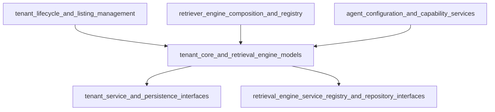

# Tenant Core and Retrieval Engine Models 模块技术深度解析

## 1. 模块概述

**tenant_core_and_retrieval_engine_models** 模块是整个系统的核心领域模型之一，负责定义租户（Tenant）的核心数据结构和检索引擎配置。这个模块解决了多租户环境下，不同租户如何拥有和管理自己的检索配置的问题，同时提供了系统级默认配置与租户级自定义配置的无缝融合机制。

想象一下，如果你正在搭建一个支持多个客户的知识库检索系统，每个客户可能有不同的检索需求：有的客户注重关键字检索的准确性，有的客户更依赖向量检索的语义理解能力，还有的客户可能同时需要多种检索方式的组合。这个模块就是为了解决这个问题而设计的——它就像一个"检索配置工具箱"，为每个租户提供了灵活配置检索引擎的能力，同时又确保了系统的统一性和可维护性。

## 2. 核心组件深度解析

### 2.1 Tenant 结构体 - 租户的核心数据模型

`Tenant` 结构体是整个模块的核心，它封装了一个租户的所有关键信息：

```go
type Tenant struct {
    ID                  uint64           `yaml:"id"                  json:"id"                  gorm:"primaryKey"`
    Name                string           `yaml:"name"                json:"name"`
    Description         string           `yaml:"description"         json:"description"`
    APIKey              string           `yaml:"api_key"             json:"api_key"`
    Status              string           `yaml:"status"              json:"status"              gorm:"default:'active'"`
    RetrieverEngines    RetrieverEngines `yaml:"retriever_engines"   json:"retriever_engines"   gorm:"type:json"`
    Business            string           `yaml:"business"            json:"business"`
    StorageQuota        int64            `yaml:"storage_quota"       json:"storage_quota"       gorm:"default:10737418240"`
    StorageUsed         int64            `yaml:"storage_used"        json:"storage_used"        gorm:"default:0"`
    AgentConfig         *AgentConfig     `yaml:"agent_config"        json:"agent_config"        gorm:"type:jsonb"`
    ContextConfig       *ContextConfig   `yaml:"context_config"      json:"context_config"      gorm:"type:jsonb"`
    WebSearchConfig     *WebSearchConfig `yaml:"web_search_config"   json:"web_search_config"   gorm:"type:jsonb"`
    ConversationConfig  *ConversationConfig `yaml:"conversation_config" json:"conversation_config" gorm:"type:jsonb"`
    CreatedAt           time.Time        `yaml:"created_at"          json:"created_at"`
    UpdatedAt           time.Time        `yaml:"updated_at"          json:"updated_at"`
    DeletedAt           gorm.DeletedAt   `yaml:"deleted_at"          json:"deleted_at"          gorm:"index"`
}
```

**设计意图解析**：

- **多维度配置**：`Tenant` 结构体不仅包含基本的身份信息（ID、Name、APIKey），还包含了各种功能配置（检索引擎、代理配置、上下文配置等），这体现了"租户是一个完整的功能单元"的设计理念。

- **存储配额管理**：通过 `StorageQuota` 和 `StorageUsed` 字段，系统可以精确控制每个租户的资源使用，这对于多租户 SaaS 系统来说是至关重要的。

- **软删除支持**：`DeletedAt` 字段使用了 GORM 的软删除机制，这意味着删除租户时不会真正从数据库中移除数据，而是标记为已删除，这对于数据审计和恢复非常有用。

- **配置的 JSON 存储**：像 `RetrieverEngines`、`AgentConfig` 等复杂配置都使用 JSON 类型存储在数据库中，这提供了极大的灵活性，同时保持了数据库 schema 的简洁性。

### 2.2 RetrieverEngines - 检索引擎配置容器

`RetrieverEngines` 结构体是一个简单但重要的容器，它封装了租户的检索引擎配置列表：

```go
type RetrieverEngines struct {
    Engines []RetrieverEngineParams `yaml:"engines" json:"engines" gorm:"type:json"`
}
```

**设计亮点**：

- **自定义数据库序列化**：通过实现 `driver.Valuer` 和 `sql.Scanner` 接口，`RetrieverEngines` 可以直接与数据库交互，自动进行 JSON 序列化和反序列化，这使得代码更加简洁和类型安全。

- **空值安全处理**：在 `Scan` 方法中，对 nil 值的处理确保了即使数据库中没有存储配置，系统也能正常工作。

### 2.3 检索引擎映射系统 - 能力驱动的配置

这个模块中最有趣的设计之一是 `retrieverEngineMapping` 映射表：

```go
var retrieverEngineMapping = map[string][]RetrieverEngineParams{
    "postgres": {
        {RetrieverType: KeywordsRetrieverType, RetrieverEngineType: PostgresRetrieverEngineType},
        {RetrieverType: VectorRetrieverType, RetrieverEngineType: PostgresRetrieverEngineType},
    },
    "elasticsearch_v7": {
        {RetrieverType: KeywordsRetrieverType, RetrieverEngineType: ElasticsearchRetrieverEngineType},
    },
    // ... 其他驱动配置
}
```

**设计意图解析**：

- **能力声明模式**：这个映射表本质上是在声明"每个检索驱动支持哪些检索类型"。例如，PostgreSQL 既支持关键字检索，也支持向量检索，而 Elasticsearch v7 只支持关键字检索。

- **环境变量驱动**：通过 `GetDefaultRetrieverEngines()` 函数，系统可以根据 `RETRIEVE_DRIVER` 环境变量动态配置默认的检索引擎，这使得部署配置非常灵活。

- **去重机制**：在 `GetDefaultRetrieverEngines()` 中，使用 `seen` 映射确保不会重复添加相同的检索引擎配置，这处理了多个驱动提供相同能力的情况。

### 2.4 有效引擎选择策略 - 租户自定义与系统默认的融合

`GetEffectiveEngines()` 方法是整个模块的关键协调点：

```go
func (t *Tenant) GetEffectiveEngines() []RetrieverEngineParams {
    if len(t.RetrieverEngines.Engines) > 0 {
        return t.RetrieverEngines.Engines
    }
    return GetDefaultRetrieverEngines()
}
```

**设计意图解析**：

- **优先租户配置**：如果租户已经配置了自己的检索引擎，就使用租户的配置，这体现了"租户自主权"的原则。

- **系统默认兜底**：如果租户没有配置，就使用系统默认配置，这确保了系统的"开箱即用"体验，新租户无需任何配置就能正常工作。

- **简单而强大**：这个方法的逻辑非常简单，但它解决了多租户系统中一个常见的复杂问题——如何平衡系统统一性和租户灵活性。

### 2.5 创建钩子 - 数据完整性保障

`BeforeCreate()` 钩子确保了在创建租户时数据的完整性：

```go
func (t *Tenant) BeforeCreate(tx *gorm.DB) error {
    if t.RetrieverEngines.Engines == nil {
        t.RetrieverEngines.Engines = []RetrieverEngineParams{}
    }
    return nil
}
```

**设计意图解析**：

- **空切片初始化**：确保 `RetrieverEngines.Engines` 始终是一个切片，而不是 nil，这避免了后续代码中可能出现的空指针异常。

- **GORM 钩子利用**：使用 GORM 的生命周期钩子，将数据完整性逻辑嵌入到数据访问层，这是一种优雅的关注点分离方式。

## 3. 架构角色与数据流动

### 3.1 模块在系统中的位置

`tenant_core_and_retrieval_engine_models` 模块位于系统的核心领域层，它是连接多个上层模块和下层基础设施的关键纽带：



### 3.2 关键数据流动路径

#### 路径 1：租户创建时的检索引擎配置

1. 上层服务（如 `tenant_lifecycle_and_listing_management`）创建一个新的 `Tenant` 对象
2. 如果没有指定检索引擎配置，`BeforeCreate` 钩子会初始化空切片
3. 租户被保存到数据库
4. 当需要使用检索功能时，调用 `GetEffectiveEngines()` 获取有效配置

#### 路径 2：检索执行时的引擎选择

1. 检索服务（如 `retriever_engine_composition_and_registry`）从租户服务获取当前租户
2. 调用 `tenant.GetEffectiveEngines()` 获取有效的检索引擎配置
3. 根据配置实例化相应的检索引擎
4. 执行检索操作

## 4. 设计决策与权衡分析

### 4.1 JSON 存储 vs 关系表设计

**决策**：使用 JSON 类型存储复杂配置（如 `RetrieverEngines`、`AgentConfig`）

**权衡分析**：
- ✅ **优点**：
  - 灵活性高，可以轻松添加新的配置项而无需修改数据库 schema
  - 减少了表之间的关联，查询性能更好
  - 配置结构与代码结构直接对应，序列化/反序列化简单
  
- ⚠️ **缺点**：
  - 无法利用数据库的约束和索引来保证数据完整性
  - 查询配置内部的特定字段比较困难
  - 没有类型安全保障，配置错误可能在运行时才发现

**为什么这个选择是合理的**：
对于检索引擎配置这种经常变化、结构复杂且不需要频繁查询内部字段的数据，JSON 存储是一个很好的选择。系统可以通过代码层面的验证来弥补数据库约束的不足。

### 4.2 环境变量驱动的默认配置 vs 数据库存储的默认配置

**决策**：使用环境变量 `RETRIEVE_DRIVER` 来配置系统默认的检索引擎

**权衡分析**：
- ✅ **优点**：
  - 部署配置简单，只需设置环境变量
  - 不同环境（开发、测试、生产）可以有不同的配置
  - 配置变更不需要重启数据库
  
- ⚠️ **缺点**：
  - 环境变量是全局的，无法为不同的租户组设置不同的默认配置
  - 配置变更需要重启应用
  - 没有配置版本历史

**为什么这个选择是合理的**：
对于大多数 SaaS 系统来说，全局的默认检索引擎配置已经足够。如果需要更细粒度的默认配置控制，可以在未来的版本中引入"租户模板"或"组织级默认配置"的概念。

### 4.3 租户配置优先策略 vs 系统配置覆盖策略

**决策**：如果租户有自己的配置，就完全使用租户配置，忽略系统默认配置

**权衡分析**：
- ✅ **优点**：
  - 逻辑简单直观
  - 租户有完全的自主权
  - 不会出现配置合并导致的意外行为
  
- ⚠️ **缺点**：
  - 租户配置不会自动继承系统配置的更新
  - 租户可能需要手动维护完整的配置，即使只想修改一小部分

**为什么这个选择是合理的**：
对于检索引擎配置这种关键的功能设置，"明确性"比"便利性"更重要。租户应该明确知道自己使用的是什么配置，而不是依赖于可能变化的系统默认。

## 5. 使用指南与注意事项

### 5.1 基本使用模式

#### 创建租户时指定检索引擎配置

```go
tenant := &types.Tenant{
    Name:        "示例租户",
    Description: "一个使用自定义检索引擎配置的租户",
    RetrieverEngines: types.RetrieverEngines{
        Engines: []types.RetrieverEngineParams{
            {
                RetrieverType:       types.KeywordsRetrieverType,
                RetrieverEngineType: types.PostgresRetrieverEngineType,
            },
            {
                RetrieverType:       types.VectorRetrieverType,
                RetrieverEngineType: types.QdrantRetrieverEngineType,
            },
        },
    },
}
```

#### 使用系统默认配置创建租户

```go
// 只需不设置 RetrieverEngines，系统会自动使用默认配置
tenant := &types.Tenant{
    Name:        "示例租户",
    Description: "一个使用系统默认检索引擎配置的租户",
}
```

#### 获取有效的检索引擎配置

```go
// 无论租户是否有自定义配置，都可以通过这个方法获取有效的配置
engines := tenant.GetEffectiveEngines()
for _, engine := range engines {
    fmt.Printf("检索类型: %s, 引擎类型: %s\n", engine.RetrieverType, engine.RetrieverEngineType)
}
```

### 5.2 配置环境变量

设置系统默认的检索驱动：

```bash
# 单一驱动
export RETRIEVE_DRIVER=postgres

# 多个驱动（逗号分隔）
export RETRIEVE_DRIVER=postgres,qdrant
```

### 5.3 常见陷阱与注意事项

#### 陷阱 1：忘记处理 nil 配置

**问题**：直接访问 `tenant.RetrieverEngines.Engines` 而不检查是否为 nil，可能导致空指针异常。

**解决方案**：
- 始终使用 `tenant.GetEffectiveEngines()` 来获取配置，而不是直接访问字段
- 如果必须直接访问，先检查是否为 nil

#### 陷阱 2：配置结构变更导致的兼容性问题

**问题**：当 `RetrieverEngineParams` 结构发生变化时，数据库中存储的旧格式 JSON 可能无法正确反序列化。

**解决方案**：
- 对于配置结构的变更，考虑使用版本控制机制
- 添加迁移逻辑，在启动时检查并更新旧格式的配置
- 保持向后兼容性，避免移除或重命名字段，而是添加新字段并标记旧字段为 deprecated

#### 陷阱 3：环境变量设置错误

**问题**：`RETRIEVE_DRIVER` 环境变量设置了不存在的驱动名称，导致默认配置为空。

**解决方案**：
- 在应用启动时验证 `RETRIEVE_DRIVER` 的值
- 提供合理的默认值，即使环境变量设置错误也能正常工作
- 记录警告日志，帮助诊断配置问题

## 6. 模块演进历史与未来方向

### 6.1 已废弃的字段

从代码中可以看到，有两个字段已经被标记为 deprecated：

- `AgentConfig` - 被 CustomAgent (builtin-smart-reasoning) 配置替代
- `ConversationConfig` - 被 CustomAgent (builtin-quick-answer) 配置替代

这表明系统正在从"专门化的配置模型"向"统一的 CustomAgent 配置模型"演进。

### 6.2 未来可能的演进方向

基于当前的设计，我们可以推测一些未来可能的改进：

1. **更灵活的配置合并策略**：允许租户配置部分覆盖系统默认配置，而不是完全替换
2. **配置验证机制**：在保存租户配置时进行验证，确保配置的有效性
3. **配置版本历史**：记录配置的变更历史，支持回滚和审计
4. **租户配置模板**：允许创建配置模板，新租户可以基于模板创建
5. **动态配置更新**：支持在不重启应用的情况下更新系统默认配置

## 7. 总结

`tenant_core_and_retrieval_engine_models` 模块是一个精心设计的核心领域模型，它通过简洁的接口和灵活的配置机制，解决了多租户环境下检索引擎配置的复杂问题。这个模块的设计体现了几个重要的软件设计原则：

- **关注点分离**：将租户数据模型与检索引擎配置解耦
- **开闭原则**：通过 JSON 存储和灵活的映射机制，系统对扩展开放，对修改封闭
- **简单性**：核心逻辑（如 `GetEffectiveEngines`）非常简单，但功能强大
- **向后兼容性**：通过 deprecated 标记和保留旧字段，确保了系统的平滑演进

对于新加入团队的开发者来说，理解这个模块的设计意图和使用方式是非常重要的，因为它是连接多个上层业务模块和下层基础设施的关键纽带。
