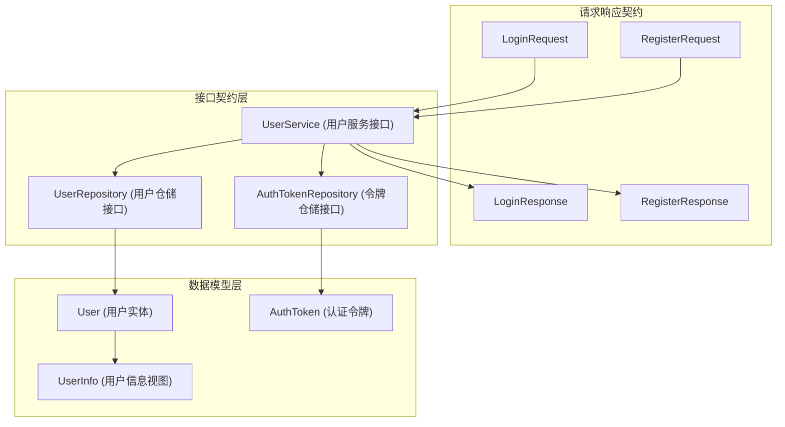

# 用户身份注册与认证契约模块技术文档

## 概述

这个模块是整个系统的身份基础设施核心，就像一个办公大楼的门禁系统——它定义了谁能进入、如何验证身份、以及如何管理访问权限。它不直接处理认证流程的执行，而是提供了一套标准化的数据结构和接口契约，确保整个系统在处理用户身份和认证时保持一致性。

## 核心问题域

在构建多租户 SaaS 系统时，用户身份管理面临几个关键挑战：

1. **数据一致性**：不同模块需要以统一的方式理解用户数据
2. **安全边界**：需要明确区分敏感数据（如密码哈希）和可公开数据
3. **接口标准化**：服务层和数据层需要清晰的契约，便于实现替换和测试
4. **多租户支持**：用户数据需要与租户概念正确关联

这个模块通过定义数据模型、请求/响应契约和服务接口，为这些问题提供了标准解决方案。

## 架构设计



### 核心组件解析

#### 1. 数据模型

**User 结构体**
- 这是系统中用户的核心表示，包含了用户的所有关键信息
- 设计亮点：
  - 使用 UUID 作为主键，确保分布式环境下的唯一性
  - `PasswordHash` 字段标记为 `json:"-"`，确保永远不会在 API 响应中暴露
  - 支持软删除（`DeletedAt` 字段）
  - 包含租户关联（`TenantID`）和跨租户访问权限标志（`CanAccessAllTenants`）
  - 提供 `ToUserInfo()` 方法，安全地转换为不含敏感数据的视图模型

**AuthToken 结构体**
- 管理认证令牌的生命周期
- 设计特点：
  - 支持多种令牌类型（`TokenType`），如访问令牌和刷新令牌
  - 包含过期时间和撤销状态，支持令牌的主动失效
  - 与用户实体建立关联，便于查询用户的所有令牌

#### 2. 请求/响应契约

这些结构体定义了 API 层的输入输出格式：
- `LoginRequest` / `RegisterRequest`：包含验证标签（`binding`），确保输入数据的有效性
- `LoginResponse` / `RegisterResponse`：统一的响应格式，包含成功状态、消息和相关数据
- `UserInfo`：专门用于 API 响应的用户信息视图，避免暴露敏感字段

#### 3. 服务与仓储接口

**UserService 接口**
- 定义了用户领域的核心业务操作
- 涵盖注册、登录、用户查询、密码管理、令牌管理等完整功能
- 所有方法都接受 `context.Context`，支持超时控制和链路追踪

**UserRepository 与 AuthTokenRepository 接口**
- 定义了数据持久化层的契约
- 遵循仓储模式，将业务逻辑与数据访问解耦
- 提供了完整的 CRUD 操作和查询方法

## 设计决策分析

### 1. 分离数据模型与视图模型

**决策**：创建 `User` 和 `UserInfo` 两个结构体
**原因**：
- `User` 包含完整的用户数据，包括敏感字段（如密码哈希）
- `UserInfo` 是安全的视图模型，专门用于 API 响应
- 通过 `ToUserInfo()` 方法确保转换的一致性

**权衡**：
- ✅ 优点：避免敏感数据泄露，API 响应更加可控
- ❌ 缺点：需要维护两个结构体，增加了一定的代码重复

### 2. 接口优先设计

**决策**：定义 `UserService`、`UserRepository`、`AuthTokenRepository` 接口
**原因**：
- 支持依赖倒置原则，高层模块不依赖低层实现
- 便于单元测试，可以轻松创建 mock 实现
- 提供了清晰的扩展点，允许不同的实现方式

**权衡**：
- ✅ 优点：提高了代码的可测试性和可维护性
- ❌ 缺点：增加了一定的抽象层级，初次理解可能需要更多时间

### 3. 令牌管理的完整性

**决策**：`AuthToken` 结构体包含完整的生命周期管理字段
**原因**：
- 支持令牌的主动撤销（`IsRevoked`）
- 允许定期清理过期令牌（`ExpiresAt`）
- 支持用户级别的令牌批量撤销（`RevokeTokensByUserID`）

**权衡**：
- ✅ 优点：提供了强大的安全控制能力
- ❌ 缺点：需要后台任务定期清理过期令牌，增加了系统复杂度

## 数据流向分析

### 用户注册流程

```
RegisterRequest → UserService.Register() → UserRepository.CreateUser() → 数据库
         ↓
   RegisterResponse (包含 User 和 Tenant 信息)
```

### 用户登录流程

```
LoginRequest → UserService.Login() → UserRepository.GetUserByEmail() → 验证密码
         ↓
   UserService.GenerateTokens() → AuthTokenRepository.CreateToken()
         ↓
   LoginResponse (包含 User、Tenant、Token、RefreshToken)
```

### 令牌验证流程

```
请求头中的 Token → UserService.ValidateToken() → AuthTokenRepository.GetTokenByValue()
         ↓
   验证令牌有效性 (IsRevoked, ExpiresAt)
         ↓
   UserRepository.GetUserByID() → 返回 User
```

## 与其他模块的关系

这个模块是系统的基础设施模块，被多个上层模块依赖：

- **[identity_tenant_and_organization_management](../application_services_and_orchestration-agent_identity_tenant_and_configuration_services-identity_tenant_and_organization_management.md)**：实现了这里定义的 `UserService` 接口
- **[user_identity_and_auth_repositories](../data_access_repositories-identity_tenant_and_organization_repositories-user_identity_and_auth_repositories.md)**：实现了这里定义的仓储接口
- **[auth_endpoint_handler](../http_handlers_and_routing-auth_initialization_and_system_operations_handlers-auth_endpoint_handler.md)**：使用这里的请求/响应契约处理 HTTP 请求

## 使用指南与注意事项

### 1. 安全最佳实践

- **永远不要**直接返回 `User` 结构体，始终使用 `ToUserInfo()` 转换
- 密码哈希应该在服务层生成，不要在 API 层处理明文密码
- 令牌验证应该在中间件层统一处理，不要在每个处理函数中重复

### 2. 扩展注意事项

- 添加新的用户字段时，考虑是否需要在 `UserInfo` 中也添加
- 修改接口时，确保所有实现都能兼容
- 考虑使用版本化的 API 契约，避免破坏性变更

### 3. 常见陷阱

- 忘记检查 `IsRevoked` 字段，导致已撤销的令牌仍然有效
- 没有处理 `DeletedAt` 字段，导致已删除的用户仍然可以访问
- 令牌过期时间设置过长，增加了安全风险

## 子模块详解

这个模块进一步细分为以下子模块，每个子模块处理特定的关注点：

- [registration_payload_contracts](./core_domain_types_and_interfaces-identity_tenant_organization_and_configuration_contracts-user_identity_registration_and_auth_contracts-registration_payload_contracts.md)：注册相关的数据结构和契约
- [login_and_session_auth_payload_contracts](./core_domain_types_and_interfaces-identity_tenant_organization_and_configuration_contracts-user_identity_registration_and_auth_contracts-login_and_session_auth_payload_contracts.md)：登录和会话认证的请求/响应结构
- [user_account_identity_model](./core_domain_types_and_interfaces-identity_tenant_organization_and_configuration_contracts-user_identity_registration_and_auth_contracts-user_account_identity_model.md)：用户账户和身份的核心数据模型
- [user_auth_service_and_repository_interfaces](./core_domain_types_and_interfaces-identity_tenant_organization_and_configuration_contracts-user_identity_registration_and_auth_contracts-user_auth_service_and_repository_interfaces.md)：用户认证服务和仓储的接口定义

## 总结

这个模块是系统身份管理的基石，它通过清晰的数据模型和接口契约，为整个系统提供了统一的身份基础设施。它的设计体现了关注点分离、接口优先、安全第一等原则，为上层模块提供了可靠的基础。

通过理解这个模块，新团队成员可以快速把握系统的身份管理架构，并在遵循现有契约的基础上进行扩展和维护。详细的子模块文档提供了每个组件的深入解析，帮助开发者更精准地使用和扩展这些契约。
