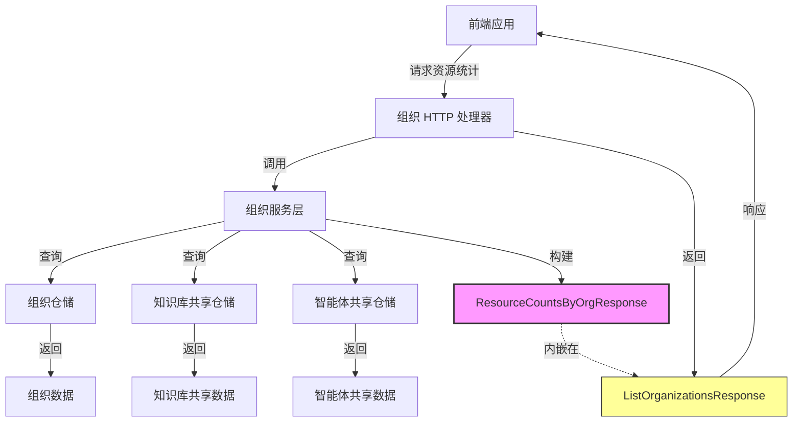

# organization_resource_summary_contracts 模块深度解析

## 目录
1. [模块概述](#模块概述)
2. [核心组件](#核心组件)
3. [架构角色](#架构角色)
4. [数据流程](#数据流程)
5. [设计决策](#设计决策)
6. [使用示例](#使用示例)
7. [常见问题与注意事项](#常见问题与注意事项)
8. [参考资料](#参考资料)

## 模块概述

`organization_resource_summary_contracts` 模块是平台中组织资源管理的核心契约层，专注于提供组织级资源统计和摘要的标准化数据结构。该模块解决了在多租户、多组织协作环境中，如何高效、一致地聚合和展示各组织内资源分布情况的问题。

### 问题背景

在一个支持组织协作和资源共享的平台中，用户通常需要：
1. 在侧边栏快速查看不同组织中可用的知识库和智能体数量
2. 了解自己在各个组织中的资源访问权限概览
3. 系统需要在组织列表页面高效展示资源统计信息

如果没有统一的资源摘要契约，各个页面和服务可能会以不同方式计算和展示这些统计数据，导致：
- 数据不一致
- 重复的统计计算逻辑
- 前端展示逻辑复杂且难以维护

### 设计洞察

该模块的核心设计思想是将组织资源摘要的**数据结构**与**计算逻辑**分离，通过标准化的响应契约确保数据一致性，同时为前端提供简洁、易于消费的数据格式。

## 核心组件

### ResourceCountsByOrgResponse

这是模块的核心数据结构，专门用于向客户端提供按组织分组的资源统计信息。

```go
type ResourceCountsByOrgResponse struct {
        KnowledgeBases struct {
                ByOrganization map[string]int `json:"by_organization"`
        } `json:"knowledge_bases"`
        Agents struct {
                ByOrganization map[string]int `json:"by_organization"`
        } `json:"agents"`
}
```

#### 设计意图

这个结构体采用了嵌套的 map 结构，有以下几个关键设计考虑：

1. **资源类型分离**：将知识库和智能体的统计分开，使前端可以独立处理不同类型的资源
2. **组织为中心**：使用 `ByOrganization` map 以组织 ID 为键，资源数量为值，直接支持按组织快速查找
3. **扩展性设计**：通过嵌套结构体，为未来添加新的资源类型（如文档、工具等）预留了空间

#### 使用场景

- **侧边栏资源计数**：前端在组织切换侧边栏中显示各组织的资源数量
- **组织列表统计**：在组织列表页面展示每个组织的资源丰富程度
- **权限概览辅助**：结合用户角色信息，提供资源访问能力的快速概览

## 架构



## 架构角色

### 在系统中的位置

`organization_resource_summary_contracts` 模块位于 `core_domain_types_and_interfaces` 层，是组织管理领域模型的一部分。它的主要职责是定义组织资源摘要的数据契约，而不是实现具体的统计计算逻辑。

### 依赖关系

该模块依赖于：
- 组织核心模型（`Organization`、`OrganizationMember`）
- 资源共享模型（`KnowledgeBaseShare`、`AgentShare`）

被以下模块依赖：
- 组织服务层（用于构建资源统计响应）
- 前端 API 契约层（用于序列化/反序列化）
- 组织列表 HTTP 处理器（用于返回组织资源统计）

## 数据流程

### 资源统计数据流向

1. **请求发起**：前端请求 `/me/resource-counts` 端点获取资源统计
2. **服务层处理**：组织服务调用资源统计计算逻辑
3. **数据聚合**：
   - 查询用户所属的所有组织
   - 对每个组织，统计可访问的知识库数量
   - 对每个组织，统计可访问的智能体数量
4. **契约构建**：将统计结果填充到 `ResourceCountsByOrgResponse` 结构中
5. **响应返回**：通过 HTTP 响应返回给前端
6. **前端展示**：前端使用这些数据渲染侧边栏或组织列表

### 与 ListOrganizationsResponse 的集成

`ResourceCountsByOrgResponse` 通常作为 `ListOrganizationsResponse` 的可选字段出现：

```go
type ListOrganizationsResponse struct {
        Organizations  []OrganizationResponse     `json:"organizations"`
        Total          int64                      `json:"total"`
        ResourceCounts *ResourceCountsByOrgResponse `json:"resource_counts,omitempty"`
}
```

这种设计允许前端在一次请求中同时获取组织列表和资源统计，减少网络往返。

## 设计决策

### 1. 嵌套结构体 vs 扁平结构

**选择**：使用嵌套结构体分别包装知识库和智能体统计

**原因**：
- 提高了数据结构的可读性和自描述性
- 为每种资源类型未来添加更多统计维度预留了空间（如按权限级别细分）
- 使 API 契约更具扩展性，添加新资源类型时不会破坏现有结构

**权衡**：
- 增加了一层嵌套，前端访问时需要多写一层路径
- 但这个代价很小，相比收益是值得的

### 2. map[string]int  vs 数组结构

**选择**：使用 `map[string]int` 来存储组织 ID 到数量的映射

**原因**：
- 前端可以通过组织 ID 直接 O(1) 查找对应数量，无需遍历数组
- 数据结构简洁，没有冗余
- 符合前端"按组织 ID 展示计数"的常见访问模式

**权衡**：
- map 在 JSON 序列化后顺序不确定，但在这个场景下顺序不重要
- 如果未来需要按数量排序，前端需要自己处理

### 3. 独立契约 vs 内嵌在组织响应中

**选择**：设计独立的 `ResourceCountsByOrgResponse`，同时允许其作为 `ListOrganizationsResponse` 的字段

**原因**：
- 支持两种使用场景：单独获取资源计数，或与组织列表一起获取
- 保持了契约的复用性和一致性
- 为未来可能的独立资源统计端点预留了空间

## 使用示例

### 服务端构建响应

```go
// 假设这是组织服务中的方法
func (s *OrganizationService) GetResourceCounts(userID string) (*ResourceCountsByOrgResponse, error) {
    // 获取用户所属组织
    orgs, err := s.repo.GetUserOrganizations(userID)
    if err != nil {
        return nil, err
    }
    
    response := &ResourceCountsByOrgResponse{}
    response.KnowledgeBases.ByOrganization = make(map[string]int)
    response.Agents.ByOrganization = make(map[string]int)
    
    for _, org := range orgs {
        // 统计知识库数量
        kbCount, err := s.repo.CountAccessibleKnowledgeBases(org.ID, userID)
        if err != nil {
            return nil, err
        }
        response.KnowledgeBases.ByOrganization[org.ID] = kbCount
        
        // 统计智能体数量
        agentCount, err := s.repo.CountAccessibleAgents(org.ID, userID)
        if err != nil {
            return nil, err
        }
        response.Agents.ByOrganization[org.ID] = agentCount
    }
    
    return response, nil
}
```

### 前端使用数据

```typescript
// 假设这是前端组织侧边栏组件
interface ResourceCounts {
    knowledge_bases: {
        by_organization: Record<string, number>;
    };
    agents: {
        by_organization: Record<string, number>;
    };
}

function OrganizationSidebar({ organizations, resourceCounts }: Props) {
    return (
        <div className="org-sidebar">
            {organizations.map(org => (
                <div key={org.id} className="org-item">
                    <div className="org-name">{org.name}</div>
                    <div className="org-stats">
                        <span>
                            📚 {resourceCounts?.knowledge_bases.by_organization[org.id] || 0}
                        </span>
                        <span>
                            🤖 {resourceCounts?.agents.by_organization[org.id] || 0}
                        </span>
                    </div>
                </div>
            ))}
        </div>
    );
}
```

## 常见问题与注意事项

### 1. 数据一致性

**注意**：`ResourceCountsByOrgResponse` 中的数据是时点快照，不实时更新。

**建议**：
- 前端在组织切换、资源共享变更等操作后，主动刷新资源统计
- 考虑使用 WebSocket 或轮询机制在资源发生变化时更新统计

### 2. 权限边界

**注意**：统计的是用户**可访问**的资源数量，而不是组织内所有资源。

**隐含契约**：
- 统计逻辑需要考虑用户在组织中的角色
- 需要考虑资源本身的共享权限
- 需要过滤掉已删除或禁用的资源

### 3. 空值处理

**注意**：`ByOrganization` map 中可能不存在某个组织 ID 的键。

**前端最佳实践**：
```typescript
// 使用可选链和默认值
const kbCount = resourceCounts?.knowledge_bases.by_organization[orgId] ?? 0;
```

### 4. 性能考虑

**注意**：如果用户属于大量组织，统计计算可能会比较耗时。

**优化建议**：
- 考虑缓存资源统计结果
- 可以使用异步预计算和更新
- 对于超大规模部署，考虑使用专门的统计数据表

## 参考资料

- [组织治理与成员管理契约](core_domain_types_and_interfaces-identity_tenant_organization_and_configuration_organization_governance_membership_and_join_workflow_contracts.md)
- [知识库共享契约](core_domain_types_and_interfaces-identity_tenant_organization_and_configuration_organization_resource_sharing_and_access_control_knowledge_base_sharing_contracts.md)
- [智能体共享契约](core_domain_types_and_interfaces-identity_tenant_organization_and_configuration_organization_resource_sharing_and_access_control_agent_sharing_contracts.md)
