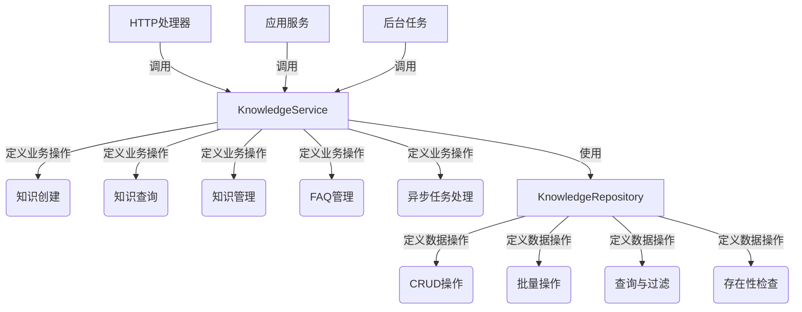

# 知识内容服务与仓库接口技术文档

## 1. 模块概述

### 1.1 问题空间

在构建企业级知识管理系统时，我们面临着一个复杂的挑战：如何提供一个统一、灵活且可扩展的接口，来处理多种来源（文件、URL、文本段落、手动输入）和多种类型（文档、FAQ、多模态内容）的知识？

一个简单的 CRUD 接口无法满足这种复杂性，因为：
- 知识来源多样，需要不同的处理逻辑
- 知识创建过程往往涉及异步处理（文档解析、分块、索引）
- 需要支持多种查询和过滤方式（标签、关键词、文件类型）
- 租户隔离和权限控制是核心要求
- 需要与后台任务系统集成

### 1.2 解决方案

本模块定义了两个核心接口：`KnowledgeService` 和 `KnowledgeRepository`，它们构成了知识管理系统的服务层和数据访问层的契约。这种设计遵循了领域驱动设计（DDD）中的分层架构原则，将业务逻辑与数据访问分离，同时提供了清晰的扩展点。

## 2. 架构设计

### 2.1 核心组件关系图

### 2.2 架构职责划分

这两个接口清晰地划分了系统的职责边界：

- **KnowledgeService**：负责业务逻辑编排，包括知识创建流程、异步任务调度、业务规则验证、权限控制等。
- **KnowledgeRepository**：专注于数据持久化和查询，提供高效的数据访问能力。

## 3. 核心组件详解

### 3.1 KnowledgeService 接口

`KnowledgeService` 是知识管理的核心业务接口，定义了丰富的知识操作方法。

#### 3.1.1 知识创建方法

接口提供了多种知识创建方式：
- `CreateKnowledgeFromFile`：从文件创建知识
- `CreateKnowledgeFromURL`：从URL创建知识
- `CreateKnowledgeFromPassage`：从文本段落创建知识
- `CreateKnowledgeFromManual`：手动创建Markdown知识

**异步处理设计**：大多数方法返回后，实际的文档解析和索引是异步进行的，确保用户操作的响应性。

#### 3.1.2 知识查询方法

接口提供了多种查询方式：
- `GetKnowledgeByID`：按ID获取知识（带租户隔离）
- `GetKnowledgeByIDOnly`：按ID获取知识（无租户过滤，用于权限解析）
- `GetKnowledgeBatch`：批量获取知识
- `ListPagedKnowledgeByKnowledgeBaseID`：分页列出知识库中的知识

#### 3.1.3 FAQ 管理方法

接口专门提供了完整的FAQ管理方法：
- `ListFAQEntries`：列出FAQ条目
- `UpsertFAQEntries`：批量导入FAQ（支持DryRun模式）
- `CreateFAQEntry`：创建单个FAQ条目
- `SearchFAQEntries`：搜索FAQ条目

#### 3.1.4 异步任务处理方法

接口包含多个处理Asynq任务的方法：
- `ProcessDocument`：处理文档解析任务
- `ProcessFAQImport`：处理FAQ导入任务
- `ProcessQuestionGeneration`：处理问题生成任务
- 其他后台任务处理方法

### 3.2 KnowledgeRepository 接口

`KnowledgeRepository` 是知识数据访问的抽象接口。

#### 3.2.1 CRUD 操作

- `CreateKnowledge`：创建知识
- `GetKnowledgeByID`：按ID获取知识
- `UpdateKnowledge`：更新知识
- `DeleteKnowledge`：删除知识

**租户隔离设计**：所有方法都显式接收`tenantID`参数，确保数据访问的租户隔离。

#### 3.2.2 批量操作

- `UpdateKnowledgeBatch`：批量更新知识
- `DeleteKnowledgeList`：批量删除知识
- `GetKnowledgeBatch`：批量获取知识

#### 3.2.3 存在性检查

- `CheckKnowledgeExists`：检查知识是否已存在，支持文件哈希、URL等多种检查方式

#### 3.2.4 查询与统计

- `SearchKnowledge`：搜索知识
- `CountKnowledgeByKnowledgeBaseID`：统计知识库中的知识数量
- `CountKnowledgeByStatus`：按状态统计知识数量

## 4. 数据流与依赖关系

### 4.1 典型知识创建流程

1. **HTTP处理器层**：接收文件上传请求
2. **KnowledgeService**：验证权限、检查重复、创建知识记录、调度异步任务
3. **异步任务处理**：解析文档、创建知识块、更新知识状态
4. **KnowledgeRepository**：执行数据持久化操作

### 4.2 依赖关系

- **被依赖模块**：`knowledge_core_model`、`knowledge_requests_and_responses`、后台任务系统
- **依赖模块**：`knowledge_content_http_handlers`、`knowledge_ingestion_orchestration`、各种应用服务

## 5. 设计决策与权衡

### 5.1 服务层与数据层分离

**决策**：清晰分离`KnowledgeService`和`KnowledgeRepository`接口

**原因**：符合单一职责原则，提高可测试性，允许独立演进

### 5.2 异步处理为主

**决策**：大多数知识创建操作采用异步处理模式

**原因**：文档解析和索引可能耗时较长，提供更好的用户体验

**权衡**：需要额外的状态跟踪机制，增加了系统复杂性

### 5.3 显式租户隔离

**决策**：在Repository层所有方法中显式传递`tenantID`

**原因**：提供强制的租户隔离，避免数据泄露

## 6. 总结

`KnowledgeService`和`KnowledgeRepository`接口构成了知识管理系统的核心契约，通过清晰的职责划分和丰富的功能设计，为上层应用提供了强大而灵活的知识管理能力。这种设计不仅满足了当前的功能需求，还为未来的扩展提供了良好的基础。
