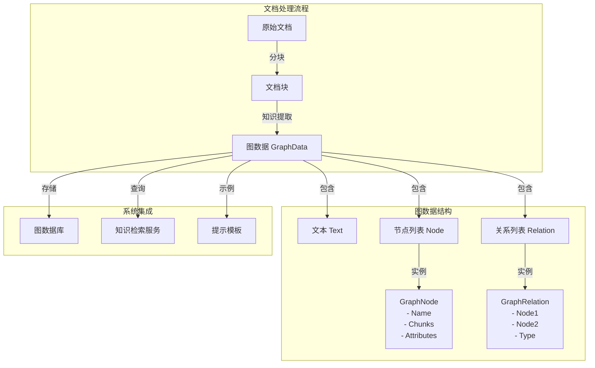

# graph_document_projection_models 模块技术深度解析

## 1. 模块概述与问题空间

在知识图谱构建和文档处理系统中，一个核心挑战是如何将非结构化或半结构化的文档内容转化为结构化的图数据表示。`graph_document_projection_models` 模块正是为了解决这一问题而设计的。

想象一下，你有一篇关于"人工智能发展史"的文档，里面包含了人物、事件、时间、技术等各种实体，以及它们之间的复杂关系。如果我们只是将文档作为纯文本存储，那么当用户询问"图灵测试是在哪一年提出的？"或"谁发明了深度学习？"时，系统只能通过模糊的文本匹配来尝试回答，而无法给出精确、结构化的答案。

这就是 `graph_document_projection_models` 模块要解决的问题：它定义了一套数据模型，用于将文档内容投影（projection）到图结构中，从而实现更智能的知识检索和推理。

## 2. 核心抽象与心智模型

该模块的核心抽象可以用一个简单的图论模型来理解：

- **节点（Node）**：代表文档中的实体或概念
- **关系（Relation）**：代表节点之间的连接
- **图数据（GraphData）**：将原始文本与对应的图结构关联起来



你可以把这个模型想象成一个"知识地图"：
- 节点是地图上的城市（实体）
- 关系是连接城市的道路（实体间的关联）
- 图数据则是包含了地图和对应地理描述的完整文档

这种设计的核心洞察是：**文档不仅包含文本，还包含结构化的知识，而图结构是表示这种知识的最自然方式**。

## 3. 核心组件深度解析

### 3.1 GraphNode - 图节点结构

```go
type GraphNode struct {
    Name       string   `json:"name,omitempty"`
    Chunks     []string `json:"chunks,omitempty"`
    Attributes []string `json:"attributes,omitempty"`
}
```

**设计意图**：
- `Name`：节点的唯一标识符，通常是实体名称（如"Alan Turing"、"Deep Learning"）
- `Chunks`：关联的文档块ID列表，记录这个节点出现在哪些文档片段中
- `Attributes`：节点的属性列表，用于存储额外的描述性信息

**为什么这样设计**：
- 将节点与具体的文档块关联，使得我们可以追溯知识的来源
- 采用切片而非映射来存储属性，保持了简单性和灵活性
- `omitempty` 标签确保在序列化时省略空字段，优化数据传输

### 3.2 GraphRelation - 图关系结构

```go
type GraphRelation struct {
    Node1 string `json:"node1,omitempty"`
    Node2 string `json:"node2,omitempty"`
    Type  string `json:"type,omitempty"`
}
```

**设计意图**：
- `Node1` 和 `Node2`：关系连接的两个节点名称
- `Type`：关系类型，描述节点间的关联性质（如"invented"、"occurred_in"）

**为什么这样设计**：
- 采用有向图的表示方式（Node1 → Node2），能够表达非对称关系
- 关系类型作为独立字段，使得我们可以对关系进行分类和查询
- 简洁的三元组结构（主体-谓词-客体）与RDF等知识表示标准兼容

### 3.3 GraphData - 图数据容器

```go
type GraphData struct {
    Text     string           `json:"text,omitempty"`
    Node     []*GraphNode     `json:"node,omitempty"`
    Relation []*GraphRelation `json:"relation,omitempty"`
}
```

**设计意图**：
- `Text`：原始文本内容，作为图结构的来源
- `Node`：提取出的节点列表
- `Relation`：提取出的关系列表

**为什么这样设计**：
- 将原始文本与结构化数据关联，支持"图-文"对照验证
- 使用指针切片而非值切片，允许在不同GraphData实例间共享节点和关系
- 这种结构非常适合作为LLM（大语言模型）的输入输出格式，用于知识提取任务

### 3.4 PromptTemplateStructured - 结构化提示模板

```go
type PromptTemplateStructured struct {
    Description string      `json:"description"`
    Tags        []string    `json:"tags"`
    Examples    []GraphData `json:"examples"`
}
```

**设计意图**：
- `Description`：描述知识提取任务的要求和目标
- `Tags`：标签列表，用于分类和筛选提示模板
- `Examples`：示例列表，使用`GraphData`结构展示期望的输出格式

**为什么这样设计**：
- 采用少样本学习（few-shot learning）的方式，通过示例指导LLM进行知识提取
- 将示例直接表示为`GraphData`，确保输入输出格式的一致性
- 标签系统支持灵活的模板管理和选择

### 3.5 NameSpace - 命名空间

```go
type NameSpace struct {
    KnowledgeBase string `json:"knowledge_base"`
    Knowledge     string `json:"knowledge"`
}

// Labels returns the labels of the name space
func (n NameSpace) Labels() []string {
    res := make([]string, 0)
    if n.KnowledgeBase != "" {
        res = append(res, n.KnowledgeBase)
    }
    if n.Knowledge != "" {
        res = append(res, n.Knowledge)
    }
    return res
}
```

**设计意图**：
- `KnowledgeBase`：知识库标识符
- `Knowledge`：知识文档标识符
- `Labels()`方法：返回命名空间的标签列表

**为什么这样设计**：
- 提供两级命名空间机制，支持知识库和知识文档级别的数据隔离
- `Labels()`方法使得命名空间可以方便地用于图数据库的标签系统
- 灵活的设计允许部分字段为空，适应不同粒度的命名空间需求

## 4. 数据流程与依赖关系

虽然这个模块本身主要定义数据结构，但它在整个系统中的数据流如下：

1. **输入阶段**：文档经过[docreader_pipeline](docreader_pipeline.md)处理后，被切分成多个chunk
2. **提取阶段**：这些chunk被送入知识提取服务，使用`GraphData`结构作为中间格式
3. **构建阶段**：提取出的图数据被用于构建知识图谱，存储在[graph_retrieval_and_memory_repositories](data_access_repositories-graph_retrieval_and_memory_repositories.md)中
4. **查询阶段**：在检索时，系统可以利用图结构进行更精确的知识查询和推理

这个模块被以下模块依赖：
- [graph_entity_relationship_builder_contracts](core_domain_types_and_interfaces-knowledge_graph_retrieval_and_content_contracts-document_extraction_and_graph_pipeline_contracts-graph_entity_relationship_builder_contracts.md) - 用于构建实体关系
- [graph_retrieval_repository_contracts](core_domain_types_and_interfaces-knowledge_graph_retrieval_and_content_contracts-document_extraction_and_graph_pipeline_contracts-graph_retrieval_repository_contracts.md) - 用于图数据的持久化

此外，该模块中的`PromptTemplateStructured`结构体表明它还与提示工程相关联，用于指导LLM如何从文本中提取结构化的图数据。而`NameSpace`结构体则提供了知识图谱的命名空间机制，用于隔离不同知识库和知识文档的图数据。

## 5. 设计决策与权衡

### 5.1 简洁性 vs 表达能力

**决策**：选择了相对简洁的三元组结构，而非更复杂的属性图模型。

**权衡**：
- ✅ 优点：简单易懂，与大多数图数据库兼容，易于序列化
- ❌ 缺点：无法直接表示关系的属性（如时间戳、置信度等）

**为什么这样选择**：在系统的当前阶段，简洁性和互操作性比复杂的表达能力更重要。如果未来需要表示关系属性，可以通过扩展`GraphRelation`结构或引入中间节点来实现。

### 5.2 引用 vs 嵌入

**决策**：`GraphNode`中的`Chunks`字段存储的是chunk ID的引用，而非chunk内容的副本。

**权衡**：
- ✅ 优点：避免数据冗余，确保数据一致性
- ❌ 缺点：需要额外的查询来获取完整的chunk内容

**为什么这样选择**：这是一个经典的数据库设计决策——通过引用而非嵌入来规范化数据。在知识图谱系统中，数据一致性通常比查询性能更重要。

### 5.3 指针 vs 值

**决策**：`GraphData`中的`Node`和`Relation`字段使用指针切片。

**权衡**：
- ✅ 优点：允许共享节点和关系对象，减少内存占用
- ❌ 缺点：引入了空指针风险，需要更多的防御性编程

**为什么这样选择**：在图处理场景中，同一个节点可能出现在多个图数据结构中，使用指针可以避免重复创建对象。

## 6. 使用指南与最佳实践

### 6.1 创建图数据

```go
// 创建一个简单的图数据示例
graphData := &types.GraphData{
    Text: "Alan Turing invented the Turing Test in 1950.",
    Node: []*types.GraphNode{
        {
            Name:       "Alan Turing",
            Chunks:     []string{"chunk_123"},
            Attributes: []string{"person", "computer_scientist"},
        },
        {
            Name:       "Turing Test",
            Chunks:     []string{"chunk_123"},
            Attributes: []string{"concept", "test"},
        },
        {
            Name:       "1950",
            Chunks:     []string{"chunk_123"},
            Attributes: []string{"year"},
        },
    },
    Relation: []*types.GraphRelation{
        {
            Node1: "Alan Turing",
            Node2: "Turing Test",
            Type:  "invented",
        },
        {
            Node1: "Turing Test",
            Node2: "1950",
            Type:  "occurred_in",
        },
    },
}
```

### 6.2 最佳实践

1. **节点命名一致性**：确保节点名称的一致性，避免"Alan Turing"和"A. Turing"表示同一个实体
2. **关系类型标准化**：使用标准化的关系类型词汇表，如"invented"而非"created"
3. **空值处理**：在访问指针字段前，始终检查是否为nil
4. **批量操作**：当处理大量图数据时，考虑使用批处理来提高效率

## 7. 边缘情况与注意事项

### 7.1 空图数据

当文档中没有提取到任何实体或关系时，`GraphData`的`Node`和`Relation`字段将为空切片。在处理这种情况时，确保你的代码能够优雅地处理空图数据，而不是抛出错误。

### 7.2 孤立节点

可能会出现没有任何关系连接的节点。虽然这在图论中是允许的，但在知识图谱中通常表示提取不完整或实体不重要。

### 7.3 循环关系

图结构允许循环关系（A→B→C→A）。虽然这在某些情况下是合理的（如"朋友"关系），但在处理图遍历算法时需要特别注意，避免无限循环。

### 7.4 性能考虑

当处理大规模图数据时，注意：
- 节点和关系的数量可能会非常大，导致内存压力
- 图遍历操作可能会很耗时，考虑使用索引或缓存
- 序列化和反序列化大型图数据可能会成为瓶颈

## 8. 扩展与未来方向

虽然当前的设计已经满足了基本需求，但未来可以考虑以下扩展：

1. **关系属性**：为`GraphRelation`添加属性字段，用于存储时间戳、置信度等信息
2. **节点类型系统**：引入更严格的节点类型系统，而非简单的字符串属性
3. **图模式验证**：添加图模式验证，确保提取的图数据符合预期的结构
4. **图合并操作**：提供图合并工具，用于将多个文档的图数据合并成一个更大的图谱

通过这些扩展，`graph_document_projection_models`模块将能够支持更复杂的知识表示和推理场景。
