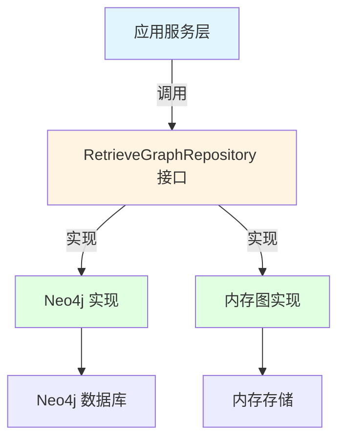

# graph_retrieval_repository_contracts 模块技术深度解析

## 1. 模块概述

在知识管理系统中，图结构是表示和存储实体及其关系的核心方式。当我们处理知识图谱时，需要一个稳定的接口层来屏蔽底层图数据库（如 Neo4j）的实现细节，同时提供统一的图数据操作能力。`graph_retrieval_repository_contracts` 模块正是为了解决这个问题而设计的——它定义了知识图谱数据存储和检索的核心契约，确保系统的其他部分可以以统一的方式与图数据库交互，而不需要关心具体的图数据库技术选型。

## 2. 核心抽象与心智模型

这个模块的核心抽象是 `RetrieveGraphRepository` 接口，我们可以将其想象为一个"图数据仓库管理员"。这个管理员负责三个主要职责：
- **入库管理**：将图数据安全地存储到指定的命名空间中
- **出库清理**：按命名空间清理不再需要的图数据
- **智能检索**：根据节点名称快速查找相关的图结构

这种设计遵循了仓库模式（Repository Pattern）的思想，将图数据的访问逻辑封装在一个统一的接口后面，使得业务逻辑与数据访问逻辑解耦。

## 3. 架构与数据流



### 数据流向说明：
1. **图数据添加**：应用服务层将图数据通过 `AddGraph` 方法传递给仓库实现，实现层将数据持久化到图数据库中。
2. **图数据删除**：应用服务层通过 `DelGraph` 方法指定要删除的命名空间，实现层清理对应命名空间的所有图数据。
3. **节点检索**：应用服务层通过 `SearchNode` 方法传入节点名称列表，实现层在图数据库中查找相关节点和关系，并返回完整的图数据结构。

## 4. 核心组件详解

### RetrieveGraphRepository 接口

**设计意图**：定义图数据存储和检索的统一契约，隔离业务逻辑与具体图数据库实现。

**核心方法**：

1. **AddGraph**
   - **功能**：将图数据添加到指定命名空间
   - **参数**：
     - `ctx context.Context`：上下文，用于传递超时、取消信号等
     - `namespace types.NameSpace`：命名空间，用于隔离不同的图数据集合
     - `graphs []*types.GraphData`：要添加的图数据列表
   - **返回值**：`error`：操作是否成功
   - **设计思考**：使用切片批量添加图数据，减少网络往返次数，提高性能

2. **DelGraph**
   - **功能**：删除指定命名空间的图数据
   - **参数**：
     - `ctx context.Context`：上下文
     - `namespace []types.NameSpace`：要删除的命名空间列表
   - **返回值**：`error`：操作是否成功
   - **设计思考**：支持批量删除多个命名空间，提高清理效率

3. **SearchNode**
   - **功能**：在指定命名空间中搜索节点
   - **参数**：
     - `ctx context.Context`：上下文
     - `namespace types.NameSpace`：要搜索的命名空间
     - `nodes []string`：要搜索的节点名称列表
   - **返回值**：
     - `*types.GraphData`：包含搜索结果的图数据
     - `error`：操作是否成功
   - **设计思考**：返回完整的图数据结构，包含节点和关系，便于上层应用进行后续处理

## 5. 依赖关系分析

### 依赖的模块：
- `core_domain_types_and_interfaces`：依赖 `types.NameSpace` 和 `types.GraphData` 类型定义
- `context`：标准库，用于上下文管理

### 被依赖的模块：
- `data_access_repositories/graph_retrieval_and_memory_repositories`：实现此接口，提供具体的图数据库访问能力
- `application_services_and_orchestration/knowledge_ingestion_extraction_and_graph_services`：使用此接口进行图数据的存储和检索

### 数据契约：
- `types.NameSpace`：命名空间类型，用于隔离不同的图数据集合
- `types.GraphData`：图数据类型，包含节点和关系信息

## 6. 设计决策与权衡

### 1. 接口最小化设计
**决策**：接口只定义了三个核心方法（AddGraph、DelGraph、SearchNode）
**权衡**：
- ✅ 优点：接口简单清晰，易于实现和维护
- ❌ 缺点：可能无法覆盖所有图操作场景
**设计理由**：遵循接口隔离原则，只定义最核心的图操作，其他复杂操作可以通过组合这三个方法或扩展接口来实现。

### 2. 命名空间隔离
**决策**：所有操作都基于命名空间进行
**权衡**：
- ✅ 优点：提供了数据隔离机制，支持多租户或多知识库场景
- ❌ 缺点：增加了操作的复杂性，需要始终关注命名空间参数
**设计理由**：知识管理系统通常需要支持多个独立的知识图谱，命名空间是实现这种隔离的自然方式。

### 3. 批量操作支持
**决策**：AddGraph 和 DelGraph 都支持批量操作
**权衡**：
- ✅ 优点：减少网络往返次数，提高性能
- ❌ 缺点：批量操作失败时的错误处理更复杂
**设计理由**：图数据通常以批量方式导入和清理，批量操作可以显著提高效率。

## 7. 使用指南与最佳实践

### 基本使用示例

```go
// 假设我们有一个 RetrieveGraphRepository 的实现
var repo RetrieveGraphRepository

// 1. 添加图数据
graphs := []*types.GraphData{
    // 构造图数据
}
err := repo.AddGraph(ctx, "my-namespace", graphs)
if err != nil {
    // 处理错误
}

// 2. 搜索节点
result, err := repo.SearchNode(ctx, "my-namespace", []string{"node1", "node2"})
if err != nil {
    // 处理错误
}
// 使用 result

// 3. 删除图数据
err = repo.DelGraph(ctx, []types.NameSpace{"my-namespace"})
if err != nil {
    // 处理错误
}
```

### 最佳实践

1. **始终使用上下文**：确保传入的上下文包含适当的超时和取消信号，以防止长时间运行的操作阻塞系统。

2. **合理命名空间设计**：命名空间的设计应该考虑数据隔离需求，常见的策略是使用 `tenant-id:knowledge-base-id` 的格式。

3. **批量操作注意事项**：批量添加图数据时，要注意单次操作的数据量，避免过大的批量操作导致内存溢出或超时。

4. **错误处理**：特别是批量操作时，要注意部分成功的情况，根据具体业务需求决定是回滚还是继续。

## 8. 边缘情况与注意事项

1. **空命名空间**：虽然接口没有明确禁止空命名空间，但在实际使用中应该避免，以免造成数据混淆。

2. **节点不存在**：SearchNode 方法在节点不存在时的行为需要由实现来定义，可能返回空的图数据或错误。

3. **并发操作**：多个 goroutine 同时操作同一个命名空间时，需要注意并发安全性，具体取决于实现的事务支持。

4. **大型图数据**：当图数据非常大时，SearchNode 可能会返回大量数据，需要考虑分页或限制返回结果的大小。

## 9. 相关模块参考

- [graph_retrieval_and_memory_repositories](data_access_repositories-graph_retrieval_and_memory_repositories.md)：包含此接口的具体实现
- [knowledge_graph_construction](application_services_and_orchestration-knowledge_ingestion_extraction_and_graph_services-knowledge_graph_construction.md)：使用此接口进行知识图谱构建
- [memory_extraction_and_recall_service](application_services_and_orchestration-conversation_context_and_memory_services-memory_extraction_and_recall_service.md)：可能使用此接口进行记忆检索
