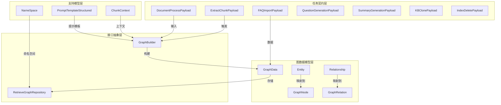

# 文档提取与图管道契约 (document_extraction_and_graph_pipeline_contracts)

## 概述

这个模块是整个知识图谱构建系统的"语言中枢"——它定义了一套通用的契约和数据结构，让文档解析、实体提取、关系构建和图检索等不同组件能够像讲同一种语言一样协同工作。想象一下，如果没有这个模块，每个组件都可能用自己的方式表示"实体"或"关系"，系统就会变成一个充满翻译错误的巴别塔。

**核心问题**：如何在一个分布式系统中，让文档处理、知识提取、图构建和检索等多个独立组件能够可靠地交换数据，而不会因为格式不匹配导致信息丢失或错误？

**解决方案**：通过定义一套标准化的契约（Contract），包括：
- 任务载荷（Payload）：描述"做什么"
- 图数据模型：描述"提取出什么"
- 存储接口：描述"如何存取"

这些契约就像系统中的"通用协议"，确保了组件之间的互操作性。

## 架构概览



这个模块的架构呈现出清晰的分层设计：

1. **任务契约层**：定义了系统中所有知识处理任务的载荷结构，从文档处理到知识库克隆，每个任务都有明确的输入输出格式。
2. **图数据模型层**：提供了两种表示图的方式——轻量级的 `GraphData`（用于传输和存储）和语义丰富的 `Entity`/`Relationship`（用于处理和推理）。
3. **接口抽象层**：`GraphBuilder` 定义了如何从文档构建图，`RetrieveGraphRepository` 定义了如何存储和检索图。
4. **支持模型层**：提供上下文管理、命名空间和提示模板等辅助功能。

## 核心组件解析

### 任务载荷契约

这部分定义了系统中所有知识处理任务的"输入格式"，就像函数的参数列表一样明确。

#### DocumentProcessPayload
这是最复杂的任务载荷，因为它需要处理多种文档导入方式（文件、URL、文本段落）。设计上采用了可选字段模式（`omitempty`），让同一个结构体能够适配不同的导入场景。

```go
type DocumentProcessPayload struct {
    RequestId                string   // 唯一请求ID，用于追踪
    TenantID                 uint64   // 租户ID，多租户隔离
    KnowledgeID              string   // 知识ID
    KnowledgeBaseID          string   // 知识库ID
    FilePath/URL/FileURL     string   // 三种导入方式，互斥使用
    Passages                 []string // 直接文本导入
    EnableMultimodel         bool     // 是否启用多模态处理
    EnableQuestionGeneration bool     // 是否生成问题
    QuestionCount            int      // 每个chunk生成多少问题
}
```

**设计意图**：通过可选字段实现"多态"载荷，避免为每种导入方式创建单独的结构体。但这也要求消费者必须正确验证字段组合的合法性。

#### FAQImportPayload
这个载荷展示了如何处理大数据量导入——当数据量小时直接放在 `Entries` 中，数据量大时通过 `EntriesURL` 引用对象存储中的文件。

**关键设计点**：
- `DryRun` 模式：支持先验证再导入，减少错误导入的风险
- `EnqueuedAt` 时间戳：用于区分同一 TaskID 的不同次提交，防止重复处理

### 图数据模型

模块提供了两套图数据模型，分别服务于不同的场景：

#### GraphData（传输层模型）
这是一个轻量级、可序列化的模型，用于组件之间的数据传输和持久化存储。

```go
type GraphData struct {
    Text     string           // 原始文本片段
    Node     []*GraphNode     // 节点列表
    Relation []*GraphRelation // 关系列表
}

type GraphNode struct {
    Name       string   // 节点名称
    Chunks     []string // 关联的chunk ID
    Attributes []string // 属性列表
}

type GraphRelation struct {
    Node1 string // 源节点
    Node2 string // 目标节点
    Type  string // 关系类型
}
```

#### Entity/Relationship（语义层模型）
这是更丰富的图模型，包含了用于推理和排序的元数据。

```go
type Entity struct {
    ID          string   // 唯一标识
    ChunkIDs    []string // 出现的chunk
    Frequency   int      // 出现频率
    Degree      int      // 连接度（用于重要性排序）
    Title       string   // 显示名称
    Type        string   // 实体类型
    Description string   // 描述
}

type Relationship struct {
    Source      string  // 源实体ID
    Target      string  // 目标实体ID
    Description string  // 关系描述
    Strength    int     // 强度（1-10）
    Weight      float64 // 权重
}
```

**设计权衡**：
- 为什么两套模型？`GraphData` 专注于"存和传"，简单高效；`Entity`/`Relationship` 专注于"算和用"，信息丰富。
- 转换责任：需要在合适的地方进行两者之间的转换，通常是在图构建器中。

### 核心接口

#### GraphBuilder
这是图构建的核心抽象，定义了从文档到知识图谱的转换契约。

```go
type GraphBuilder interface {
    BuildGraph(ctx context.Context, chunks []*Chunk) error
    GetRelationChunks(chunkID string, topK int) []string
    GetIndirectRelationChunks(chunkID string, topK int) []string
    GetAllEntities() []*Entity
    GetAllRelationships() []*Relationship
}
```

**设计意图**：
- `BuildGraph`：输入是文档块，输出是构建好的图（副作用）
- `GetRelationChunks`：直接相关的块（一阶邻居）
- `GetIndirectRelationChunks`：间接相关的块（二阶邻居），用于扩展检索上下文

这个接口的设计体现了"图不仅要构建，还要用于检索"的理念——它不仅仅是一个构建器，还是一个查询引擎。

#### RetrieveGraphRepository
定义了图数据的持久化契约。

```go
type RetrieveGraphRepository interface {
    AddGraph(ctx context.Context, namespace types.NameSpace, graphs []*types.GraphData) error
    DelGraph(ctx context.Context, namespace []types.NameSpace) error
    SearchNode(ctx context.Context, namespace types.NameSpace, nodes []string) (*types.GraphData, error)
}
```

**关键点**：
- `NameSpace`：通过知识库和知识ID的组合实现隔离
- `SearchNode`：按节点搜索，返回包含这些节点的子图

### 支持组件

#### ChunkContext
为LLM提供上下文窗口，不仅仅是当前chunk的内容，还包括前一个和后一个chunk。

```go
type ChunkContext struct {
    ChunkID     string
    Content     string
    PrevContent string // 前一个chunk，提供上文
    NextContent string // 后一个chunk，提供下文
}
```

**设计意图**：LLM在提取实体和关系时，经常需要跨chunk的上下文。例如，一个实体可能在前一个chunk中被介绍，在当前chunk中被提及。

#### NameSpace
实现多租户和多知识库隔离的关键。

```go
type NameSpace struct {
    KnowledgeBase string
    Knowledge     string
}

func (n NameSpace) Labels() []string {
    // 返回层级标签，用于图数据库的命名空间
}
```

## 设计决策与权衡

### 1. 契约式设计 vs 灵活性
**选择**：严格的契约式设计
**权衡**：
- ✅ 优点：组件间解耦，可独立测试，接口明确
- ❌ 缺点：修改契约需要协调多个组件，演进成本高

**为什么这样选**：知识图谱系统涉及多个复杂组件（文档解析、LLM提取、图存储、检索），如果没有严格契约，集成时的调试成本会远高于契约演进成本。

### 2. 可选字段载荷 vs 专用载荷
**选择**：可选字段的单一结构体
**例子**：`DocumentProcessPayload` 同时支持文件、URL、文本段落导入
**权衡**：
- ✅ 优点：API表面小，概念统一
- ❌ 缺点：需要运行时验证，可能出现无效字段组合

**缓解措施**：虽然代码中没有显示，但实际使用时应该有验证函数来确保字段组合的合法性。

### 3. 两套图模型的分离
**选择**：传输模型（GraphData）和语义模型（Entity/Relationship）分离
**权衡**：
- ✅ 优点：关注点分离，传输高效，语义丰富
- ❌ 缺点：需要维护映射逻辑，可能出现模型不一致

**设计洞察**：这是典型的"数据模型"vs"领域模型"分离——GraphData是数据模型，Entity/Relationship是领域模型。

### 4. 接口契约的粒度
**选择**：粗粒度接口
**例子**：`GraphBuilder.BuildGraph` 接收多个chunks，而不是单个chunk
**权衡**：
- ✅ 优点：减少调用次数，便于批量优化
- ❌ 缺点：单个大请求可能失败，需要考虑重试策略

## 数据流与依赖关系

### 典型的文档处理流程

```
上游：HTTP处理器
    ↓
DocumentProcessPayload 创建
    ↓
中间：任务队列
    ↓
GraphBuilder.BuildGraph(chunks)
    ├─→ 解析文档 → Chunk
    ├─→ 提取实体 → Entity
    ├─→ 提取关系 → Relationship
    └─→ 构建图结构
    ↓
转换为 GraphData
    ↓
RetrieveGraphRepository.AddGraph(namespace, graphs)
    ↓
下游：图数据库（Neo4j/MemoryGraph）
```

### 检索时的图使用流程

```
用户查询
    ↓
RetrieveGraphRepository.SearchNode(namespace, nodes)
    ↓
获取相关 GraphData
    ↓
转换为 Entity/Relationship
    ↓
GraphBuilder.GetRelationChunks(chunkID, topK)
    ↓
扩展检索上下文
    ↓
增强召回结果
```

## 与其他模块的关系

### 依赖的模块
- **[knowledge_and_knowledgebase_domain_models](../core_domain_types_and_interfaces-knowledge_graph_retrieval_and_content_contracts-knowledge_and_knowledgebase_domain_models.md)**：提供知识库和知识的核心模型
- **[chunk_content_service_and_repository_interfaces](../core_domain_types_and_interfaces-knowledge_graph_retrieval_and_content_contracts-content_service_and_repository_interfaces.md)**：提供chunk的存取接口

### 被依赖的模块
- **[knowledge_ingestion_extraction_and_graph_services](../application_services_and_orchestration-knowledge_ingestion_extraction_and_graph_services.md)**：使用这些契约实现实际的知识图谱构建
- **[memory_graph_repository](../data_access_repositories-graph_retrieval_and_memory_repositories.md)**：实现 `RetrieveGraphRepository` 接口
- **[http_handlers_and_routing](../http_handlers_and_routing.md)**：使用载荷结构进行HTTP请求解析

## 常见问题与注意事项

### 1. 字段验证的责任
**陷阱**：载荷结构使用了很多可选字段，但没有内置验证。
**建议**：在使用载荷前，始终进行验证，确保字段组合的合法性。

### 2. 两套图模型的映射
**陷阱**：GraphData 和 Entity/Relationship 之间的转换可能丢失信息。
**建议**：
- 明确转换方向和场景
- 保留所有必要的元数据
- 考虑使用辅助函数进行转换

### 3. Namespace 的正确使用
**陷阱**：忘记设置 Namespace 可能导致数据混合。
**建议**：
- 始终设置 KnowledgeBase 和 Knowledge
- 在多租户环境中，确保租户ID也被正确隔离
- 使用 `Labels()` 方法获取层级标签

### 4. 上下文窗口的大小
**陷阱**：ChunkContext 的 PrevContent 和 NextContent 可能很大，增加 LLM 的 token 消耗。
**建议**：
- 考虑对上下文进行截断或摘要
- 根据模型的上下文窗口调整提供的信息量

### 5. 图构建的幂等性
**陷阱**：重复调用 BuildGraph 可能导致重复的实体和关系。
**建议**：
- GraphBuilder 实现应该具有幂等性
- 或者在调用前先删除旧图

## 子模块说明

这个模块包含以下子模块，每个子模块负责契约的特定方面：

- **[extraction_and_generation_payload_contracts](./core_domain_types_and_interfaces-knowledge_graph_retrieval_and_content_contracts-document_extraction_and_graph_pipeline_contracts-extraction_and_generation_payload_contracts.md)**：文档提取和生成任务的载荷契约
- **[knowledge_lifecycle_and_namespace_payload_contracts](./core_domain_types_and_interfaces-knowledge_graph_retrieval_and_content_contracts-document_extraction_and_graph_pipeline_contracts-knowledge_lifecycle_and_namespace_payload_contracts.md)**：知识生命周期和命名空间相关契约
- **[graph_document_projection_models](./core_domain_types_and_interfaces-knowledge_graph_retrieval_and_content_contracts-document_extraction_and_graph_pipeline_contracts-graph_document_projection_models.md)**：图文档投影模型
- **[graph_entity_relationship_builder_contracts](./core_domain_types_and_interfaces-knowledge_graph_retrieval_and_content_contracts-document_extraction_and_graph_pipeline_contracts-graph_entity_relationship_builder_contracts.md)**：图实体关系构建器契约
- **[graph_retrieval_repository_contracts](./core_domain_types_and_interfaces-knowledge_graph_retrieval_and_content_contracts-document_extraction_and_graph_pipeline_contracts-graph_retrieval_repository_contracts.md)**：图检索仓库契约

## 总结

这个模块是知识图谱系统的"粘合剂"和"语言"。它不做实际的文档解析、图构建或存储工作，而是定义了这些工作应该如何进行、数据应该如何表示。这种契约式设计虽然增加了前期设计成本，但为系统的可扩展性、可测试性和组件的独立演进奠定了坚实的基础。

对于新加入的开发者，理解这个模块的关键是理解"契约"的价值——它不仅仅是数据结构，更是组件之间的"协议"和"承诺"。
