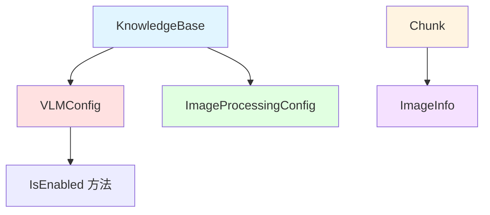

# 多模态 VLM 与图像处理配置模块

## 1. 模块概述

想象一下，您有一个包含大量文档的知识库，这些文档不仅包含文本，还包含图表、照片和流程图。传统的知识库系统只能索引文本内容，而忽略了图像中的丰富信息。这就是多模态 VLM（视觉语言模型）与图像处理配置模块要解决的问题。

这个模块为知识库系统提供了配置和管理多模态处理能力的核心数据结构，使系统能够：
- 通过视觉语言模型理解文档中的图像内容
- 提取图像的 OCR 文本和语义描述
- 将图像信息与文本内容一起索引和检索

它就像知识库系统的"视觉皮层"，让系统能够"看懂"文档中的图像，并将这些视觉信息转化为可检索的知识。

## 2. 核心组件与架构

### 2.1 核心组件



这个模块的核心由三个主要组件构成：

1. **VLMConfig** - 视觉语言模型配置
   - 控制 VLM 功能的启用状态
   - 指定使用的 VLM 模型
   - 提供新旧版本配置的兼容性支持

2. **ImageProcessingConfig** - 图像处理配置
   - 指定用于图像处理的模型 ID
   - 简单而专注的配置结构

3. **ImageInfo** - 图像元数据
   - 存储图像的 URL、位置信息
   - 保存图像的描述和 OCR 文本
   - 维护图像在原始文本中的位置关系

### 2.2 数据流向

当处理包含图像的文档时，数据流向如下：

1. **配置阶段**：系统读取 `KnowledgeBase` 中的 `VLMConfig` 和 `ImageProcessingConfig`
2. **处理阶段**：根据配置，调用相应的 VLM 和图像处理模型
3. **结果存储**：处理结果（图像描述、OCR 文本）存储在 `ImageInfo` 中
4. **索引阶段**：包含 `ImageInfo` 的 `Chunk` 被索引，支持多模态检索

## 3. 设计决策与权衡

### 3.1 新旧版本兼容性设计

**决策**：在 `VLMConfig` 中同时保留新版本配置（`Enabled`、`ModelID`）和旧版本配置（`ModelName`、`BaseURL`、`APIKey`、`InterfaceType`），并通过 `IsEnabled()` 方法统一判断逻辑。

**原因**：
- 平滑迁移：允许用户逐步从旧配置迁移到新配置
- 向后兼容：确保现有知识库无需修改即可继续工作
- 统一接口：通过 `IsEnabled()` 方法隐藏配置版本差异

**权衡**：
- ✅ 优点：迁移平滑，用户体验好
- ❌ 缺点：代码复杂度增加，需要维护两套配置逻辑

### 3.2 配置与数据分离

**决策**：将配置（`VLMConfig`、`ImageProcessingConfig`）与数据（`ImageInfo`）分离为不同的结构体。

**原因**：
- 职责清晰：配置定义"如何处理"，数据存储"处理结果"
- 复用性：同一配置可应用于多个知识库
- 灵活性：配置可动态调整，不影响已处理的数据

**权衡**：
- ✅ 优点：架构清晰，易于维护和扩展
- ❌ 缺点：需要确保配置与数据的一致性

### 3.3 简化的图像处理配置

**决策**：`ImageProcessingConfig` 只包含一个 `ModelID` 字段，保持极简设计。

**原因**：
- YAGNI 原则：避免过度设计，只包含当前必要的配置
- 未来扩展：如有需要，可轻松添加更多字段而不破坏兼容性
- 关注点分离：将复杂的模型参数配置留给模型 catalog 管理

**权衡**：
- ✅ 优点：简单易用，维护成本低
- ❌ 缺点：当前版本灵活性有限

## 4. 关键组件详解

### 4.1 VLMConfig - 视觉语言模型配置

`VLMConfig` 是控制视觉语言模型行为的核心配置结构。

```go
type VLMConfig struct {
    Enabled bool   // 新版本：是否启用 VLM
    ModelID string // 新版本：模型 ID
    
    // 兼容老版本的字段
    ModelName     string // 模型名称
    BaseURL       string // 基础 URL
    APIKey        string // API 密钥
    InterfaceType string // 接口类型："ollama" 或 "openai"
}
```

**核心方法 - IsEnabled()**：
```go
func (c VLMConfig) IsEnabled() bool {
    // 新版本配置
    if c.Enabled && c.ModelID != "" {
        return true
    }
    // 兼容老版本配置
    if c.ModelName != "" && c.BaseURL != "" {
        return true
    }
    return false
}
```

这个方法是整个多模态功能的"开关"，它巧妙地处理了新旧版本配置的兼容性问题。无论是使用新版本的 `Enabled` + `ModelID` 组合，还是旧版本的 `ModelName` + `BaseURL` 组合，都能正确判断 VLM 功能是否启用。

### 4.2 ImageInfo - 图像元数据

`ImageInfo` 结构体存储了与文档 chunk 关联的图像的完整信息：

```go
type ImageInfo struct {
    URL         string // 图片 URL（COS）
    OriginalURL string // 原始图片 URL
    StartPos    int    // 图片在文本中的开始位置
    EndPos      int    // 图片在文本中的结束位置
    Caption     string // 图片描述（由 VLM 生成）
    OCRText     string // 图片 OCR 文本
}
```

这个结构体就像图像的"身份证"，包含了：
- **位置信息**：`StartPos` 和 `EndPos` 让系统知道图像在原始文档中的位置
- **存储信息**：`URL` 和 `OriginalURL` 用于访问图像文件
- **内容信息**：`Caption` 和 `OCRText` 是图像的"可检索内容"，使图像能够被语义搜索

### 4.3 KnowledgeBase 中的多模态集成

在 `KnowledgeBase` 结构体中，多模态配置通过两个字段集成：

```go
type KnowledgeBase struct {
    // ... 其他字段 ...
    ImageProcessingConfig ImageProcessingConfig // 图像处理配置
    VLMConfig             VLMConfig             // VLM 配置
    // ... 其他字段 ...
}
```

同时，`KnowledgeBase` 提供了一个便捷方法 `IsMultimodalEnabled()` 来统一判断多模态功能是否启用：

```go
func (kb *KnowledgeBase) IsMultimodalEnabled() bool {
    if kb == nil {
        return false
    }
    // 新版本配置优先
    if kb.VLMConfig.IsEnabled() {
        return true
    }
    // 兼容老版本：chunking_config 中的 enable_multimodal 字段
    if kb.ChunkingConfig.EnableMultimodal {
        return true
    }
    return false
}
```

这个方法展示了系统如何优雅地处理多层级的兼容性：
1. 首先检查新版本的 `VLMConfig`
2. 如果不满足，回退到旧版本的 `ChunkingConfig.EnableMultimodal`

## 5. 使用场景与最佳实践

### 5.1 启用多模态处理

要为知识库启用多模态处理，只需设置 `VLMConfig`：

```go
kb := &KnowledgeBase{
    // ... 其他字段 ...
    VLMConfig: VLMConfig{
        Enabled: true,
        ModelID: "your-vlm-model-id",
    },
    ImageProcessingConfig: ImageProcessingConfig{
        ModelID: "your-image-processing-model-id",
    },
}
```

### 5.2 检查多模态状态

在处理文档时，使用 `IsMultimodalEnabled()` 来决定是否进行多模态处理：

```go
if kb.IsMultimodalEnabled() {
    // 执行多模态处理
    processImagesWithVLM(document, kb.VLMConfig)
    extractOCR(document, kb.ImageProcessingConfig)
}
```

### 5.3 兼容性迁移

如果您有使用旧版本配置的知识库，可以逐步迁移到新版本：

1. 保持旧版本配置不变，系统仍然可以正常工作
2. 为新知识库使用新版本配置
3. 逐步将旧知识库迁移到新版本配置

## 6. 注意事项与潜在陷阱

### 6.1 配置一致性

**陷阱**：同时设置新旧版本配置可能导致混淆。

**建议**：
- 对于新知识库，只使用新版本配置
- 对于旧知识库，在迁移完成后清理旧版本配置
- 使用 `IsEnabled()` 和 `IsMultimodalEnabled()` 方法，而不是直接检查字段

### 6.2 空值处理

**陷阱**：`ImageInfo` 中的字段可能为空，特别是在图像处理失败时。

**建议**：
- 在使用 `ImageInfo` 字段前进行空值检查
- 为 `Caption` 和 `OCRText` 提供合理的默认值或回退策略

### 6.3 性能考虑

**陷阱**：VLM 处理可能非常耗时，特别是对于大量图像。

**建议**：
- 考虑异步处理图像
- 实现图像处理结果的缓存
- 提供跳过图像处理的选项

## 7. 与其他模块的关系

这个模块与以下模块紧密相关：

- [知识提取管道配置](core_domain_types_and_interfaces-knowledge_graph_retrieval_and_content_contracts-knowledge_and_knowledgebase_domain_models-knowledgebase_extraction_faq_and_multimodal_processing_configuration-knowledge_extraction_pipeline_configuration.md) - 共同构成知识库的处理配置
- [文档分块数据模型](docreader_pipeline-document_models_and_chunking_support-document_data_models-document_chunk_data_model.md) - 使用 `ImageInfo` 存储图像信息
- [模型目录](core_domain_types_and_interfaces-identity_tenant_organization_and_configuration_contracts-model_catalog_and_parameter_contracts.md) - 提供 VLM 和图像处理模型的定义

## 8. 总结

多模态 VLM 与图像处理配置模块为知识库系统提供了"看见"和理解图像的能力。它的设计体现了以下核心思想：

1. **兼容性优先**：通过优雅的版本兼容设计，确保平滑迁移
2. **简单性**：保持配置结构的简洁，避免过度设计
3. **关注点分离**：将配置与数据分离，使架构更清晰

这个模块虽然代码量不大，但它是整个多模态知识库系统的基础，为后续的图像处理、VLM 推理和多模态检索提供了必要的配置支持。
