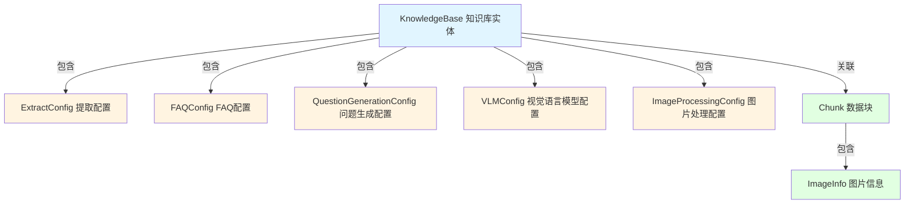

# 知识库提取、FAQ和多模态处理配置模块

## 1. 模块概述

这个模块是知识库系统的核心配置层，它解决的核心问题是：**如何让知识库灵活适配不同类型的内容处理需求？** 想象一下，你有一个文件柜，但有些文件需要拆分成卡片（文档分块），有些文件是问答对（FAQ），还有些文件包含图片需要理解（多模态）。这个模块就像是文件柜的"配置面板"，让你为每个抽屉（知识库）定义不同的处理规则。

从技术角度看，它提供了一套结构化的配置模型，用于控制：
- 文档知识的提取和知识图谱构建
- FAQ知识库的索引策略
- 多模态内容（图片）的视觉语言模型（VLM）处理

## 2. 核心架构



### 2.1 架构角色定位

这个模块在系统中扮演**"配置契约"**的角色：
- **上游**：被知识库管理服务和HTTP处理器使用，用于创建/更新知识库配置
- **下游**：被文档解析管道、知识提取服务、多模态处理引擎消费，用于指导具体的处理行为
- **核心价值**：将"业务意图"（如何处理这个知识库）与"执行逻辑"（具体怎么处理）解耦

### 2.2 数据流向

以文档导入流程为例：
1. 用户通过API创建知识库，设置 `ExtractConfig`、`VLMConfig` 等配置
2. 配置被持久化到数据库（通过 GORM 的 JSON 字段）
3. 文档导入时，知识提取服务读取配置
4. 根据 `ExtractConfig.Enabled` 决定是否进行知识图谱提取
5. 根据 `VLMConfig.IsEnabled()` 决定是否启动多模态处理
6. 处理结果生成 `Chunk`，图片信息存入 `ImageInfo`

## 3. 核心组件详解

### 3.1 ExtractConfig - 知识提取配置

```go
type ExtractConfig struct {
    Enabled   bool             // 是否启用知识提取
    Text      string           // 提取的文本内容
    Tags      []string         // 相关标签
    Nodes     []*GraphNode     // 知识图谱节点
    Relations []*GraphRelation // 知识图谱关系
}
```

**设计意图**：这个结构体不仅仅是配置，还承载了提取结果的存储。这种"配置+结果"的混合设计是一个权衡点：
- **优点**：减少数据模型数量，配置和结果天然关联
- **缺点**：职责不够单一，配置部分和结果部分混用

**使用场景**：当你需要从文档中自动提取实体和关系构建知识图谱时，启用此配置。

### 3.2 FAQConfig - FAQ知识库配置

```go
type FAQConfig struct {
    IndexMode         FAQIndexMode         // 索引模式：仅问题 or 问题+答案
    QuestionIndexMode FAQQuestionIndexMode // 问题索引模式：合并 or 分离
}
```

**设计亮点**：
- **双重索引策略**：通过 `IndexMode` 控制是只索引问题还是连答案一起索引
- **相似问题处理**：通过 `QuestionIndexMode` 控制相似问题是合并索引还是分离索引

**为什么需要这么多模式？**
- `FAQIndexModeQuestionOnly`：适合答案很长的场景，避免索引体积过大
- `FAQIndexModeQuestionAnswer`：适合短问答，能提高匹配准确率
- `FAQQuestionIndexModeCombined`：相似问题合并，减少索引项
- `FAQQuestionIndexModeSeparate`：相似问题分离，提高召回率

### 3.3 QuestionGenerationConfig - 问题生成配置

```go
type QuestionGenerationConfig struct {
    Enabled bool          // 是否启用
    QuestionCount int     // 每个数据块生成的问题数（默认3，最大10）
}
```

**设计意图**：这是一个**检索增强**的设计。文档分块后，直接对块内容进行向量化检索效果可能不好（因为用户提问的表达方式和文档正文不同）。通过为每个块生成几个问题，然后索引这些问题，可以大幅提高召回率。

**权衡**：问题数越多，召回率可能越高，但索引成本和计算成本也越高。默认3个、最大10个是经验值的平衡。

### 3.4 VLMConfig - 视觉语言模型配置

```go
type VLMConfig struct {
    Enabled bool
    ModelID string
    
    // 兼容老版本字段
    ModelName string
    BaseURL string
    APIKey string
    InterfaceType string
}
```

**设计亮点 - 兼容性处理**：注意 `IsEnabled()` 方法，它同时支持新旧两种配置格式：
- 新版本：`Enabled && ModelID != ""`
- 老版本：`ModelName != "" && BaseURL != ""`

这是一个**向后兼容**的优雅实现，避免了配置迁移的痛苦。

### 3.5 ImageInfo - 图片信息

```go
type ImageInfo struct {
    URL string          // 图片存储URL
    OriginalURL string  // 原始图片URL
    StartPos int        // 在文本中的起始位置
    EndPos int          // 在文本中的结束位置
    Caption string      // 图片描述
    OCRText string      // OCR识别文本
}
```

**设计意图**：这个结构体将图片的**位置信息**、**存储信息**和**语义信息**完美结合：
- 位置信息（StartPos/EndPos）：保持与原始文档的上下文关联
- 存储信息（URL/OriginalURL）：支持图片访问和溯源
- 语义信息（Caption/OCRText）：让图片可被检索

## 4. 关键设计决策

### 4.1 配置持久化：JSON字段 vs 关联表

**决策**：使用 GORM 的 JSON 字段存储所有配置

**为什么这样选择？**
- ✅ 灵活性：配置结构变化时不需要数据库迁移
- ✅ 查询效率：一次查询就能获取知识库的所有配置
- ✅ 简化模型：不需要为每种配置创建单独的表

**权衡**：
- ❌ 失去了数据库层面的类型安全
- ❌ 无法对配置字段建立索引
- ❌ 配置结构演化需要手动处理兼容性

**适用场景**：配置结构相对稳定，且不需要按配置字段查询的场景。

### 4.2 兼容性设计：双重配置格式支持

**决策**：在 `VLMConfig` 和 `IsMultimodalEnabled()` 中同时支持新旧配置格式

**为什么这样选择？**
- ✅ 平滑升级：现有用户不需要修改配置就能使用新功能
- ✅ 渐进迁移：可以逐步淘汰老版本配置
- ✅ 降低风险：不会因为配置格式变化导致系统故障

**实现模式**：
```go
// 新版本配置优先
if c.Enabled && c.ModelID != "" {
    return true
}
// 兼容老版本配置
if c.ModelName != "" && c.BaseURL != "" {
    return true
}
```

### 4.3 职责边界：配置只定义"做什么"，不定义"怎么做"

**决策**：配置结构体只包含参数，不包含业务逻辑

**为什么这样选择？**
- ✅ 关注点分离：配置是声明式的，执行逻辑在服务层
- ✅ 易于测试：配置可以独立测试，不依赖执行环境
- ✅ 灵活替换：同一套配置可以被不同的执行引擎使用

**边界示例**：
- 配置定义：`QuestionGenerationConfig.QuestionCount = 3`
- 执行逻辑：在服务层决定用什么LLM、什么prompt生成这3个问题

## 5. 使用指南与注意事项

### 5.1 正确设置默认值

```go
kb := &KnowledgeBase{Type: KnowledgeBaseTypeFAQ}
kb.EnsureDefaults() // 必须调用！
```

**注意**：`EnsureDefaults()` 方法会根据知识库类型自动设置合理的默认值，千万不要跳过。

### 5.2 多模态启用检查

```go
// 正确做法
if kb.IsMultimodalEnabled() {
    // 启用多模态处理
}

// 错误做法
if kb.VLMConfig.Enabled {
    // 可能漏掉老版本配置的情况
}
```

### 5.3 FAQ配置的选择建议

| 场景 | 推荐配置 |
|------|----------|
| 短问答，高准确率优先 | `IndexMode=QuestionAnswer`, `QuestionIndexMode=Combined` |
| 长答案，索引体积敏感 | `IndexMode=QuestionOnly`, `QuestionIndexMode=Combined` |
| 高召回率优先 | `IndexMode=QuestionAnswer`, `QuestionIndexMode=Separate` |

### 5.4 常见陷阱

1. **忘记处理 nil 指针**：`ExtractConfig`、`FAQConfig` 等都是指针，使用前必须检查 nil
2. **跳过默认值设置**：不调用 `EnsureDefaults()` 可能导致配置不完整
3. **直接检查 VLM 字段**：总是使用 `IsEnabled()` 和 `IsMultimodalEnabled()` 方法
4. **忽略配置兼容性**：修改配置结构时，要考虑现有数据的迁移

## 6. 子模块概览

本模块包含以下子模块，每个子模块都有详细的文档：

- [知识提取管道配置](core_domain_types_and_interfaces-knowledge_graph_retrieval_and_content_contracts-knowledge_and_knowledgebase_domain_models-knowledgebase_extraction_faq_and_multimodal_processing_configuration-knowledge_extraction_pipeline_configuration.md)
- [FAQ和问题生成配置](core_domain_types_and_interfaces-knowledge_graph_retrieval_and_content_contracts-knowledge_and_knowledgebase_domain_models-knowledgebase_extraction_faq_and_multimodal_processing_configuration-faq_and_question_generation_configuration.md)
- [多模态VLM和图像处理配置](core_domain_types_and_interfaces-knowledge_graph_retrieval_and_content_contracts-knowledge_and_knowledgebase_domain_models-knowledgebase_extraction_faq_and_multimodal_processing_configuration-multimodal_vlm_and_image_processing_configuration.md)

## 7. 与其他模块的关系

- **上游依赖**：
  - [知识库核心和存储配置](core_domain_types_and_interfaces-knowledge_graph_retrieval_and_content_contracts-knowledge_and_knowledgebase_domain_models-knowledgebase_core_and_storage_configuration.md)：提供知识库的基础模型
  - [知识图谱检索仓库契约](core_domain_types_and_interfaces-knowledge_graph_retrieval_and_content_contracts-document_extraction_and_graph_pipeline_contracts.md)：知识提取结果的消费者
  
- **下游影响**：
  - [知识提取服务](application_services_and_orchestration-knowledge_ingestion_extraction_and_graph_services.md)：直接消费这些配置
  - [文档解析管道](docreader_pipeline.md)：使用VLM和图像处理配置

---

这个模块看似只是简单的数据结构定义，但实则包含了丰富的设计考量：兼容性处理、职责边界、默认值策略等。理解这些设计背后的"为什么"，才能真正用好这个模块。
