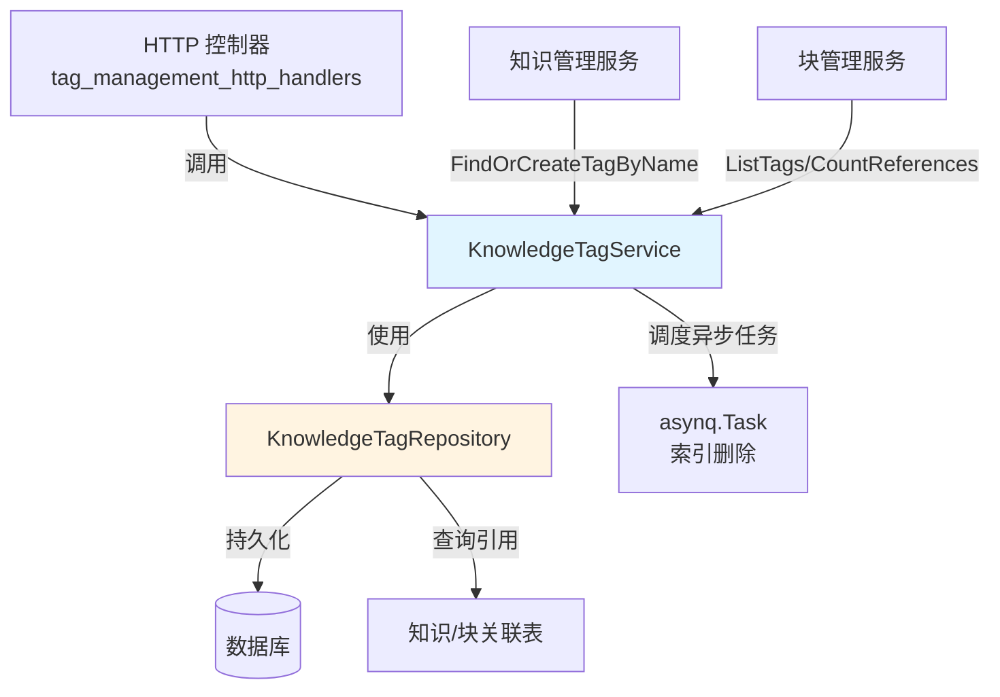

# knowledge_tag_service_and_persistence_interfaces 模块深度解析

## 1. 为什么需要这个模块？

在知识管理系统中，标签（Tag）是连接知识内容与用户组织方式的桥梁。想象一下：一个知识库可能包含数千条知识记录和百万级的文本块，用户需要一种灵活的方式来分类、过滤和发现这些内容。这就是标签系统存在的意义。

### 问题空间

1. **内容组织的复杂性**：知识和文本块需要被灵活标记，但标签本身也需要管理（创建、更新、删除、排序）
2. **引用计数的挑战**：删除标签时需要知道它是否被使用，否则会导致数据不一致
3. **异步操作的必要性**：大规模删除标签关联的内容时，同步操作会阻塞用户界面
4. **多维度的统计需求**：用户需要知道每个标签下有多少知识和文本块，以便做出操作决策

### 设计洞察

这个模块的核心思想是**将标签的业务逻辑与持久化分离**，同时通过接口定义契约，让上层应用不需要关心底层实现细节。它不是一个简单的 CRUD 接口集，而是一个完整的标签生命周期管理契约。

---

## 2. 核心心智模型

理解这个模块的关键是建立两个核心抽象：

### 标签作为一等公民

标签不是知识的附属属性，而是独立的业务实体。它有自己的元数据（名称、颜色、排序）、生命周期和统计信息。这种设计使得标签可以被独立管理，而不依赖于任何特定的知识内容。

### 服务-仓库分离模式

- **Service 层**：处理业务逻辑（如删除时的引用检查、异步任务调度、幂等性保证）
- **Repository 层**：专注于数据持久化（CRUD、批量操作、复杂查询）

这种分离类似于餐厅的"前台-后厨"模式：Service 是前台服务员，负责接待顾客、处理特殊要求、协调订单；Repository 是后厨，专注于按照标准流程准备菜品。

---

## 3. 架构与数据流向

让我们通过 Mermaid 图来理解这个模块的架构：



### 核心组件职责

#### KnowledgeTagService 接口

这是标签业务逻辑的核心契约，定义了 7 个关键操作：

1. **ListTags** - 列出知识库下的所有标签，带统计信息
2. **CreateTag** - 创建新标签
3. **UpdateTag** - 更新标签基本信息
4. **DeleteTag** - 删除标签（支持仅删除内容、强制删除等模式）
5. **FindOrCreateTagByName** - 按名称查找或创建标签（幂等操作）
6. **ProcessIndexDelete** - 处理异步索引删除任务

#### KnowledgeTagRepository 接口

这是标签持久化的契约，提供了数据访问的抽象：

1. **基本 CRUD** - Create/Update/GetByID/Delete
2. **批量查询** - GetByIDs/GetBySeqIDs
3. **知识库范围查询** - ListByKB/GetByName
4. **引用统计** - CountReferences/BatchCountReferences
5. **清理操作** - DeleteUnusedTags

### 关键数据流向

让我们追踪一个典型的"删除标签"操作流程：

1. **用户请求** → HTTP 控制器调用 `KnowledgeTagService.DeleteTag()`
2. **业务逻辑** → Service 层检查引用计数（通过 Repository）
3. **决策分支**：
   - 如果标签被使用且 `force=false` → 拒绝删除
   - 如果 `contentOnly=true` → 仅删除标签与内容的关联
   - 否则 → 删除标签本身
4. **异步清理** → 如果需要大规模清理，Service 调度 `asynq.Task`
5. **持久化** → Repository 执行实际的数据库操作

---

## 4. 核心组件深度解析

### KnowledgeTagService 接口详解

#### ListTags - 带统计的标签列表

```go
ListTags(ctx context.Context, kbID string, page *types.Pagination, keyword string) (*types.PageResult, error)
```

**设计意图**：这不是一个简单的列表查询。用户需要看到每个标签下有多少知识和文本块，才能决定如何管理它们。

**关键点**：
- 接受 `keyword` 参数支持标签搜索
- 返回 `types.PageResult` 而不是直接返回标签列表，这意味着结果包含分页信息和统计数据
- 实现通常会在内部调用 `Repository.BatchCountReferences` 来批量获取引用计数，避免 N+1 查询问题

#### DeleteTag - 灵活的删除策略

```go
DeleteTag(ctx context.Context, id string, force bool, contentOnly bool, excludeIDs []string) error
```

**设计意图**：删除标签是一个危险操作，需要提供多种安全机制。

**参数解析**：
- `force` - 强制删除，即使标签被引用
- `contentOnly` - 只删除标签与内容的关联，保留标签定义
- `excludeIDs` - 排除特定的文本块，避免误删重要内容

**为什么这样设计？**：
想象用户想"清空这个标签下的所有内容，但保留标签本身" - `contentOnly=true` 就是为这种场景设计的。而 `excludeIDs` 则允许用户在批量清理时保护某些重要内容不被删除。

#### FindOrCreateTagByName - 幂等的标签获取

```go
FindOrCreateTagByName(ctx context.Context, kbID string, name string) (*types.KnowledgeTag, error)
```

**设计意图**：在知识导入或自动标记场景中，我们经常需要"如果标签存在就用它，不存在就创建一个"。这个方法将这个常见模式封装成一个幂等操作。

**关键特性**：
- 幂等性：多次调用不会创建重复标签
- 原子性：在并发场景下应该保证不会创建重复标签（通常通过数据库唯一约束实现）

#### ProcessIndexDelete - 异步任务处理

```go
ProcessIndexDelete(ctx context.Context, t *asynq.Task) error
```

**设计意图**：删除标签关联的内容可能涉及大量索引更新，同步执行会导致请求超时。这个方法将异步任务的处理逻辑契约化。

**为什么 Service 层要包含这个？**：
虽然这是一个任务处理方法，但它属于标签业务逻辑的一部分 - 它知道如何正确清理标签相关的索引数据。将它放在 Service 接口中保持了业务逻辑的内聚性。

### KnowledgeTagRepository 接口详解

#### 批量查询优化

```go
GetByIDs(ctx context.Context, tenantID uint64, ids []string) ([]*types.KnowledgeTag, error)
GetBySeqIDs(ctx context.Context, tenantID uint64, seqIDs []int64) ([]*types.KnowledgeTag, error)
```

**设计意图**：当需要显示多个标签（如一个知识记录的所有标签）时，批量查询比循环单个查询高效得多。

**关键点**：
- 同时支持 ID 和 SeqID 两种查询方式，反映了系统可能有两种标识符
- `tenantID` 作为第一个参数，强调了数据的多租户隔离性

#### 引用统计 - BatchCountReferences

```go
BatchCountReferences(
    ctx context.Context,
    tenantID uint64,
    kbID string,
    tagIDs []string,
) (map[string]types.TagReferenceCounts, error)
```

**设计意图**：这是为 `ListTags` 场景优化的。如果列表页面显示 20 个标签，逐个查询引用计数会产生 21 次数据库查询（1 次列表 + 20 次计数），而批量查询只需要 2 次。

**性能考量**：
返回 `map[string]types.TagReferenceCounts` 而不是按顺序返回，是为了让调用者可以灵活地将统计信息与标签列表匹配。

#### DeleteUnusedTags - 垃圾回收

```go
DeleteUnusedTags(ctx context.Context, tenantID uint64, kbID string) (int64, error)
```

**设计意图**：系统中可能存在没有被任何知识或文本块引用的"孤儿标签"。这个方法提供了一种清理机制。

**为什么在 Repository 层？**：
这是一个纯粹的数据操作，不涉及复杂的业务逻辑决策，因此放在 Repository 层更合适。

---

## 5. 依赖关系分析

### 此模块依赖什么？

1. **context.Context** - 标准库，用于请求上下文传递、超时控制和取消
2. **github.com/hibiken/asynq** - 异步任务队列库，用于处理耗时的标签删除操作
3. **internal/types** - 内部类型定义，包含 `KnowledgeTag`、`Pagination`、`PageResult`、`TagReferenceCounts` 等核心数据结构

### 谁依赖此模块？

根据模块树，这个接口层会被以下模块依赖：

1. **http_handlers_and_routing.knowledge_faq_and_tag_content_handlers.tag_management_http_handlers** - HTTP 层调用 Service 接口处理标签管理请求
2. **application_services_and_orchestration.knowledge_ingestion_extraction_and_graph_services** - 知识导入服务可能使用 `FindOrCreateTagByName`
3. **data_access_repositories.content_and_knowledge_management_repositories.tagging_and_reference_count_repositories** - Repository 接口的实现层

### 数据契约

这个模块定义了两个关键的数据契约：

1. **Service 契约** - 上层应用通过这个契约与标签系统交互，不需要知道底层存储细节
2. **Repository 契约** - 数据访问层通过这个契约与数据库交互，不需要知道业务逻辑

这种双层接口设计使得系统可以独立演进：
- 可以更换 Repository 实现（如从 PostgreSQL 切换到 MySQL）而不影响 Service 层
- 可以修改 Service 层的业务逻辑（如改变删除策略）而不影响 Repository 层

---

## 6. 设计决策与权衡

### 决策 1：接口分离 vs 统一接口

**选择**：将 Service 和 Repository 分离为两个独立的接口

**为什么这样选择？**：
- **单一职责原则**：Service 负责业务逻辑，Repository 负责数据访问
- **可测试性**：可以轻松 mock Repository 来测试 Service 逻辑，反之亦然
- **灵活性**：可以有多个 Repository 实现（如主数据库、缓存、只读副本）

**权衡**：
- 增加了一定的接口复杂度
- 简单场景下可能显得"过度设计"

### 决策 2：多租户感知 vs 租户透明

**选择**：Repository 接口的所有方法都显式接受 `tenantID` 参数

**为什么这样选择？**：
- **安全性**：防止跨租户数据泄露，每个查询都必须明确指定租户
- **性能**：数据库查询可以利用租户索引进行优化
- **一致性**：强制在数据访问层考虑多租户，避免遗漏

**权衡**：
- 接口略显冗长
- 调用者需要正确传递租户 ID

### 决策 3：批量操作 vs 单个操作

**选择**：同时提供单个和批量操作方法（如 `GetByID` 和 `GetByIDs`）

**为什么这样选择？**：
- **性能**：批量操作显著减少数据库往返次数
- **灵活性**：简单场景用单个操作，复杂场景用批量操作
- **实用性**：List 场景必须用批量计数才能保证性能

**权衡**：
- 接口数量增加
- 实现者需要维护两套逻辑

### 决策 4：异步删除 vs 同步删除

**选择**：通过 `asynq.Task` 支持异步删除操作

**为什么这样选择？**：
- **用户体验**：大规模删除不会让用户等待
- **系统稳定性**：避免长时间持有数据库连接
- **错误重试**：异步任务可以重试失败的操作

**权衡**：
- 最终一致性：删除操作不会立即反映在查询结果中
- 复杂性增加：需要处理异步任务的状态和错误

---

## 7. 使用指南与最佳实践

### 常见使用模式

#### 模式 1：列出带统计的标签

```go
// 假设我们有一个 service 实例
page, err := service.ListTags(ctx, kbID, pagination, keyword)
if err != nil {
    // 处理错误
}
// page 包含标签列表和每个标签的知识/块计数
```

#### 模式 2：安全地创建标签

```go
// 使用 FindOrCreateTagByName 避免重复创建
tag, err := service.FindOrCreateTagByName(ctx, kbID, tagName)
if err != nil {
    // 处理错误
}
// tag 现在肯定存在，可以安全使用
```

#### 模式 3：灵活的删除策略

```go
// 场景 1：仅清空标签下的内容，保留标签
err := service.DeleteTag(ctx, tagID, false, true, nil)

// 场景 2：强制删除标签及其所有关联
err := service.DeleteTag(ctx, tagID, true, false, nil)

// 场景 3：清空内容，但保留某些重要的块
excludeIDs := []string{"chunk-1", "chunk-2"}
err := service.DeleteTag(ctx, tagID, false, true, excludeIDs)
```

### 扩展点

#### 实现自定义 Repository

如果你需要为特定数据库（如 MongoDB）实现 Repository：

```go
type MongoKnowledgeTagRepository struct {
    // MongoDB 相关字段
}

func (r *MongoKnowledgeTagRepository) Create(ctx context.Context, tag *types.KnowledgeTag) error {
    // 实现 MongoDB 插入逻辑
}

// ... 实现其他接口方法
```

#### 装饰 Service 层

你可以使用装饰器模式为 Service 添加横切关注点：

```go
type LoggingKnowledgeTagService struct {
    inner KnowledgeTagService
    logger *zap.Logger
}

func (s *LoggingKnowledgeTagService) ListTags(ctx context.Context, kbID string, page *types.Pagination, keyword string) (*types.PageResult, error) {
    s.logger.Info("Listing tags", zap.String("kbID", kbID))
    result, err := s.inner.ListTags(ctx, kbID, page, keyword)
    if err != nil {
        s.logger.Error("List tags failed", zap.Error(err))
    }
    return result, err
}
```

### 配置与依赖注入

这个模块设计为依赖注入友好。典型的 wire 配置可能如下：

```go
func ProvideKnowledgeTagService(
    repo KnowledgeTagRepository,
    asynqClient *asynq.Client,
) KnowledgeTagService {
    return &knowledgeTagServiceImpl{
        repo: repo,
        asynqClient: asynqClient,
    }
}
```

---

## 8. 注意事项与潜在陷阱

### 陷阱 1：忘记处理租户隔离

**危险**：Repository 的所有方法都需要 `tenantID`，如果传递错误的租户 ID，可能导致跨租户数据访问。

**缓解**：
- 使用中间件从请求上下文提取租户 ID
- 在 Service 层验证租户 ID 与知识库 ID 的匹配关系
- 考虑使用类型化的租户 ID（如 `type TenantID uint64`）而不是裸 `uint64`

### 陷阱 2：DeleteTag 的幂等性

**危险**：如果在异步删除过程中发生错误，可能导致部分数据被删除，部分保留。

**缓解**：
- 确保删除操作是幂等的
- 使用数据库事务保证一致性
- 实现异步任务的重试和补偿机制

### 陷阱 3：引用计数的准确性

**危险**：在高并发场景下，引用计数可能因为竞争条件而不准确。

**缓解**：
- 使用数据库的原子操作（如 `UPDATE ... SET count = count + 1`）
- 定期运行 `DeleteUnusedTags` 清理不一致的数据
- 考虑使用数据库外键约束保证引用完整性

### 陷阱 4：异步任务的最终一致性

**危险**：用户触发删除后立即查询，可能看到不一致的状态。

**缓解**：
- 在用户界面上显示"正在处理"状态
- 使用 WebSocket 或轮询通知用户操作完成
- 设计系统时假设存在短暂的不一致窗口

### 性能考虑

- **批量查询**：始终优先使用 `GetByIDs` 和 `BatchCountReferences` 而不是循环单个查询
- **分页参数**：不要使用过大的分页大小，否则可能导致内存问题
- **索引优化**：确保数据库在 `(tenant_id, kb_id, name)` 上有合适的索引

---

## 9. 总结

`knowledge_tag_service_and_persistence_interfaces` 模块是一个精心设计的标签管理契约，它通过服务-仓库分离模式实现了业务逻辑与数据访问的解耦。这个模块不仅仅是一组 CRUD 接口，它还考虑了多租户隔离、引用完整性、异步操作、性能优化等复杂场景。

关键要点：
1. **标签是一等公民** - 有独立的生命周期和统计信息
2. **接口分离** - Service 处理业务逻辑，Repository 处理数据访问
3. **灵活的删除策略** - 支持多种删除模式，满足不同场景
4. **批量操作优先** - 避免 N+1 查询问题
5. **异步处理** - 大规模操作使用异步任务保证系统响应性

理解这个模块的设计思想，将帮助你更好地使用和扩展整个知识管理系统。
