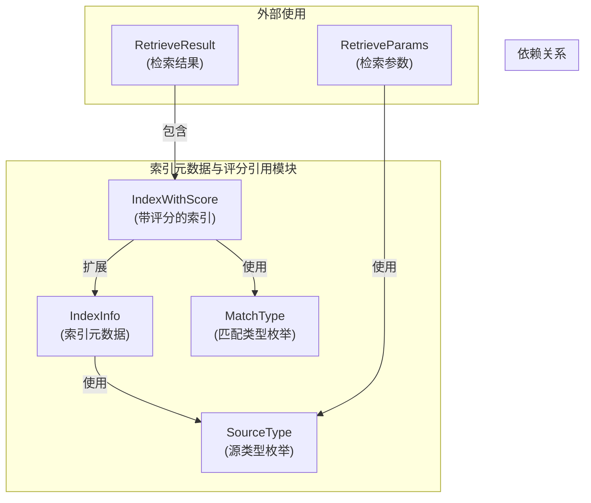
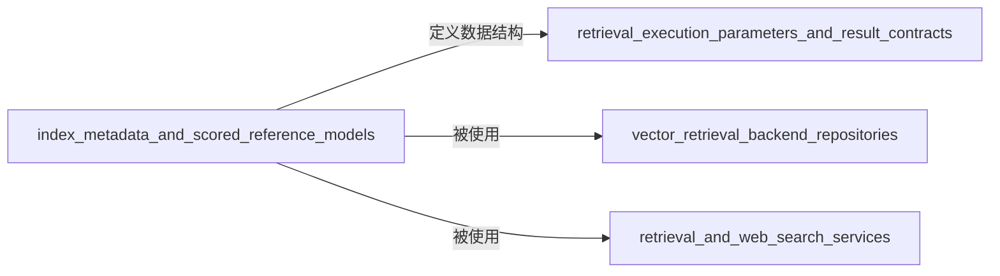

# index_metadata_and_scored_reference_models 模块技术文档

## 模块概述

想象一个图书馆，里面有成千上万本书，每本书都被拆解成了可检索的卡片。当你想要查找某个主题的资料时，图书管理员不仅要找到相关的卡片，还要根据卡片的相关性程度进行排序，确保最相关的资料优先展示。这就是 `index_metadata_and_scored_reference_models` 模块在我们系统中的角色——它是检索系统的"数据卡片"和"评分系统"，负责定义索引元数据结构和带评分的索引引用模型。

这个模块是整个检索系统的基础数据契约层，位于 [retrieval_engine_and_search_contracts](core_domain_types_and_interfaces-knowledge_graph_retrieval_and_content_contracts-retrieval_engine_and_search_contracts.md) 模块之下，为所有的检索引擎提供统一的数据模型。

## 核心组件与架构

这个模块由两个核心数据结构组成：

1. **IndexInfo**：定义了索引内容的元数据结构，包含了索引内容的唯一标识、内容文本、来源信息、所属知识库和知识条目标识等基础信息。

2. **IndexWithScore**：在 IndexInfo 的基础上增加了评分、匹配类型等检索相关的字段，代表了一次检索操作返回的带相关性评分的结果。

## 设计决策与权衡

### 1. 分离元数据与评分结果
**决策**：将 IndexInfo 和 IndexWithScore 设计为两个独立的结构体
**原因**：这种分离体现了关注点分离的原则。IndexInfo 专注于描述"索引是什么"，而 IndexWithScore 专注于描述"在这次检索中这个索引有多相关"。

**权衡**：
- ✅ 优点：元数据结构可以在非检索场景（如索引管理）中复用，评分结构可以根据检索需求灵活变化
- ⚠️ 缺点：存在一定的字段重复，维护时需要保持两者的一致性

### 2. 使用枚举类型而非字符串
**决策**：SourceType 和 MatchType 都采用了自定义的枚举类型
**原因**：使用枚举类型可以提供编译时类型安全，防止无效值的传入，同时使代码更具可读性和自文档化。

**权衡**：
- ✅ 优点：类型安全、IDE 自动补全支持、减少运行时错误
- ⚠️ 缺点：增加新类型需要修改代码，灵活性稍低

### 3. 丰富的元数据字段设计
**决策**：IndexInfo 包含了知识 ID、知识库 ID、标签 ID 等多个关联字段
**原因**：检索系统不仅需要返回内容，还需要支持复杂的过滤、权限控制和相关性调整。这些字段为上层检索逻辑提供了必要的上下文信息。

**权衡**：
- ✅ 优点：支持灵活的检索策略和结果处理
- ⚠️ 缺点：结构相对复杂，需要确保各个字段的正确填充

## 数据流转与依赖关系

### 典型检索流程中的数据流转

1. **输入阶段**：[RetrieveParams](core_domain_types_and_interfaces-knowledge_graph_retrieval_and_content_contracts-retrieval_engine_and_search_contracts-retrieval_execution_parameters_and_result_contracts.md) 接收查询参数
2. **检索阶段**：检索引擎根据参数查询索引，创建 IndexInfo 实例
3. **评分阶段**：为每个 IndexInfo 计算相关性评分，转换为 IndexWithScore
4. **输出阶段**：将 IndexWithScore 集合封装到 [RetrieveResult](core_domain_types_and_interfaces-knowledge_graph_retrieval_and_content_contracts-retrieval_engine_and_search_contracts-retrieval_execution_parameters_and_result_contracts.md) 中返回

### 模块依赖关系

这个模块是整个检索系统的基础，被以下关键模块依赖：
- [retrieval_execution_parameters_and_result_contracts](core_domain_types_and_interfaces-knowledge_graph_retrieval_and_content_contracts-retrieval_engine_and_search_contracts-retrieval_execution_parameters_and_result_contracts.md)：使用 IndexWithScore 构建检索结果
- [vector_retrieval_backend_repositories](data_access_repositories-vector_retrieval_backend_repositories.md)：实现各种向量数据库的检索逻辑
- [retrieval_and_web_search_services](application_services_and_orchestration-retrieval_and_web_search_services.md)：编排检索流程

## 子模块文档

这个模块包含两个子模块，分别负责不同的职责：

1. **[index_metadata_definition](./core-domain-types-and-interfaces-knowledge-graph-retrieval-and-content-contracts-retrieval-engine-and-search-contracts-index-metadata-and-scored-reference-models-index-metadata-definition.md)**：定义了索引元数据的核心结构 IndexInfo 和相关的枚举类型
2. **[scored_index_reference_model](./core-domain-types-and-interfaces-knowledge-graph-retrieval-and-content-contracts-retrieval-engine-and-search-contracts-index-metadata-and-scored-reference-models-scored-index-reference-model.md)**：定义了带评分的索引引用模型 IndexWithScore 及其相关方法

## 新开发者注意事项

### 1. 字段填充的完整性
**注意**：IndexInfo 和 IndexWithScore 中的字段很多，使用时确保所有相关字段都被正确填充。特别是 IsEnabled 字段，它会影响结果是否被过滤。

### 2. 评分的语义一致性
**注意**：Score 字段的语义可能因不同的检索引擎而异（有些是相似度，有些是距离）。在合并多个检索引擎的结果时，需要确保评分的可比性或进行适当的归一化处理。

### 3. MatchType 的正确使用
**注意**：MatchType 不仅用于标识匹配方式，还可能影响后续的结果处理和展示逻辑。确保根据实际的检索策略设置正确的 MatchType。

### 4. 扩展建议
如果需要添加新的源类型或匹配类型，请遵循现有的枚举模式，并在相关的检索引擎实现中添加对应的处理逻辑。
