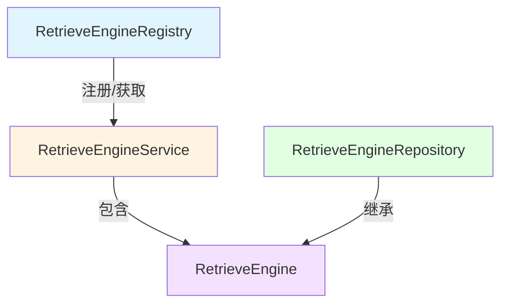

# 检索引擎服务注册与仓库接口模块深度解析

## 1. 模块概述

在知识检索系统中，支持多种检索后端（如 Elasticsearch、Milvus、Postgres 等）是一个核心挑战。这个模块定义了一套统一的抽象接口，用于解决以下问题：

- **多样化检索引擎的统一管理**：系统需要同时支持向量检索、关键词检索等多种检索方式，且每种检索方式可能有不同的后端实现
- **索引生命周期的一致管理**：从索引创建、批量保存到删除，不同检索引擎的操作需要被封装在统一接口下
- **检索能力的动态扩展**：需要能够方便地注册新的检索引擎实现，而不影响现有代码

你可以把这个模块想象成一个"检索引擎的插座面板"：`RetrieveEngineRegistry` 是插座板本身，各种检索引擎实现是不同形状的插头，而 `RetrieveEngineService` 和 `RetrieveEngineRepository` 则定义了插头必须符合的标准接口形状。

## 2. 核心抽象与架构

### 2.1 核心组件关系图

### 2.2 核心接口详解

#### RetrieveEngine - 基础检索能力
这是最底层的接口，定义了任何检索引擎都必须具备的核心能力：
- `EngineType()` - 标识引擎类型，用于区分不同的实现
- `Retrieve()` - 执行实际的检索操作
- `Support()` - 声明支持的检索类型（向量/关键词/混合等）

#### RetrieveEngineService - 索引服务层
在基础检索能力之上，增加了索引管理的业务逻辑：
- `Index()` / `BatchIndex()` - 单个和批量索引创建
- `EstimateStorageSize()` - 存储大小预估
- `CopyIndices()` - 索引复制，避免重复计算嵌入向量的关键优化
- 各种删除和状态更新方法

#### RetrieveEngineRepository - 数据持久化层
专注于数据的持久化操作，它继承自 `RetrieveEngine`，说明仓库层也具备检索能力：
- `Save()` / `BatchSave()` - 索引信息的持久化
- 各种按条件删除的方法
- 分块启用状态和标签的批量更新

#### RetrieveEngineRegistry - 服务注册中心
负责管理所有可用的检索引擎服务：
- `Register()` - 注册新的检索引擎服务
- `GetRetrieveEngineService()` - 根据类型获取服务
- `GetAllRetrieveEngineServices()` - 获取所有已注册服务

## 3. 数据流转与职责划分

### 3.1 典型检索流程

1. **初始化阶段**：各种检索引擎实现通过 `RetrieveEngineRegistry.Register()` 注册自己
2. **检索请求阶段**：
   - 上层应用根据配置或需求，通过 `Registry.GetRetrieveEngineService()` 获取合适的服务
   - 调用 `RetrieveEngineService.Retrieve()` 执行检索
3. **索引管理阶段**：
   - 知识摄入时，通过 `Index()` 或 `BatchIndex()` 创建索引
   - 必要时通过 `CopyIndices()` 高效复制已有索引

### 3.2 服务分层设计意图

这种三层接口设计（Engine → Service → Repository）体现了清晰的关注点分离：
- **Engine 层**：仅关注"如何检索"，是纯粹的能力抽象
- **Service 层**：关注"如何管理索引"，包含业务逻辑（如嵌入向量计算）
- **Repository 层**：关注"如何持久化"，处理与具体存储后端的交互

## 4. 设计决策与权衡

### 4.1 接口继承 vs 组合

**设计选择**：`RetrieveEngineRepository` 继承自 `RetrieveEngine`，而非包含它。

**权衡分析**：
- ✅ **优点**：简化了使用场景，仓库层可以直接用于检索，无需额外适配
- ⚠️ **缺点**：违反了单一职责原则，仓库层既负责持久化又负责检索

**设计意图**：在实际应用中，检索操作通常直接针对存储层执行，这种设计减少了间接层，提高了效率。

### 4.2 CopyIndices 作为一级公民

**设计选择**：`CopyIndices` 被明确设计为接口的核心方法，而非实现细节。

**设计意图**：这是一个关键的性能优化点。在知识库复制、分叉等场景下，重新计算嵌入向量的成本极高，直接复制索引数据可以节省大量计算资源和时间。

### 4.3 支持多种删除粒度

**设计选择**：提供了按分块ID、源ID、知识ID等多种维度的删除方法。

**权衡分析**：
- ✅ **优点**：满足不同业务场景的需求，提供灵活的数据管理能力
- ⚠️ **缺点**：增加了接口的复杂度，每种实现都需要支持所有删除方式

## 5. 使用指南与注意事项

### 5.1 实现新检索引擎的步骤

1. 实现 `RetrieveEngine` 接口的三个基本方法
2. 实现 `RetrieveEngineService` 接口的索引管理方法
3. 在应用启动时通过 `RetrieveEngineRegistry.Register()` 注册你的服务

### 5.2 关键契约与约束

- **线程安全**：所有接口方法都接收 `context.Context` 参数，实现者需要确保在并发环境下的安全性
- **错误处理**：特别是 `Retrieve()` 方法，需要合理处理检索失败的情况
- **参数验证**：实现者不应假设传入参数的有效性，需要进行必要的验证

### 5.3 常见陷阱

- **忽略 `Support()` 方法**：在选择检索引擎时，务必检查 `Support()` 返回的检索类型，否则可能导致不支持的操作
- **批量操作的事务性**：`BatchSave()` 和 `BatchIndex()` 等方法的事务语义需要明确，是全成功还是部分成功？
- **资源清理**：在 `DeleteBy*` 方法中，确保不仅删除索引，还要清理相关的资源

## 6. 模块关系与依赖

这个模块是整个检索系统的核心抽象层，它被以下模块依赖：
- [检索引擎组合与注册](application_services_and_orchestration-retrieval_and_web_search_services-retriever_engine_composition_and_registry.md) - 实际使用这些接口来组合和管理检索引擎
- 各种具体的检索引擎实现模块（如 Elasticsearch、Milvus 等）

它依赖于：
- 核心类型定义模块 - 提供 `RetrieverEngineType`、`RetrieveParams` 等基础类型
- 嵌入模型接口 - 用于索引创建时的向量计算

## 7. 总结

这个模块通过精心设计的接口抽象，成功地将多样化的检索引擎背后的复杂性隐藏起来，为上层应用提供了统一、一致的检索和索引管理能力。它的设计体现了"面向接口编程"的最佳实践，同时在性能优化（如 `CopyIndices`）和灵活性（多种删除粒度）之间取得了良好的平衡。

对于新加入团队的开发者来说，理解这个模块的关键在于把握其作为"抽象层"的定位——它不做实际的检索工作，而是定义了"如何做检索"的契约，让各种具体实现能够无缝地插入到系统中。
