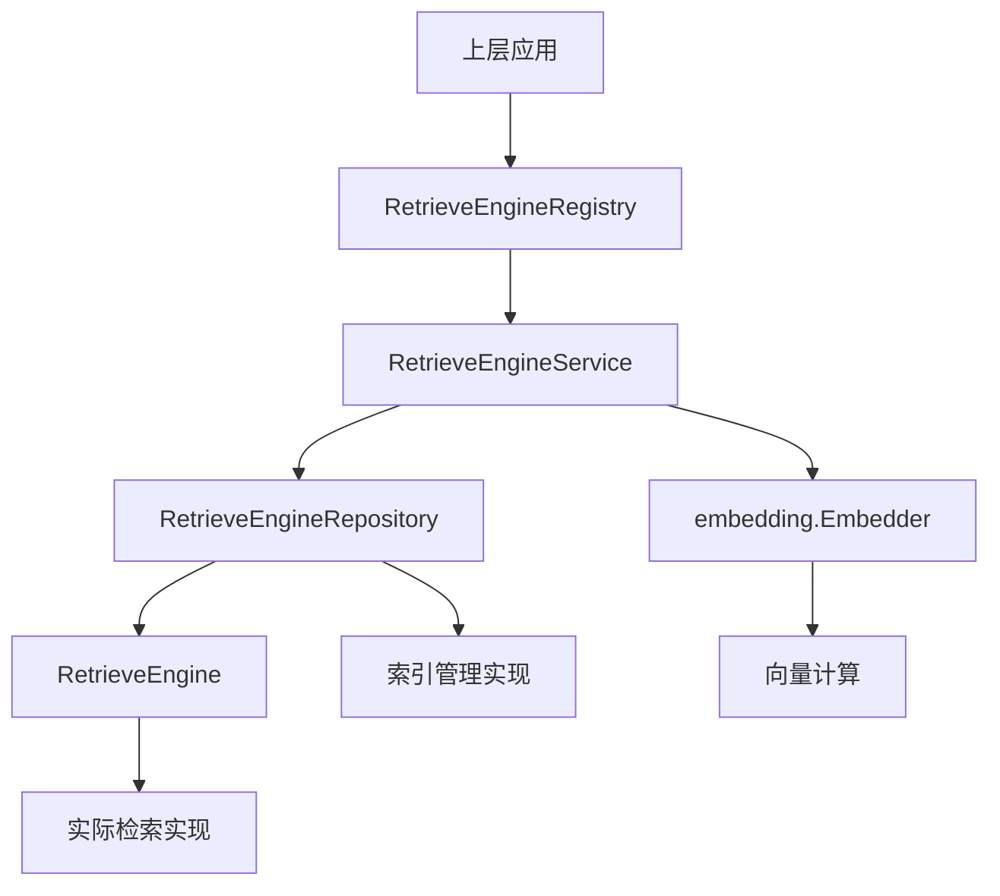

# 检索引擎接口契约 (retrieval_engine_interface_contract)

## 概述

想象一下，你正在构建一个支持多种搜索引擎的平台——有的使用向量相似度搜索，有的使用关键词匹配，还有的可能结合了知识图谱。如果每个搜索引擎都有自己独特的API，那么上层应用代码就会变得混乱不堪，每次添加新引擎都要修改大量代码。这就是 `retrieval_engine_interface_contract` 模块要解决的问题：它定义了一套统一的检索引擎接口契约，让不同的检索实现可以像插拔零件一样轻松替换，而上层代码无需感知底层差异。

## 核心组件解析

### RetrieveEngine 接口

`RetrieveEngine` 是整个模块的核心抽象，它定义了检索引擎必须实现的三个基本方法：

```go
type RetrieveEngine interface {
    EngineType() types.RetrieverEngineType
    Retrieve(ctx context.Context, params types.RetrieveParams) ([]*types.RetrieveResult, error)
    Support() []types.RetrieverType
}
```

**设计意图**：
- `EngineType()`：提供引擎的唯一标识，用于在注册表中查找和区分不同的引擎实现
- `Retrieve()`：执行实际检索操作的核心方法，接收统一的参数格式，返回标准化的结果
- `Support()`：声明该引擎支持的检索类型（如向量检索、关键词检索等），让调用者可以在运行时判断引擎能力

### RetrieveEngineRepository 接口

这个接口扩展了 `RetrieveEngine`，增加了索引管理的功能：

```go
type RetrieveEngineRepository interface {
    Save(ctx context.Context, indexInfo *types.IndexInfo, params map[string]any) error
    BatchSave(ctx context.Context, indexInfoList []*types.IndexInfo, params map[string]any) error
    // ... 其他索引管理方法
    RetrieveEngine
}
```

**设计意图**：
- 将检索能力和索引管理能力分离但又通过组合关联在一起
- 提供批量操作方法（`BatchSave`、`BatchUpdateChunkEnabledStatus`）以优化性能
- `CopyIndices` 方法是一个亮点：它允许在不重新计算嵌入向量的情况下复制索引，显著降低了知识库复制的成本

### RetrieveEngineRegistry 接口

这是一个工厂模式的实现，用于管理和获取不同的检索引擎服务：

```go
type RetrieveEngineRegistry interface {
    Register(indexService RetrieveEngineService) error
    GetRetrieveEngineService(engineType types.RetrieverEngineType) (RetrieveEngineService, error)
    GetAllRetrieveEngineServices() []RetrieveEngineService
}
```

**设计意图**：
- 实现了服务定位器模式，让调用者可以通过引擎类型获取对应的服务实例
- 支持动态注册，使得在运行时添加新的检索引擎成为可能
- 提供了获取所有服务的方法，方便进行批量操作或能力展示

### RetrieveEngineService 接口

这个接口是 `RetrieveEngineRepository` 的超集，增加了与嵌入模型交互的索引方法：

```go
type RetrieveEngineService interface {
    Index(ctx context.Context, embedder embedding.Embedder, indexInfo *types.IndexInfo, retrieverTypes []types.RetrieverType) error
    BatchIndex(ctx context.Context, embedder embedding.Embedder, indexInfoList []*types.IndexInfo, retrieverTypes []types.RetrieverType) error
    // ... 其他方法
    RetrieveEngineRepository
}
```

**设计意图**：
- 将嵌入计算的职责从索引存储中分离出来，通过 `embedder` 参数注入
- 支持多种检索类型的同时索引，一次调用可以为向量、关键词等多种检索方式建立索引
- 继承了 `RetrieveEngineRepository`，形成了完整的"索引-检索-管理"能力闭环

## 架构与数据流



**数据流解析**：
1. **注册阶段**：各种 `RetrieveEngineService` 实现向 `RetrieveEngineRegistry` 注册自己
2. **获取阶段**：上层应用通过 `RetrieveEngineRegistry` 获取所需的 `RetrieveEngineService`
3. **索引阶段**：调用 `Index` 或 `BatchIndex` 方法，服务内部使用 `embedder` 计算向量，然后通过仓库接口存储
4. **检索阶段**：调用 `Retrieve` 方法，执行实际检索并返回标准化结果

## 依赖关系分析

### 输入依赖
- `context.Context`：Go 标准库的上下文，用于传递取消信号、超时和请求范围的值
- `embedding.Embedder`：来自 [embedding](model_providers_and_ai_backends-embedding_interfaces_batching_and_backends.md) 模块，负责计算向量嵌入
- `types.*`：来自 [retrieval_request_and_engine_parameters](core_domain_types_and_interfaces-knowledge_graph_retrieval_and_content_contracts-retrieval_engine_and_search_contracts-retrieval_execution_parameters_and_result_contracts-retrieval_request_and_engine_parameters.md) 和相关类型模块，定义了参数和结果的数据结构

### 输出依赖
- 实现这些接口的组件会被 [retriever_engine_composition_and_registry](application_services_and_orchestration-retrieval_and_web_search_services-retriever_engine_composition_and_registry.md) 模块使用
- 检索结果会被 [retrieval_result_refinement_and_merge](application_services_and_orchestration-chat_pipeline_plugins_and_flow-query_understanding_and_retrieval_flow-retrieval_result_refinement_and_merge.md) 模块进一步处理

## 设计决策与权衡

### 1. 接口分层设计
**决策**：将功能拆分为 `RetrieveEngine` → `RetrieveEngineRepository` → `RetrieveEngineService` 三个层次
**原因**：
- 遵循接口隔离原则，不同的使用者可以依赖不同的接口
- 例如，只需要检索功能的组件可以只依赖 `RetrieveEngine`，而不需要关心索引管理

**权衡**：
- ✅ 优点：灵活性高，职责清晰
- ❌ 缺点：接口数量较多，理解成本稍高

### 2. 批量操作优先
**决策**：提供了丰富的批量操作方法（`BatchSave`、`BatchIndex`、`BatchUpdateChunkEnabledStatus` 等）
**原因**：
- 检索引擎通常处理大量数据，批量操作可以显著减少网络往返和事务开销
- 尤其是向量索引，批量插入通常比单条插入效率高很多

**权衡**：
- ✅ 优点：性能更好，资源利用率更高
- ❌ 缺点：批量操作的错误处理更复杂，部分失败时的回滚策略需要仔细设计

### 3. 嵌入计算外部化
**决策**：将 `embedder` 作为参数传入索引方法，而不是在内部创建
**原因**：
- 遵循依赖倒置原则，引擎不依赖具体的嵌入实现
- 支持在不同场景下使用不同的嵌入模型，提高灵活性

**权衡**：
- ✅ 优点：解耦彻底，可测试性强（可以轻松 mock embedder）
- ❌ 缺点：调用者需要管理 embedder 的生命周期，增加了使用复杂度

### 4. 支持索引复制
**决策**：设计了 `CopyIndices` 方法，允许直接复制索引数据而不重新计算嵌入
**原因**：
- 向量计算通常是计算密集型且耗时的操作
- 在知识库复制、备份等场景下，避免重复计算可以显著提升性能

**权衡**：
- ✅ 优点：性能提升明显，节省计算资源
- ❌ 缺点：实现复杂度较高，需要处理源和目标之间的ID映射关系

## 使用指南与最佳实践

### 实现新的检索引擎

1. **定义引擎类型**：在 `types.RetrieverEngineType` 中添加新的引擎类型
2. **实现接口**：创建结构体实现 `RetrieveEngineService` 接口的所有方法
3. **注册服务**：在应用启动时将实现注册到 `RetrieveEngineRegistry`

```go
// 示例：实现一个简单的检索引擎
type MyRetrieveEngine struct {
    // 内部字段
}

func (e *MyRetrieveEngine) EngineType() types.RetrieverEngineType {
    return types.MyEngineType
}

func (e *MyRetrieveEngine) Retrieve(ctx context.Context, params types.RetrieveParams) ([]*types.RetrieveResult, error) {
    // 实现检索逻辑
}

func (e *MyRetrieveEngine) Support() []types.RetrieverType {
    return []types.RetrieverType{types.VectorRetriever}
}

// 实现其他方法...
```

### 使用检索引擎

```go
// 从注册表获取引擎服务
engineService, err := registry.GetRetrieveEngineService(types.ElasticsearchEngine)
if err != nil {
    // 处理错误
}

// 执行检索
results, err := engineService.Retrieve(ctx, retrieveParams)
if err != nil {
    // 处理错误
}

// 处理结果
for _, result := range results {
    // 使用 result
}
```

### 最佳实践

1. **上下文传递**：始终传递 `context.Context`，并尊重其取消信号
2. **批量操作**：优先使用批量方法，尤其是在处理大量数据时
3. **错误处理**：批量操作的错误处理要特别小心，考虑部分失败的情况
4. **支持声明**：确保 `Support()` 方法返回的检索类型与实际实现一致
5. **资源清理**：如果引擎持有资源（如数据库连接），实现适当的关闭方法

## 边缘情况与注意事项

### 1. 空结果处理
- `Retrieve` 方法在没有匹配结果时应该返回空切片，而不是 `nil`
- 调用者应该正确处理空结果的情况，不要将其视为错误

### 2. 并发安全性
- 接口的实现应该是并发安全的，因为多个 goroutine 可能同时调用 `Retrieve` 方法
- 特别是索引管理方法，要考虑并发写入的冲突问题

### 3. 参数验证
- 实现应该在方法开始时验证参数的有效性，而不是假设调用者已经验证过
- 常见的验证点：`indexInfo` 是否为 `nil`、维度是否为正数、ID 是否为空等

### 4. 维度兼容性
- `CopyIndices` 和删除方法都接收 `dimension` 参数，实现应该确保源和目标的维度兼容
- 如果维度不匹配，应该返回明确的错误，而不是静默失败

### 5. 启用状态的影响
- `BatchUpdateChunkEnabledStatus` 更新的分块状态应该在检索时被尊重
- 禁用的分块不应该出现在检索结果中，但应该仍然可以被索引管理操作处理

## 相关模块

- [embedding](model_providers_and_ai_backends-embedding_interfaces_batching_and_backends.md)：嵌入模型接口，与 `RetrieveEngineService` 配合使用
- [retrieval_request_and_engine_parameters](core_domain_types_and_interfaces-knowledge_graph_retrieval_and_content_contracts-retrieval_engine_and_search_contracts-retrieval_execution_parameters_and_result_contracts-retrieval_request_and_engine_parameters.md)：检索参数和结果的数据结构定义
- [retriever_engine_composition_and_registry](application_services_and_orchestration-retrieval_and_web_search_services-retriever_engine_composition_and_registry.md)：检索引擎的组合和注册表实现
- [retrieval_result_refinement_and_merge](application_services_and_orchestration-chat_pipeline_plugins_and_flow-query_understanding_and_retrieval_flow-retrieval_result_refinement_and_merge.md)：检索结果的后处理模块
