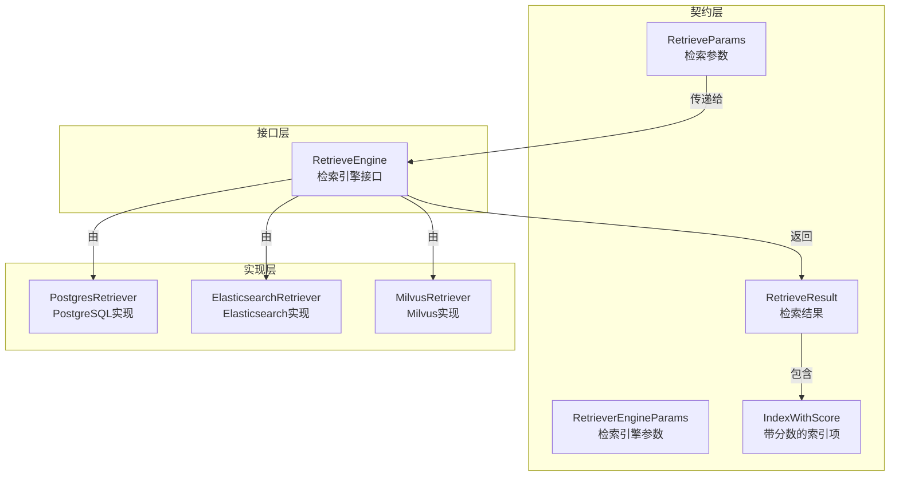

# 检索执行参数与结果契约模块

## 模块概览

想象一下，你正在组织一场大型的图书搜索活动。参与者带着不同的搜索需求前来：有的知道具体书名，有的记得书中的某些内容，有的甚至只记得模糊的主题。作为活动组织者，你需要一套标准的方法来接收这些不同类型的搜索请求，将它们转换为图书馆系统能理解的查询，然后以统一的格式返回结果。这正是 `retrieval_execution_parameters_and_result_contracts` 模块的核心职责——它定义了一套标准的"请求-响应"契约，让不同类型的检索引擎能够以统一的方式协同工作。

在整个系统架构中，这个模块扮演着**检索层的通用语言**角色。它不负责具体的检索实现（那是各个向量数据库或搜索引擎的工作），而是定义了：
- 如何描述一个检索请求（无论它是关键词搜索、向量搜索还是网络搜索）
- 如何表示检索结果（无论结果来自 PostgreSQL、Elasticsearch 还是 Milvus）
- 检索引擎应该具备哪些基本能力

## 核心架构

### 组件关系图



### 架构解析

这个模块的设计遵循了**契约优先**的原则，将数据结构与行为接口清晰分离：

1. **数据契约层**（`retriever.go`）：
   - `RetrieveParams`：定义了"什么是一个检索请求"，包含查询文本、向量嵌入、过滤条件等所有可能的检索参数
   - `RetrieveResult`：定义了"什么是一个检索结果"，包含结果列表、检索来源类型和可能的错误
   - `IndexWithScore`：定义了"什么是一个带评分的检索项"，是结果的基本单位

2. **行为接口层**（`interfaces/retriever.go`）：
   - `RetrieveEngine`：定义了检索引擎必须具备的三个核心能力：标识自身类型、执行检索、声明支持的检索类型
   - `RetrieveEngineRepository`：扩展了检索能力，增加了索引管理功能（保存、删除、复制等）
   - `RetrieveEngineService`：进一步扩展，增加了批量索引和嵌入计算的协调能力

这种分层设计的好处是：**实现可以千差万别，但交互方式始终统一**。无论是 PostgreSQL 的向量扩展、Elasticsearch 的全文检索，还是 Milvus 的专用向量数据库，它们都通过相同的接口与系统其他部分交互。

## 核心组件深度解析

### RetrieveParams：检索请求的通用容器

`RetrieveParams` 是整个检索系统的"请求信封"。它的设计体现了**包容性与扩展性**的平衡：

```go
type RetrieveParams struct {
    Query               string                 // 查询文本
    Embedding           []float32              // 查询向量（用于向量检索）
    KnowledgeBaseIDs    []string               // 知识库ID列表
    KnowledgeIDs        []string               // 知识ID列表
    TagIDs              []string               // 标签ID（用于FAQ优先级过滤）
    ExcludeKnowledgeIDs []string               // 排除的知识ID
    ExcludeChunkIDs     []string               // 排除的分块ID
    TopK                int                    // 返回结果数量
    Threshold           float64                // 相似度阈值
    KnowledgeType       string                 // 知识类型（决定使用哪个索引）
    AdditionalParams    map[string]interface{} // 扩展参数
    RetrieverType       RetrieverType          // 检索器类型
}
```

**设计意图**：
- **多模态支持**：同时支持文本查询（`Query`）和向量查询（`Embedding`），让同一个参数结构能服务于不同的检索范式
- **精细过滤**：提供了多层级的过滤能力（知识库级、知识级、分块级、标签级），满足复杂的业务过滤需求
- **扩展机制**：`AdditionalParams` 作为逃生舱，允许特定检索引擎传递专有参数而不破坏通用契约
- **类型安全**：通过 `RetrieverType` 枚举明确检索类型，避免字符串拼写错误

**使用场景**：
当用户在聊天界面输入问题时，系统会：
1. 生成问题的向量嵌入
2. 构建 `RetrieveParams`，同时填充 `Query`（原始问题）和 `Embedding`（向量）
3. 设置 `TopK`（比如返回 10 个结果）和 `Threshold`（相似度阈值）
4. 根据用户权限设置 `KnowledgeBaseIDs` 过滤可访问的知识库

### RetrieveResult：检索结果的统一封装

`RetrieveResult` 是检索系统的"响应信封"，它不仅封装结果数据，还保留了检索的元信息：

```go
type RetrieveResult struct {
    Results             []*IndexWithScore   // 检索结果列表
    RetrieverEngineType RetrieverEngineType // 检索引擎类型
    RetrieverType       RetrieverType       // 检索器类型
    Error               error               // 检索错误
}
```

**设计意图**：
- **结果溯源**：通过 `RetrieverEngineType` 和 `RetrieverType` 保留结果来源，这在混合检索（同时使用多个检索器）场景中至关重要
- **错误处理**：将错误作为结果的一部分，而不是使用异常，使得批量检索时单个失败不会影响整体流程
- **自描述性**：结果本身就说明了"它是什么"、"来自哪里"、"是否成功"

**数据流转**：
在混合检索场景中：
1. 系统并行调用多个检索引擎（关键词、向量、网络搜索）
2. 每个引擎返回各自的 `RetrieveResult`
3. 结果合并组件根据 `RetrieverType` 和 `Score` 进行重排和融合
4. 最终向用户展示一个统一的结果列表，但内部保留了每个结果的来源信息

### RetrieveEngine：检索能力的抽象契约

`RetrieveEngine` 接口是检索引擎的"身份证+工作证"，它定义了检索引擎必须回答的三个问题：

```go
type RetrieveEngine interface {
    EngineType() types.RetrieverEngineType  // 你是谁？
    Retrieve(ctx context.Context, params types.RetrieveParams) ([]*types.RetrieveResult, error)  // 你能做什么？
    Support() []types.RetrieverType  // 你支持哪些检索类型？
}
```

**设计意图**：
- **最小接口原则**：只定义最核心的三个方法，保持接口的简洁性和实现的灵活性
- **自标识能力**：`EngineType()` 和 `Support()` 让检索引擎能够"自我介绍"，使得系统可以动态发现和组合能力
- **上下文感知**：`Retrieve` 方法接收 `context.Context`，支持取消、超时和链路追踪

**扩展层次**：
这个模块设计了三个层次的检索接口，形成了一个能力递增的谱系：

1. **基础检索能力**（`RetrieveEngine`）：只能执行检索
2. **索引管理能力**（`RetrieveEngineRepository`）：在检索基础上增加了索引的增删改查
3. **全功能服务能力**（`RetrieveEngineService`）：在索引管理基础上增加了嵌入计算协调和批量操作

这种设计允许不同的实现选择适合自己的层次——例如，一个只读的远程检索服务可能只需要实现 `RetrieveEngine`，而一个本地向量数据库可能需要实现完整的 `RetrieveEngineService`。

## 关键设计决策

### 1. 契约 vs 实现：为什么定义这么多接口？

**决策**：将数据契约（结构体）与行为契约（接口）分离，并且定义了多层接口。

**替代方案对比**：
| 方案 | 优点 | 缺点 |
|------|------|------|
| 当前方案（多层接口+数据契约） | 灵活性高，实现可以按需选择能力层级；契约清晰，易于理解和测试 | 接口数量较多，初学者可能感到困惑 |
| 单一巨型接口 | 简单直接，只有一个接口 | 实现被迫提供所有方法，即使不需要；接口变更影响范围大 |
| 只定义结构体，不定义接口 | 最简单，没有抽象成本 | 无法进行多态替换，难以测试和扩展 |

**选择理由**：
检索引擎的实现差异极大——从本地内存索引到分布式向量数据库，从只读搜索引擎到读写混合系统。多层接口设计让每个实现都能"按需承诺"，同时保持系统的一致性。这是**开放性与约束性的平衡艺术**。

### 2. AdditionalParams：为什么保留这个"万能字典"？

**决策**：在 `RetrieveParams` 中包含 `map[string]interface{}` 类型的 `AdditionalParams`。

**设计考量**：
- **逃生舱模式**：当某个检索引擎需要特定参数而通用契约无法覆盖时，不需要修改全局契约
- **渐进式标准化**：新的参数可以先在 `AdditionalParams` 中试用，验证价值后再提升为正式字段
- **风险控制**：使用 `interface{}` 确实失去了类型安全，但这是在灵活性和类型安全之间的权衡

**使用建议**：
新贡献者应当：
1. 优先考虑使用正式字段
2. 如果必须使用 `AdditionalParams`，确保在文档中明确说明键名和期望值类型
3. 考虑将常用的 `AdditionalParams` 提升为正式字段

### 3. 错误作为结果的一部分：为什么不直接返回错误？

**决策**：`RetrieveResult` 包含 `Error` 字段，而不是让 `Retrieve` 方法在出错时直接返回错误。

**设计意图**：
在混合检索场景中，系统通常会并行调用多个检索引擎。如果某个引擎失败，我们不希望整个检索失败，而是希望：
1. 记录那个引擎的错误
2. 继续使用其他引擎的结果
3. 最终向用户返回部分结果（可能带有降级提示）

将错误作为结果的一部分，使得这种"优雅降级"模式变得自然。

## 与其他模块的关系

### 依赖流向

```
retrieval_execution_parameters_and_result_contracts
    ↑ 被依赖
    ├── retrieval_engine_service_registry_and_repository_interfaces
    ├── vector_retrieval_backend_repositories（所有实现）
    ├── application_services_and_orchestration → retrieval_execution
    └── knowledge_graph_retrieval_and_memory_repositories
```

### 关键交互

1. **与检索执行插件**：
   - `single_query_retrieval_execution_plugin` 和 `parallel_retrieval_execution_plugin` 是本模块的主要消费者
   - 它们接收用户查询，构建 `RetrieveParams`，调用 `RetrieveEngine`，然后处理 `RetrieveResult`

2. **与向量检索后端仓库**：
   - `elasticsearch_vector_retrieval_repository`、`milvus_vector_retrieval_repository` 等是本模块的主要实现者
   - 它们实现 `RetrieveEngine` 接口，将通用的 `RetrieveParams` 转换为特定数据库的查询

3. **与检索结果处理**：
   - `retrieval_reranking_plugin` 和 `top_k_result_selection_plugin` 消费 `RetrieveResult`，进行重排和筛选
   - 它们依赖 `IndexWithScore` 中的 `Score` 字段进行排序

## 新贡献者指南

### 常见陷阱与注意事项

1. **TopK 的语义差异**：
   - 不同检索引擎对 `TopK` 的理解可能不同：有些返回至少 TopK 个结果（然后过滤），有些返回最多 TopK 个结果
   - **建议**：在实现 `RetrieveEngine` 时，明确文档说明 TopK 的语义，并在结果合并阶段统一处理

2. **空 Embedding 的处理**：
   - 当 `RetrieverType` 是向量检索但 `Embedding` 为空时，应该返回错误还是回退到其他检索方式？
   - **建议**：优先返回明确错误，让调用者决定降级策略，而不是自作主张

3. **AdditionalParams 的类型安全**：
   - 从 `map[string]interface{}` 取值时，务必进行类型断言和错误处理
   - **建议**：为常用的附加参数创建辅助函数，例如 `GetIntParam(params, "key", defaultValue)`

4. **IndexWithScore 中的可选字段**：
   - `IndexWithScore` 中的许多字段是可选的（如 `TagID`、`SourceID`），不要假设它们一定有值
   - **建议**：使用这些字段前检查是否为空字符串

### 扩展指南

#### 添加新的检索引擎类型

1. 在 `RetrieverEngineType` 枚举中添加新类型：
```go
const (
    // ... 现有类型
    MyNewRetrieverEngineType RetrieverEngineType = "mynewengine"
)
```

2. 实现 `RetrieveEngine` 接口（或更高级的接口）：
```go
type MyNewRetriever struct {
    // 内部字段
}

func (r *MyNewRetriever) EngineType() types.RetrieverEngineType {
    return types.MyNewRetrieverEngineType
}

func (r *MyNewRetriever) Retrieve(ctx context.Context, params types.RetrieveParams) ([]*types.RetrieveResult, error) {
    // 实现检索逻辑
}

func (r *MyNewRetriever) Support() []types.RetrieverType {
    return []types.RetrieverType{types.VectorRetrieverType}
}
```

#### 添加新的检索类型

1. 在 `RetrieverType` 枚举中添加新类型：
```go
const (
    // ... 现有类型
    HybridRetrieverType RetrieverType = "hybrid" // 混合检索
)
```

2. 在相关检索引擎的 `Support()` 方法中包含这个新类型

## 子模块

本模块包含以下子模块，提供了更细致的契约定义：

- [检索引擎接口契约](core_domain_types_and_interfaces-knowledge_graph_retrieval_and_content_contracts-retrieval_engine_and_search_contracts-retrieval_execution_parameters_and_result_contracts-retrieval_engine_interface_contract.md)
- [检索请求与引擎参数](core_domain_types_and_interfaces-knowledge_graph_retrieval_and_content_contracts-retrieval_engine_and_search_contracts-retrieval_execution_parameters_and_result_contracts-retrieval_request_and_engine_parameters.md)
- [检索结果契约](core_domain_types_and_interfaces-knowledge_graph_retrieval_and_content_contracts-retrieval_engine_and_search_contracts-retrieval_execution_parameters_and_result_contracts-retrieval_result_contracts.md)

## 总结

`retrieval_execution_parameters_and_result_contracts` 模块是整个检索系统的"通用语言"。它的价值不在于复杂的逻辑，而在于**精心设计的抽象**：

- 它让不同的检索引擎能够"用同一种语言对话"
- 它在灵活性和约束性之间找到了平衡点
- 它为系统的扩展和演进提供了稳定的基础

理解这个模块的关键是理解它的**设计意图**——它不是要限制实现的多样性，而是要通过标准化的契约让多样性能够协同工作。这就像电源插座标准：它不限制你连接什么设备，也不限制发电厂如何发电，但它确保了插头和插座能够可靠连接。
