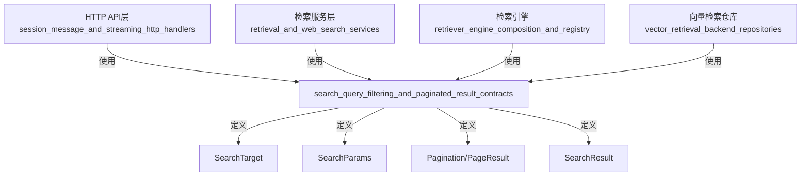

# search_query_filtering_and_paginated_result_contracts 模块深度解析

## 1. 模块概述

### 1.1 问题空间

在构建知识检索系统时，我们面临着几个核心挑战：
- **搜索范围的灵活定义**：用户可能需要搜索整个知识库，也可能只需要搜索特定的知识文件
- **多租户环境下的资源隔离**：在支持跨租户共享知识库的场景中，需要准确追踪每个知识库的所属租户
- **搜索参数的统一管理**：向量搜索、关键词搜索、过滤条件等多种搜索参数需要统一传递和处理
- **分页结果的标准化**：不同检索引擎返回的结果需要统一的分页包装，以便前端一致处理
- **数据库与JSON之间的无缝转换**：搜索结果可能需要存储在数据库中，同时也需要以JSON格式返回给客户端

### 1.2 解决方案

`search_query_filtering_and_paginated_result_contracts` 模块通过定义一组核心契约类型，解决了上述问题：
- `SearchTarget`：统一表示搜索目标，支持整个知识库或特定知识文件的搜索
- `SearchParams`：封装所有搜索相关参数，包括查询文本、阈值、过滤条件等
- `Pagination` 和 `PageResult`：提供标准化的分页参数和结果包装
- `SearchResult`：定义统一的搜索结果结构，并实现数据库序列化/反序列化接口

这些类型构成了检索系统的"通用语言"，确保从API层到检索引擎再到数据存储层的数据一致性。

## 2. 核心概念与心智模型

### 2.1 搜索目标的层级结构

可以将 `SearchTarget` 想象成一个"搜索透镜"：
- 当类型为 `knowledge_base` 时，透镜是宽视角的，可以看到整个知识库的内容
- 当类型为 `knowledge` 时，透镜是聚焦的，只看到指定的知识文件

而 `SearchTargets` 则是一组这样的透镜，可以同时观察多个知识库或知识文件。

### 2.2 数据流契约

这个模块的核心作用是定义**契约**，而不是实现业务逻辑。可以将其想象成系统各个组件之间的"接口协议"：
- API层使用这些契约来解析请求和构建响应
- 检索引擎使用这些契约来接收参数和返回结果
- 数据存储层使用这些契约来序列化和反序列化数据

## 3. 架构与数据流向

虽然这是一个纯契约定义模块，不包含业务逻辑，但它在整个检索系统中处于核心地位。以下是它在系统中的位置：

### 数据流向示例

1. **请求接收**：API层从HTTP请求中解析出 `SearchParams` 和 `Pagination`
2. **目标解析**：根据请求参数构建 `SearchTargets` 列表
3. **检索执行**：将这些参数传递给检索服务层
4. **结果返回**：检索引擎返回 `SearchResult` 列表，包装在 `PageResult` 中返回给客户端

## 4. 核心组件深度解析

### 4.1 SearchTarget 与 SearchTargets

#### 设计意图

`SearchTarget` 的设计体现了**统一接口**模式：无论用户想要搜索整个知识库还是特定的知识文件，都使用同一个结构来表示。这种设计避免了为不同搜索范围定义不同的API。

#### 关键字段解析

- `Type`：决定了如何解释其他字段，是整个结构的"开关"
- `KnowledgeBaseID`：必须字段，因为即使搜索特定知识文件，也需要知道它们属于哪个知识库
- `TenantID`：这是一个值得注意的设计。注释明确指出它是"跨租户共享KB查询"所必需的。这表明系统支持租户之间共享知识库，此时需要明确指定知识库的原始租户ID。
- `KnowledgeIDs`：只在 `Type` 为 `knowledge` 时使用，这是一个典型的条件字段设计。

#### SearchTargets 的辅助方法

`SearchTargets` 类型提供了几个实用方法，这些方法体现了**行为附着于数据**的设计理念：

- `GetAllKnowledgeBaseIDs()`：返回所有唯一的知识库ID，用于批量加载知识库元数据
- `GetKBTenantMap()`：构建知识库ID到租户ID的映射，这在多租户环境中非常重要
- `GetTenantIDForKB()`：查找特定知识库的租户ID
- `ContainsKB()`：检查是否包含某个知识库

这些方法的存在表明，虽然 `SearchTargets` 是一个列表，但它不仅仅是一个简单的集合，而是一个具有特定行为的领域概念。

### 4.2 SearchParams

#### 设计意图

`SearchParams` 是一个典型的**参数对象**模式的应用。当一个函数需要接收多个相关参数时，将它们封装在一个对象中可以：
- 提高代码可读性
- 方便添加新参数而不改变函数签名
- 允许参数的验证和默认值设置集中在一处

#### 字段分类

可以将 `SearchParams` 的字段分为几类：

1. **核心查询**：
   - `QueryText`：用户输入的查询文本
   
2. **检索控制**：
   - `VectorThreshold`：向量相似度阈值
   - `KeywordThreshold`：关键词匹配阈值
   - `DisableKeywordsMatch`：是否禁用关键词匹配
   - `DisableVectorMatch`：是否禁用向量匹配
   - `MatchCount`：返回结果数量

3. **过滤条件**：
   - `KnowledgeIDs`：限制在特定知识文件中搜索
   - `TagIDs`：按标签过滤，注释特别提到用于"FAQ优先级过滤"
   - `OnlyRecommended`：是否只返回推荐内容

这种分类显示了系统支持混合检索（向量+关键词）以及多种过滤方式的能力。

### 4.3 SearchResult

#### 设计意图

`SearchResult` 是整个检索系统的核心输出结构，它需要满足多个需求：
1. 包含足够的信息来展示搜索结果
2. 支持多种类型的内容（文本、图片等）
3. 能够存储在数据库中（通过 `driver.Valuer` 和 `sql.Scanner` 接口）
4. 能够序列化为JSON返回给前端

#### 字段深度解析

基本字段（ID、内容、知识ID等）是自解释的，但有几个字段值得特别关注：

1. **匹配信息**：
   - `Score`：相似度分数
   - `MatchType`：匹配类型（向量匹配、关键词匹配等）
   - `MatchedContent`：实际匹配的内容，这对于FAQ特别重要，因为FAQ可能匹配标准问题或相似问题

2. **内容结构**：
   - `SubChunkID`：支持子块的概念
   - `ChunkType`：块类型
   - `ParentChunkID`：支持块的层级结构
   - `ChunkMetadata`：块级元数据，注释提到用于存储"生成的问题"

3. **多媒体支持**：
   - `ImageInfo`：图片信息，以JSON格式存储

4. **知识来源**：
   - `KnowledgeFilename`：原始文件名
   - `KnowledgeSource`：知识来源，如"url"

这些字段展示了系统对多种内容类型和复杂内容结构的支持。

#### 数据库序列化

`SearchResult` 实现了 `driver.Valuer` 和 `sql.Scanner` 接口，这使得它可以直接存储在数据库的JSON字段中。这种设计有几个优点：
- 简化了数据存储逻辑
- 保留了结构化数据的完整性
- 允许数据库层面的JSON查询（如果数据库支持）

### 4.4 Pagination 与 PageResult

#### 设计意图

分页是API设计中的常见需求，这两个类型提供了标准化的分页处理：
- `Pagination`：处理请求中的分页参数
- `PageResult`：包装分页结果

#### Pagination 的方法设计

`Pagination` 的方法体现了**防御性编程**的思想：
- `GetPage()`：如果页码小于1，默认返回1
- `GetPageSize()`：如果页大小不在合理范围内（1-100），则进行修正
- `Offset()` 和 `Limit()`：提供数据库查询所需的偏移量和限制值

这些方法确保了即使前端传递了不合理的分页参数，系统也能稳健处理。

#### PageResult 的工厂方法

`NewPageResult` 是一个工厂方法，它接收 `Pagination` 对象并从中提取必要的信息来构建 `PageResult`。这种设计确保了请求参数和响应结果之间的一致性。

## 5. 设计决策与权衡

### 5.1 统一的 SearchTarget vs 分离的结构

**决策**：使用一个统一的 `SearchTarget` 结构来表示两种不同的搜索目标类型。

**权衡**：
- ✅ 优点：API更简洁，不需要为不同搜索类型定义不同的请求结构
- ⚠️ 缺点：结构中有条件字段（如 `KnowledgeIDs` 只在特定类型下使用），增加了理解成本

**替代方案**：可以使用接口和不同的实现类型，但这会增加序列化和反序列化的复杂性。

### 5.2 TenantID 的包含

**决策**：在 `SearchTarget` 中显式包含 `TenantID`。

**权衡**：
- ✅ 优点：支持跨租户共享知识库的场景，数据自包含，不依赖外部上下文
- ⚠️ 缺点：增加了结构的复杂度，调用者需要知道知识库的租户ID

**设计理由**：这是一个前瞻性的设计决策，表明系统从一开始就考虑了多租户资源共享的需求。

### 5.3 SearchResult 的数据库序列化

**决策**：让 `SearchResult` 实现 `driver.Valuer` 和 `sql.Scanner` 接口，使其可以直接存储在数据库中。

**权衡**：
- ✅ 优点：简化了存储逻辑，数据结构一致
- ⚠️ 缺点：将数据库关注点混合到了领域类型中，违反了单一职责原则

**替代方案**：可以创建单独的数据库映射类型，但这会增加代码重复和维护成本。

### 5.4 Pagination 的默认值和边界检查

**决策**：在 `Pagination` 的方法中内置默认值和边界检查。

**权衡**：
- ✅ 优点：提高了系统的稳健性，防止不合理的分页参数导致性能问题
- ⚠️ 缺点：静默修正参数可能导致前端困惑，因为返回的分页信息可能与请求的不一致

**设计理由**：在这种情况下，可用性优先于严格性。防止系统过载比严格遵守请求参数更重要。

## 6. 使用指南与最佳实践

### 6.1 构建 SearchTargets

当构建 `SearchTargets` 时，注意以下几点：
- 始终设置 `TenantID`，即使不涉及跨租户共享
- 当 `Type` 为 `knowledge` 时，确保 `KnowledgeIDs` 不为空
- 避免在同一个 `SearchTargets` 中重复包含同一个知识库

### 6.2 SearchParams 的使用

- 不要同时设置 `DisableKeywordsMatch` 和 `DisableVectorMatch` 为 `true`，否则将没有任何检索方式
- 根据内容类型合理设置阈值：对于精确匹配要求高的场景，可以提高阈值；对于召回率要求高的场景，可以降低阈值
- `TagIDs` 不仅可以用于过滤，还可以用于FAQ的优先级排序，具体实现取决于检索引擎

### 6.3 分页处理

- 总是使用 `GetPage()` 和 `GetPageSize()` 方法，而不是直接访问字段
- 当使用 `Offset()` 和 `Limit()` 进行数据库查询时，确保在查询总数之后再应用它们
- 使用 `NewPageResult` 工厂方法创建分页结果，确保一致性

### 6.4 SearchResult 的扩展

如果需要向 `SearchResult` 添加新字段：
- 考虑字段的通用性，是否对所有类型的搜索结果都有意义
- 如果是特定类型的结果，可以考虑使用 `Metadata` 或 `ChunkMetadata` 字段
- 确保添加的字段有合理的JSON标签和数据库标签（如果需要）

## 7. 边界情况与注意事项

### 7.1 空 SearchTargets

如果 `SearchTargets` 为空，大多数检索引擎可能会返回空结果。在API层应该验证至少有一个搜索目标。

### 7.2 不合理的分页参数

虽然 `Pagination` 的方法会修正不合理的参数，但前端仍然可能收到与请求不一致的分页信息。建议在API响应中包含实际使用的分页参数。

### 7.3 TenantID 为 0

`GetTenantIDForKB` 在找不到时返回 0，调用者需要检查这种情况，不要假设总是能找到有效的租户ID。

### 7.4 SearchResult 的 JSON 序列化

`SearchResult` 有很多字段，其中一些可能是空的。虽然当前的实现会序列化所有字段，但可以考虑使用 `omitempty` 标签来减少响应大小。

### 7.5 KnowledgeIDs 的一致性

当 `Type` 为 `knowledge` 时，确保 `KnowledgeIDs` 中的所有知识文件确实属于指定的 `KnowledgeBaseID`，否则可能导致意外的结果。

## 8. 相关模块参考

- [retrieval_engine_and_search_contracts](core_domain_types_and_interfaces-knowledge_graph_retrieval_and_content_contracts-retrieval_engine_and_search_contracts.md)：定义了检索引擎的核心接口
- [knowledge_and_knowledgebase_domain_models](core_domain_types_and_interfaces-knowledge_graph_retrieval_and_content_contracts-knowledge_and_knowledgebase_domain_models.md)：定义了知识库和知识的核心领域模型
- [session_qa_and_search_request_contracts](http_handlers_and_routing-session_message_and_streaming_http_handlers-session_qa_and_search_request_contracts.md)：定义了会话问答和搜索的HTTP请求契约

## 9. 总结

`search_query_filtering_and_paginated_result_contracts` 模块虽然只包含数据结构定义，但它是整个检索系统的"骨架"，连接了API层、检索服务层和数据存储层。它的设计体现了几个重要的原则：

1. **契约优先**：通过明确的数据结构定义，确保系统各组件之间的一致性
2. **前瞻性设计**：从一开始就考虑了多租户、跨租户共享等高级需求
3. **实用性优先**：在保持设计简洁的同时，满足实际业务需求
4. **防御性编程**：内置参数验证和默认值处理，提高系统稳健性

对于新加入团队的开发者，理解这个模块是理解整个检索系统的第一步。当你需要修改或扩展检索功能时，首先考虑的应该是这些契约是否需要调整，以及如何保持它们的一致性和稳定性。
