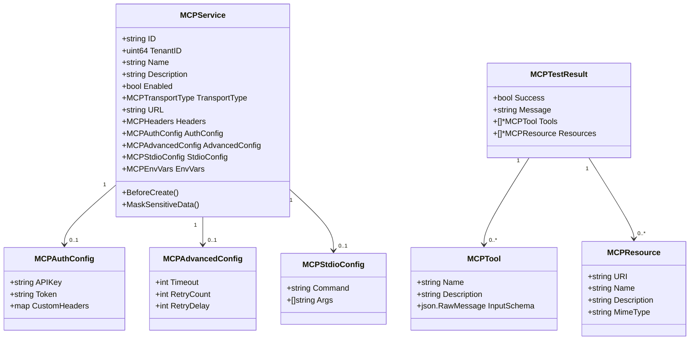

# MCP 服务域模型技术深度解析

## 1. 模块概述

`mcp_service_domain_models` 模块是系统中负责定义和管理 MCP (Model Context Protocol) 服务核心数据结构的基础模块。它为整个系统提供了 MCP 服务配置、认证、工具和资源等核心概念的抽象，是连接上层业务逻辑与底层 MCP 协议实现的桥梁。

### 问题背景

在构建 AI 代理系统时，我们需要与外部 MCP 服务进行交互，这些服务可能通过不同的传输协议（如 SSE、HTTP Streamable、stdio）提供工具和资源。不同服务的配置方式差异巨大，包括认证方式、连接参数、超时重试策略等。如果没有统一的抽象层，业务逻辑会变得混乱且难以维护。

### 解决方案

本模块通过定义一组清晰的领域模型，将 MCP 服务的各种配置和特性抽象为结构化的数据类型。这些模型不仅支持数据持久化，还提供了数据序列化/反序列化、敏感信息保护等核心功能，为上层应用提供了统一的接口。

## 2. 核心抽象与架构

### 2.1 核心组件层次结构



### 2.2 核心抽象解析

#### MCPService：服务配置的核心聚合根
`MCPService` 是整个模块的核心，它聚合了服务配置的所有方面。想象它是一个服务控制面板，从这里可以配置服务的所有细节：如何连接、如何认证、如何处理通信等。

#### 传输类型抽象
`MCPTransportType` 定义了三种主要的传输方式：
- **SSE**：Server-Sent Events，适用于服务端主动推送的场景
- **HTTP Streamable**：流式 HTTP 通信，适用于需要双向流式交互的场景
- **stdio**：标准输入输出，适用于本地进程间通信

这种设计使得系统可以通过统一的接口处理不同传输方式的 MCP 服务。

#### 配置分层设计
配置被清晰地分为多个层次：
- **基础配置**：服务名称、描述、启用状态等
- **传输配置**：URL、Headers、stdio 命令等
- **认证配置**：API Key、Token、自定义 Header 等
- **高级配置**：超时、重试次数、重试延迟等

这种分层设计使得配置管理更加清晰，也便于未来扩展。

## 3. 关键组件深度解析

### 3.1 MCPService 结构体

#### 设计意图
`MCPService` 作为聚合根，负责维护 MCP 服务的完整状态。它不仅是数据的容器，还提供了生命周期钩子和数据保护功能。

#### 核心字段解析
- **ID**：使用 UUID 作为主键，确保分布式环境下的唯一性
- **TenantID**：支持多租户架构，这是企业级应用的关键特性
- **Enabled**：支持服务的软启用/禁用，便于运维管理
- **TransportType**：明确服务的通信方式，是后续连接逻辑的依据
- **URL**：可选字段，仅在 SSE/HTTP Streamable 传输方式下需要
- **StdioConfig**：可选字段，仅在 stdio 传输方式下需要

这种条件性字段设计（URL 和 StdioConfig 互斥）是为了适应不同传输方式的需求，但也引入了一定的复杂性——使用时需要根据 TransportType 验证相应字段的存在性。

#### 生命周期钩子
`BeforeCreate` 钩子在创建服务前自动生成 UUID，这是一种常见的数据库实体模式，确保了 ID 的自动管理。

### 3.2 数据持久化适配

#### 设计意图
所有复杂类型（`MCPHeaders`、`MCPAuthConfig` 等）都实现了 `driver.Valuer` 和 `sql.Scanner` 接口，这是为了让这些复杂类型能够直接与数据库交互，而不需要额外的转换层。

#### 实现机制
这些接口的实现都基于 JSON 序列化：
- **Value()**：将对象序列化为 JSON 字节数组存储到数据库
- **Scan()**：从数据库读取 JSON 字节数组并反序列化为对象

这种设计的优点是简单直接，利用了 Go 标准库的 JSON 功能。但也有一个潜在的缺点：JSON 字段在数据库中无法建立有效的索引，对于需要基于这些字段进行查询的场景可能会有性能问题。

### 3.3 敏感数据保护

#### 设计意图
`MaskSensitiveData()` 方法的存在是为了在日志记录、API 响应等场景中保护敏感信息（如 API Key、Token）不被泄露。

#### 实现策略
- 对于长度 ≤ 8 的字符串，完全替换为 ****
- 对于更长的字符串，只保留前 4 个和后 4 个字符，中间用 **** 替换

这种策略在安全性和可读性之间取得了平衡：既保护了敏感信息，又让运维人员能够通过首尾字符确认使用的是正确的凭证。

### 3.4 MCPTool 和 MCPResource

#### 设计意图
这两个结构体代表了 MCP 服务暴露的核心能力：
- **MCPTool**：可调用的工具，包含名称、描述和输入 schema
- **MCPResource**：可访问的资源，包含 URI、名称、描述和 MIME 类型

#### 关键设计点
`MCPTool.InputSchema` 使用 `json.RawMessage` 类型，这是一个非常重要的设计决策。使用 `json.RawMessage` 而不是具体的结构体，意味着：
1. 我们不需要预先知道工具的输入 schema 结构
2. 可以动态处理任意复杂的 schema
3. 避免了不必要的 JSON 解析/序列化开销

这种设计为系统提供了极大的灵活性，使其能够适应各种不同的 MCP 服务。

## 4. 数据流与交互

### 4.1 服务创建流程

1. 上层应用创建 `MCPService` 对象，设置必要的配置
2. GORM 触发 `BeforeCreate` 钩子，自动生成 UUID
3. 数据持久化层通过 `Value()` 方法将复杂配置序列化为 JSON
4. 数据保存到数据库

### 4.2 服务测试流程

1. 上层应用从数据库加载 `MCPService` 配置
2. 数据访问层通过 `Scan()` 方法反序列化 JSON 配置
3. MCP 客户端根据配置连接到服务
4. 连接成功后，获取服务的工具和资源列表
5. 结果封装为 `MCPTestResult` 对象返回

### 4.3 数据展示流程

1. 从数据库加载 `MCPService` 对象
2. 调用 `MaskSensitiveData()` 方法隐藏敏感信息
3. 通过 API 返回给前端或记录到日志

## 5. 设计决策与权衡

### 5.1 JSON 序列化 vs 结构化表设计

**选择**：使用 JSON 字段存储复杂配置  
**替代方案**：为每种配置类型创建单独的表，通过外键关联  

**权衡分析**：
- ✅ **优点**：
  - Schema 灵活性高，配置变化时不需要数据库迁移
  - 查询简单，一次查询即可获取完整配置
  - 代码简洁，不需要处理复杂的关联关系
  
- ❌ **缺点**：
  - JSON 字段无法建立有效索引，查询性能受限
  - 数据一致性验证依赖应用层，数据库无法提供约束
  - 对于 SQL 查询和分析不友好

**适用场景**：配置数据主要作为整体读写，不需要基于配置字段进行复杂查询的场景，这正是 MCP 服务配置的典型使用模式。

### 5.2 敏感数据处理策略

**选择**：在应用层通过 `MaskSensitiveData()` 方法处理敏感数据  
**替代方案**：使用数据库加密、字段级加密等技术  

**权衡分析**：
- ✅ **优点**：
  - 实现简单，不依赖数据库特定功能
  - 性能开销小
  - 灵活性高，可以根据需要调整掩码策略
  
- ❌ **缺点**：
  - 数据库中存储的是明文，依赖数据库访问控制保护
  - 需要确保所有数据展示路径都调用了掩码方法

**适用场景**：系统已经有完善的数据库访问控制，且主要风险在于日志和 API 响应泄露的场景。

### 5.3 条件性字段设计

**选择**：URL 和 StdioConfig 作为可选字段，根据 TransportType 确定哪个有效  
**替代方案**：使用接口和多态，或者创建不同的结构体类型  

**权衡分析**：
- ✅ **优点**：
  - 设计简单直观
  - 减少了类型层次的复杂性
  - 便于序列化和持久化
  
- ❌ **缺点**：
  - 数据一致性需要应用层验证
  - 可能存在无效状态（如同时设置 URL 和 StdioConfig）
  - 类型安全性较弱

**适用场景**：字段数量不多，且验证逻辑相对简单的场景。

## 6. 使用指南与最佳实践

### 6.1 创建 MCP 服务配置

```go
// 创建 SSE 传输类型的服务
service := &types.MCPService{
    TenantID:      123,
    Name:          "My MCP Service",
    Description:   "A sample MCP service",
    Enabled:       true,
    TransportType: types.MCPTransportSSE,
    URL:           ptrToString("https://example.com/mcp"),
    Headers: types.MCPHeaders{
        "Authorization": "Bearer token",
    },
    AuthConfig: &types.MCPAuthConfig{
        APIKey: "secret-api-key",
    },
    AdvancedConfig: types.GetDefaultAdvancedConfig(),
}

// 创建 stdio 传输类型的服务
stdioService := &types.MCPService{
    TenantID:      123,
    Name:          "Local MCP Service",
    Description:   "A local MCP service",
    Enabled:       true,
    TransportType: types.MCPTransportStdio,
    StdioConfig: &types.MCPStdioConfig{
        Command: "npx",
        Args:    []string{"-y", "@modelcontextprotocol/server-filesystem", "/path/to/files"},
    },
    EnvVars: types.MCPEnvVars{
        "LOG_LEVEL": "debug",
    },
}
```

### 6.2 数据验证

由于使用了条件性字段设计，在创建或更新服务时应该进行验证：

```go
func ValidateMCPService(service *types.MCPService) error {
    switch service.TransportType {
    case types.MCPTransportSSE, types.MCPTransportHTTPStreamable:
        if service.URL == nil || *service.URL == "" {
            return errors.New("URL is required for SSE/HTTP Streamable transport")
        }
    case types.MCPTransportStdio:
        if service.StdioConfig == nil {
            return errors.New("StdioConfig is required for stdio transport")
        }
        if service.StdioConfig.Command == "" {
            return errors.New("command is required in StdioConfig")
        }
    default:
        return errors.New("unsupported transport type")
    }
    return nil
}
```

### 6.3 敏感数据处理

在返回服务数据给前端或记录日志前，务必调用掩码方法：

```go
// 获取服务后
service, err := repository.GetMCPService(id)
if err != nil {
    return err
}
service.MaskSensitiveData() // 隐藏敏感信息
return service, nil
```

## 7. 注意事项与常见问题

### 7.1 空值处理

由于很多字段是指针类型或可选的，使用时需要注意空值检查：

```go
// 错误示例：可能导致空指针 panic
url := *service.URL

// 正确示例：先检查是否为 nil
var url string
if service.URL != nil {
    url = *service.URL
}
```

### 7.2 JSON 字段查询限制

由于配置字段存储为 JSON，无法像普通字段那样进行高效查询。如果需要基于配置内容进行查询，考虑：
1. 将常用查询字段提取为独立的数据库列
2. 使用支持 JSON 索引的数据库（如 PostgreSQL 的 JSONB）
3. 在应用层进行过滤（适用于数据量不大的情况）

### 7.3 数据一致性

由于条件性字段的存在，数据库层面无法强制数据一致性。务必在应用层确保：
1. 创建和更新时进行验证
2. 提供明确的错误信息
3. 考虑使用数据库事务确保操作的原子性

### 7.4 版本兼容性

当配置结构发生变化时，需要考虑向后兼容性：
1. 新增字段应该有默认值
2. 删除字段前应该先标记为废弃
3. 考虑使用版本号管理配置结构

## 8. 总结

`mcp_service_domain_models` 模块通过精心设计的领域模型，为 MCP 服务配置提供了清晰、灵活且实用的抽象。它在简洁性和功能性之间取得了良好的平衡，通过 JSON 序列化、敏感数据保护等机制，为上层应用提供了强大的支持。

该模块的设计体现了几个重要的原则：
- **聚合根模式**：`MCPService` 作为单一入口点管理所有配置
- **分层设计**：将不同关注点的配置分离到不同的结构体中
- **数据库适配**：通过标准接口实现复杂类型的持久化
- **安全意识**：内置敏感数据保护功能

作为系统的基础模块，它为上层的 [mcp_service_interfaces](core_domain_types_and_interfaces-mcp_web_search_and_eventing_contracts-mcp_service_interfaces.md) 和更上层的业务逻辑提供了坚实的基础。
