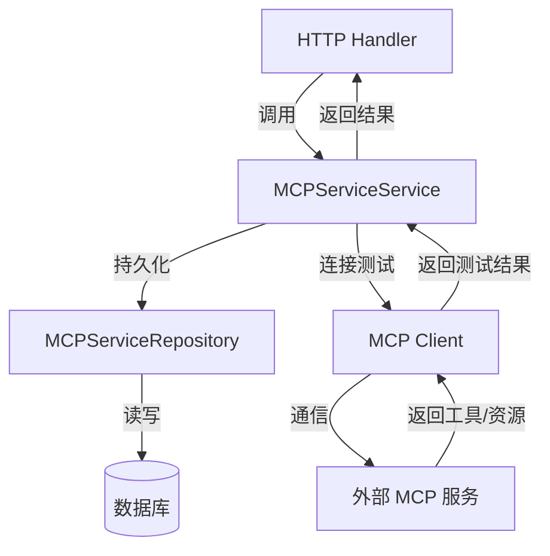

# MCP Service Interfaces 模块深度解析

## 1. 问题域与模块定位

在多租户 AI 代理系统中，Model Context Protocol (MCP) 服务作为外部能力扩展的核心通道，允许代理动态连接和使用第三方服务提供的工具与资源。然而，这种灵活性带来了两个关键挑战：

**数据一致性挑战**：不同租户需要管理各自的 MCP 服务配置，包括服务凭证、连接参数、启用状态等。这些配置需要持久化存储，同时保证租户间的隔离性。

**能力发现挑战**：每个 MCP 服务可能提供不同的工具集和资源集，系统需要能够动态探测这些能力，而不是硬编码在代码中。

一个简单的 CRUD 接口无法满足需求，因为：
- 它缺少对服务连接性验证的支持
- 它没有提供能力发现的机制
- 它没有考虑多租户场景下的权限隔离

`mcp_service_interfaces` 模块正是为了解决这些问题而设计的。它定义了 MCP 服务管理的核心契约，将数据访问与业务逻辑分离，同时提供了服务测试和能力发现的抽象接口。

## 2. 核心抽象与心智模型

理解这个模块的关键在于掌握两个核心抽象：

### 2.1 仓库抽象 (Repository)
`MCPServiceRepository` 是数据访问层的契约，它封装了所有与 MCP 服务持久化相关的操作。你可以把它想象成 MCP 服务配置的"书架"——它知道如何存放、检索、更新和删除服务配置，但它不关心这些配置如何被使用，也不理解服务的业务含义。

### 2.2 服务抽象 (Service)
`MCPServiceService` 是业务逻辑层的契约，它定义了 MCP 服务管理的所有业务操作。这个抽象不仅仅是数据的 CRUD，还增加了服务连接测试和能力发现的功能。你可以把它想象成 MCP 服务的"管理员"——它不仅知道如何管理配置，还知道如何与实际的 MCP 服务通信，验证连接，并获取服务提供的工具和资源列表。

这种分离遵循了领域驱动设计 (DDD) 中的分层架构原则，使得数据访问逻辑与业务逻辑解耦，提高了代码的可测试性和可维护性。

## 3. 架构与数据流

让我们通过一个典型的"创建并测试 MCP 服务"的场景来理解数据如何流动：



### 3.1 核心组件职责

**MCPServiceRepository** 负责：
- 服务配置的持久化操作（Create/Update/Delete）
- 服务配置的查询操作（GetByID/List/ListEnabled/ListByIDs）
- 确保多租户隔离（所有查询都带有 tenantID 参数）

**MCPServiceService** 负责：
- 协调仓库进行数据操作（CreateMCPService/UpdateMCPService/DeleteMCPService）
- 提供服务查询能力（GetMCPServiceByID/ListMCPServices/ListMCPServicesByIDs）
- 执行服务连接测试（TestMCPService）
- 发现服务能力（GetMCPServiceTools/GetMCPServiceResources）

### 3.2 关键数据流

1. **服务创建流程**：
   - 上层调用 `CreateMCPService`
   - Service 层可能进行一些业务验证
   - 调用 Repository 的 `Create` 方法持久化
   - 返回结果

2. **服务测试流程**：
   - 上层调用 `TestMCPService(tenantID, id)`
   - Service 层通过 Repository 获取服务配置
   - 使用 MCP 客户端连接到外部服务
   - 验证连接并获取工具和资源列表
   - 返回 `MCPTestResult`

3. **能力发现流程**：
   - 上层调用 `GetMCPServiceTools` 或 `GetMCPServiceResources`
   - Service 层获取服务配置
   - 连接到外部服务并请求相应的能力列表
   - 返回结构化的工具或资源信息

## 4. 依赖关系分析

### 4.1 被依赖模块

这个模块依赖于：
- **internal/types**：提供核心数据模型，包括 `MCPService`、`MCPTool`、`MCPResource` 和 `MCPTestResult`
- **context**：Go 标准库，用于上下文传递和取消控制

### 4.2 依赖此模块的模块

从模块树可以看出，这个模块可能被以下模块依赖：
- **application_services_and_orchestration** 下的 **agent_identity_tenant_and_configuration_services**：特别是 **mcp_service_configuration_management** 子模块，它可能实现了这些接口
- **http_handlers_and_routing** 下的 **agent_tenant_organization_and_model_management_handlers**：特别是 **mcp_service_management_handlers** 子模块，它可能使用 Service 接口处理 HTTP 请求
- **platform_infrastructure_and_runtime** 下的 **mcp_connectivity_and_protocol_models**：可能与 Service 接口协作进行实际的 MCP 连接

### 4.3 数据契约

这个模块定义了清晰的数据契约：
- 所有操作都需要 `context.Context`，支持请求跟踪、超时控制和取消
- 所有租户相关的操作都带有 `tenantID uint64` 参数，确保多租户隔离
- 返回值明确区分了数据操作和业务操作，业务操作返回更丰富的结果类型（如 `MCPTestResult`）

## 5. 设计决策与权衡

### 5.1 接口分离设计

**决策**：将数据访问和业务逻辑分离为两个独立的接口。

**原因**：
- 遵循单一职责原则，使每个接口的职责更清晰
- 便于单元测试，可以独立 mock Repository 来测试 Service 层的业务逻辑
- 提高了灵活性，例如可以有不同的 Repository 实现（数据库、缓存等）而不影响 Service 层

**权衡**：
- 增加了接口数量，初期可能看起来有些过度设计
- 但在复杂系统中，这种分离带来的可维护性提升远超过初期的额外开销

### 5.2 租户隔离设计

**决策**：所有租户相关的查询方法都显式接收 `tenantID` 参数。

**原因**：
- 确保在多租户系统中，数据不会意外泄露到其他租户
- 使租户隔离成为接口契约的一部分，而不是实现细节
- 便于在实现层进行统一的权限检查

**权衡**：
- 方法签名略显冗长
- 但这是多租户系统中安全性和正确性的必要保障

### 5.3 软删除设计

**决策**：Repository 的 Delete 方法注释明确标注为 "soft delete"。

**原因**：
- 保留历史数据，便于审计和恢复
- 避免因误删除导致的数据丢失
- 符合企业级应用的数据管理最佳实践

**权衡**：
- 需要在实现层处理软删除的数据过滤
- 数据库会逐渐积累已删除的记录，可能需要定期清理策略

### 5.4 能力发现接口设计

**决策**：Service 接口不仅提供了统一的 `TestMCPService` 方法，还提供了独立的 `GetMCPServiceTools` 和 `GetMCPServiceResources` 方法。

**原因**：
- `TestMCPService` 用于完整的连接测试和能力发现，适合服务创建或更新时使用
- 独立的能力获取方法允许在不需要完整测试的情况下获取特定类型的能力，提高效率
- 满足不同场景的需求：有时只需要工具列表，有时只需要资源列表

**权衡**：
- 增加了接口方法数量
- 但提供了更好的粒度控制和性能优化空间

## 6. 使用指南与最佳实践

### 6.1 实现接口的最佳实践

当实现 `MCPServiceRepository` 时：
- 确保所有查询都正确应用租户过滤
- 实现软删除时，使用一个布尔字段（如 `deleted`）或时间戳字段（如 `deleted_at`）
- 在 `ListEnabled` 方法中，同时过滤已删除和已禁用的服务
- 考虑在 `Create` 方法中生成唯一 ID（如果上层没有提供）

当实现 `MCPServiceService` 时：
- 在执行业务操作前，验证服务配置的有效性
- 在 `TestMCPService` 中，不仅测试连接，还要验证返回的工具和资源格式是否正确
- 考虑对频繁访问的服务能力进行缓存，减少对外部 MCP 服务的请求
- 实现适当的超时和重试机制，处理外部服务不可用的情况

### 6.2 常见使用模式

**创建并测试服务**：
```go
// 假设 service 是一个已配置好的 *types.MCPService
err := mcpService.CreateMCPService(ctx, service)
if err != nil {
    // 处理错误
}

// 测试连接并获取能力
testResult, err := mcpService.TestMCPService(ctx, tenantID, service.ID)
if err != nil {
    // 处理连接失败，可能需要回滚创建
    mcpService.DeleteMCPService(ctx, tenantID, service.ID)
}
```

**获取所有启用服务的工具**：
```go
// 获取所有启用的服务
services, err := mcpService.ListMCPServices(ctx, tenantID)
if err != nil {
    // 处理错误
}

// 收集所有工具
var allTools []*types.MCPTool
for _, svc := range services {
    tools, err := mcpService.GetMCPServiceTools(ctx, tenantID, svc.ID)
    if err != nil {
        // 记录错误但继续处理其他服务
        continue
    }
    allTools = append(allTools, tools...)
}
```

## 7. 注意事项与陷阱

### 7.1 租户隔离

**陷阱**：在实现 Repository 时忘记应用租户过滤，可能导致数据泄露。

**建议**：
- 在实现层编写单元测试，验证不同租户的数据不会相互访问
- 考虑使用装饰器模式，在 Repository 实现外层自动应用租户过滤

### 7.2 外部服务通信

**陷阱**：Service 层的方法可能长时间阻塞，等待外部 MCP 服务响应。

**建议**：
- 总是使用带超时的 context
- 考虑实现 circuit breaker 模式，避免故障服务拖慢整个系统
- 对外部服务调用进行适当的日志记录和监控

### 7.3 并发安全

**陷阱**：同一服务的并发更新可能导致数据不一致。

**建议**：
- 在 Repository 实现中使用乐观锁（如版本号字段）
- 或者在 Service 层对同一服务的操作进行适当的序列化

### 7.4 错误处理

**陷阱**：不同类型的错误（数据访问错误、网络错误、验证错误）没有区分处理。

**建议**：
- 定义清晰的错误类型，便于上层进行不同的处理
- 在接口文档中说明可能返回的错误类型
- 保留原始错误信息，便于调试

## 8. 总结

`mcp_service_interfaces` 模块是整个 MCP 服务管理体系的核心契约层。它通过清晰的接口分离，将数据访问与业务逻辑解耦，同时考虑了多租户隔离、服务测试和能力发现等关键需求。

这个模块的设计体现了几个重要的软件工程原则：
- **接口分离原则**：将不同关注点的操作分离到不同的接口
- **依赖倒置原则**：定义抽象接口而不是具体实现，使上层依赖抽象而不是细节
- **多租户安全**：通过设计确保租户隔离成为契约的一部分

理解这个模块的关键在于掌握 Repository 和 Service 两个核心抽象，以及它们如何协作完成 MCP 服务的完整生命周期管理。对于新加入团队的开发者来说，熟悉这个模块将为理解整个 MCP 服务管理体系打下坚实的基础。
