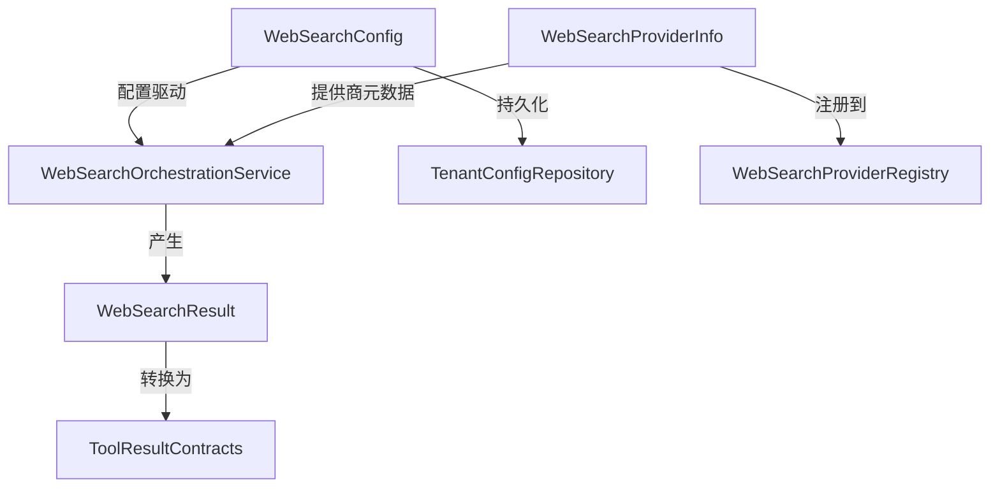

# Web Search Domain Models 技术深度文档

## 1. 模块概览

**web_search_domain_models** 模块是整个系统中 Web 搜索功能的"数据契约层"，它定义了 Web 搜索相关的核心数据结构。这些模型就像系统各组件之间的"通用语言"——无论是配置管理、搜索引擎集成、结果处理还是前端展示，都通过这些标准化的数据结构来交换信息。

在实际场景中，系统需要支持多种搜索引擎提供商（Bing、Google、DuckDuckGo 等），每种提供商有不同的 API 格式和配置需求。如果没有统一的领域模型，每新增一个搜索引擎都需要修改大量代码，配置管理会变得混乱，结果处理逻辑也会分散在各个地方。这个模块通过抽象出通用的配置、结果和提供商信息模型，解决了这些问题。

## 2. 架构与数据流

虽然这是一个纯数据模型模块，没有复杂的处理逻辑，但它在整个 Web 搜索架构中处于核心位置：



**数据流向说明**：
1. **配置流**：`WebSearchConfig` 从租户配置存储中加载，传递给 Web 搜索编排服务，控制搜索行为
2. **提供商信息流**：`WebSearchProviderInfo` 从提供商注册表中获取，用于动态发现和选择搜索引擎
3. **结果流**：各搜索引擎提供商返回原始数据后，转换为统一的 `WebSearchResult` 结构，再经过处理后传递给前端或 Agent

## 3. 核心组件深度解析

### 3.1 WebSearchConfig - 搜索配置契约

```go
type WebSearchConfig struct {
    Provider          string   `json:"provider"`
    APIKey            string   `json:"api_key"`
    MaxResults        int      `json:"max_results"`
    IncludeDate       bool     `json:"include_date"`
    CompressionMethod string   `json:"compression_method"`
    Blacklist         []string `json:"blacklist"`
    // RAG压缩相关配置
    EmbeddingModelID   string `json:"embedding_model_id,omitempty"`
    EmbeddingDimension int    `json:"embedding_dimension,omitempty"`
    RerankModelID      string `json:"rerank_model_id,omitempty"`
    DocumentFragments  int    `json:"document_fragments,omitempty"`
}
```

**设计意图**：
这个结构体是租户级 Web 搜索配置的完整描述。它的设计体现了"关注点分离"——基础搜索参数与 RAG（检索增强生成）相关的高级配置清晰地分为两部分。

**关键字段解析**：
- `Provider`：搜索引擎提供商的标识符（如 "bing"、"google"），这是连接配置与实际搜索引擎实现的桥梁
- `CompressionMethod`：支持 "none"、"summary"、"extract"、"rag" 四种压缩方法，体现了对搜索结果后处理的灵活设计
- `Blacklist`：字符串数组形式的黑名单规则，允许通过配置过滤特定域名或内容模式
- RAG 相关字段：这些字段带有 `omitempty` 标签，表明它们是可选的，只有在 `CompressionMethod` 为 "rag" 时才需要

**数据库兼容性**：
该结构体实现了 `driver.Valuer` 和 `sql.Scanner` 接口，这意味着它可以直接作为数据库字段存储和读取，无需额外的序列化/反序列化代码。这种设计选择将数据持久化逻辑封装在模型内部，符合"单一职责原则"。

### 3.2 WebSearchResult - 搜索结果统一表示

```go
type WebSearchResult struct {
    Title       string     `json:"title"`
    URL         string     `json:"url"`
    Snippet     string     `json:"snippet"`
    Content     string     `json:"content"`
    Source      string     `json:"source"`
    PublishedAt *time.Time `json:"published_at,omitempty"`
}
```

**设计意图**：
这是所有搜索引擎提供商返回结果的统一抽象。无论底层搜索引擎返回什么格式的数据，最终都会转换为这个结构，使得上层处理逻辑（如结果排序、过滤、展示）不需要关心具体的搜索引擎实现。

**字段设计考量**：
- `Snippet` vs `Content`：这两个字段的分离体现了"原始数据"与"处理后数据"的区别。`Snippet` 是搜索引擎返回的摘要片段，而 `Content` 是可选的完整内容（需要额外抓取）
- `PublishedAt` 使用指针类型：这是为了区分"没有发布时间"和"发布时间为空"两种情况，符合 Go 语言处理可选时间字段的惯用模式
- `Source` 字段：记录结果来自哪个搜索引擎，这在混合使用多个搜索引擎时非常重要

### 3.3 WebSearchProviderInfo - 搜索引擎提供商元数据

```go
type WebSearchProviderInfo struct {
    ID             string `json:"id"`
    Name           string `json:"name"`
    Free           bool   `json:"free"`
    RequiresAPIKey bool   `json:"requires_api_key"`
    Description    string `json:"description"`
    APIURL         string `json:"api_url,omitempty"`
}
```

**设计意图**：
这个结构体描述搜索引擎提供商的静态元信息，用于提供商的动态发现、注册和 UI 展示。它不包含任何运行时状态，只描述提供商本身的特性。

**设计亮点**：
- `Free` 和 `RequiresAPIKey` 这两个布尔字段：直接影响前端 UI 的展示逻辑（如是否显示 API 密钥输入框、是否标注"免费"标签）
- `APIURL` 可选：有些搜索引擎（如 DuckDuckGo）可能使用固定的 API 地址，不需要配置；而有些企业级搜索引擎可能需要自定义 API 地址
- `ID` 字段：作为提供商的唯一标识符，与 `WebSearchConfig` 中的 `Provider` 字段对应，形成配置与提供商实现之间的关联

## 4. 依赖关系分析

### 被依赖关系（被哪些模块使用）
- **web_search_orchestration_registry_and_state**：使用 `WebSearchConfig` 来配置搜索行为，使用 `WebSearchProviderInfo` 来管理提供商注册表
- **web_search_provider_implementations**：各搜索引擎实现将原始结果转换为 `WebSearchResult`
- **search_result_conversion_and_normalization_utilities**：使用 `WebSearchResult` 进行结果转换和归一化
- **tenant_core_models_and_retrieval_config**：租户配置中包含 `WebSearchConfig`

### 依赖关系（依赖哪些模块）
这个模块非常底层，几乎不依赖其他业务模块，只依赖标准库：
- `encoding/json`：用于 JSON 序列化/反序列化
- `database/sql/driver`：用于数据库兼容性
- `time`：用于时间处理

## 5. 设计决策与权衡

### 5.1 选择结构体而不是接口

**决策**：所有核心模型都定义为结构体，而不是接口。

**原因**：
- 这些模型主要是数据容器，没有复杂的行为
- 结构体可以直接序列化/反序列化为 JSON，便于 API 交互和数据库存储
- 避免了接口抽象带来的额外复杂性

**权衡**：
- 失去了一定的灵活性（无法轻松替换实现）
- 但在这个场景下，数据结构的稳定性比灵活性更重要

### 5.2 可选字段使用指针和 omitempty

**决策**：可选字段使用指针类型（如 `*time.Time`）并在 JSON 标签中添加 `omitempty`。

**原因**：
- 指针类型可以区分"零值"和"未设置"两种情况
- `omitempty` 可以在序列化时省略未设置的字段，减少传输数据量

**权衡**：
- 使用指针增加了空指针检查的负担
- 但这是 Go 语言处理可选字段的标准做法，团队成员熟悉这种模式

### 5.3 数据库序列化逻辑内置在模型中

**决策**：在模型结构体中直接实现 `driver.Valuer` 和 `sql.Scanner` 接口。

**原因**：
- 将数据持久化逻辑封装在模型内部，符合"单一职责原则"
- 使模型可以直接在数据库操作中使用，简化上层代码
- 避免了在多个地方重复编写序列化/反序列化代码

**权衡**：
- 模型层与数据库层有一定耦合
- 但这种耦合是单向的，只依赖标准库的 `database/sql/driver` 接口，不会引入复杂的依赖

## 6. 使用指南与最佳实践

### 6.1 WebSearchConfig 使用示例

```go
// 创建基本搜索配置
config := &types.WebSearchConfig{
    Provider:          "bing",
    MaxResults:        10,
    IncludeDate:       true,
    CompressionMethod: "none",
}

// 创建 RAG 增强的搜索配置
ragConfig := &types.WebSearchConfig{
    Provider:           "google",
    APIKey:             "your-api-key",
    MaxResults:         20,
    CompressionMethod:  "rag",
    EmbeddingModelID:   "text-embedding-ada-002",
    EmbeddingDimension: 1536,
    RerankModelID:      "rerank-english-v2.0",
    DocumentFragments:  5,
}
```

### 6.2 WebSearchResult 构建示例

```go
// 从搜索引擎原始响应构建结果
publishedTime := time.Date(2023, 1, 15, 0, 0, 0, 0, time.UTC)
result := &types.WebSearchResult{
    Title:       "Example Title",
    URL:         "https://example.com/page",
    Snippet:     "This is a snippet from the page...",
    Content:     "", // 可以留空，后续根据需要抓取
    Source:      "bing",
    PublishedAt: &publishedTime,
}
```

### 6.3 最佳实践

1. **空指针安全**：使用 `WebSearchResult.PublishedAt` 等指针字段时，始终检查是否为 nil
2. **压缩方法一致性**：确保 `CompressionMethod` 的值与 RAG 相关字段的设置保持一致
3. **提供商 ID 匹配**：`WebSearchConfig.Provider` 的值必须与某个 `WebSearchProviderInfo.ID` 匹配
4. **敏感信息处理**：`WebSearchConfig.APIKey` 是敏感信息，日志记录时需要脱敏

## 7. 边缘情况与注意事项

### 7.1 空值处理

- `WebSearchConfig.Scan(nil)` 会返回 nil 而不是错误，这意味着从数据库加载配置时，如果该字段为 NULL，配置对象将保持零值状态
- `WebSearchResult.Content` 字段可能为空，这表示没有获取完整内容，使用时需要判断

### 7.2 兼容性考虑

- 新增字段时应使用 `omitempty` 标签，确保向后兼容性
- 不要重命名或删除现有字段，否则会破坏 JSON 反序列化和数据库读取
- 如果需要修改字段类型，考虑添加新字段并标记旧字段为 deprecated

### 7.3 性能考量

- `WebSearchConfig.Value()` 和 `WebSearchConfig.Scan()` 方法在每次数据库操作时都会调用，虽然 JSON 序列化开销不大，但在高频操作场景下仍需注意
- 如果 `WebSearchResult.Content` 字段存储大量文本，会增加内存使用和网络传输量，建议仅在真正需要时才填充此字段

## 8. 相关模块参考

- [Web Search Orchestration Service](platform_infrastructure_and_runtime-mcp_connectivity_and_protocol_models.md)：使用这些模型进行搜索编排
- [Web Search Provider Implementations](application_services_and_orchestration-retrieval_and_web_search_services-web_search_provider_implementations.md)：各搜索引擎提供商的具体实现
- [Tenant Core Models](core_domain_types_and_interfaces-identity_tenant_organization_and_configuration_contracts-tenant_lifecycle_and_runtime_configuration_contracts.md)：租户配置的完整定义
