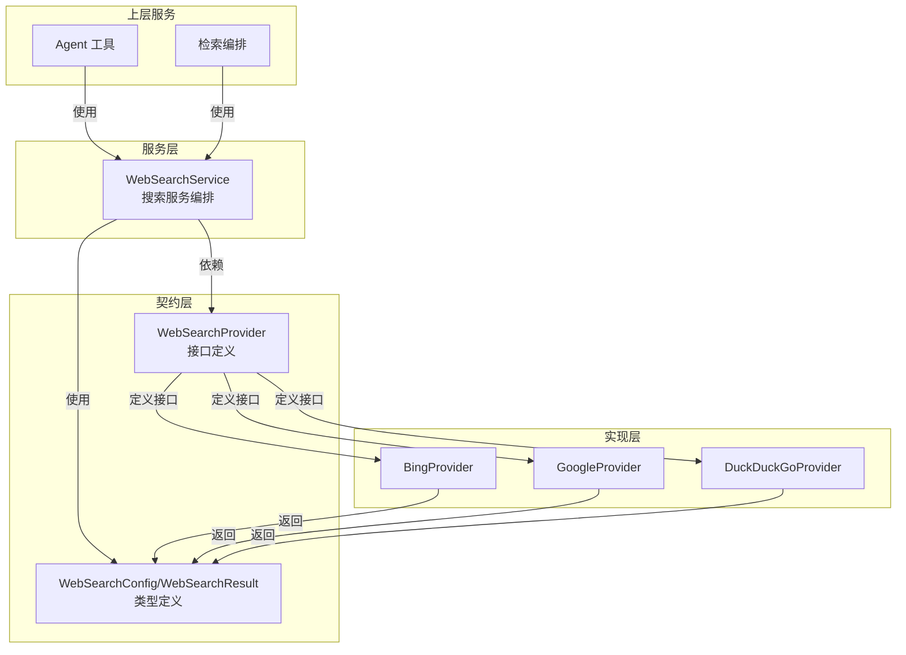

# web_search_provider_integration_contracts 模块技术深度解析

## 概述

**web_search_provider_integration_contracts** 模块是整个系统中定义 Web 搜索能力的核心契约层。它解决了**如何在保持系统灵活性的同时，统一不同搜索引擎提供商的行为接口**这一关键问题。在一个可能集成 Bing、Google、DuckDuckGo 等多种搜索服务的系统中，这个模块确保了上层应用不需要关心底层搜索提供商的实现细节，同时也为新搜索提供商的接入提供了清晰的规范。

## 1. 问题空间

在深入代码之前，让我们思考一下这个模块要解决的根本问题：

- **多搜索引擎集成的复杂性**：每个搜索引擎（Bing、Google、DuckDuckGo）都有自己独特的 API 签名、参数体系和响应格式
- **接口一致性的需求**：上层服务（如 agent 工具、检索编排）不应该需要为每个搜索引擎写不同的适配代码
- **可扩展性要求**：系统需要能够轻松接入新的搜索提供商，而不影响现有代码
- **结果标准化**：不同搜索返回的结果需要被统一成相同的数据结构，以便后续处理

一个朴素的解决方案可能是让上层代码直接调用各个搜索引擎的 SDK，但这会导致：
- 代码库中充斥着搜索引擎特定的逻辑
- 切换搜索提供商需要修改大量代码
- 无法统一管理搜索结果的格式和质量

这就是为什么需要**契约层**的原因——它定义了"搜索能力"的抽象概念，而不是具体实现。

## 2. 核心抽象与心智模型

这个模块的核心抽象是 **WebSearchProvider** 接口。你可以把它想象成**搜索引擎的插座**——任何符合这个接口的搜索引擎实现都能"插入"到系统中，而系统只需要知道如何使用这个插座。

### 关键抽象

**WebSearchProvider** 是这个模块的核心，它定义了搜索提供商必须具备的两个核心能力：

1. **身份标识**：通过 `Name()` 方法声明自己的身份
2. **搜索执行**：通过 `Search()` 方法执行实际的搜索操作

### 心智模型类比

你可以把这个模块想象成**电源插座标准**：

- **WebSearchProvider 接口** = 电源插座规格（定义了形状、电压、引脚数量）
- **具体实现**（BingProvider、GoogleProvider）= 符合插座规格的插头
- **上层服务** = 各种电器（它们只需要知道如何插入插座，不需要关心电力来自哪个发电厂）

就像所有电器都能用同一个插座一样，系统中所有需要搜索功能的组件都能使用同一个 `WebSearchProvider` 接口。

## 3. 架构与数据流程

让我们看看这个模块在整个搜索生态系统中的位置：

### 架构图



### 依赖关系

从模块树可以看出，这个模块被以下关键模块依赖：

- **web_search_orchestration_registry_and_state**：搜索编排层，负责管理和调用具体的搜索提供商
- **web_search_provider_implementations**：包含 Bing、Google、DuckDuckGo 等具体提供商实现

### 数据流向

1. **配置输入**：上层服务提供 `types.WebSearchConfig`（包含提供商选择、API 密钥等配置）
2. **查询执行**：通过 `WebSearchProvider.Search()` 发送查询
3. **结果返回**：得到标准化的 `[]*types.WebSearchResult`

虽然我们还没有看到 `WebSearchConfig` 和 `WebSearchResult` 的具体定义，但从接口可以推断出：

- `WebSearchConfig` 应该包含选择提供商、配置搜索行为的参数
- `WebSearchResult` 应该统一封装了搜索结果的标题、URL、摘要等公共字段

## 4. 核心组件深度解析

### WebSearchProvider 接口

让我们仔细分析这个接口的设计：

```go
// WebSearchProvider defines the interface for web search providers
type WebSearchProvider interface {
        // Name returns the name of the provider
        Name() string
        // Search performs a web search
        Search(ctx context.Context, query string, maxResults int, includeDate bool) ([]*types.WebSearchResult, error)
}
```

#### 设计意图分析

**Name() 方法**：
- 提供了自我标识能力，用于日志记录、监控、配置选择等场景
- 这是一个简单但关键的设计，让提供商实例能够"说出自己是谁"

**Search() 方法**：
这个方法签名体现了几个重要的设计决策：

1. **context.Context 优先**：将 context 作为第一个参数，这是 Go 的标准实践，支持超时控制、取消和链路追踪
2. **核心参数最小化**：只包含最本质的搜索参数：
   - `query`：搜索关键词（必需）
   - `maxResults`：最大结果数（用于控制成本和性能）
   - `includeDate`：是否包含日期过滤（常见的搜索选项）
3. **标准化返回值**：返回统一的 `[]*types.WebSearchResult`，确保消费者不用处理多种响应格式

#### 设计权衡

**为什么选择这些参数而不是更灵活的配置对象？**

这是一个**简洁性 vs 灵活性**的权衡：

- **选择简洁性**：接口设计简单明了，新提供商容易实现
- **牺牲部分灵活性**：如果某个特殊搜索引擎有独特参数，可能需要通过其他方式处理（比如在具体实现中通过配置文件设置）

这个选择是合理的，因为：
1. 大多数搜索引擎的核心功能是相似的
2. 过于复杂的接口会增加实现负担
3. 特殊需求可以通过具体实现的配置来满足，而不是污染通用接口

### WebSearchService 接口

让我们也看看 `WebSearchService` 接口，它构建在 `WebSearchProvider` 之上：

```go
// WebSearchService defines the interface for web search services
type WebSearchService interface {
        // Search performs a web search
        Search(ctx context.Context, config *types.WebSearchConfig, query string) ([]*types.WebSearchResult, error)
        // CompressWithRAG performs RAG-based compression using a temporary, hidden knowledge base
        CompressWithRAG(ctx context.Context, sessionID string, tempKBID string, questions []string, webSearchResults []*types.WebSearchResult, cfg *types.WebSearchConfig, kbSvc KnowledgeBaseService, knowSvc KnowledgeService, seenURLs map[string]bool, knowledgeIDs []string) (compressed []*types.WebSearchResult, kbID string, newSeen map[string]bool, newIDs []string, err error)
}
```

**关键区别**：
- `WebSearchProvider` 是**单一搜索引擎**的抽象
- `WebSearchService` 是**搜索服务编排**的抽象，它可能会：
  - 根据配置选择合适的提供商
  - 处理多个提供商的结果融合
  - 提供更高级的功能（如 `CompressWithRAG` 所示）

## 5. 设计决策与权衡

### 1. 接口最小化原则

这个模块严格遵循了**接口最小化**原则，只定义了最核心的方法。

**优点**：
- 实现成本低：新的搜索提供商只需要实现两个简单方法
- 易于测试：接口简单意味着 mock 实现也简单
- 稳定性高：接口越简单，越不容易发生变化

**缺点**：
- 某些高级特性可能无法通过标准接口暴露
- 特殊需求需要通过其他方式满足（如实现特定的额外接口）

### 2. 结果标准化

通过返回统一的 `[]*types.WebSearchResult`，这个模块强制实现了结果标准化。

**为什么这很重要？**：
- 上层代码只需要处理一种数据结构
- 可以在多个搜索提供商之间切换而不影响消费者
- 便于实现搜索结果的后处理和分析

### 3. 错误处理策略

注意到接口返回的是标准的 Go `error` 类型，这意味着：
- 错误处理交给了消费者，提供了最大的灵活性
- 具体实现可以定义自己的错误类型，但需要通过标准错误接口暴露
- 消费者需要使用类型断言来获取更详细的错误信息

### 4. Context 的使用

将 `context.Context` 作为第一个参数是一个深思熟虑的设计：

- 支持请求取消：如果用户取消了操作，搜索可以被及时中断
- 支持超时控制：防止搜索请求无限期等待
- 支持链路追踪：可以在整个调用链中传递 tracing 信息
- 符合 Go 语言的最佳实践

## 6. 如何使用与扩展

### 实现新的搜索提供商

要接入一个新的搜索引擎，你需要：

1. 创建一个结构体，实现 `WebSearchProvider` 接口
2. 实现 `Name()` 方法，返回提供商的唯一标识
3. 实现 `Search()` 方法，包含与搜索引擎 API 交互的逻辑
4. 将搜索结果转换为统一的 `[]*types.WebSearchResult` 格式

### 配置与使用

上层服务通常通过 `WebSearchService` 来使用搜索功能，而不是直接使用 `WebSearchProvider`。这样可以获得：
- 配置管理能力
- 提供商选择逻辑
- 高级功能（如 RAG 压缩）

## 7. 注意事项与陷阱

### 1. 接口稳定性

这个模块的接口是整个搜索功能的契约，一旦定义就应该保持稳定。修改接口会导致所有实现都需要更新，这是一个高风险操作。

### 2. 错误处理

虽然接口只返回了标准的 `error`，但具体实现应该提供足够的错误上下文，以便消费者能够适当地处理失败场景（比如区分是网络错误、API 密钥无效还是配额超限）。

### 3. 搜索结果一致性

不同的搜索引擎可能会以不同的方式呈现"相同"的信息。确保 `WebSearchResult` 的转换逻辑能够合理地映射这些差异，而不会丢失重要信息。

### 4. 性能考虑

- `maxResults` 参数不仅影响返回的结果数量，还可能影响 API 调用的成本和响应时间
- 实现者应该尊重这个参数，不要返回超过请求数量的结果
- 考虑在实现中加入缓存机制，避免重复查询相同的内容

## 8. 与其他模块的关系

这个模块与以下模块有紧密的关系：

- **[web_search_provider_implementations](application_services_and_orchestration-retrieval_and_web_search_services-web_search_provider_implementations.md)**：包含了这个接口的具体实现
- **[web_search_orchestration_registry_and_state](application_services_and_orchestration-retrieval_and_web_search_services-web_search_orchestration_registry_and_state.md)**：使用这个接口来编排搜索操作
- **[web_search_domain_models](core_domain_types_and_interfaces-mcp_web_search_and_eventing_contracts-web_search_domain_models.md)**：包含了 `WebSearchConfig` 和 `WebSearchResult` 等类型定义

## 总结

`web_search_provider_integration_contracts` 模块是一个典型的**接口定义层**，它通过简洁的抽象解决了多搜索引擎集成的复杂性问题。它的设计体现了**接口最小化**、**标准化**和**可扩展性**等原则，为整个系统的搜索功能提供了坚实的基础。

作为新加入团队的工程师，理解这个模块的关键是要意识到它不仅仅是一些方法签名的集合，更是整个搜索能力的"语言规范"——它定义了系统如何"谈论"搜索，以及不同组件之间如何通过搜索能力进行交互。