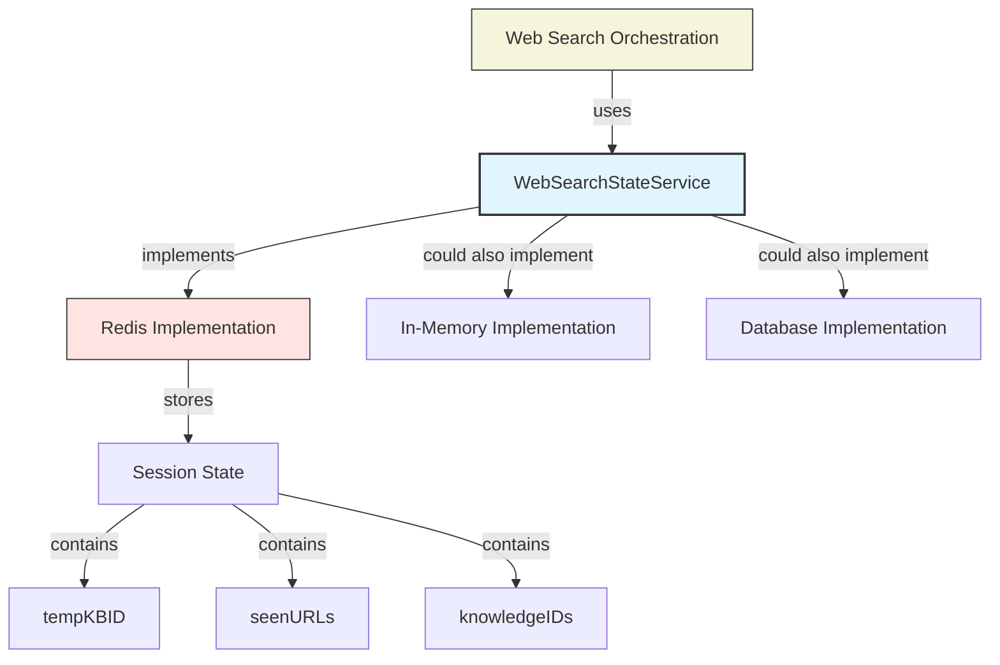

# web_search_state_management_contracts 模块技术深度解析

## 1. 模块概述

**web_search_state_management_contracts** 模块定义了管理 Web 搜索临时知识库状态的核心服务接口。在搜索会话过程中，系统需要跟踪已发现的 URL、临时知识库 ID 和知识项 ID，以确保搜索结果的一致性和避免重复处理。

### 问题空间

想象一下：用户在一个聊天会话中多次执行 Web 搜索。系统需要：
- 记住之前已经见过的 URL，避免重复获取和处理相同内容
- 维护一个临时知识库，用于存储当前会话的搜索结果
- 在会话结束时清理这些临时资源

如果没有这种状态管理，每次搜索都会重新处理所有 URL，浪费带宽和计算资源，还可能导致重复的知识条目。

### 设计洞察

这个模块采用了**会话级状态管理**的设计模式，将搜索状态与会话 ID 绑定，实现了：
- 状态的隔离性：不同会话的搜索状态互不干扰
- 资源的可追踪性：可以精确管理临时资源的生命周期
- 操作的幂等性：重复操作不会产生副作用

## 2. 核心抽象与架构

### 核心接口：WebSearchStateService

`WebSearchStateService` 是本模块的核心抽象，定义了三个关键操作：

```go
type WebSearchStateService interface {
    GetWebSearchTempKBState(ctx context.Context, sessionID string) (tempKBID string, seenURLs map[string]bool, knowledgeIDs []string)
    SaveWebSearchTempKBState(ctx context.Context, sessionID string, tempKBID string, seenURLs map[string]bool, knowledgeIDs []string)
    DeleteWebSearchTempKBState(ctx context.Context, sessionID string) error
}
```

### 数据模型

这个接口管理三个关键数据实体：
- **tempKBID**: 临时知识库的唯一标识符
- **seenURLs**: 已访问 URL 的集合（使用 map[string]bool 实现高效的存在性检查）
- **knowledgeIDs**: 已创建的知识项 ID 列表

### 架构角色

从系统架构角度看，`WebSearchStateService` 扮演着**状态网关**的角色：
- 它是搜索状态持久化的抽象层
- 它隔离了业务逻辑与具体的存储实现
- 它定义了状态操作的契约

### 架构图



## 3. 数据流程

### 典型使用场景

让我们通过一个完整的 Web 搜索会话来追踪数据流程：

1. **会话初始化**：当用户开始一个新的搜索会话时，系统可能会调用 `SaveWebSearchTempKBState` 来初始化空状态
2. **搜索执行**：每次搜索前，调用 `GetWebSearchTempKBState` 获取已见 URL，避免重复处理
3. **结果保存**：搜索完成后，将新发现的 URL 和创建的知识项通过 `SaveWebSearchTempKBState` 保存
4. **会话结束**：当会话关闭时，调用 `DeleteWebSearchTempKBState` 清理临时资源

### 依赖关系

根据模块树结构，这个模块被以下模块依赖：
- [web_search_orchestration_registry_and_state](application_services_and_orchestration-retrieval_and_web_search_services-web_search_orchestration_registry_and_state.md) - 实际的 Web 搜索编排服务会使用这个接口

## 4. 设计决策与权衡

### 设计决策 1：使用 Redis 作为存储后端

**决策**：接口文档明确提到了 Redis 作为存储介质。

**原因**：
- Redis 提供了键值对存储，非常适合按 sessionID 索引状态
- Redis 的过期机制可以自动处理会话超时的情况
- 高性能读写适合搜索场景的频繁状态更新

**权衡**：
- 优点：高性能、自动过期、集群支持
- 缺点：内存成本较高，数据持久化需要额外配置

### 设计决策 2：map[string]bool 表示已见 URL

**决策**：使用 map 而不是切片来存储已见 URL。

**原因**：
- O(1) 时间复杂度的存在性检查
- 自动去重特性
- 符合 "集合" 的语义

**权衡**：
- 优点：查询效率高
- 缺点：序列化成本稍高，内存占用比切片大

### 设计决策 3：接口不返回错误（除了 Delete）

**决策**：Get 和 Save 方法不返回错误，只有 Delete 返回 error。

**原因**：
- 简化调用方代码，不需要处理状态操作的错误
- 假设状态操作失败不会阻塞主流程（可以重新初始化状态）

**权衡**：
- 优点：调用简单，降低耦合
- 缺点：错误被静默处理，可能导致状态不一致

## 5. 使用指南与最佳实践

### 基本使用模式

```go
// 获取当前状态
tempKBID, seenURLs, knowledgeIDs := stateService.GetWebSearchTempKBState(ctx, sessionID)

// 处理新搜索结果，避免重复
for _, result := range searchResults {
    if !seenURLs[result.URL] {
        // 处理新 URL
        processURL(result.URL)
        seenURLs[result.URL] = true
        knowledgeIDs = append(knowledgeIDs, newKnowledgeID)
    }
}

// 保存更新后的状态
stateService.SaveWebSearchTempKBState(ctx, sessionID, tempKBID, seenURLs, knowledgeIDs)
```

### 最佳实践

1. **总是在会话结束时清理**：确保调用 `DeleteWebSearchTempKBState` 释放资源
2. **批量更新状态**：减少 Save 调用次数，批量处理后再保存
3. **处理状态丢失**：设计时要考虑状态可能丢失的情况，要有恢复机制

### 常见陷阱

1. **假设状态一定存在**：Get 可能返回空值，需要妥善处理
2. **并发安全**：接口没有定义并发安全保证，使用时需要外部同步
3. **URL 规范化**：确保 URL 在存入 seenURLs 之前经过规范化处理

## 6. 扩展点与实现考虑

### 实现该接口的注意事项

如果要实现 `WebSearchStateService`，需要考虑：

1. **序列化策略**：如何将 map 和切片高效地序列化存储
2. **过期策略**：设置合理的 TTL，避免僵尸状态占用资源
3. **错误处理**：虽然接口不返回错误，但实现应该记录日志
4. **原子性**：确保 Save 操作的原子性，避免部分更新

### 可能的变体

- **内存实现**：用于测试或单实例部署
- **数据库实现**：用于需要持久化的场景
- **混合实现**：热数据在 Redis，冷数据归档到数据库

## 7. 总结

`web_search_state_management_contracts` 模块通过简洁的接口定义，解决了 Web 搜索会话中状态管理的核心问题。它的设计体现了"接口隔离"和"依赖倒置"原则，为上层业务逻辑提供了清晰的契约，同时将具体的存储实现细节隐藏在接口之后。

这个模块虽然小，但在整个 Web 搜索架构中扮演着关键的协调角色，确保了搜索过程的高效性和一致性。