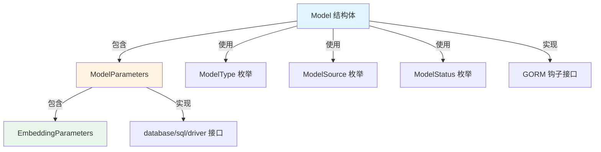

# LLM 模型参数契约 (llm_model_parameter_contracts) 技术深度分析

## 1. 模块概述与问题解决

### 问题背景

在构建 AI 模型管理系统时，我们面临着一个复杂的集成挑战：不同的模型提供商（OpenAI、阿里云、智谱等）使用完全不同的配置模式、认证方式和参数格式。如果没有统一的抽象层，代码库中会散落着大量针对特定提供商的条件逻辑，导致维护成本飙升、扩展性受限。

更糟糕的是，模型配置需要持久化到数据库中，同时又要在不同层级的系统间传递——从 API 层到服务层，再到模型提供商的适配器。直接使用原始 JSON 或无类型结构会失去类型安全和编译时检查的优势。

### 解决方案

`llm_model_parameter_contracts` 模块定义了一个统一的模型参数契约，它通过以下方式解决上述问题：
- 提供强类型的参数结构，同时保持足够的灵活性以容纳不同提供商的特殊需求
- 实现数据库序列化/反序列化机制，将复杂的参数结构透明地存储为 JSON
- 定义标准的模型类型、状态和来源枚举，确保整个系统的一致性
- 提供内置的模型记录生命周期管理（如 UUID 自动生成）

## 2. 核心抽象与心智模型

### 核心抽象

该模块围绕三个核心抽象构建：

1. **类型安全的枚举**：`ModelType`、`ModelStatus`、`ModelSource` 为系统提供了标准化的分类方式，避免了魔法字符串的滥用。

2. **分层参数结构**：`ModelParameters` 作为顶层容器，包含通用参数（如 `BaseURL`、`APIKey`）和专门领域的参数（如 `EmbeddingParameters`）。

3. **可持久化的模型记录**：`Model` 结构体将元数据（名称、类型、来源）与参数组合，并通过 GORM 钩子实现自动生命周期管理。

### 心智模型

可以将这个模块想象成一个**通用插座适配器系统**：
- `Model` 是插座面板，提供了统一的安装方式和接口
- `ModelParameters` 是插座的内部接线，处理不同电压和电流规格
- 各种 `ModelSource` 和 `ModelType` 是不同类型的插头标准
- `Value()` 和 `Scan()` 方法是适配器，负责在电气系统（数据库）和插座（结构体）之间进行转换

## 3. 架构与数据流程

### 组件关系图



### 数据流程

1. **模型创建流程**：
   - 上层应用创建 `Model` 实例，填充必要字段
   - GORM 在插入数据库前触发 `BeforeCreate` 钩子，自动生成 UUID
   - `ModelParameters` 通过 `Value()` 方法序列化为 JSON
   - 完整记录持久化到数据库

2. **模型读取流程**：
   - 从数据库查询记录
   - GORM 自动将 JSON 字段通过 `Scan()` 方法反序列化为 `ModelParameters`
   - 完整的 `Model` 结构体提供给上层使用

3. **模型使用流程**：
   - 模型提供商适配器接收 `Model` 实例
   - 根据 `ModelSource` 和 `Provider` 字段选择合适的处理逻辑
   - 从 `ModelParameters` 和 `ExtraConfig` 中提取所需配置
   - 构建特定于提供商的请求并执行

## 4. 核心组件深度分析

### ModelParameters 结构体

**设计意图**：作为所有模型参数的统一容器，同时平衡类型安全和灵活性。

**内部结构**：
- **通用连接参数**：`BaseURL`、`APIKey`、`InterfaceType` 处理大多数提供商都需要的基本连接信息
- **专用参数嵌套**：`EmbeddingParameters` 专门处理嵌入模型特有的配置
- **元数据字段**：`ParameterSize` 针对特定部署环境（如 Ollama）的需求
- **灵活扩展点**：`ExtraConfig` 作为 "逃生舱"，容纳任何提供商特定的配置

**数据库序列化**：
- `Value()` 方法将结构体序列化为 JSON 存储
- `Scan()` 方法从数据库读取 JSON 并反序列化
- 这种设计允许我们在保持 SQL 数据库的同时，拥有 NoSQL 的灵活性

**设计亮点**：
- 即使 `ExtraConfig` 提供了灵活性，核心参数仍然保持强类型
- YAML 和 JSON 标签的双重支持，使其同时适用于配置文件和 API 响应

### Model 结构体

**设计意图**：完整表示一个 AI 模型的所有方面，包括元数据、状态和参数。

**关键字段解析**：
- `IsBuiltin`：区分内置模型（对所有租户可见）和租户自定义模型
- `IsDefault`：标记默认模型，简化上层应用的模型选择逻辑
- `Status`：跟踪模型的生命周期状态，特别是对于需要下载的本地模型
- `Parameters`：嵌入 `ModelParameters`，将元数据和实际参数组合在一起

**GORM 集成**：
- `BeforeCreate` 钩子自动生成 UUID，确保 ID 的唯一性和不可预测性
- `gorm:"type:json"` 标签明确告诉 ORM 如何处理 `Parameters` 字段
- `DeletedAt` 字段支持软删除，保留审计历史

### 枚举类型

**ModelType**：定义了系统支持的四种基本模型类型：
- `Embedding`：用于生成文本嵌入向量
- `Rerank`：用于对搜索结果进行重新排序
- `KnowledgeQA`：专门用于知识问答场景
- `VLLM`：针对高吞吐量推理优化的模型

**ModelSource**：目前支持 14 种不同的模型来源，反映了系统的广泛兼容性。

**ModelStatus**：特别关注本地模型的下载状态，这是许多模型管理系统容易忽略的细节。

## 5. 依赖分析

### 被依赖关系

该模块位于系统的核心位置，被以下关键模块依赖：
- [model_catalog_repository](../data_access_repositories-model_catalog_repository.md)：用于模型数据的持久化
- [model_catalog_configuration_services](../application_services_and_orchestration-agent_identity_tenant_and_configuration_services-model_and_tag_configuration_services.md)：用于模型目录的管理
- [chat_completion_backends_and_streaming](../model_providers_and_ai_backends-chat_completion_backends_and_streaming.md)：用于实际的模型调用

### 依赖关系

该模块依赖于：
- `database/sql/driver`：用于数据库值的转换
- `encoding/json`：用于 JSON 序列化
- `github.com/google/uuid`：用于生成唯一标识符
- `gorm.io/gorm`：用于 ORM 功能

**设计决策**：选择 GORM 作为 ORM 层是一个重要的决策，它提供了钩子机制和软删除功能，但也引入了一定的耦合。

## 6. 设计权衡与决策

### 1. 强类型与灵活性的平衡

**决策**：采用了混合方案——核心参数使用强类型，同时通过 `ExtraConfig` 提供灵活扩展。

**权衡**：
- ✅ 获得了类型安全和编译时检查的好处
- ✅ 可以容纳任何未来提供商的特殊需求
- ❌ `ExtraConfig` 中的内容没有类型检查，可能导致运行时错误
- ❌ 需要在文档中明确哪些配置应该放在哪里

**替代方案**：完全使用 `map[string]interface{}` 会更灵活但失去类型安全；为每个提供商创建单独的结构体则会导致类型爆炸。

### 2. JSON 存储与关系型设计

**决策**：将 `ModelParameters` 作为 JSON 字段存储在数据库中。

**权衡**：
- ✅ 模式演化更容易，不需要为参数变更执行数据库迁移
- ✅ 可以存储任意复杂的嵌套结构
- ❌ 无法对参数字段建立索引
- ❌ SQL 查询参数内容比较困难

**替代方案**：为不同参数类型创建单独的表并建立外键关系会更符合关系型设计，但会增加复杂性。

### 3. 枚举类型的实现

**决策**：使用类型别名 `type ModelType string` 而非 `iota` 枚举。

**权衡**：
- ✅ 数据库中存储的值具有可读性（"Embedding" 而非 0）
- ✅ 更容易与外部系统集成
- ❌ 没有编译时的穷尽性检查
- ❌ 需要额外验证来防止无效值

**替代方案**：使用 `iota` 枚举可以获得更好的类型安全，但可读性较差。

### 4. UUID 与自增 ID

**决策**：使用 UUID 作为模型的主键。

**权衡**：
- ✅ 在分布式系统中更容易协调
- ✅ 不会暴露创建顺序等信息
- ❌ UUID 索引效率略低于整数
- ❌ 可读性较差

**替代方案**：自增 ID 在单体应用中效率更高，但在分布式环境中会有问题。

## 7. 使用指南与最佳实践

### 基本使用

```go
// 创建一个新模型
model := &types.Model{
    TenantID:    12345,
    Name:        "My OpenAI Model",
    Type:        types.ModelTypeEmbedding,
    Source:      types.ModelSourceOpenAI,
    Description: "Custom OpenAI embedding model",
    Parameters: types.ModelParameters{
        BaseURL:       "https://api.openai.com/v1",
        APIKey:        "sk-...",
        InterfaceType: "openai",
        Provider:      "openai",
        EmbeddingParameters: types.EmbeddingParameters{
            Dimension:            1536,
            TruncatePromptTokens: 8191,
        },
        ExtraConfig: map[string]string{
            "organization": "my-org",
        },
    },
    IsDefault: true,
    Status:    types.ModelStatusActive,
}

// 保存到数据库
db.Create(model)
```

### 最佳实践

1. **处理 ExtraConfig**：
   - 始终检查键是否存在，不要假设它一定存在
   - 考虑为常用的额外配置创建辅助方法

2. **模型验证**：
   - 创建前验证 `ModelType` 和 `ModelSource` 的组合是否有效
   - 检查必要的参数是否已提供（例如，嵌入模型需要 `EmbeddingParameters`）

3. **敏感信息处理**：
   - 序列化到 API 响应时，记得清除或掩码 `APIKey` 字段
   - 考虑使用单独的表存储敏感凭证

4. **默认模型管理**：
   - 设置新的默认模型时，记得清除其他模型的 `IsDefault` 标志
   - 每个租户应该只有一个默认模型

## 8. 边缘情况与陷阱

### 常见陷阱

1. **空值处理**：
   - `Scan()` 方法在 `value == nil` 时直接返回，不会初始化 `ModelParameters`，可能导致后续空指针异常
   - 建议在使用前检查 `Parameters` 是否为零值

2. **JSON 序列化错误**：
   - `Value()` 方法忽略了 JSON 序列化错误，这可能导致数据库中存储不正确的数据
   - 考虑在序列化失败时返回错误

3. **类型断言失败**：
   - `Scan()` 方法在类型断言失败时静默返回，这可能掩盖数据转换问题
   - 应该在类型断言失败时记录警告或返回错误

4. **枚举值验证**：
   - 目前没有代码验证传入的枚举值是否有效，可能导致无效值进入数据库
   - 建议添加验证方法，如 `IsValidModelType()`

### 扩展注意事项

1. **添加新的模型类型**：
   - 不仅要在 `ModelType` 中添加新常量，还要确保所有使用它的地方都能正确处理
   - 考虑创建一个全面的测试套件来验证所有组合

2. **参数结构演进**：
   - 修改 `ModelParameters` 时要考虑向后兼容性
   - 对于重大变更，考虑版本化参数结构

3. **多租户安全**：
   - 始终确保查询模型时包含 `TenantID` 过滤，除非是 `IsBuiltin` 模型
   - 不要允许普通租户修改内置模型

## 9. 总结

`llm_model_parameter_contracts` 模块是系统的关键基础设施，它解决了 AI 模型配置多样化的复杂问题。通过强类型与灵活性的巧妙平衡，以及与数据库的无缝集成，它为上层应用提供了统一、可靠的模型管理基础。

该模块的设计体现了几个重要原则：
- **实用主义**：不追求理论上的纯粹，而是选择在实践中工作良好的方案
- **演进式设计**：通过 JSON 存储和 `ExtraConfig` 字段为未来变化预留空间
- **关注点分离**：将元数据、参数和状态清晰地分离，但又有机地组合在一起

对于新加入的团队成员，理解这个模块的设计思想将帮助您在整个系统中更好地处理模型相关的功能，并在需要扩展时做出与现有设计一致的决策。
