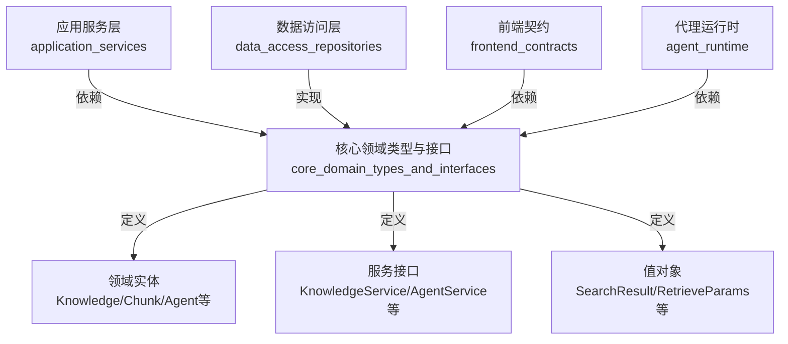
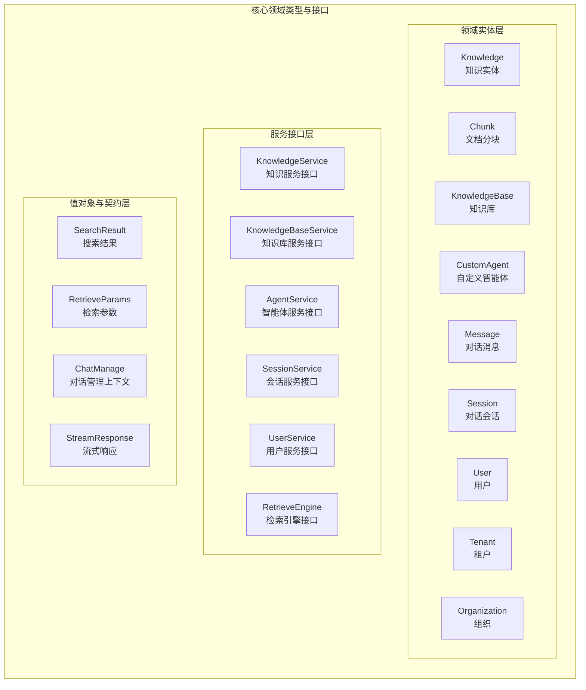
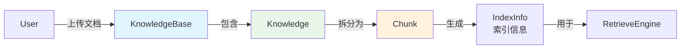
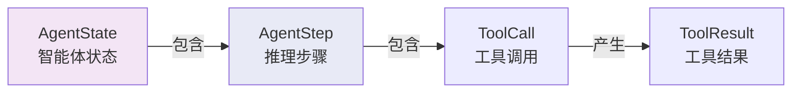
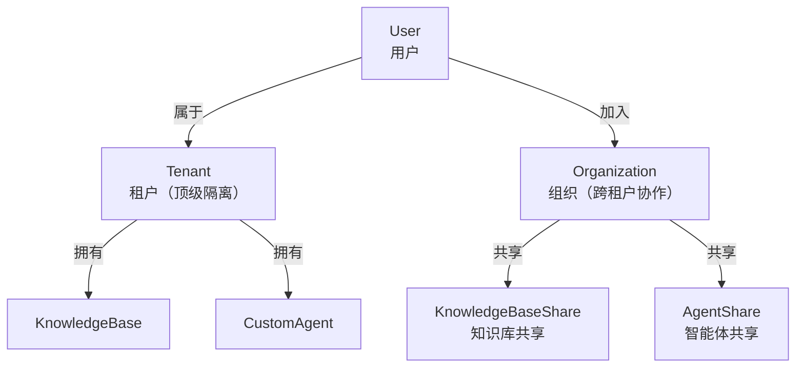
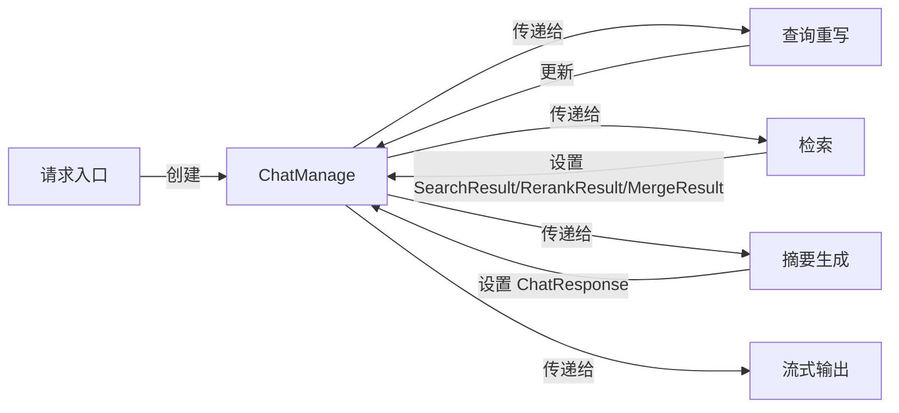
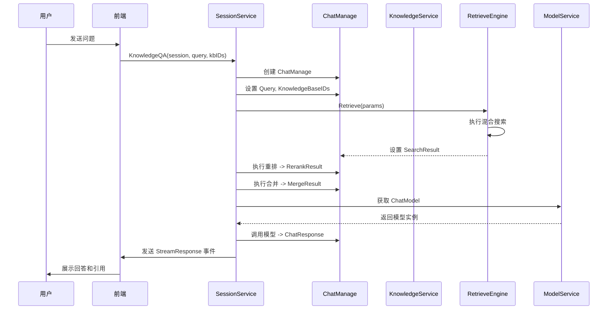

# 核心领域类型与接口 (core_domain_types_and_interfaces)

## 概述

`core_domain_types_and_interfaces` 模块是整个系统的"脊柱"——它定义了所有核心领域实体的数据结构、服务接口契约和协作协议。想象一下，如果整个系统是一个城市，这个模块就是城市的总体规划图：它规定了建筑（数据结构）的样式、道路（接口）的走向，以及不同区域（子系统）之间的交互规则。

这个模块不包含任何业务逻辑实现，而是通过**类型定义**和**接口契约**来描述系统"应该是什么样子"。这种设计使得：
- 各层之间通过接口解耦，实现可以独立演进
- 领域模型清晰可见，新人可以快速理解系统核心概念
- 测试变得简单，可以轻松 mock 依赖接口

## 架构设计

### 分层架构与依赖方向



**关键设计原则**：依赖向内指向核心领域层。所有其他模块都依赖这个模块，但这个模块不依赖任何其他业务模块——它只依赖标准库和基础工具。

### 模块内部结构



## 核心领域模型

### 1. 知识管理领域模型

知识管理是系统的核心能力之一。让我们通过一个实际场景来理解这些模型如何协作：

**场景**：用户上传一份 PDF 文档到知识库，系统将其拆分为多个 Chunk 进行索引和检索。



#### Knowledge（知识实体）

`Knowledge` 代表一个完整的知识单元——可以是一份文档、一个网页、一段手动编辑的 Markdown 内容，或者一组 FAQ 条目。

**设计意图**：
- 将不同来源（文件、URL、文本、手动编辑）的知识统一建模
- 跟踪知识的处理状态（待处理、处理中、已完成、失败）
- 维护与物理文件的关联

**关键字段**：
- `Type`：知识类型（"manual" 手动编辑、"faq" FAQ 条目）
- `ParseStatus`：解析状态（pending/processing/completed/failed）
- `FileHash`：文件哈希，用于去重和增量更新
- `Metadata`：扩展元数据，存储 FAQ 导入结果等结构化信息

**注意**：`Knowledge` 本身不存储实际内容——内容被拆分为 `Chunk` 存储。

#### Chunk（文档分块）

`Chunk` 是知识检索的基本单位。将大文档拆分为小块是为了：
1. 提高检索精度（返回最相关的段落而非整份文档）
2. 适应 LLM 的上下文窗口限制
3. 支持精细的内容定位

**设计亮点**：
- **双向链表结构**：`PreChunkID` 和 `NextChunkID` 维护分块间的顺序关系，检索时可以获取上下文
- **类型区分**：`ChunkType` 支持文本、图片 OCR、图片描述、摘要、实体、关系等多种类型
- **位标志管理**：`Flags` 字段使用位运算高效管理多个布尔状态（如推荐状态）
- **内容哈希**：`ContentHash` 用于 FAQ 条目快速匹配和去重

**特别注意**：`Chunk` 设计支持**父子关系**（`ParentChunkID`），用于将图片 OCR/描述与原始文本块关联。

#### KnowledgeBase（知识库）

`KnowledgeBase` 是知识的容器，代表一个独立的知识域。

**设计特点**：
- **配置隔离**：每个知识库可以有独立的分块策略、嵌入模型、图像处理配置
- **类型区分**：支持文档知识库和 FAQ 知识库两种类型，索引策略不同
- **临时标记**：`IsTemporary` 字段支持创建临时知识库（如 Web 搜索结果压缩用的临时库），UI 会自动隐藏

### 2. 智能体与对话领域模型

#### CustomAgent（自定义智能体）

`CustomAgent` 是系统中最灵活的实体之一——它代表一个可配置的 AI 助手，类似于 GPTs。

**设计模式**：采用"内置 + 自定义"的混合模式：
- 内置智能体（`IsBuiltin=true`）：系统提供的标准智能体（快速问答、智能推理、数据分析师等）
- 自定义智能体：用户可创建的个性化智能体

**配置分层**：
```
CustomAgent
└── CustomAgentConfig
    ├── 基础设置（AgentMode、SystemPrompt）
    ├── 模型设置（ModelID、Temperature）
    ├── 智能体模式设置（MaxIterations、AllowedTools）
    ├── 技能设置（SkillsSelectionMode）
    ├── 知识库设置（KBSelectionMode）
    └── 检索策略设置（EmbeddingTopK、Thresholds）
```

**关键设计决策**：
- **渐进式披露**：技能和工具采用白名单机制，默认关闭，需要显式启用
- **模式切换**：`AgentMode` 支持 "quick-answer"（RAG 模式）和 "smart-reasoning"（ReAct 模式）
- **条件检索**：`RetrieveKBOnlyWhenMentioned` 允许智能体仅在用户明确 @ 提及知识库时才检索

#### Agent 运行时状态

系统定义了一套完整的类型来跟踪智能体的执行过程：



**AgentState**：跟踪整个执行过程
- `CurrentRound`：当前轮次
- `RoundSteps`：所有步骤
- `IsComplete`：是否完成
- `FinalAnswer`：最终答案
- `KnowledgeRefs`：收集的知识引用

**AgentStep**：代表 ReAct 循环的一次迭代
- `Iteration`：迭代编号
- `Thought`：LLM 的思考过程
- `ToolCalls`：本次调用的工具
- `Timestamp`：时间戳

这种设计使得：
1. 可以完整重现智能体的推理过程
2. 支持用户查看"思考过程"，提高可解释性
3. 便于调试和优化智能体行为

#### Message（对话消息）

`Message` 代表对话中的一条消息，设计上考虑了丰富的场景：

**设计特点**：
- **角色分离**：`Role` 区分 user/assistant/system
- **知识引用**：`KnowledgeReferences` 存储回答使用的知识来源
- **智能体步骤**：`AgentSteps` 存储智能体的完整推理过程（仅用于展示，不送入 LLM 上下文）
- **提及项**：`MentionedItems` 存储用户 @ 提及的知识库或文件

**关键决策**：`AgentSteps` 字段标记为 `gorm:"column:agent_steps"` 但在 LLM 上下文中被排除——这是一个重要的优化，避免将推理过程重复送入上下文浪费 token。

#### Session（对话会话）

`Session` 代表一次完整的对话会话。

**设计简化**：注释掉的大量字段表明系统正在从"会话持有所有配置"向"智能体持有配置"迁移。现在的 `Session` 变得很薄，主要起一个容器作用。

### 3. 多租户与组织领域模型

系统采用**三层租户结构**：



#### Tenant（租户）

`Tenant` 是系统的顶级隔离单元——不同租户之间数据完全隔离。

**关键配置**：
- `RetrieverEngines`：租户级检索引擎配置
- `StorageQuota` / `StorageUsed`：存储配额管理
- `WebSearchConfig`：Web 搜索配置

设计上通过 `TenantID` 字段在所有实体中实现租户隔离。

#### Organization（组织）

`Organization` 是跨租户协作的单元——它允许不同租户的用户共享知识库和智能体。

**设计亮点**：
- **发现机制**：`Searchable` 字段允许组织被搜索和发现
- **审批流程**：`RequireApproval` 控制加入是否需要审批
- **邀请码**：`InviteCode` 支持通过邀请码加入
- **角色体系**：admin/editor/viewer 三级权限

#### 共享模型

系统设计了两种共享关系：

**KnowledgeBaseShare**：知识库共享
- 记录哪个知识库共享给了哪个组织
- `SourceTenantID` 支持跨租户嵌入模型访问
- `Permission` 控制权限级别

**AgentShare**：智能体共享
- 类似知识库共享，但用于智能体
- 支持"来自智能体"的知识库可见性（`SourceFromAgentInfo`）

**TenantDisabledSharedAgent**：租户级禁用共享智能体
- 允许用户隐藏不喜欢的共享智能体
- 不删除共享关系，只是在 UI 中隐藏

### 4. 检索与搜索领域模型

检索是系统的核心能力，相关类型设计非常精细：

#### 检索参数与结果

**RetrieveParams**：检索请求参数
- 支持多种过滤条件（知识库 ID、知识 ID、标签 ID、排除项）
- `KnowledgeType` 区分索引类型（faq/manual）
- `AdditionalParams` 支持扩展参数

**RetrieveResult**：检索结果
- `Results`：`IndexWithScore` 列表
- `RetrieverEngineType` / `RetrieverType`：标识来源
- `Error`：错误信息（支持部分失败）

**IndexWithScore**：带评分的索引项
- 包含完整的来源信息（ChunkID、KnowledgeID、KnowledgeBaseID）
- `MatchType`：标识匹配类型（向量/关键词/父块/关系/图等）

#### 搜索目标抽象

**SearchTarget**：统一搜索目标抽象
- 支持两种类型：搜索整个知识库，或搜索特定知识文件
- 包含 `TenantID` 支持跨租户共享知识库查询

**SearchTargets**：搜索目标列表
- 提供便捷方法：`GetAllKnowledgeBaseIDs()`、`GetKBTenantMap()`、`ContainsKB()`

这种设计使得系统可以优雅地处理：
1. 单知识库搜索
2. 多知识库联合搜索
3. 跨租户共享知识库搜索
4. 特定文件搜索

### 5. 流式响应与事件模型

系统采用**事件驱动**的流式响应设计：

#### StreamResponse（流式响应）

```go
type StreamResponse struct {
    ID             string                 // 唯一标识
    ResponseType   ResponseType           // 响应类型
    Content        string                 // 内容片段
    Done           bool                   // 是否完成
    KnowledgeReferences References      // 知识引用
    ToolCalls      []LLMToolCall          // 工具调用
    Data           map[string]interface{} // 扩展数据
}
```

**ResponseType** 定义了丰富的事件类型：
- `answer`：回答内容
- `references`：知识引用
- `thinking`：智能体思考过程
- `tool_call`：工具调用
- `tool_result`：工具结果
- `reflection`：反思
- `complete`：完成

这种设计使得前端可以：
1. 实时展示回答生成过程
2. 显示智能体的思考过程和工具调用
3. 渐进式展示知识引用
4. 提供丰富的交互反馈

#### ChatManage（对话管理上下文）

`ChatManage` 是贯穿整个对话流水线的"上下文背包"：



**设计特点**：
- **流水线状态**：存储各阶段的中间结果（`SearchResult`、`RerankResult`、`MergeResult`、`ChatResponse`）
- **配置传递**：携带所有配置参数（阈值、模型 ID、回退策略等）
- **事件总线**：集成 `EventBus` 用于发送流式事件
- **可克隆**：`Clone()` 方法支持创建深拷贝，用于并行处理

### 6. MCP（模型上下文协议）模型

系统集成了 MCP（Model Context Protocol）来扩展智能体的能力：

#### MCPService（MCP 服务）

`MCPService` 代表一个外部 MCP 服务连接配置：

**传输类型支持**：
- `sse`：Server-Sent Events
- `http-streamable`：HTTP 流式
- `stdio`：标准输入输出（本地进程）

**配置分离**：
- `AuthConfig`：认证配置（API Key、Token、自定义头）
- `AdvancedConfig`：高级配置（超时、重试）
- `StdioConfig`：标准输入输出配置（命令、参数）
- `EnvVars`：环境变量

**安全设计**：`MaskSensitiveData()` 方法在返回给前端前脱敏敏感信息。

## 核心接口契约

模块定义了大量服务接口，这些接口是系统各部分协作的"合同"。让我们分析几个最关键的：

### 1. KnowledgeService（知识服务接口）

这个接口展示了系统知识管理的完整能力集：

```go
type KnowledgeService interface {
    // 创建知识（多种来源）
    CreateKnowledgeFromFile(...) (*Knowledge, error)
    CreateKnowledgeFromURL(...) (*Knowledge, error)
    CreateKnowledgeFromPassage(...) (*Knowledge, error)
    CreateKnowledgeFromManual(...) (*Knowledge, error)
    
    // 查询知识
    GetKnowledgeByID(...) (*Knowledge, error)
    ListKnowledgeByKnowledgeBaseID(...) ([]*Knowledge, error)
    ListPagedKnowledgeByKnowledgeBaseID(...) (*PageResult, error)
    
    // 操作知识
    UpdateKnowledge(...) error
    DeleteKnowledge(...) error
    ReparseKnowledge(...) (*Knowledge, error)
    
    // FAQ 管理
    ListFAQEntries(...) (*PageResult, error)
    UpsertFAQEntries(...) (string, error)
    CreateFAQEntry(...) (*FAQEntry, error)
    SearchFAQEntries(...) ([]*FAQEntry, error)
    
    // 异步任务处理
    ProcessDocument(...) error
    ProcessFAQImport(...) error
    ProcessQuestionGeneration(...) error
    ProcessSummaryGeneration(...) error
    ProcessKBClone(...) error
    ProcessKnowledgeListDelete(...) error
    
    // 进度跟踪
    GetKBCloneProgress(...) (*KBCloneProgress, error)
    GetFAQImportProgress(...) (*FAQImportProgress, error)
}
```

**设计意图**：
- **统一入口**：所有知识操作通过一个接口，无论来源是文件、URL 还是手动编辑
- **异步优先**：重量级操作（文档解析、FAQ 导入）通过异步任务处理
- **进度跟踪**：提供进度查询接口，支持前端展示处理进度
- **FAQ 优先**：FAQ 管理作为一等公民，有专门的方法

### 2. SessionService（会话服务接口）

这个接口是对话交互的核心：

```go
type SessionService interface {
    // 会话管理
    CreateSession(...) (*Session, error)
    GetSession(...) (*Session, error)
    UpdateSession(...) error
    DeleteSession(...) error
    
    // 对话能力
    KnowledgeQA(...) error  // 知识问答
    AgentQA(...) error      // 智能体问答
    SearchKnowledge(...) ([]*SearchResult, error)  // 仅搜索不生成
    
    // 辅助功能
    GenerateTitle(...) (string, error)
    GenerateTitleAsync(...)
    ClearContext(...) error
}
```

**关键设计**：
- `KnowledgeQA` vs `AgentQA`：两种问答模式清晰分离
- `GenerateTitleAsync`：标题生成异步化，不阻塞对话开始
- `SearchKnowledge`：支持"仅搜索不生成"的使用场景

### 3. RetrieveEngine（检索引擎接口）

这是检索系统的核心抽象：

```go
type RetrieveEngine interface {
    EngineType() RetrieverEngineType  // 引擎类型
    Retrieve(...) ([]*RetrieveResult, error)  // 执行检索
    Support() []RetrieverType  // 支持的检索类型
}
```

这种设计使得系统可以：
1. 支持多种检索引擎实现（Postgres、Elasticsearch、Qdrant、Milvus 等）
2. 同一引擎可以支持多种检索类型（关键词、向量）
3. 运行时动态选择和组合引擎

### 4. ContextManager（上下文管理器接口）

这是 LLM 上下文管理的抽象：

```go
type ContextManager interface {
    AddMessage(...) error      // 添加消息
    GetContext(...) ([]chat.Message, error)  // 获取上下文（可能压缩）
    ClearContext(...) error     // 清除上下文
    GetContextStats(...) (*ContextStats, error)  // 获取统计
    SetSystemPrompt(...) error  // 设置系统提示词
}
```

**设计亮点**：
- `GetContextStats()` 提供透明度，可以看到是否压缩、压缩了多少
- 上下文管理与消息存储分离——`ContextManager` 不负责持久化，只负责 LLM 上下文窗口管理

## 关键设计决策与权衡

### 1. 接口与实现分离：依赖倒置原则

**决策**：所有服务契约定义为接口，实现放在其他模块。

**为什么这样设计**：
- **可测试性**：可以轻松 mock 接口进行单元测试
- **可替换性**：可以切换实现而不影响调用方
- **演进灵活性**：实现可以独立演进，只要保持接口兼容

**权衡**：
- 增加了一定的间接层和代码量
- 需要更多的 upfront design 工作
- IDE 自动完成需要更多跳转

### 2. 领域实体同时作为数据库模型：GORM 注解嵌入

**决策**：在领域实体结构体中直接嵌入 GORM 注解（`gorm:"..."`）。

**替代方案**：
- 纯领域实体 + 独立的数据库模型 + 转换器
- 使用整洁架构/洋葱架构，分离领域层和基础设施层

**为什么这样设计**：
- **简单性**：减少样板代码，不需要写实体间的转换
- **直观性**：看一个结构体就知道它的数据库映射
- **性能**：零转换开销

**权衡**：
- 领域层与基础设施层（GORM）耦合
- 如果更换 ORM 或数据库，需要修改领域实体
- 某些数据库特定概念会"污染"领域模型

### 3. JSON 字段用于扩展性：Metadata 模式

**决策**：在多个实体中使用 `Metadata JSON` 字段来存储扩展数据。

**例子**：
- `Knowledge.Metadata`：存储手动编辑内容、FAQ 导入元数据
- `Chunk.Metadata`：存储 FAQ 条目元数据、生成的问题
- `Message.AgentSteps`：存储智能体推理步骤

**为什么这样设计**：
- **灵活性**：可以添加新字段而不修改数据库 schema
- **渐进式迁移**：新旧数据可以共存
- **复杂结构**：可以存储嵌套结构、数组等

**权衡**：
- 数据库查询能力受限（难以索引 JSON 内部字段）
- 失去类型安全（需要手动序列化/反序列化）
- 数据一致性检查需要在应用层完成

**缓解措施**：
- 提供辅助方法（如 `FAQMetadata()`、`SetFAQMetadata()`）封装序列化逻辑
- 关键数据还是用独立字段
- 使用数据库的 JSON 索引功能（如 PostgreSQL 的 GIN 索引）

### 4. 软删除而非硬删除：DeletedAt 模式

**决策**：所有实体都包含 `gorm.DeletedAt` 字段，使用软删除。

**为什么这样设计**：
- **可恢复性**：误删除可以恢复
- **审计追踪**：保留历史记录
- **依赖完整性**：其他表可能引用了这条记录

**权衡**：
- 查询需要过滤软删除记录（容易忘记）
- 数据库会积累"垃圾"数据
- 唯一索引需要考虑软删除（可以用 `(id, deleted_at)` 复合索引）

### 5. 位标志管理多个布尔状态：ChunkFlags 模式

**决策**：使用位运算在单个整数字段中管理多个布尔状态。

**例子**：
```go
type ChunkFlags int
const ChunkFlagRecommended ChunkFlags = 1 << 0  // 第0位

// 检查标志
func (f ChunkFlags) HasFlag(flag ChunkFlags) bool {
    return f&flag != 0
}
```

**为什么这样设计**：
- **存储效率**：一个整数可以存 32/64 个布尔值
- **原子操作**：可以在单个数据库操作中更新多个标志
- **扩展性**：添加新标志不需要修改数据库 schema

**权衡**：
- 可读性稍差（需要查看常量定义）
- 数据库查询需要使用位运算（不是所有数据库都支持）
- 不能为单个标志设置索引

### 6. 渐进式披露：技能和工具默认关闭

**决策**：新功能（技能、MCP 工具等）默认关闭，需要显式启用。

**例子**：
- `SkillsEnabled` 默认 false
- `MCPSelectionMode` 需要明确选择
- `AllowedTools` 白名单机制

**为什么这样设计**：
- **安全性**：新功能默认不可用，降低风险
- **用户体验**：避免界面过于复杂，用户按需启用
- **演进安全**：可以逐步推出新功能，观察效果

**权衡**：
- 新用户可能不知道有这些功能
- 配置变得复杂，有很多开关
- 需要良好的引导和文档

## 数据流转分析

让我们通过一个典型的 RAG 问答场景，追踪数据如何在这些类型中流动：

### RAG 问答流程



**关键数据结构在流程中的变化**：

1. **输入阶段**：
   - `Session`：当前会话
   - `SearchTargets`：预处理的搜索目标
   - `ChatManage`：创建并初始化

2. **检索阶段**：
   - `RetrieveParams`：构检检索参数
   - `RetrieveResult`：检索结果
   - `ChatManage.SearchResult`：存储原始检索结果
   - `ChatManage.RerankResult`：重排后结果
   - `ChatManage.MergeResult`：最终合并结果

3. **生成阶段**：
   - `ChatManage.ChatResponse`：模型响应
   - `StreamResponse`：流式事件（多个）
   - `Message`：持久化的消息

## 常见陷阱与注意事项

### 1. 忘记过滤软删除记录

**问题**：查询时忘记添加 `WHERE deleted_at IS NULL`。

**缓解**：
- 使用 GORM 的 Scope 自动添加
- Repository 层统一处理过滤

### 2. JSON 字段的 nil vs 空对象

**问题**：`Metadata` 字段可能是 `nil` 也可能是空 JSON 对象 `{}`，处理不一致。

**建议**：
- 统一在创建时初始化为空对象 `{}`
- 提供辅助方法处理 nil 情况

### 3. 租户隔离的一致性

**问题**：某些查询忘记添加 `tenant_id` 过滤，导致跨租户数据泄露。

**缓解**：
- Repository 层要求必须传入 `tenantID`
- 使用 Context 携带租户信息
- 集成测试验证租户隔离

### 4. ContextManager 与 Message 存储的分离

**问题**：混淆了"LLM 上下文"和"历史消息"——它们是相关但不同的东西。

**注意**：
- `ContextManager` 负责 LLM 上下文窗口（可能压缩）
- `MessageService` 负责完整历史存储（永不压缩）
- 两者可以有不同的实现

### 5. 异步任务的幂等性

**问题**：文档解析、FAQ 导入等异步任务可能重试，需要确保幂等。

**关键类型**：
- `DocumentProcessPayload`：包含 `RequestId` 用于去重
- `FAQImportProgress`：跟踪进度，支持断点续传

**建议**：
- 任务设计为幂等
- 使用唯一键防止重复处理
- 跟踪处理状态

## 总结

`core_domain_types_and_interfaces` 模块是系统的"定海神针"——它通过清晰的领域建模和接口契约，为整个系统提供了稳固的基础。

**关键价值**：
1. **统一语言**：所有团队成员使用相同的领域概念
2. **依赖倒置**：高层策略不依赖低层实现，都依赖抽象
3. **演进安全**：可以修改实现而不影响契约
4. **可测试性**：接口设计使得单元测试变得简单

这个模块的设计展现了深刻的领域洞察——它不仅仅是定义数据结构，更是在编码对业务领域的理解。
