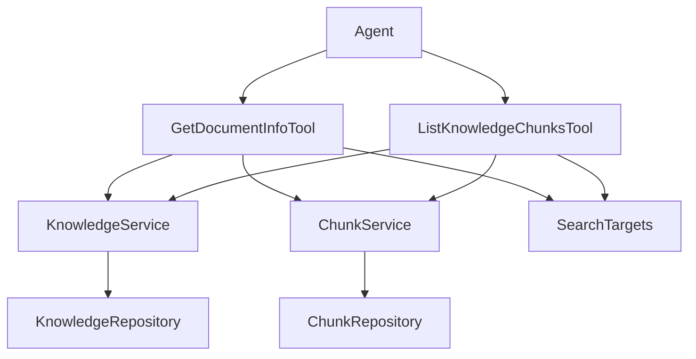

# 文档库与分块浏览模块 (corpus_document_and_chunk_browsing)

## 1. 问题解决

在智能助手系统中，当代理需要与文档库交互时，会遇到两个关键问题：
1. **文档元数据缺失**：搜索结果通常只包含文档ID和片段内容，但代理可能需要了解文档的完整元数据（标题、类型、大小、处理状态等）来判断文档的相关性和可用性。
2. **分块内容不完整**：语义搜索或关键词搜索可能只返回文档的部分分块，但代理有时需要查看文档的完整分块列表或特定分块的上下文信息。

这个模块就是为了解决这些问题而设计的，它为代理提供了两个核心工具：
- 文档元数据查询工具
- 文档分块列表浏览工具

## 2. 心理模型

可以将这个模块想象成**文档库的"目录查询系统"**：
- **GetDocumentInfoTool** 就像图书馆的图书信息查询台，你告诉它图书编号（knowledge_id），它会告诉你这本书的标题、作者、页数、是否在馆等基本信息。
- **ListKnowledgeChunksTool** 就像图书的目录页，它展示了这本书被分成了多少章节（分块），以及每个章节的具体内容。

这两个工具配合使用，代理可以像读者一样，先通过查询台了解图书概况，再通过目录页深入阅读具体章节。

## 3. 架构概览

### 核心组件说明

1. **GetDocumentInfoTool**：文档元数据查询工具
   - 输入：文档ID列表（knowledge_ids）
   - 输出：文档的完整元数据，包括标题、描述、文件信息、处理状态、分块数量等
   - 特点：支持并发查询，提高批量获取文档信息的效率

2. **ListKnowledgeChunksTool**：文档分块浏览工具
   - 输入：文档ID（knowledge_id）、分页参数（limit、offset）
   - 输出：文档的分块列表，包含每个分块的完整内容
   - 特点：支持分页浏览，可查看文档的完整分块内容

3. **KnowledgeService**：知识文档服务接口
   - 提供文档元数据的查询能力
   - 支持跨租户共享知识库的文档访问

4. **ChunkService**：分块服务接口
   - 提供文档分块的查询能力
   - 支持按文档ID分页获取分块列表

5. **SearchTargets**：搜索目标集合
   - 预计算的知识库-租户映射
   - 用于权限验证，确保代理只能访问授权的知识库

## 4. 数据流分析

### 4.1 GetDocumentInfoTool 数据流

1. **输入解析**：解析传入的 knowledge_ids 数组
2. **参数验证**：确保 knowledge_ids 非空且不超过10个
3. **并发查询**：
   - 为每个 knowledge_id 启动一个 goroutine
   - 通过 KnowledgeService 获取文档元数据
   - 通过 ChunkService 获取文档的分块数量
   - 使用 SearchTargets 验证知识库访问权限
4. **结果聚合**：收集所有查询结果，区分成功和失败的文档
5. **输出格式化**：将结果格式化为人类可读的文本和结构化数据

### 4.2 ListKnowledgeChunksTool 数据流

1. **输入解析**：解析 knowledge_id、limit、offset 参数
2. **文档查询**：通过 KnowledgeService 获取文档基本信息
3. **权限验证**：使用 SearchTargets 验证知识库访问权限
4. **分块查询**：通过 ChunkService 分页获取文档分块
5. **结果处理**：
   - 构建人类可读的输出文本
   - 处理分块中的图片信息
   - 格式化结构化数据
6. **结果返回**：返回包含分块内容的完整结果

## 5. 设计决策

### 5.1 并发查询设计

**决策**：GetDocumentInfoTool 使用 goroutine 并发查询多个文档信息

**原因**：
- 文档查询涉及多个服务调用（KnowledgeService 和 ChunkService）
- 批量查询时，串行处理会导致响应时间过长
- 并发处理可以显著提高批量查询的效率

**权衡**：
- ✅ 优点：提高了批量查询的性能
- ⚠️ 缺点：增加了代码复杂度，需要使用互斥锁保护共享数据

### 5.2 权限验证机制

**决策**：使用 SearchTargets 进行知识库权限验证，而不是在服务层过滤

**原因**：
- 支持跨租户共享知识库的访问
- 将权限验证逻辑集中在工具层，保持服务层的通用性
- 预计算的 SearchTargets 可以提高权限验证的效率

**权衡**：
- ✅ 优点：支持灵活的共享知识库访问模式
- ⚠️ 缺点：工具层需要依赖 SearchTargets，增加了耦合

### 5.3 分页设计

**决策**：ListKnowledgeChunksTool 使用 limit 和 offset 进行分页，而不是基于游标的分页

**原因**：
- 实现简单，与现有的 ChunkService 接口兼容
- 满足大多数使用场景的需求
- 代理可以通过多次调用来获取完整的分块列表

**权衡**：
- ✅ 优点：实现简单，易于使用
- ⚠️ 缺点：在大数据量场景下，offset 较大时性能可能下降

### 5.4 双重输出格式

**决策**：工具同时返回人类可读的文本输出和结构化数据

**原因**：
- 文本输出方便代理直接理解和使用
- 结构化数据方便前端展示和进一步处理
- 满足不同使用场景的需求

**权衡**：
- ✅ 优点：灵活性高，适应多种使用场景
- ⚠️ 缺点：需要维护两种输出格式，增加了代码复杂度

## 6. 子模块概览

### 6.1 文档元数据查询工具 (document_metadata_retrieval_tool)

该子模块提供了查询文档元数据的能力，包括文档的基本信息、文件信息、处理状态等。它支持并发查询多个文档，提高了批量获取信息的效率。

详细文档请参考：[document_metadata_retrieval_tool](agent_runtime_and_tools-knowledge_access_and_corpus_navigation_tools-corpus_document_and_chunk_browsing-document_metadata_retrieval_tool.md)

### 6.2 知识分块列表工具 (knowledge_chunk_listing_tool)

该子模块提供了浏览文档分块的能力，支持分页获取文档的完整分块内容。它可以与语义搜索或关键词搜索配合使用，帮助代理深入了解文档的具体内容。

详细文档请参考：[knowledge_chunk_listing_tool](agent_runtime_and_tools-knowledge_access_and_corpus_navigation_tools-corpus_document_and_chunk_browsing-knowledge_chunk_listing_tool.md)

### 6.3 文档浏览请求契约 (corpus_browsing_request_contracts)

该子模块定义了文档浏览工具的请求和响应契约，包括文档元数据查询请求契约和知识分块列表请求契约。

详细文档请参考：[corpus_browsing_request_contracts](agent_runtime_and_tools-knowledge_access_and_corpus_navigation_tools-corpus_document_and_chunk_browsing-corpus_browsing_request_contracts.md)

## 7. 跨模块依赖

### 7.1 依赖模块

1. **知识核心模型 (knowledge_core_model)**
   - 提供了 Knowledge 和 Chunk 等核心数据模型
   - 定义了文档和分块的基本结构

2. **知识请求与响应 (knowledge_requests_and_responses)**
   - 提供了知识服务的请求和响应契约
   - 定义了与知识服务交互的接口

3. **分块管理 API (chunk_management_api)**
   - 提供了分块服务的接口
   - 定义了与分块服务交互的契约

### 7.2 被依赖模块

该模块主要被 **agent_core_orchestration_and_tooling_foundation** 模块使用，作为代理工具集的一部分，为代理提供文档库浏览能力。

## 8. 使用指南

### 8.1 GetDocumentInfoTool 使用场景

**适用场景**：
- 需要了解文档的基本信息（标题、类型、大小等）
- 检查文档是否存在且可用
- 批量查询多个文档的元数据
- 了解文档的处理状态

**不适用场景**：
- 需要文档内容（应使用 knowledge_search）
- 需要特定文本分块（搜索结果已包含完整内容）

### 8.2 ListKnowledgeChunksTool 使用场景

**适用场景**：
- 需要已知文档的完整分块内容
- 想要查看特定分块周围的上下文
- 检查文档有多少个分块

**使用流程**：
1. 使用 grep_chunks 或 knowledge_search 获取 knowledge_id
2. 使用 list_knowledge_chunks 读取完整内容

## 9. 注意事项

### 9.1 权限验证

- 两个工具都依赖 SearchTargets 进行权限验证
- 确保在创建工具实例时传入正确的 SearchTargets
- 如果文档所属的知识库不在 SearchTargets 中，访问将被拒绝

### 9.2 跨租户支持

- 工具使用 GetKnowledgeByIDOnly 方法获取文档信息，该方法不进行租户过滤
- 然后使用文档的实际 tenant_id 进行分块查询
- 这种设计支持跨租户共享知识库的访问

### 9.3 并发限制

- GetDocumentInfoTool 最多支持并发查询 10 个文档
- 超过 10 个文档将返回错误
- 如果需要查询更多文档，建议分批处理

### 9.4 分页参数

- ListKnowledgeChunksTool 的 limit 参数最大为 100
- offset 参数从 0 开始
- 如果文档分块较多，需要多次调用以获取完整内容

## 10. 扩展点

### 10.1 工具扩展

可以通过实现 BaseTool 接口来添加新的文档浏览工具，例如：
- 文档分块对比工具
- 文档结构浏览工具
- 文档版本历史工具

### 10.2 输出格式扩展

目前工具支持文本输出和结构化数据输出，可以根据需要添加新的输出格式，例如：
- Markdown 格式
- JSON 格式（更详细的版本）
- XML 格式
