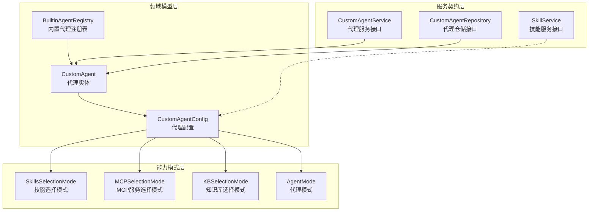

# 自定义代理与技能能力契约模块

## 模块概述

想象你正在构建一个智能助手平台，用户需要能够像配置 GPTs 一样创建自己的定制化 AI 代理——有些需要快速回答知识库问题，有些需要多步推理，有些还要能处理特定文件类型。这个模块就是解决这个问题的核心契约层：它定义了"什么是一个自定义代理"、"代理可以有哪些能力"、"技能如何与代理协作"这些最基本的概念。

这个模块不负责实际运行代理，也不负责存储数据——它是整个系统的"语言"，让所有组件能够用统一的方式谈论"代理"和"技能"。从数据库存储到 API 接口，从代理运行时到前端配置，都依赖这些契约来保持一致性。

## 核心架构



这个模块采用了清晰的分层设计：

1. **领域模型层**：定义核心数据结构 `CustomAgent` 和 `CustomAgentConfig`，以及内置代理的注册机制。这是整个模块的" nouns"。

2. **服务契约层**：通过 `CustomAgentService`、`CustomAgentRepository` 和 `SkillService` 接口定义了对代理和技能的操作。这是模块的" verbs"。

3. **能力模式层**：定义了代理各种能力的选择模式（全部、选中、无），让配置既灵活又可预测。

数据流向通常是：外部请求 → `CustomAgentService` 接口 → 实现层 → `CustomAgentRepository` 接口 → 数据库。而 `CustomAgentConfig` 则作为配置载体贯穿始终，控制着代理的行为。

## 核心组件解析

### CustomAgent：代理实体

`CustomAgent` 是整个模块的核心实体，它代表一个可配置的 AI 代理。设计上有几个关键决策：

**复合主键设计**：使用 `ID` + `TenantID` 作为复合主键，这是多租户系统的典型做法。内置代理使用固定 ID（如 `builtin-quick-answer`），自定义代理使用 UUID，既保证了内置代理的可识别性，又给了自定义代理足够的灵活性。

**配置与实体分离**：将所有配置项集中在 `CustomAgentConfig` 中，并以 JSON 形式存储在数据库。这种设计的好处是：
- 配置可以灵活扩展而无需修改数据库 schema
- 配置可以整体序列化/反序列化，便于 API 传输
- 实体本身保持简洁，只包含元数据

### CustomAgentConfig：配置的艺术

`CustomAgentConfig` 是这个模块最复杂也最能体现设计意图的部分。它采用了**分组配置**的思路，将近 40 个配置项组织成 8 个清晰的类别：

1. **基础设置**：代理模式、系统提示词、上下文模板
2. **模型设置**：使用的模型、重排模型、温度等
3. **代理模式设置**：最大迭代次数、允许的工具、反射开关等
4. **技能设置**：技能选择模式、选中的技能
5. **知识库设置**：知识库选择模式、是否仅在提及 @ 时检索
6. **文件类型限制**：支持的文件类型（如数据分析师只处理 CSV/Excel）
7. **FAQ 策略**：FAQ 优先策略、直接回答阈值等
8. **Web 搜索设置**：是否启用、最大结果数
9. **多轮对话设置**：是否启用、历史轮数
10. **检索策略**：向量检索 Top K、重排阈值等
11. **高级设置**：查询扩展、重写、回退策略等

这种设计体现了**渐进式复杂度**的理念：
- 简单场景（如快速问答）只需要配置基础设置
- 复杂场景（如智能推理）可以深入配置代理模式设置
- 专家场景可以调整检索策略和高级设置

**选择模式的统一设计**：知识库、MCP 服务、技能都采用了相同的三种选择模式：
- `"all"`：使用全部
- `"selected"`：使用指定的
- `"none"`：不使用

这种一致性让用户学习成本更低，也让代码实现更统一。

### 内置代理注册表

系统预置了 6 个内置代理（目前实现了 3 个），通过 `BuiltinAgentRegistry` 统一管理。这种设计有几个优势：

1. **开箱即用**：新租户自动拥有这些代理，无需手动创建
2. **可扩展性**：添加新的内置代理只需在注册表中注册，无需修改核心逻辑
3. **固定顺序**：通过 `builtinAgentIDsOrdered` 保证了内置代理在 UI 中的显示顺序固定

内置代理不是存储在数据库中的，而是在运行时动态生成的，这意味着它们的配置可以随着系统版本升级而自动更新。

### 服务接口：分离关注点

`CustomAgentService` 和 `CustomAgentRepository` 的分离体现了**领域驱动设计**的思想：

- `CustomAgentService` 是**应用服务层**接口，处理业务逻辑（如权限检查、内置代理解析、复制代理等）
- `CustomAgentRepository` 是**基础设施层**接口，只负责数据持久化

这种分离让业务逻辑和数据访问解耦，便于测试和替换实现。例如，我们可以轻松地为 `CustomAgentRepository` 提供一个内存实现用于单元测试，而不影响业务逻辑。

## 关键设计决策

### 1. 配置作为 JSON 存储 vs 关系型字段

**选择**：将 `CustomAgentConfig` 作为 JSON 字段存储在数据库中。

**权衡分析**：
- ✅ **灵活性**：可以轻松添加新的配置项而无需数据库迁移
- ✅ **简洁性**：整个配置可以一次性读取和写入，避免复杂的关系映射
- ❌ **查询能力**：无法直接在数据库层面查询特定配置项（如"找出所有温度 > 0.8 的代理"）
- ❌ **类型安全**：数据库层面无法验证配置结构的正确性

**为什么这个选择是合理的**：
对于配置项，我们很少需要基于单个配置项进行查询，更多的是整体读取和写入。而配置的频繁变更（特别是在产品迭代早期）使得灵活性成为更重要的考虑因素。类型安全则通过 Go 的结构体和 `EnsureDefaults()` 方法在应用层保证。

### 2. 内置代理的动态生成 vs 数据库存储

**选择**：内置代理不在数据库中存储，而是在运行时通过工厂函数动态生成。

**权衡分析**：
- ✅ **自动更新**：系统升级时，内置代理的配置自动更新，无需数据迁移
- ✅ **数据一致性**：不会出现内置代理被意外修改或删除的情况
- ❌ **个性化**：用户无法自定义内置代理的配置（但可以复制后修改）
- ❌ **查询复杂度**：列表代理时需要合并数据库中的自定义代理和动态生成的内置代理

**为什么这个选择是合理的**：
内置代理代表了系统的"最佳实践"，我们希望它们随着系统演进而改进。如果用户需要定制，复制机制提供了完美的折衷方案。

### 3. 复合主键 vs 单主键 + 唯一索引

**选择**：使用 `(ID, TenantID)` 作为复合主键。

**权衡分析**：
- ✅ **查询效率**：按租户查询代理时可以直接利用主键索引
- ✅ **数据隔离**：从数据库层面保证租户间的数据隔离
- ❌ **复杂度**：所有需要通过 ID 访问代理的地方都需要同时提供 TenantID
- ❌ **ID 重复**：不同租户可以有相同 ID 的代理（这实际上是特性而非 bug）

**为什么这个选择是合理的**：
在多租户系统中，数据隔离是首要考虑。复合主键的设计在数据库层面强制了这一点，避免了"忘记在查询中添加租户条件"这种常见错误。

### 4. 接口契约 vs 具体实现

**选择**：只定义接口契约，不提供具体实现。

**权衡分析**：
- ✅ **关注点分离**：这个模块只定义"是什么"和"可以做什么"，不关心"怎么做"
- ✅ **灵活性**：不同的实现可以共存（如数据库仓储 vs 内存仓储）
- ✅ **可测试性**：可以轻松 mock 接口进行单元测试
- ❌ **代码分散**：实现代码分布在其他模块，理解完整流程需要跨越模块边界

**为什么这个选择是合理的**：
这个模块的定位是"契约层"，它的作用是建立共识，而不是实现逻辑。具体实现分别在 `data_access_repositories`（仓储实现）和 `application_services_and_orchestration`（服务实现）中。

## 与其他模块的关系

这个模块是整个系统的**核心契约层**，被众多其他模块依赖：

### 依赖本模块的模块

1. **[agent_configuration_and_external_service_repositories](data_access_repositories-agent_configuration_and_external_service_repositories.md)**：实现 `CustomAgentRepository` 接口，负责代理数据的数据库持久化
2. **[agent_identity_tenant_and_configuration_services](application_services_and_orchestration-agent_identity_tenant_and_configuration_services.md)**：实现 `CustomAgentService` 接口，处理代理的业务逻辑
3. **[agent_tenant_organization_and_model_management_handlers](http_handlers_and_routing-agent_tenant_organization_and_model_management_handlers.md)**：使用 `CustomAgentService` 提供 HTTP API
4. **[agent_runtime_and_tools](agent_runtime_and_tools.md)**：使用 `CustomAgent` 和 `CustomAgentConfig` 来配置和运行代理

### 本模块依赖的模块

1. **[agent_skills_lifecycle_and_skill_tools](agent_runtime_and_tools-agent_skills_lifecycle_and_skill_tools.md)**：`SkillService` 接口依赖 `skills.SkillMetadata` 和 `skills.Skill` 类型
2. **core_domain_types_and_interfaces 下的其他模块**：共享相同的基础类型和模式

## 使用指南与注意事项

### 创建自定义代理的正确姿势

```go
agent := &types.CustomAgent{
    Name:        "我的专属代理",
    Description: "一个定制化的 AI 代理",
    Avatar:      "🤖",
    TenantID:    tenantID,
    CreatedBy:   userID,
    Config: types.CustomAgentConfig{
        AgentMode:     types.AgentModeQuickAnswer,
        ModelID:       "qwen-max",
        Temperature:   0.7,
        KBSelectionMode: "all",
    },
}

// 重要：必须调用 EnsureDefaults 设置默认值
agent.EnsureDefaults()

// 然后通过服务创建
createdAgent, err := customAgentService.CreateAgent(ctx, agent)
```

**注意**：始终在创建或更新代理后调用 `EnsureDefaults()`，这可以确保所有配置项都有合理的默认值，避免因配置缺失导致的运行时错误。

### 内置代理的使用

内置代理不需要创建，可以直接通过 ID 获取：

```go
// 获取快速问答代理
agent := types.GetBuiltinQuickAnswerAgent(tenantID)

// 或者通过注册表获取
agent, _ := types.GetBuiltinAgent(types.BuiltinQuickAnswerID, tenantID)
```

**注意**：不要尝试修改或删除内置代理——服务层会阻止这些操作。如果需要自定义内置代理的行为，应该先复制它，然后修改副本。

### 配置的常见陷阱

1. **文件类型限制**：`SupportedFileTypes` 中指定的文件类型会被后端自动处理别名（如 "xlsx" 会自动包含 "xls"），所以只需指定标准扩展名。

2. **代理模式与多轮对话**：智能推理模式（`AgentModeSmartReasoning`）会强制启用多轮对话，即使你在配置中关闭了它。这是因为 ReAct 框架本质上需要多轮交互。

3. **知识库检索时机**：`RetrieveKBOnlyWhenMentioned` 设置为 `true` 时，只有用户在消息中使用 `@` 提及知识库或文件时才会进行检索。这对于避免无关检索很有用，但要确保用户知道需要使用 `@`。

4. **FAQ 策略**：`FAQDirectAnswerThreshold` 设置得太高可能导致 FAQ 永远不会被直接使用，设置得太低可能导致误判。建议从 0.9 开始调整。

### 扩展内置代理

要添加新的内置代理，只需：

1. 定义新的内置代理 ID 常量
2. 创建工厂函数（类似 `GetBuiltinQuickAnswerAgent`）
3. 在 `BuiltinAgentRegistry` 中注册
4. 在 `builtinAgentIDsOrdered` 中添加（如果需要显示）

```go
const BuiltinMyNewAgentID = "builtin-my-new-agent"

func GetBuiltinMyNewAgent(tenantID uint64) *CustomAgent {
    return &CustomAgent{
        ID:        BuiltinMyNewAgentID,
        Name:      "我的新代理",
        IsBuiltin: true,
        TenantID:  tenantID,
        Config: CustomAgentConfig{
            // 配置...
        },
    }
}

// 在 init 函数或包级别变量中注册
var BuiltinAgentRegistry = map[string]func(uint64) *CustomAgent{
    // ... 现有代理
    BuiltinMyNewAgentID: GetBuiltinMyNewAgent,
}
```

## 子模块

本模块包含以下子模块，提供更详细的组件文档：

- [custom_agent_domain_models](custom_agent_and_skill_capability_contracts-custom_agent_domain_models.md)：自定义代理领域模型
- [custom_agent_service_and_persistence_interfaces](custom_agent_and_skill_capability_contracts-custom_agent_service_and_persistence_interfaces.md)：自定义代理服务和持久化接口
- [skill_capability_service_interface](custom_agent_and_skill_capability_contracts-skill_capability_service_interface.md)：技能能力服务接口

## 总结

`custom_agent_and_skill_capability_contracts` 模块是整个系统的"通用语言"，它通过精心设计的数据结构和接口契约，定义了"什么是代理"、"代理可以做什么"以及"如何与代理交互"。

这个模块的设计体现了几个核心原则：
- **渐进式复杂度**：简单场景简单配置，复杂场景深度配置
- **配置即数据**：将配置作为 JSON 存储，换取极大的灵活性
- **契约优先**：定义接口而不实现，让关注点分离
- **内置扩展**：通过注册表模式让内置代理可扩展

对于新加入团队的开发者，理解这个模块是理解整个代理系统的第一步——它不会告诉你"如何运行代理"，但会告诉你"代理是什么"以及"它能做什么"。
