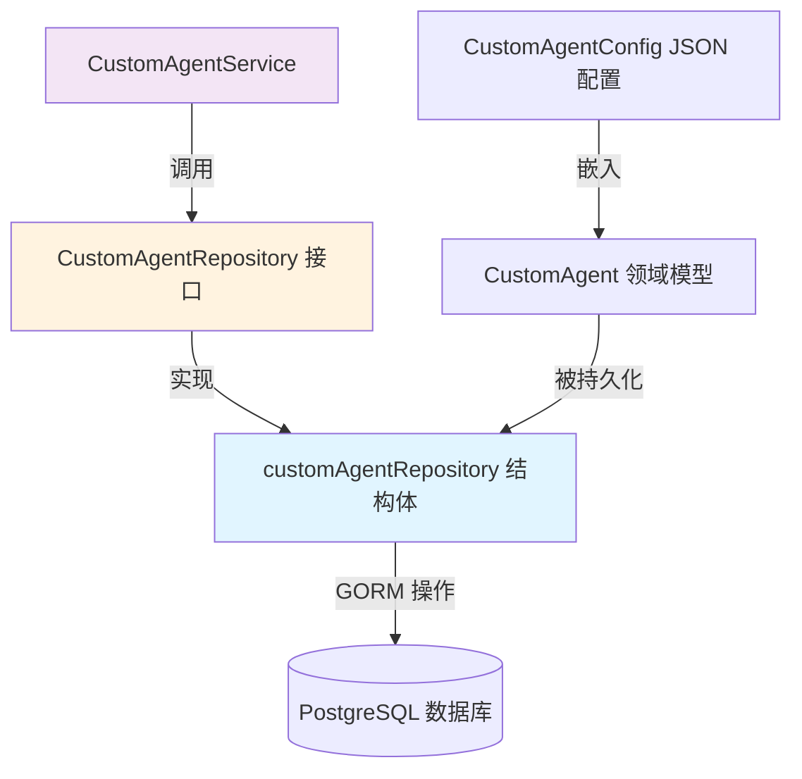

# Custom Agent Configuration Repository

## 概述：为什么需要这个模块

想象你正在运营一个多租户的 AI 助手平台，每个企业客户（tenant）都希望拥有自己专属的 AI 代理 —— 有的需要快速回答的 RAG 模式，有的需要能调用工具、进行多步推理的 ReAct 模式。这些代理的配置信息（系统提示词、模型选择、工具权限、知识库绑定等）需要被持久化存储，并且在查询时必须严格隔离：A 公司绝不能看到 B 公司的代理配置。

`custom_agent_configuration_repository` 模块正是解决这个问题的数据持久化层。它采用 **Repository 模式**，将自定义代理配置的 CRUD 操作封装在一个统一的接口背后，对外隐藏了底层使用 GORM 操作数据库的实现细节。

这个模块存在的核心原因是：
1. **多租户隔离**：每个查询都必须携带 `tenantID`，确保数据隔离
2. **复合主键设计**：代理的 `ID` 不是全局唯一的，而是 `(ID, TenantID)` 的组合，这要求所有查询都必须同时指定这两个字段
3. **软删除支持**：代理删除后需要保留历史记录，通过 `DeletedAt` 字段实现
4. **内置代理区分**：系统内置的代理（如 `builtin-quick-answer`）与用户自定义代理存储在同一张表中，通过 `IsBuiltin` 字段区分

如果你尝试用 naive 的方案（比如直接用 GORM 在 service 层操作数据库），很快就会遇到代码重复、租户隔离逻辑分散、测试困难等问题。这个模块通过 Repository 模式将这些关注点集中管理，使得上层服务可以专注于业务逻辑而非数据访问细节。

## 架构与数据流



**架构角色说明**：

这个模块在整体架构中扮演 **数据访问网关（Data Access Gateway）** 的角色：

1. **上游调用者**：[`CustomAgentService`](custom_agent_profile_and_behavior_configuration_service.md) 是唯一的直接调用方。Service 层负责业务逻辑（如权限校验、配置验证、内置代理的特殊处理），而 Repository 层只负责数据的持久化。

2. **下游依赖**：模块直接依赖 GORM ORM 框架操作 PostgreSQL 数据库。所有 SQL 操作都通过 GORM 的方法链完成，没有手写 SQL。

3. **数据契约**：输入输出都是 [`CustomAgent`](#customagent-领域模型) 结构体指针，这是一个包含完整代理配置信息的领域模型。

**数据流追踪**（以获取代理为例）：

```
用户请求 → HTTP Handler → CustomAgentService.GetAgentByID() 
    → 从上下文提取 tenantID → customAgentRepository.GetAgentByID(ctx, id, tenantID)
    → GORM 执行 SELECT WHERE id=? AND tenant_id=? → 返回 *CustomAgent
    → Service 层进行权限校验 → 返回给 Handler
```

注意 `tenantID` 的传递路径：它不是由调用方显式传入 Service 方法，而是从 `context` 中提取的。这是为了保证调用方无法绕过租户隔离。但 Repository 层要求显式传入 `tenantID`，这是一种防御性设计 —— 即使 Service 层忘记提取租户信息，Repository 层的接口签名也会强制要求提供。

## 组件深度解析

### `customAgentRepository` 结构体

**设计意图**：
这是 Repository 接口的唯一实现，采用 **结构体 + 构造函数** 的经典 Go 模式。结构体只持有一个 `*gorm.DB` 依赖，体现了单一职责原则 —— 它只关心数据持久化，不关心业务逻辑。

```go
type customAgentRepository struct {
    db *gorm.DB
}
```

**为什么是私有结构体？**
结构体名以小写开头（`customAgentRepository` 而非 `CustomAgentRepository`），这意味着它只能在 `repository` 包内部访问。外部代码只能通过 `NewCustomAgentRepository()` 构造函数获取接口类型 `interfaces.CustomAgentRepository`。这种设计有两个好处：
1. **隐藏实现细节**：调用方不需要知道底层用 GORM，未来可以切换到其他存储引擎而不影响上层
2. **强制通过接口交互**：依赖注入时注入的是接口，便于测试时替换为 mock 实现

**构造函数**：
```go
func NewCustomAgentRepository(db *gorm.DB) interfaces.CustomAgentRepository
```
构造函数接收 `*gorm.DB` 并返回接口类型。注意返回类型是接口而非具体结构体，这符合 **依赖倒置原则** —— 高层模块（Service）应该依赖抽象（接口），而非具体实现。

---

### `CreateAgent(ctx, agent)` 方法

**目的**：将新的自定义代理持久化到数据库。

**内部机制**：
```go
func (r *customAgentRepository) CreateAgent(ctx context.Context, agent *types.CustomAgent) error {
    return r.db.WithContext(ctx).Create(agent).Error
}
```

方法非常简单，直接调用 GORM 的 `Create()`。但有几个关键点需要注意：

1. **Context 传递**：`WithContext(ctx)` 确保数据库操作可以继承请求的超时、取消信号和追踪信息。如果请求被取消，数据库操作也会立即终止，避免资源泄漏。

2. **主键生成策略**：`CustomAgent.ID` 字段在创建前必须由调用方生成（通常是 UUID）。GORM 不会自动生成这个字段，因为它是复合主键的一部分。这意味着 Service 层在调用 `CreateAgent` 之前必须确保 `agent.ID` 已被赋值。

3. **错误处理**：方法直接返回 GORM 的 `Error`，可能的错误包括：
   - 唯一约束冲突（如果 ID 已存在）
   - 数据库连接失败
   - 字段验证失败（如 `Name` 为空）

**副作用**：
- `agent.CreatedAt` 和 `agent.UpdatedAt` 会被 GORM 自动填充
- `agent.DeletedAt` 会被初始化为零值（表示未删除）

---

### `GetAgentByID(ctx, id, tenantID)` 方法

**目的**：根据代理 ID 和租户 ID 查询单个代理记录。

**内部机制**：
```go
func (r *customAgentRepository) GetAgentByID(ctx context.Context, id string, tenantID uint64) (*types.CustomAgent, error) {
    var agent types.CustomAgent
    if err := r.db.WithContext(ctx).Where("id = ? AND tenant_id = ?", id, tenantID).First(&agent).Error; err != nil {
        if errors.Is(err, gorm.ErrRecordNotFound) {
            return nil, ErrCustomAgentNotFound
        }
        return nil, err
    }
    return &agent, nil
}
```

**关键设计决策**：

1. **复合主键查询**：WHERE 子句同时包含 `id` 和 `tenant_id`，这是强制性的租户隔离措施。如果只查 `id`，可能会跨租户泄露数据。

2. **错误转换**：GORM 在记录不存在时返回 `gorm.ErrRecordNotFound`，但 Repository 层将其转换为领域特定的 `ErrCustomAgentNotFound`。这样做的好处是：
   - 上层代码不需要导入 GORM 包
   - 可以通过 `errors.Is(err, ErrCustomAgentNotFound)` 进行精确判断
   - 未来如果更换 ORM，错误处理逻辑不需要改动

3. **返回值类型**：返回 `*types.CustomAgent` 而非 `types.CustomAgent`，这是 Go 的常见模式 —— 指针可以避免大结构体拷贝，同时允许返回 `nil` 表示不存在。

**使用陷阱**：
调用方必须检查返回的 `error`，不能直接使用返回的 `agent`。如果记录不存在，`agent` 是零值结构体，而非 `nil`（因为方法内部声明的是 `var agent types.CustomAgent`）。

---

### `ListAgentsByTenantID(ctx, tenantID)` 方法

**目的**：列出指定租户下的所有代理（包括内置和自定义）。

**内部机制**：
```go
func (r *customAgentRepository) ListAgentsByTenantID(ctx context.Context, tenantID uint64) ([]*types.CustomAgent, error) {
    var agents []*types.CustomAgent
    if err := r.db.WithContext(ctx).
        Where("tenant_id = ?", tenantID).
        Order("created_at DESC").
        Find(&agents).Error; err != nil {
        return nil, err
    }
    return agents, nil
}
```

**设计特点**：

1. **按创建时间倒序**：`Order("created_at DESC")` 确保最新的代理排在前面。这是 UI 层的常见需求（最近创建的代理优先展示），放在 Repository 层实现可以避免 Service 层重复排序逻辑。

2. **空结果处理**：如果租户下没有代理，GORM 的 `Find()` 不会返回错误，而是返回空切片。这与 `First()` 不同 —— `First()` 在记录不存在时返回 `ErrRecordNotFound`。调用方需要区分这两种行为。

3. **返回切片指针**：`[]*types.CustomAgent` 表示切片中的每个元素都是指针。这比 `[]types.CustomAgent` 更节省内存，尤其是在代理配置较大时。

---

### `UpdateAgent(ctx, agent)` 方法

**目的**：更新现有代理的配置信息。

**内部机制**：
```go
func (r *customAgentRepository) UpdateAgent(ctx context.Context, agent *types.CustomAgent) error {
    return r.db.WithContext(ctx).Save(agent).Error
}
```

**关键行为**：

GORM 的 `Save()` 方法会根据主键更新记录。由于 `CustomAgent` 的主键是 `(ID, TenantID)`，这两个字段在更新时 **不能被修改**。如果调用方修改了 `agent.ID` 或 `agent.TenantID`，GORM 会认为这是一条新记录，可能导致意外行为。

**更新范围**：
`Save()` 会更新所有非零值字段。如果调用方只想更新部分字段（如只更新 `Name`），应该使用 `Updates()` 方法配合 `map` 或结构体指针。但当前实现选择了简单性，假设调用方会传入完整的代理对象。

**副作用**：
- `agent.UpdatedAt` 会被 GORM 自动更新为当前时间
- 如果记录不存在（主键不匹配），`Save()` 会尝试插入新记录，可能引发唯一约束错误

---

### `DeleteAgent(ctx, id, tenantID)` 方法

**目的**：软删除指定代理。

**内部机制**：
```go
func (r *customAgentRepository) DeleteAgent(ctx context.Context, id string, tenantID uint64) error {
    return r.db.WithContext(ctx).Where("id = ? AND tenant_id = ?", id, tenantID).Delete(&types.CustomAgent{}).Error
}
```

**软删除机制**：
`CustomAgent` 结构体包含 `DeletedAt gorm.DeletedAt` 字段，GORM 会自动识别这个字段并将 `Delete()` 操作转换为 `UPDATE custom_agents SET deleted_at = NOW() WHERE ...`。这意味着：
- 记录不会被物理删除，仍然存在于数据库中
- 后续的 `Find()` 和 `First()` 查询会自动添加 `WHERE deleted_at IS NULL` 条件
- 如果需要查询已删除的记录，必须使用 `Unscoped()` 方法

**为什么选择软删除？**
1. **审计需求**：保留删除记录，便于追踪谁在什么时候删除了哪个代理
2. **恢复能力**：如果需要，可以通过将 `DeletedAt` 设为 `nil` 来恢复代理
3. **外键约束**：如果有其他表引用了代理 ID，软删除可以避免外键冲突

**注意事项**：
删除操作不检查记录是否存在。如果 ID 不存在，`Delete()` 不会返回错误（受影响行数为 0，但 GORM 不将其视为错误）。调用方如果需要确认删除成功，应该在删除前先调用 `GetAgentByID()`。

---

### `ErrCustomAgentNotFound` 错误变量

**目的**：领域特定的"记录不存在"错误。

```go
var ErrCustomAgentNotFound = errors.New("custom agent not found")
```

**使用模式**：
```go
agent, err := repo.GetAgentByID(ctx, id, tenantID)
if errors.Is(err, repository.ErrCustomAgentNotFound) {
    // 处理记录不存在的情况
}
```

**为什么不用 `nil` 表示不存在？**
Go 的常见模式是返回 `(nil, error)` 表示查询失败。但这里返回了特定的错误类型，使得调用方可以精确判断失败原因（是记录不存在，还是数据库连接失败？）。这对于 Service 层返回合适的 HTTP 状态码很重要（404 vs 500）。

## 依赖关系分析

### 上游调用者：CustomAgentService

[`CustomAgentService`](custom_agent_profile_and_behavior_configuration_service.md) 是 Repository 的唯一直接调用方。Service 层依赖 Repository 接口（而非具体实现），通过构造函数注入：

```go
type customAgentService struct {
    repo interfaces.CustomAgentRepository
    // 其他依赖...
}

func NewCustomAgentService(repo interfaces.CustomAgentRepository, ...) CustomAgentService {
    return &customAgentService{repo: repo, ...}
}
```

**Service 对 Repository 的期望**：
1. **租户隔离**：所有查询方法都必须强制要求 `tenantID`
2. **错误语义清晰**：返回的错误应该能区分"记录不存在"和"系统错误"
3. **事务支持**：Repository 的 GORM 实例应该支持事务（通过 `WithContext()` 传递事务上下文）

### 下游依赖：GORM 和 PostgreSQL

Repository 层直接依赖 GORM ORM 框架。所有数据库操作都通过 GORM 的方法链完成，没有手写 SQL。这意味着：
- **数据库迁移**：表结构变更需要通过 GORM 的 AutoMigrate 或手动迁移脚本完成
- **SQL 优化受限**：复杂查询（如多表 JOIN）难以通过 GORM 优雅实现，可能需要扩展 Repository 接口
- **连接池管理**：GORM 底层的 `*sql.DB` 连接池配置在应用启动时完成，Repository 层不关心

### 数据契约：CustomAgent 和 CustomAgentConfig

[`CustomAgent`](#customagent-领域模型) 是 Repository 操作的核心数据模型，包含：
- **标识字段**：`ID`、`TenantID`（复合主键）
- **元数据**：`Name`、`Description`、`Avatar`、`IsBuiltin`、`CreatedBy`
- **配置**：`Config`（JSON 类型，存储 [`CustomAgentConfig`](#customagentconfig-配置结构)）
- **时间戳**：`CreatedAt`、`UpdatedAt`、`DeletedAt`

**JSON 配置的设计权衡**：
`Config` 字段使用 GORM 的 `json` 类型，将整个配置序列化为 JSON 存储在单个数据库列中。这种设计的优点是：
- **灵活性**：添加新配置字段不需要修改数据库 schema
- **原子性**：配置作为一个整体被读取和更新，避免部分更新导致的不一致

缺点是：
- **查询受限**：无法在 SQL 层面对配置内的字段进行过滤（如"查找所有启用了 FAQ 优先的代理"）
- **版本兼容**：配置结构变更时需要考虑向后兼容，旧数据可能缺少新字段

## 设计决策与权衡

### 1. Repository 模式 vs 直接使用 GORM

**选择**：采用 Repository 模式，通过接口抽象数据访问层。

**权衡**：
- **优点**：
  - 业务逻辑与数据访问解耦，Service 层不依赖 GORM
  - 便于单元测试（可以注入 mock Repository）
  - 未来更换存储引擎（如从 PostgreSQL 迁移到 MongoDB）只需修改 Repository 实现
- **缺点**：
  - 增加了一层抽象，简单 CRUD 操作显得冗余
  - 需要维护接口和实现的一致性

**为什么适合这个场景**：
代理配置是核心业务实体，未来可能有复杂的查询需求（如按配置字段过滤、批量更新等）。Repository 模式为这些扩展预留了空间，同时保持 Service 层的简洁。

### 2. 复合主键 (ID, TenantID) vs 全局唯一 ID

**选择**：使用 `(ID, TenantID)` 作为复合主键，而非全局唯一的 UUID。

**权衡**：
- **优点**：
  - 内置代理可以在所有租户间共享（相同的 `ID`，不同的 `TenantID`）
  - 查询时强制要求租户隔离，减少误操作风险
- **缺点**：
  - 所有查询都必须携带 `tenantID`，增加调用复杂度
  - 外键引用时需要同时存储两个字段

**为什么适合这个场景**：
系统需要支持内置代理（如 `builtin-quick-answer`）被所有租户使用。如果使用全局唯一 ID，每个租户都需要复制一份内置代理记录，导致数据冗余和更新困难。

### 3. 软删除 vs 硬删除

**选择**：使用 GORM 的软删除功能（`DeletedAt` 字段）。

**权衡**：
- **优点**：保留审计日志，支持数据恢复，避免外键冲突
- **缺点**：数据库表会持续增长，需要定期清理已删除记录；查询时需要额外过滤条件

**为什么适合这个场景**：
代理配置可能被其他实体引用（如会话历史记录）。硬删除会导致外键约束问题或数据不一致。软删除允许保留历史引用，同时逻辑上"删除"代理。

### 4. JSON 配置存储 vs 规范化表结构

**选择**：将整个配置序列化为 JSON 存储在单个列中。

**权衡**：
- **优点**：配置结构变更灵活，不需要频繁修改数据库 schema
- **缺点**：无法在 SQL 层面对配置字段进行高效查询和索引

**为什么适合这个场景**：
代理配置字段众多（30+ 个），且可能随产品迭代频繁变更。使用 JSON 存储避免了 schema 迁移的复杂性。虽然牺牲了部分查询能力，但实际业务中很少需要按配置字段过滤代理。

## 使用指南与示例

### 初始化 Repository

```go
import (
    "github.com/Tencent/WeKnora/internal/application/repository"
    "gorm.io/gorm"
)

// 假设 db 是已初始化的 *gorm.DB 实例
repo := repository.NewCustomAgentRepository(db)
```

### 创建自定义代理

```go
agent := &types.CustomAgent{
    ID:          uuid.New().String(),
    TenantID:    123,
    Name:        "我的智能助手",
    Description: "用于内部知识库问答",
    Avatar:      "🤖",
    IsBuiltin:   false,
    CreatedBy:   "user-456",
    Config: types.CustomAgentConfig{
        AgentMode:     "smart-reasoning",
        ModelID:       "gpt-4",
        Temperature:   0.7,
        AllowedTools:  []string{"web_search", "knowledge_search"},
        KnowledgeBases: []string{"kb-1", "kb-2"},
    },
}

err := repo.CreateAgent(ctx, agent)
if err != nil {
    // 处理错误（唯一约束冲突、数据库错误等）
}
```

### 查询代理

```go
agent, err := repo.GetAgentByID(ctx, "agent-uuid", 123)
if errors.Is(err, repository.ErrCustomAgentNotFound) {
    // 代理不存在
} else if err != nil {
    // 其他数据库错误
} else {
    // 使用 agent
    fmt.Println(agent.Name)
}
```

### 列出租户下所有代理

```go
agents, err := repo.ListAgentsByTenantID(ctx, 123)
if err != nil {
    // 处理错误
}
for _, agent := range agents {
    fmt.Printf("%s: %s\n", agent.ID, agent.Name)
}
```

### 更新代理配置

```go
// 先查询现有代理
agent, err := repo.GetAgentByID(ctx, "agent-uuid", 123)
if err != nil {
    // 处理错误
}

// 修改配置
agent.Name = "更新后的名称"
agent.Config.Temperature = 0.8
agent.Config.AllowedTools = append(agent.Config.AllowedTools, "web_fetch")

// 保存更新
err = repo.UpdateAgent(ctx, agent)
```

### 删除代理

```go
err := repo.DeleteAgent(ctx, "agent-uuid", 123)
if err != nil {
    // 处理错误
}
// 注意：删除后 GetAgentByID 会返回 ErrCustomAgentNotFound
```

## 边界情况与注意事项

### 1. 租户隔离的强制性

所有查询方法都要求显式传入 `tenantID`。如果调用方传入错误的 `tenantID`，可能导致：
- 查询返回空结果（租户 ID 不匹配）
- 意外修改或删除其他租户的数据（如果 ID 恰好相同）

**防御措施**：Service 层应该从经过验证的上下文（如 JWT token 解析后的租户信息）中提取 `tenantID`，而不是信任调用方传入的值。

### 2. 内置代理的特殊处理

内置代理（`IsBuiltin = true`）的 ID 是预定义的（如 `builtin-quick-answer`），且可能被多个租户共享。Repository 层不区分内置和自定义代理，但 Service 层通常会对内置代理施加额外限制：
- 不允许删除
- 不允许修改核心配置（如 `AgentMode`）
- 允许复制为自定义代理

### 3. JSON 配置的版本兼容

`CustomAgentConfig` 结构可能随产品迭代而变更。旧数据可能缺少新字段，新代码读取时应使用默认值。例如：

```go
if agent.Config.FAQDirectAnswerThreshold == 0 {
    agent.Config.FAQDirectAnswerThreshold = 0.8 // 默认阈值
}
```

建议在配置结构中添加版本号字段，便于未来进行迁移。

### 4. 并发更新冲突

如果两个请求同时更新同一个代理，后提交的请求会覆盖先提交的更改。Repository 层没有实现乐观锁（如版本号字段），Service 层需要在关键场景自行处理：

```go
// 方案 1：使用 GORM 的乐观锁插件
type CustomAgent struct {
    // ...
    Version int `gorm:"version"`
}

// 方案 2：在 Service 层加分布式锁
```

### 5. 软删除记录的清理

软删除会导致数据库表持续增长。建议定期运行清理任务，删除超过一定时间（如 90 天）的已删除记录：

```go
db.Unscoped().Where("deleted_at < ?", time.Now().AddDate(0, 0, -90)).Delete(&types.CustomAgent{})
```

## 相关模块

- [`CustomAgentService`](custom_agent_profile_and_behavior_configuration_service.md) — 使用本 Repository 的业务服务层
- [`CustomAgent` 领域模型](custom_agent_profile_and_behavior_configuration_service.md) — 代理配置的数据结构定义
- [`KnowledgeBaseRepository`](knowledge_base_metadata_persistence.md) — 类似的知识库配置 Repository
- [`SessionRepository`](session_conversation_record_persistence.md) — 会话记录的 Repository 实现
