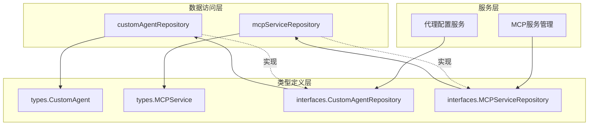

# 代理配置与外部服务仓库模块

## 概览

想象一下，您正在构建一个可以与各种外部服务无缝集成的智能代理平台。每个租户（企业或组织）都需要配置自己的自定义代理，并且可能需要连接到不同的外部服务（如数据接口、API端点等）。如何安全、高效地管理这些配置？这就是本模块要解决的问题。

`agent_configuration_and_external_service_repositories` 模块是数据访问层的关键组成部分，它负责持久化和检索两类核心数据：
1. **自定义代理配置**：存储每个租户创建的智能代理的详细信息
2. **MCP外部服务配置**：管理代理可以连接的外部服务（Model Context Protocol）

## 核心组件与架构



### 数据流向

1. **自定义代理操作流程**：
   - 创建代理：服务层 → `CreateAgent` → 数据库
   - 查询代理：服务层 → `GetAgentByID`/`ListAgentsByTenantID` → 数据库
   - 更新代理：服务层 → `UpdateAgent` → 数据库
   - 删除代理：服务层 → `DeleteAgent` → 数据库（软删除）

2. **MCP服务操作流程**：
   - 创建服务：服务层 → `Create` → 数据库
   - 查询服务：服务层 → `GetByID`/`List`/`ListEnabled`/`ListByIDs` → 数据库
   - 更新服务：服务层 → `Update` → 数据库（选择性字段更新）
   - 删除服务：服务层 → `Delete` → 数据库（软删除）

## 设计决策与权衡

### 1. 仓库模式的采用
**选择**：使用仓库模式封装数据访问逻辑
**原因**：
- 隔离数据访问细节，使业务逻辑不直接依赖ORM
- 便于单元测试（可以轻松Mock仓库接口）
- 统一数据访问的异常处理和上下文管理

**权衡**：
- ✅ 优点：提高了代码的可测试性和可维护性
- ⚠️ 缺点：增加了一层抽象，对于简单查询可能显得冗余

### 2. 租户隔离的严格执行
**选择**：所有查询都强制包含`tenant_id`条件
**原因**：
- 确保多租户环境下的数据安全隔离
- 防止租户间数据泄露
- 符合最小权限原则

**权衡**：
- ✅ 优点：数据安全性高，租户隔离严格
- ⚠️ 缺点：每次查询都需要传递tenant_id，增加了API的复杂度

### 3. 软删除策略
**选择**：使用GORM的软删除功能
**原因**：
- 保留历史数据，便于审计和恢复
- 避免因误删除导致的数据丢失
- 支持数据的时间点回溯

**权衡**：
- ✅ 优点：数据安全性高，支持恢复
- ⚠️ 缺点：数据库表会持续增长，需要定期清理

### 4. MCP服务的选择性更新
**选择**：在`mcpServiceRepository.Update`中使用更新映射而非全量更新
**原因**：
- 避免覆盖未修改的字段
- 减少网络传输和数据库写入量
- 支持部分字段更新的场景

**权衡**：
- ✅ 优点：更新精确，性能较好
- ⚠️ 缺点：代码复杂度较高，需要维护更新映射逻辑

## 子模块详情

本模块包含两个主要子模块：

- [自定义代理配置仓库](custom_agent_configuration_repository.md)：负责自定义代理配置的持久化操作
- [MCP外部服务仓库](mcp_external_service_repository.md)：负责MCP外部服务配置的持久化操作

## 跨模块依赖

### 依赖的模块
- **core_domain_types_and_interfaces**：提供了`types.CustomAgent`、`types.MCPService`等数据模型和仓库接口定义
- **platform_infrastructure_and_runtime**：提供了数据库连接和事务管理基础设施

### 被依赖的模块
- **application_services_and_orchestration**：中的代理配置服务和MCP服务管理模块使用本仓库进行数据持久化
- **http_handlers_and_routing**：中的代理和MCP服务管理HTTP处理器通过服务层间接使用本仓库

## 使用指南与注意事项

### 常见使用模式

```go
// 初始化仓库
agentRepo := repository.NewCustomAgentRepository(db)
mcpRepo := repository.NewMCPServiceRepository(db)

// 创建代理
agent := &types.CustomAgent{
    ID:        "agent-123",
    TenantID:  1,
    Name:      "我的代理",
    // ... 其他字段
}
err := agentRepo.CreateAgent(ctx, agent)

// 查询租户的所有代理
agents, err := agentRepo.ListAgentsByTenantID(ctx, 1)

// 创建MCP服务
service := &types.MCPService{
    ID:         "service-456",
    TenantID:   1,
    Name:       "数据API",
    Enabled:    true,
    // ... 其他字段
}
err = mcpRepo.Create(ctx, service)

// 查询启用的MCP服务
enabledServices, err := mcpRepo.ListEnabled(ctx, 1)
```

### 注意事项

1. **租户ID的重要性**：
   - 所有操作都必须提供正确的`tenant_id`，否则可能导致数据访问被拒绝或查询不到数据
   - 不要绕过仓库层直接操作数据库，以免破坏租户隔离

2. **错误处理**：
   - 注意处理`ErrCustomAgentNotFound`错误，这是代理不存在的明确信号
   - MCP服务的`GetByID`方法在服务不存在时返回`nil, nil`，而不是错误，这与代理仓库的行为不同

3. **更新操作的差异**：
   - 代理更新使用全量更新，确保传递完整的代理对象
   - MCP服务更新使用选择性更新，可以只传递需要修改的字段

4. **软删除的影响**：
   - 删除操作不会真正删除数据，只是标记为已删除
   - 查询时不会返回已软删除的记录
   - 如果需要查询历史数据，需要使用GORM的`Unscoped`方法（但不建议在业务代码中使用）

## 总结

`agent_configuration_and_external_service_repositories` 模块是系统数据访问层的重要组成部分，它通过仓库模式提供了对自定义代理和MCP外部服务配置的安全、高效的数据访问能力。该模块严格遵循租户隔离原则，采用软删除策略，并针对不同的更新需求提供了灵活的更新机制。

通过使用该模块，上层服务可以专注于业务逻辑，而不必关心数据持久化的细节，从而提高了整个系统的可维护性和可测试性。
