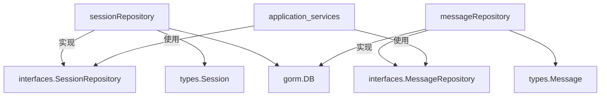

# conversation_history_repositories 模块技术文档

## 概述

`conversation_history_repositories` 模块是系统中负责持久化和检索会话历史数据的核心数据访问层。它就像一个档案室，专门管理用户与 AI 代理之间的对话记录，不仅负责存储完整的会话上下文，还提供高效的查询能力来支持历史对话的回溯、分析和上下文恢复。

### 解决的核心问题

在多轮对话系统中，维护会话上下文是一个关键挑战。没有这个模块，每次用户与 AI 交互都将是一次独立的对话，系统无法记住之前的交流内容。这个模块解决了以下关键问题：

1. **会话持久化**：将临时的内存对话状态持久化到数据库，支持跨会话的上下文恢复
2. **多租户隔离**：确保不同租户的会话数据完全隔离，满足数据安全和隐私要求
3. **高效查询**：提供按时间、会话、用户等多维度的查询能力，支持上下文加载和历史回顾
4. **数据完整性**：通过事务和约束保证会话与消息之间的引用完整性

## 架构设计

### 核心组件关系图



### 架构叙事

这个模块采用了经典的 **仓库模式（Repository Pattern）** 设计，将数据访问逻辑与业务逻辑完全分离。核心由两个主要仓库组成：

1. **sessionRepository**：负责会话级别的数据操作，如创建会话、更新会话元数据、删除会话等。它是会话的"目录管理员"，知道每个会话的基本信息和状态。

2. **messageRepository**：负责消息级别的数据操作，如添加消息、查询消息历史、更新消息内容等。它是消息的"档案管理员"，详细记录了每一条对话内容及其元数据。

两个仓库都依赖 GORM 作为 ORM 层，通过 `interfaces.SessionRepository` 和 `interfaces.MessageRepository` 接口与上层应用服务解耦。这种设计使得业务逻辑不需要关心数据是如何存储的，只需通过接口调用即可。

### 数据流向

典型的会话历史数据流向如下：

1. **创建会话**：HTTP 处理器 → 应用服务 → sessionRepository.Create → 数据库
2. **添加消息**：LLM 调用完成 → 应用服务 → messageRepository.CreateMessage → 数据库
3. **加载上下文**：新查询到达 → 应用服务 → messageRepository.GetRecentMessagesBySession → 内存
4. **会话管理**：用户操作 → 应用服务 → sessionRepository.Update/Delete → 数据库

## 关键设计决策

### 1. 租户隔离设计

**决策**：所有会话和消息操作都强制要求 `tenantID` 参数，并在查询条件中包含租户过滤。

**为什么这样设计**：
- 这是一个多租户 SaaS 系统，数据隔离是最基本的安全要求
- 通过在仓库层强制实现租户过滤，避免了上层业务逻辑忘记隔离的风险
- 相比数据库级别的租户隔离，这种方案更灵活，支持跨租户的数据管理（在受控情况下）

**权衡**：
- ✅ 优点：实现简单，性能好，灵活性高
- ❌ 缺点：依赖代码正确性，一旦出现 bug 可能导致数据泄露

### 2. 消息排序策略

**决策**：`GetRecentMessagesBySession` 和 `GetMessagesBySessionBeforeTime` 方法先按时间倒序查询，然后在内存中重新排序为正序，并对同一时间的消息进行角色排序（用户消息优先）。

**为什么这样设计**：
- 数据库按倒序查询可以高效获取最近的 N 条消息，避免全表扫描
- 内存排序确保返回给 LLM 的上下文是按对话顺序排列的
- 同一时间的角色排序处理了并发场景下的消息顺序问题，确保用户输入总是在助手回复之前

**权衡**：
- ✅ 优点：查询效率高，上下文顺序正确
- ❌ 缺点：需要在内存中进行二次排序，增加了 CPU 开销

### 3. 接口与实现分离

**决策**：仓库通过接口定义行为，具体实现隐藏在接口后面。

**为什么这样设计**：
- 遵循依赖倒置原则，上层业务逻辑依赖抽象而非具体实现
- 便于单元测试，可以轻松 mock 仓库接口
- 为未来可能的存储技术变更留下扩展空间

**权衡**：
- ✅ 优点：代码解耦，可测试性强，扩展性好
- ❌ 缺点：增加了一层抽象，代码量稍多

### 4. 时间戳管理

**决策**：`sessionRepository` 在创建和更新时自动设置 `CreatedAt` 和 `UpdatedAt`，而 `messageRepository` 则不自动管理时间戳。

**为什么这样设计**：
- 会话的创建和更新时间是系统级元数据，应该由仓库层统一管理
- 消息的时间戳可能有业务含义（如表示消息实际发送时间），应该由上层业务逻辑控制
- 这种差异反映了两种实体的不同性质：会话是管理单元，消息是内容单元

**权衡**：
- ✅ 优点：职责清晰，符合实体语义
- ❌ 缺点：两种仓库的行为不一致，容易引起混淆

## 子模块说明

### session_conversation_record_persistence

这个子模块专注于会话记录的持久化，提供完整的会话生命周期管理。它就像一个会议记录本的封面和目录，记录了每次会话的基本信息、参与者和状态。

核心功能包括：
- 创建新会话并分配唯一标识
- 按租户和 ID 检索会话
- 分页查询租户的所有会话
- 更新会话元数据（如标题、最后活跃时间）
- 单个或批量删除会话

**主要组件**：[sessionRepository](session_conversation_record_persistence.md)

### message_history_and_trace_persistence

这个子模块专注于消息历史的存储和检索，是对话内容的实际档案馆。它不仅存储消息文本，还保留了消息的角色、时间戳、关联的请求 ID 等元数据，支持完整的对话追溯。

核心功能包括：
- 添加新消息到会话
- 按会话分页查询消息历史
- 获取最近的 N 条消息（用于上下文加载）
- 按时间点回溯消息历史
- 通过请求 ID 查找特定消息
- 更新和删除消息

**主要组件**：[messageRepository](message_history_and_trace_persistence.md)

## 跨模块依赖

### 依赖关系

这个模块处于系统架构的底层，被多个上层模块依赖：

1. **application_services_and_orchestration/conversation_context_and_memory_services**：这是最主要的消费者，使用仓库来加载会话上下文、保存新消息、管理会话生命周期。
   - [session_conversation_lifecycle_service](application_services_and_orchestration-conversation_context_and_memory_services-session_conversation_lifecycle_service.md) 依赖 sessionRepository
   - [message_history_service](application_services_and_orchestration-conversation_context_and_memory_services-message_history_service.md) 依赖 messageRepository

2. **http_handlers_and_routing/session_message_and_streaming_http_handlers**：HTTP 接口层通过应用服务间接使用仓库，提供会话和消息的 REST API。

3. **core_domain_types_and_interfaces/agent_conversation_and_runtime_contracts**：定义了仓库接口和数据模型，是这个模块的契约基础。

### 数据契约

模块与外部的交互通过以下核心数据结构：

- **types.Session**：会话实体，包含 ID、租户 ID、创建时间、更新时间、标题等元数据
- **types.Message**：消息实体，包含 ID、会话 ID、角色、内容、创建时间、请求 ID 等
- **types.Pagination**：分页参数，用于控制查询结果的分页

## 使用指南与注意事项

### 典型使用场景

#### 1. 创建新会话

```go
// 创建仓库实例
sessionRepo := NewSessionRepository(db)

// 创建新会话
session := &types.Session{
    TenantID: 123,
    Title:    "新对话",
    // 其他字段...
}
createdSession, err := sessionRepo.Create(ctx, session)
```

#### 2. 添加消息并获取最近消息

```go
// 创建消息仓库
messageRepo := NewMessageRepository(db)

// 添加新消息
message := &types.Message{
    SessionID: sessionID,
    Role:      "user",
    Content:   "你好",
    CreatedAt: time.Now(),
}
_, err := messageRepo.CreateMessage(ctx, message)

// 获取最近 10 条消息用于上下文
recentMessages, err := messageRepo.GetRecentMessagesBySession(ctx, sessionID, 10)
```

### 注意事项与陷阱

1. **租户 ID 不可省略**：所有会话操作都必须提供正确的 `tenantID`，否则可能导致数据查询失败或意外的数据泄露。

2. **消息时间戳管理**：`messageRepository` 不会自动设置 `CreatedAt`，调用方必须在创建消息前显式设置，否则可能导致消息顺序错误。

3. **并发安全**：仓库层没有实现并发控制，上层业务逻辑需要考虑并发场景下的数据一致性问题。

4. **分页参数**：`GetMessagesBySession` 方法的 `page` 参数从 1 开始，而不是 0，这一点容易出错。

5. **空结果处理**：`GetMessageByRequestID` 在找不到消息时返回 `(nil, nil)` 而不是错误，调用方需要检查返回值是否为 nil。

6. **批量删除**：`BatchDelete` 方法在 `ids` 为空时直接返回成功，不会进行任何操作，这是一种防御性设计。

## 总结

`conversation_history_repositories` 模块是系统会话管理的基石，它通过简洁的接口和可靠的实现，为上层应用提供了强大的数据持久化能力。它的设计体现了关注点分离、接口抽象、租户优先等原则，同时在性能和一致性之间做出了合理的权衡。

对于新加入团队的开发者，理解这个模块的关键在于把握两个仓库的职责分工、租户隔离的重要性，以及消息排序策略背后的业务考量。在使用这个模块时，特别要注意时间戳管理、分页参数和错误处理这些容易出错的细节。
