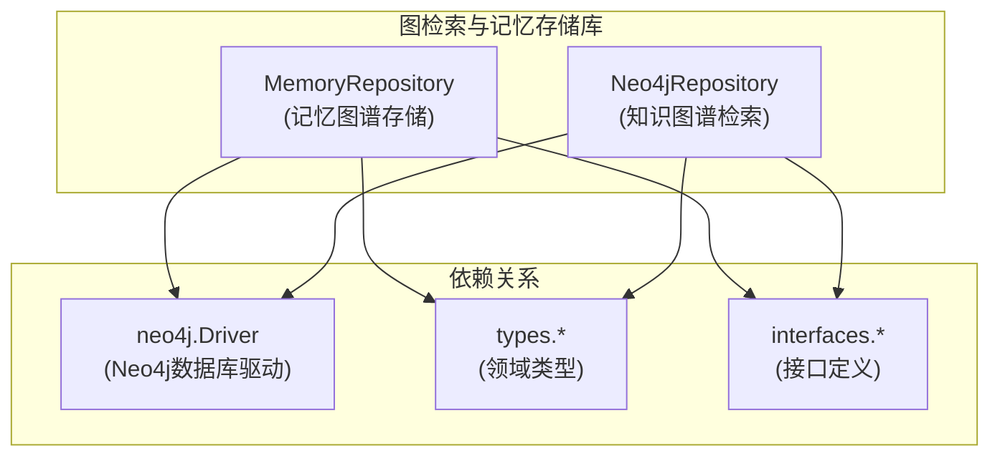

# 图检索与记忆存储库 (graph_retrieval_and_memory_repositories)

## 概述

这个模块是系统的"知识记忆与关联网络中心"，它解决了两个关键问题：
1. **如何保存和检索对话历史中的上下文记忆**，让AI能够像人一样"记得"之前讨论过的内容
2. **如何表示和查询知识图谱**，实现实体之间的关联推理和语义检索

想象一下这个模块就像一个智能图书馆员：
- **记忆存储** 就像保存你的阅读笔记和对话摘要，下次你提到相关话题时能快速回忆
- **知识图谱** 就像图书馆的主题关联图，当你查找"Python"时，它能告诉你相关的"机器学习"、"数据分析"等主题

## 架构概览

这个模块由两个核心组件组成，它们共享相同的Neo4j数据库驱动，但服务于完全不同的业务场景：

1. **MemoryRepository**：专注于对话记忆的存储与检索，将对话片段(Episode)、实体(Entity)和关系(Relationship)组织成记忆网络
2. **Neo4jRepository**：专注于知识图谱的管理，提供图数据的增删改查能力

## 核心设计决策

### 1. 图数据库 vs 关系型数据库
**选择**：使用Neo4j图数据库而非传统关系型数据库
**原因**：
- 记忆检索和知识查询本质上是**图遍历问题**，关系型数据库在处理多跳关联查询时性能会急剧下降
- 图数据库的**模式灵活性**适合处理动态变化的实体类型和关系
- Cypher查询语言能以非常直观的方式表达"找到与这些实体相关的对话"这类问题

### 2. MERGE而非CREATE
**选择**：在Cypher查询中大量使用MERGE而不是CREATE
**原因**：
- 避免重复创建相同的实体节点
- 实现幂等性操作，相同的数据多次写入不会产生副作用
- 这对于知识更新和记忆补充场景至关重要

### 3. 事务封装
**选择**：每个操作都封装在独立的读写事务中
**原因**：
- 保证图数据的一致性（节点和关系必须同时创建/删除）
- 利用Neo4j的事务隔离机制防止并发冲突
- 简化错误恢复流程

## 子模块

### 记忆图谱存储 (memory_graph_repository)

这是系统的"记忆宫殿"，负责存储对话历史中的关键信息片段，并建立它们之间的语义关联。

**核心职责**：
- 保存对话片段(Episode)及其摘要
- 提取和存储对话中提到的实体(Entity)
- 建立实体之间、实体与对话片段之间的关联
- 根据关键词检索相关的历史对话

**关键操作流程**：
当调用`SaveEpisode`时：
1. 创建或更新Episode节点
2. 为每个实体创建/更新Entity节点，并建立`MENTIONS`关系
3. 在实体之间创建`RELATED_TO`关系

当调用`FindRelatedEpisodes`时：
1. 从给定的关键词出发
2. 找到提及这些关键词的Entity节点
3. 通过`MENTIONS`关系找到关联的Episode节点
4. 按时间排序返回结果

[查看详细文档](memory_graph_repository.md)

### Neo4j检索存储库 (neo4j_retrieval_repository)

这是知识图谱的"操作面板"，提供了对知识图数据的完整生命周期管理。

**核心职责**：
- 将知识图数据导入Neo4j
- 按命名空间删除知识图
- 基于节点名称的模糊搜索
- 图数据的批量处理

**关键特性**：
- 使用APOC过程库进行高效的批量操作
- 通过命名空间(namespace)实现多租户隔离
- 支持节点标签的动态生成
- 实现了软删除模式（通过批量删除实现）

[查看详细文档](neo4j_retrieval_repository.md)

## 与其他模块的关系

### 上游依赖
- **core_domain_types_and_interfaces**：定义了`Episode`、`Entity`、`GraphData`等领域模型
- **platform_infrastructure_and_runtime**：提供Neo4j驱动的初始化和配置

### 下游使用者
- **application_services_and_orchestration** 下的 **conversation_context_and_memory_services**：使用[MemoryRepository](memory_graph_repository.md)保存和检索对话记忆
- **application_services_and_orchestration** 下的 **knowledge_ingestion_extraction_and_graph_services**：使用[Neo4jRepository](neo4j_retrieval_repository.md)管理知识图谱

## 新开发者注意事项

### 关键陷阱

1. **APOC依赖**：Neo4jRepository大量使用了APOC库，确保你的Neo4j实例已安装并启用APOC
2. **节点标签限制**：标签名不能包含连字符，代码中有`_remove_hyphen`函数处理这个问题
3. **空驱动处理**：两个仓库都优雅处理了`driver == nil`的情况，返回无错误而非失败，这是为了支持可选的图数据库配置
4. **时间格式**：MemoryRepository使用RFC3339格式存储时间，确保你在其他地方解析时使用相同的格式

### 扩展点

1. **实现新的记忆检索策略**：当前`FindRelatedEpisodes`只做简单的关键词匹配，可以扩展为基于相似度的检索
2. **添加图遍历深度控制**：当前搜索只考虑直接关联，可以添加参数支持多跳查询
3. **实现增量更新**：当前的图数据更新是全量替换的，可以优化为增量更新

### 测试建议

- 编写集成测试时，使用Neo4j的测试容器或内存实例
- 特别关注并发写入场景下的事务隔离
- 测试大规模图数据下的批量删除性能（当前使用apoc.periodic.iterate）
