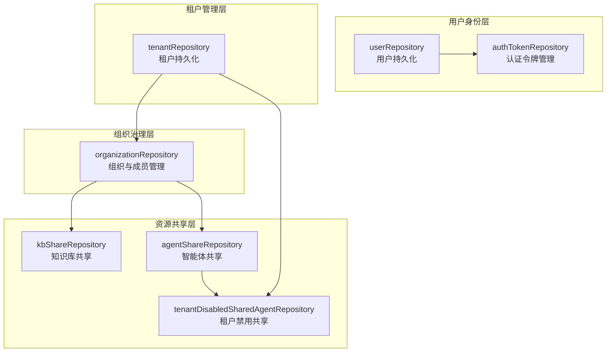

# identity_tenant_and_organization_repositories 模块技术文档

## 1. 模块概述

### 1.1 核心问题与定位

在多租户、多组织的企业级应用中，身份管理、租户隔离和资源共享是三个紧密关联且复杂的核心问题。想象一下，一个支持多个企业（租户）、每个企业内部有多个团队（组织）、用户可以跨组织协作、知识和智能体可以在组织间共享的平台，我们需要一个清晰、安全、高效的数据访问层来支撑这一切。

**identity_tenant_and_organization_repositories** 模块正是为了解决这个问题而存在。它充当了系统的"基础设施锚点"，负责：
- 用户身份的持久化与认证令牌管理
- 租户级别的资源隔离与计费计量
- 组织的成员管理与加入流程
- 知识库和智能体在组织间的共享与访问控制
- 租户级别的共享资源禁用机制

### 1.2 心智模型

可以将这个模块想象成一个**"数字办公楼宇管理系统"**：
- **租户 (Tenant)**：就像大楼的业主，拥有整层或整个建筑的使用权，负责整体的资源配额和计费
- **用户 (User)**：就像办公楼里的员工，有自己的身份标识和访问凭证
- **组织 (Organization)**：就像大楼里的一个个办公室或会议室，用户可以加入多个组织，组织有自己的邀请码、成员列表和访问规则
- **共享记录 (Share)**：就像办公室之间共享的文件柜或投影仪，需要明确的授权关系
- **禁用记录 (Disabled)**：就像某个房间临时禁止使用某些共享设备

这种分层设计既保证了租户级别的强隔离，又提供了组织级别的灵活性和协作能力。

## 2. 架构概览

### 2.1 组件关系图



### 2.2 数据流向

以"用户通过邀请码加入组织并获得共享知识库访问权限"为例，数据流向如下：

1. **认证阶段**：用户登录 → `userRepository` 验证用户身份 → `authTokenRepository` 颁发令牌
2. **加入组织**：用户使用邀请码 → `organizationRepository` 验证邀请码 → 创建 `OrganizationMember` 记录
3. **获取共享资源**：查询用户可访问的知识库 → `kbShareRepository` 关联用户所属组织 → 过滤出可用的共享知识库
4. **访问控制**：当用户使用共享智能体时 → `tenantDisabledSharedAgentRepository` 检查是否被当前租户禁用

## 3. 核心设计决策

### 3.1 分层职责隔离

**决策**：将用户、租户、组织、共享资源的存储完全分离到不同的 Repository 中。

**原因**：
- 单一职责原则：每个 Repository 只负责一类实体的持久化
- 独立演进：租户管理可能涉及计费逻辑，而组织管理更关注协作流程，分离后可以独立优化
- 测试友好：可以单独 Mock 某个 Repository 进行测试

**权衡**：
- ✅ 优点：代码清晰，职责明确，便于维护
- ❌ 缺点：需要在 Service 层进行跨 Repository 的事务协调

### 3.2 软删除与软删除一致性

**决策**：对于组织、知识库共享、智能体共享等实体采用软删除，且在查询时主动过滤已删除的关联实体。

**原因**：
- 审计需求：保留历史共享记录，便于追溯
- 数据恢复：误操作时可以恢复
- 一致性：如 `ListByOrganization` 方法通过 `JOIN` 确保只返回知识库未被删除的共享记录

**示例**（来自 `kbShareRepository.ListByOrganization`）：
```go
Joins("JOIN knowledge_bases ON knowledge_bases.id = kb_shares.knowledge_base_id AND knowledge_bases.deleted_at IS NULL")
```

### 3.3 悲观锁用于存储计量

**决策**：在 `tenantRepository.AdjustStorageUsed` 中使用悲观锁（`clause.Locking{Strength: "UPDATE"}`）来确保并发安全。

**原因**：
- 存储计量是关键业务数据，涉及计费
- 乐观锁在高并发场景下可能导致大量重试
- 悲观锁虽然性能稍低，但保证了数据一致性

**权衡**：
- ✅ 优点：数据一致性有保障，实现简单
- ❌ 缺点：在极端并发下可能成为瓶颈

### 3.4 邀请码过期逻辑放在 Repository 层

**决策**：在 `organizationRepository.GetByInviteCode` 中直接检查邀请码是否过期，并返回 `ErrInviteCodeExpired`。

**原因**：
- 邀请码过期是数据层面的业务规则，放在 Repository 层可以确保所有调用者都遵守这一规则
- 避免在 Service 层重复实现过期检查逻辑

**示例**：
```go
if org.InviteCodeExpiresAt != nil && org.InviteCodeExpiresAt.Before(time.Now()) {
    return nil, ErrInviteCodeExpired
}
```

## 4. 子模块概述

本模块包含以下三个核心子模块，每个子模块都有独立的详细文档：

### 4.1 用户身份与认证仓库 ([user_identity_and_auth_repositories](data_access_repositories-identity_tenant_and_organization_repositories-user_identity_and_auth_repositories.md))

负责用户账户的 CRUD、认证令牌的管理和生命周期维护。核心组件包括 `userRepository` 和 `authTokenRepository`。

### 4.2 租户管理仓库 ([tenant_management_repository](data_access_repositories-identity_tenant_and_organization_repositories-tenant_management_repository.md))

负责租户的生命周期、搜索和存储计量。核心组件是 `tenantRepository`，特别是其中的 `AdjustStorageUsed` 方法实现了并发安全的存储计量。

### 4.3 组织成员、共享与访问控制仓库 ([organization_membership_sharing_and_access_control_repositories](data_access_repositories-identity_tenant_and_organization_repositories-organization_membership_sharing_and_access_control_repositories.md))

这是最复杂的子模块，进一步细分为：
- 组织成员与治理仓库
- 共享资源访问仓库（知识库共享、智能体共享）
- 租户级共享智能体访问控制仓库

## 5. 跨模块依赖

### 5.1 输入依赖

本模块依赖于：
- **core_domain_types_and_interfaces** 模块：提供 `types.User`、`types.Tenant`、`types.Organization` 等领域模型和 `interfaces.UserRepository` 等接口定义
- **platform_infrastructure_and_runtime** 模块：提供 `gorm.DB` 数据库连接和日志工具

### 5.2 输出依赖

本模块被以下模块依赖：
- **application_services_and_orchestration/agent_identity_tenant_and_configuration_services**：调用这些 Repository 实现业务逻辑
- **http_handlers_and_routing/agent_tenant_organization_and_model_management_handlers**：通过 Service 层间接使用

## 6. 新贡献者指南

### 6.1 常见陷阱

1. **忘记过滤软删除记录**：当你直接查询共享表时，一定要记得过滤 `deleted_at IS NULL`，并且最好 JOIN 关联表确保关联实体也未被删除。

2. **存储计量的并发安全**：如果你需要扩展存储计量逻辑，务必保持 `AdjustStorageUsed` 的事务和悲观锁机制，否则会出现数据不一致。

3. **邀请码过期检查**：不要只依赖数据库查询，一定要在 Repository 层检查 `invite_code_expires_at`。

4. **共享记录的唯一性**：在创建共享记录时，一定要先检查是否已存在（如 `kbShareRepository.Create` 中的 `Count` 检查），避免重复共享。

### 6.2 扩展建议

- 如果你需要添加新的共享资源类型（如文件共享），可以参考 `kbShareRepository` 和 `agentShareRepository` 的模式，创建新的 Repository。
- 如果你需要添加新的访问控制机制，可以参考 `tenantDisabledSharedAgentRepository` 的设计，作为"黑名单"机制的补充。
- 所有 Repository 都通过接口（`interfaces.UserRepository` 等）对外暴露，这使得在测试时可以轻松 Mock。

### 6.3 调试技巧

- 当查询共享资源返回空结果时，检查是否有软删除的过滤器在起作用。
- 当存储计量不正确时，检查是否有其他地方绕过了 `AdjustStorageUsed` 直接更新了 `storage_used` 字段。
- 利用 GORM 的 `Debug()` 方法在开发环境查看生成的 SQL，确认 JOIN 和 WHERE 条件是否符合预期。
