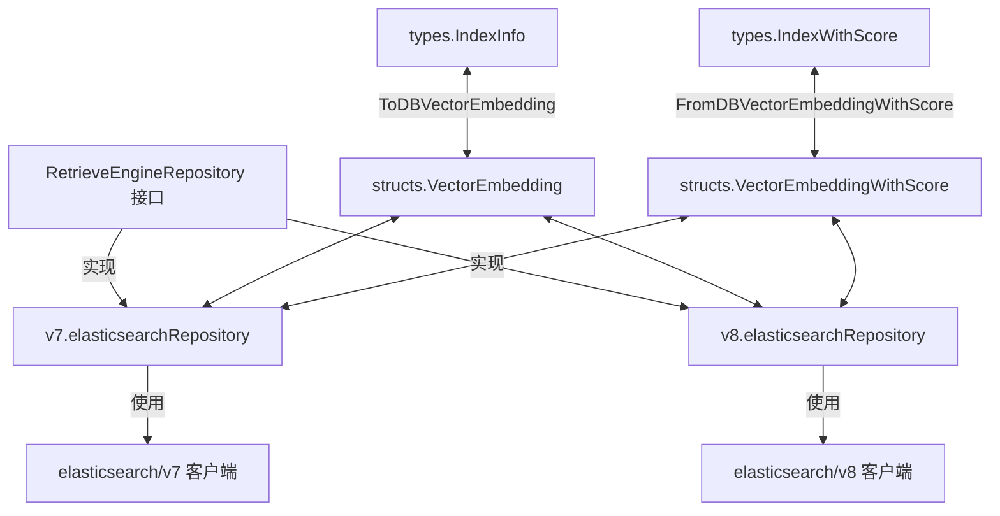

# Elasticsearch 向量检索仓库

## 模块概述

想象一下，你需要在数百万文档片段中找到与用户问题最相关的内容。这就像在一个巨大的图书馆里寻找特定的书页，而你只知道书的主题。`elasticsearch_vector_retrieval_repository` 模块就是这个图书馆的智能检索系统，它使用向量相似度搜索来找到最相关的信息片段。

这个模块为系统提供了基于 Elasticsearch 的向量检索能力，支持两种主要的检索方式：
1. **关键词检索**：传统的文本匹配搜索
2. **向量检索**：基于语义相似度的智能搜索

它同时支持 Elasticsearch v7 和 v8 两个主要版本，确保系统可以在不同的 Elasticsearch 环境中运行。

## 架构设计

### 核心组件图



### 架构说明

这个模块采用了清晰的分层架构：

1. **接口层**：通过 `RetrieveEngineRepository` 接口定义了统一的检索引擎行为
2. **版本适配层**：分别为 Elasticsearch v7 和 v8 提供了独立的实现
3. **数据模型层**：定义了 Elasticsearch 文档结构和与领域模型的转换逻辑
4. **客户端层**：封装了与 Elasticsearch 服务器的通信细节

### 数据流

当执行一次检索操作时，数据流向如下：

1. **检索请求**：上层服务调用 `Retrieve` 方法，传入检索参数
2. **查询构建**：根据检索类型（关键词或向量）构建相应的 Elasticsearch 查询
3. **条件过滤**：应用基础过滤条件（知识库、知识项、标签等）
4. **搜索执行**：向 Elasticsearch 发送搜索请求
5. **结果处理**：将 Elasticsearch 的响应转换为系统的领域模型
6. **结果返回**：返回标准化的检索结果

## 核心组件解析

### 数据模型

#### VectorEmbedding

这是 Elasticsearch 中文档的核心结构，存储了文本片段及其向量表示：

- **Content**: 文本片段的实际内容
- **SourceID**: 源文档的 ID
- **SourceType**: 源文档的类型
- **ChunkID**: 文本片段的唯一 ID
- **KnowledgeID**: 知识项的 ID
- **KnowledgeBaseID**: 知识库的 ID
- **Embedding**: 文本内容的向量表示
- **IsEnabled**: 该片段是否启用（用于软删除）

#### VectorEmbeddingWithScore

在 `VectorEmbedding` 的基础上增加了相似度分数，用于表示检索结果与查询的相关程度。

### 仓库实现

#### v7.elasticsearchRepository

为 Elasticsearch v7 设计的实现，具有以下特点：

- 使用 `github.com/elastic/go-elasticsearch/v7` 客户端
- 手动构建 JSON 查询字符串
- 支持批量操作以提高性能
- 提供详细的错误处理和日志记录

#### v8.elasticsearchRepository

为 Elasticsearch v8 设计的实现，相比 v7 版本有以下改进：

- 使用类型安全的 `TypedClient`
- 使用强类型的查询构建器，减少运行时错误
- 自动处理索引创建
- 更简洁的 API 调用方式

## 关键设计决策

### 1. 双版本支持

**决策**：同时支持 Elasticsearch v7 和 v8 两个主要版本

**原因**：
- 不同用户可能使用不同版本的 Elasticsearch
- 平滑迁移路径：用户可以逐步从 v7 升级到 v8
- 最大化兼容性和灵活性

**权衡**：
- 增加了代码维护成本
- 需要确保两个版本的功能一致性
- 测试复杂度增加

### 2. 接口抽象

**决策**：通过 `RetrieveEngineRepository` 接口定义统一行为

**原因**：
- 使上层代码不依赖于具体的 Elasticsearch 版本
- 便于未来添加其他向量检索引擎（如 Milvus、Qdrant）
- 提高了代码的可测试性

### 3. 批量操作优先

**决策**：优先实现批量操作接口

**原因**：
- 大幅减少网络往返次数
- 提高大规模数据处理的性能
- 符合 Elasticsearch 的最佳实践

**权衡**：
- 批量操作的错误处理更复杂
- 需要处理部分成功的情况

### 4. 软删除机制

**决策**：使用 `IsEnabled` 字段实现软删除，而不是物理删除

**原因**：
- 数据恢复更容易
- 可以保留历史数据
- 避免了删除操作的性能开销

**权衡**：
- 增加了存储成本
- 需要在查询时添加过滤条件

## 使用指南

### 初始化

#### Elasticsearch v7

```go
import (
    "github.com/elastic/go-elasticsearch/v7"
    "github.com/Tencent/WeKnora/internal/config"
    "github.com/Tencent/WeKnora/internal/application/repository/retriever/elasticsearch/v7"
)

// 创建 Elasticsearch v7 客户端
client, err := elasticsearch.NewClient(elasticsearch.Config{
    Addresses: []string{"http://localhost:9200"},
})
if err != nil {
    // 处理错误
}

// 创建仓库实例
repo := v7.NewElasticsearchEngineRepository(client, config)
```

#### Elasticsearch v8

```go
import (
    "github.com/elastic/go-elasticsearch/v8"
    "github.com/Tencent/WeKnora/internal/config"
    "github.com/Tencent/WeKnora/internal/application/repository/retriever/elasticsearch/v8"
)

// 创建 Elasticsearch v8 客户端
client, err := elasticsearch.NewTypedClient(elasticsearch.Config{
    Addresses: []string{"http://localhost:9200"},
})
if err != nil {
    // 处理错误
}

// 创建仓库实例
repo := v8.NewElasticsearchEngineRepository(client, config)
```

### 基本操作

#### 保存向量

```go
import (
    "context"
    "github.com/Tencent/WeKnora/internal/types"
)

ctx := context.Background()

// 创建索引信息
indexInfo := &types.IndexInfo{
    Content:         "这是一段示例文本",
    SourceID:        "doc-123",
    SourceType:      types.SourceFileType,
    ChunkID:         "chunk-456",
    KnowledgeID:     "knowledge-789",
    KnowledgeBaseID: "kb-012",
}

// 准备附加参数（包含向量数据）
additionalParams := map[string]any{
    "embedding": map[string][]float32{
        "doc-123": {0.1, 0.2, 0.3, ...}, // 向量数据
    },
}

// 保存单个索引
err := repo.Save(ctx, indexInfo, additionalParams)
if err != nil {
    // 处理错误
}
```

#### 批量保存

```go
// 准备多个索引信息
indexList := []*types.IndexInfo{
    // ... 多个索引信息
}

// 批量保存
err := repo.BatchSave(ctx, indexList, additionalParams)
if err != nil {
    // 处理错误
}
```

#### 向量检索

```go
// 准备检索参数
params := types.RetrieveParams{
    RetrieverType:    types.VectorRetrieverType,
    Embedding:        []float32{0.1, 0.2, 0.3, ...}, // 查询向量
    KnowledgeBaseIDs: []string{"kb-012"},             // 限制在特定知识库
    TopK:             10,                               // 返回前 10 个结果
    Threshold:        0.7,                              // 相似度阈值
}

// 执行检索
results, err := repo.Retrieve(ctx, params)
if err != nil {
    // 处理错误
}

// 处理结果
for _, result := range results {
    for _, item := range result.Results {
        // 处理每个检索结果
        fmt.Printf("内容: %s, 分数: %.4f\n", item.Content, item.Score)
    }
}
```

#### 关键词检索

```go
// 准备检索参数
params := types.RetrieveParams{
    RetrieverType:    types.KeywordsRetrieverType,
    Query:            "搜索关键词",
    KnowledgeBaseIDs: []string{"kb-012"},
    TopK:             10,
}

// 执行检索
results, err := repo.Retrieve(ctx, params)
if err != nil {
    // 处理错误
}
```

## 注意事项和最佳实践

### 性能考虑

1. **批量操作**：尽可能使用 `BatchSave` 而不是多次调用 `Save`，这可以显著提高性能
2. **索引大小**：定期监控索引大小，考虑使用 `EstimateStorageSize` 预估存储空间
3. **分页查询**：处理大量数据时使用分页，避免单次查询返回过多结果
4. **向量维度**：向量维度越高，存储和计算成本越大，选择合适的维度平衡性能和精度

### 错误处理

1. **部分失败**：批量操作可能部分成功，需要检查响应中的错误信息
2. **网络超时**：Elasticsearch 操作可能超时，实现适当的重试机制
3. **索引不存在**：v7 版本不会自动创建索引，确保索引存在或使用 v8 版本

### 数据一致性

1. **ID 映射**：在复制索引时，注意 SourceID 的转换逻辑，特别是生成的问题
2. **软删除**：记住 `IsEnabled` 字段的作用，历史数据可能没有这个字段
3. **向量更新**：更新向量时需要重新索引整个文档

## 子模块

这个模块包含以下子模块，每个子模块都有详细的文档：

- [Elasticsearch 向量嵌入模型](data_access_repositories-vector_retrieval_backend_repositories-elasticsearch_vector_retrieval_repository-elasticsearch_vector_embedding_models.md)：定义了向量数据的核心结构
- [Elasticsearch v7 检索仓库](data_access_repositories-vector_retrieval_backend_repositories-elasticsearch_vector_retrieval_repository-elasticsearch_v7_retrieval_repository.md)：Elasticsearch v7 的具体实现
- [Elasticsearch v8 检索仓库](data_access_repositories-vector_retrieval_backend_repositories-elasticsearch_vector_retrieval_repository-elasticsearch_v8_retrieval_repository.md)：Elasticsearch v8 的具体实现

## 与其他模块的关系

这个模块在系统中扮演着向量检索引擎的角色，与以下模块有紧密的交互：

1. **[检索引擎组合与注册](application_services_and_orchestration-retrieval_and_web_search_services-retriever_engine_composition_and_registry.md)**：这个模块使用 `elasticsearch_vector_retrieval_repository` 作为检索引擎的实现之一
2. **[核心领域类型与接口](core_domain_types_and_interfaces.md)**：定义了 `RetrieveEngineRepository` 接口和相关的数据类型
3. **[其他向量检索仓库](data_access_repositories-vector_retrieval_backend_repositories.md)**：如 Milvus、PostgreSQL 等，提供类似的功能但使用不同的后端

通过这些交互，`elasticsearch_vector_retrieval_repository` 为整个系统的智能检索能力提供了坚实的基础。
