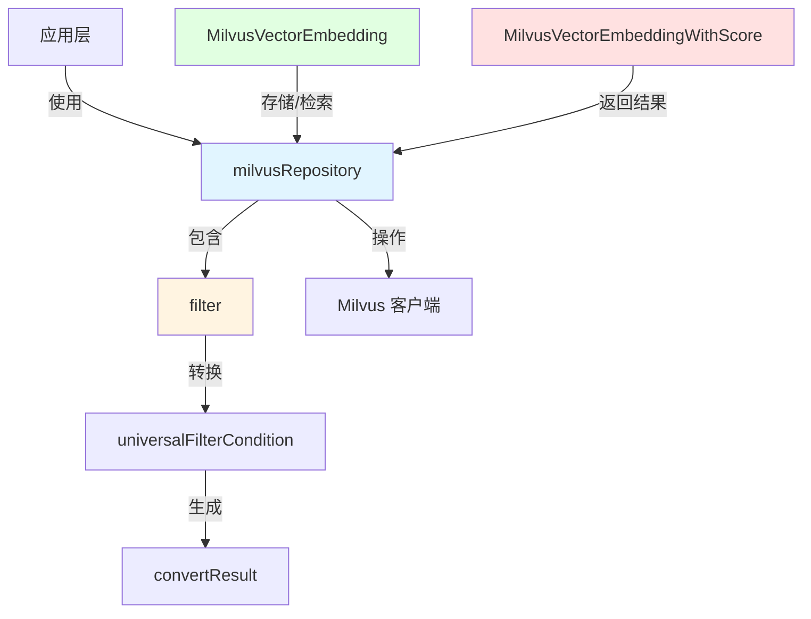

# Milvus 向量检索仓库

## 概述

Milvus 向量检索仓库模块是一个专门设计的适配器，用于将应用程序的向量检索需求与 Milvus 向量数据库连接起来。它提供了一套统一的抽象接口，允许应用程序存储、检索和过滤向量化数据，同时隐藏了 Milvus 特定的实现细节。

**核心问题**：在构建知识检索系统时，我们需要一种高效的方式来存储和查询向量化的文档片段。直接使用 Milvus 客户端会导致代码与特定数据库技术紧密耦合，难以替换或测试。此外，我们需要一种通用的方式来表达过滤条件，而不需要了解 Milvus 的查询语言。

**解决方案**：这个模块通过以下方式解决了上述问题：
1. 提供了统一的数据模型来表示向量嵌入
2. 实现了通用的过滤条件转换机制
3. 封装了 Milvus 客户端的复杂性
4. 管理集合的生命周期和初始化

## 架构概述



这个模块的架构围绕着三个核心概念构建：

1. **数据模型**：`MilvusVectorEmbedding` 和 `MilvusVectorEmbeddingWithScore` 定义了数据的结构，前者表示原始的向量嵌入，后者增加了相似度分数用于检索结果。

2. **过滤系统**：`filter` 结构体及其相关组件提供了一个通用的过滤条件转换机制。它将应用程序层的通用过滤条件（`universalFilterCondition`）转换为 Milvus 可以理解的查询表达式（`convertResult`）。

3. **仓库实现**：`milvusRepository` 是整个模块的核心，它封装了 Milvus 客户端，管理集合的初始化，并提供了数据存储和检索的主要接口。

## 核心设计决策

### 1. 通用过滤条件 vs 数据库特定查询

**决策**：实现了一个通用的过滤条件抽象层，而不是直接暴露 Milvus 的查询语言。

**原因**：
- **解耦**：将应用层与特定数据库技术解耦，使得未来可以更容易地替换向量数据库
- **易用性**：提供了更直观的 API，不需要开发者了解 Milvus 的查询语法
- **安全性**：通过参数化查询减少了注入攻击的风险

**权衡**：
- ✅ 优点：提高了代码的可维护性和可测试性
- ❌ 缺点：引入了额外的抽象层，可能会限制某些 Milvus 特有的高级功能

### 2. 集合按需初始化

**决策**：使用 `sync.Map` 来缓存已初始化的集合，实现按需初始化。

**原因**：
- **性能**：避免在每次操作时都检查集合是否存在
- **并发安全**：`sync.Map` 提供了并发安全的访问
- **灵活性**：可以支持不同维度的向量集合

**权衡**：
- ✅ 优点：提高了性能，特别是在高并发场景下
- ❌ 缺点：增加了内存使用，需要手动管理缓存失效

### 3. 结构化数据模型

**决策**：定义了明确的结构体来表示向量嵌入，而不是使用通用的 map。

**原因**：
- **类型安全**：编译时类型检查，减少运行时错误
- **自文档化**：结构体定义本身就是文档
- **性能**：结构体访问比 map 更快

**权衡**：
- ✅ 优点：提高了代码的可靠性和可维护性
- ❌ 缺点：修改数据结构需要重新编译

## 子模块说明

### milvus_vector_embedding_models

这个子模块定义了核心的数据模型，用于表示向量嵌入及其相关元数据。它包括：

- `MilvusVectorEmbedding`：表示存储在 Milvus 中的完整向量嵌入记录，包含 ID、内容、源信息、标签和向量数据等字段。
- `MilvusVectorEmbeddingWithScore`：扩展了 `MilvusVectorEmbedding`，增加了一个 `Score` 字段，用于表示检索结果的相似度分数。

这些模型是整个模块的基础，它们定义了数据在应用程序和 Milvus 之间流动的格式。

[查看详细文档](data_access_repositories-vector_retrieval_backend_repositories-milvus_vector_retrieval_repository-milvus_vector_embedding_models.md)

### milvus_filter_and_result_mapping

这个子模块实现了通用过滤条件到 Milvus 查询表达式的转换。它包括：

- `universalFilterCondition`：一个通用的过滤条件结构体，支持各种比较和逻辑操作符。
- `filter` 结构体及其方法：实现了将 `universalFilterCondition` 转换为 Milvus 查询表达式的核心逻辑。
- `convertResult`：存储转换后的查询表达式和参数。

这个子模块是模块的"大脑"之一，它解决了如何将应用程序的过滤需求转换为 Milvus 可以理解的查询语言的问题。

[查看详细文档](data_access_repositories-vector_retrieval_backend_repositories-milvus_vector_retrieval_repository-milvus_filter_and_result_mapping.md)

### milvus_repository_implementation

这个子模块是整个模块的核心，它封装了 Milvus 客户端并提供了主要的存储和检索功能。它包括：

- `milvusRepository` 结构体：封装了 Milvus 客户端、集合基础名称和已初始化集合的缓存。
- 各种方法：实现了向量的存储、检索、更新和删除等功能。

这个子模块是模块的"心脏"，它将所有其他组件组合在一起，提供了完整的向量检索仓库功能。

[查看详细文档](data_access_repositories-vector_retrieval_backend_repositories-milvus_vector_retrieval_repository-milvus_repository_implementation.md)

## 跨模块依赖

这个模块在整个系统中扮演着向量检索后端的角色，它与以下模块有密切的交互：

1. **核心域类型和接口**：依赖于 `core_domain_types_and_interfaces` 模块中定义的检索引擎接口，确保与系统的其他部分兼容。

2. **检索和网络搜索服务**：被 `application_services_and_orchestration` 模块中的 `retrieval_and_web_search_services` 子模块使用，提供实际的向量检索功能。

3. **知识访问和语料库导航工具**：被 `agent_runtime_and_tools` 模块中的 `knowledge_access_and_corpus_navigation_tools` 子模块使用，支持代理的知识检索能力。

## 使用指南

### 基本使用

要使用这个模块，你需要首先创建一个 `milvusRepository` 实例：

```go
// 假设你已经有一个 Milvus 客户端实例
client := ... // 初始化 Milvus 客户端

// 创建仓库实例
repo := &milvusRepository{
    client:             client,
    collectionBaseName: "my_collection",
}
```

### 存储向量

要存储向量嵌入，你可以创建一个 `MilvusVectorEmbedding` 实例并使用仓库的存储方法：

```go
embedding := &MilvusVectorEmbedding{
    ID:              "unique_id",
    Content:         "这是一段示例文本",
    SourceID:        "source_123",
    SourceType:      1,
    ChunkID:         "chunk_456",
    KnowledgeID:     "knowledge_789",
    KnowledgeBaseID: "kb_012",
    TagID:           "tag_345",
    Embedding:       []float32{0.1, 0.2, 0.3, ...}, // 向量数据
    IsEnabled:       true,
}

err := repo.Store(embedding)
if err != nil {
    // 处理错误
}
```

### 检索向量

要检索向量，你可以使用仓库的检索方法，并提供查询向量和可选的过滤条件：

```go
// 创建查询向量
queryVector := []float32{0.1, 0.2, 0.3, ...}

// 创建过滤条件（可选）
filter := &universalFilterCondition{
    Field:    "knowledge_base_id",
    Operator: "eq",
    Value:    "kb_012",
}

// 检索 top 10 结果
results, err := repo.Search(queryVector, 10, filter)
if err != nil {
    // 处理错误
}

// 处理结果
for _, result := range results {
    fmt.Printf("ID: %s, Score: %f\n", result.ID, result.Score)
}
```

## 注意事项和陷阱

### 1. 集合维度匹配

当创建集合时，确保向量的维度与集合配置的维度匹配。如果不匹配，Milvus 会拒绝存储操作。

### 2. 过滤条件字段名

在使用过滤条件时，确保字段名与 `MilvusVectorEmbedding` 结构体中定义的 JSON 标签一致。例如，使用 `knowledge_base_id` 而不是 `KnowledgeBaseID`。

### 3. 并发安全

虽然 `milvusRepository` 使用了 `sync.Map` 来缓存已初始化的集合，但其他操作可能不是完全并发安全的。在高并发场景下，建议使用适当的同步机制。

### 4. 错误处理

Milvus 操作可能会因为各种原因失败，包括网络问题、集合不存在、权限问题等。确保正确处理所有可能的错误。

### 5. 性能考虑

- 批量操作通常比单个操作更高效，尽量使用批量接口
- 过滤条件会影响检索性能，尽量使用选择性高的过滤条件
- 合理设置 `top_k` 参数，避免检索过多不必要的结果

通过理解这些设计决策、架构和使用注意事项，你应该能够有效地使用这个模块来实现向量检索功能，并避免常见的陷阱。
