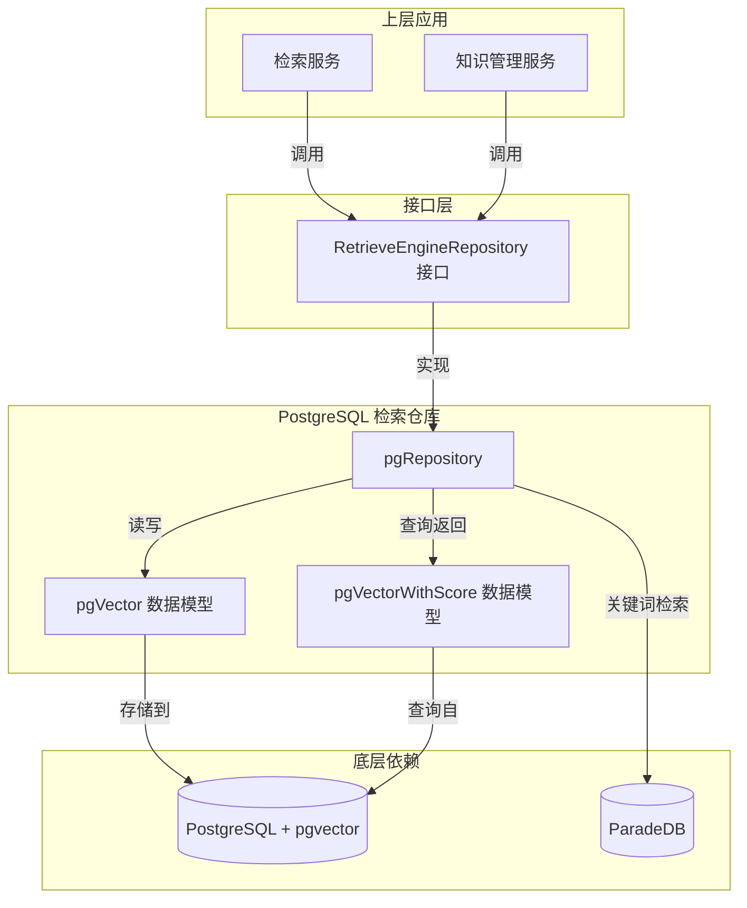

# PostgreSQL 向量检索仓库

## 概述

这个模块将 PostgreSQL 数据库转变为一个功能强大的向量搜索引擎，同时支持传统的关键词检索和现代的语义检索。想象一下，你有一个图书馆，既可以通过卡片目录（关键词）找到书籍，也可以通过描述书籍的内容（语义）来找到它们——这个模块就为你的数据提供了这样的双重检索能力。

在整个系统架构中，这个模块扮演着**向量检索后端**的角色，它实现了统一的检索引擎接口，使上层应用可以透明地使用 PostgreSQL 作为向量存储和检索的基础设施，而无需关心底层实现细节。

## 架构概览



这个模块的设计遵循了清晰的分层架构：

1. **接口层**：通过 `RetrieveEngineRepository` 接口定义了统一的检索操作契约
2. **实现层**：`pgRepository` 结构体实现了所有检索逻辑
3. **数据模型层**：`pgVector` 和 `pgVectorWithScore` 定义了数据库表结构
4. **基础设施层**：依赖 PostgreSQL 数据库、pgvector 扩展和 ParadeDB 扩展

核心的数据流向是：
- **写入路径**：`IndexInfo` → `toDBVectorEmbedding()` → `pgVector` → 数据库
- **读取路径**：数据库 → `pgVectorWithScore` → `fromDBVectorEmbeddingWithScore()` → `IndexWithScore`

## 核心设计决策

### 1. 统一检索接口，双引擎实现

**决策**：实现 `RetrieveEngineRepository` 接口，同时支持关键词检索和向量检索两种模式。

**为什么这样设计**：
- 不同的检索场景需要不同的检索方式：精确匹配用关键词，语义理解用向量
- 上层应用不需要知道底层用的是什么检索引擎，只需通过统一接口调用
- 便于未来替换或升级检索后端，而不影响上层业务逻辑

**替代方案**：
- ❌ 分别为关键词和向量检索创建不同的仓库接口：会增加上层应用的复杂度
- ❌ 只支持一种检索方式：无法满足多样化的检索需求

### 2. 使用半精度浮点数存储向量

**决策**：使用 `pgvector.HalfVector`（半精度浮点数）而不是全精度浮点数存储向量。

**为什么这样设计**：
- 存储空间节省 50%：半精度浮点数只需要 2 字节/维度，而全精度需要 4 字节
- 对于大多数语义检索场景，半精度的精度损失可以忽略不计
- 配合 HNSW 索引，检索速度更快，内存占用更低

**权衡**：
- ✅ 存储空间减半，检索性能提升
- ⚠️ 精度略有损失，但在语义检索场景下影响极小
- ⚠️ 需要确保所有向量维度一致

**计算示例**：
```
100 万条 1536 维向量：
- 全精度：100万 × 1536 × 4字节 ≈ 6.144 GB
- 半精度：100万 × 1536 × 2字节 ≈ 3.072 GB
加上 HNSW 索引（约 2 倍向量大小），总共节省约 6 GB 存储空间
```

### 3. 向量检索的两级查询策略

**决策**：在 `VectorRetrieve` 方法中使用子查询策略，先扩大候选集再应用阈值过滤。

**为什么这样设计**：
- HNSW 索引需要通过 `ORDER BY` 子句才能高效使用
- 如果在索引扫描阶段就应用距离阈值，PostgreSQL 可能无法有效使用 HNSW 索引
- 通过先获取更多候选（TopK × 2，最少 100，最多 1000），再在内存中过滤，可以兼顾准确性和性能

**查询结构**：
```sql
SELECT ... FROM (
    -- 子查询：利用 HNSW 索引快速获取候选
    SELECT ... ORDER BY embedding <=> query_vector LIMIT expanded_topK
) AS candidates
-- 外层查询：应用阈值过滤和最终排序
WHERE distance <= threshold
ORDER BY distance ASC
LIMIT topK
```

### 4. 批量操作的乐观锁策略

**决策**：在 `BatchSave` 中使用 `clause.OnConflict{DoNothing: true}` 来处理重复数据。

**为什么这样设计**：
- 避免了在插入前先查询是否存在的额外开销
- 在高并发场景下，即使多个请求同时插入相同数据，也不会报错
- 简化了错误处理逻辑，提高了批量操作的吞吐量

**权衡**：
- ✅ 性能更好，无需额外查询
- ✅ 并发安全性更高
- ⚠️ 如果需要知道哪些记录是新插入的、哪些是已存在的，这种方式无法提供该信息

## 子模块说明

本模块包含以下子模块，每个子模块都有详细的文档：

### 数据模型层
- **[PostgreSQL 向量数据模型](data_access_repositories-vector_retrieval_backend_repositories-postgres_vector_retrieval_repository-postgres_vector_embedding_models.md)**：定义了 `pgVector` 结构体，映射数据库表结构
- **[PostgreSQL 带评分的向量结果模型](data_access_repositories-vector_retrieval_backend_repositories-postgres_vector_retrieval_repository-postgres_scored_vector_result_models.md)**：定义了 `pgVectorWithScore` 结构体，用于返回带相似度评分的检索结果

### 实现层
- **[PostgreSQL 检索仓库实现](data_access_repositories-vector_retrieval_backend_repositories-postgres_vector_retrieval_repository-postgres_retrieval_repository_implementation.md)**：包含 `pgRepository` 的完整实现，包括向量检索、关键词检索、批量操作等

## 跨模块依赖

这个模块在整个系统中处于数据访问层，与其他模块的依赖关系如下：

### 依赖的模块
- **[核心领域类型与接口](core_domain_types_and_interfaces.md)**：依赖 `types.IndexInfo`、`types.RetrieveParams`、`types.RetrieveResult` 等领域模型
- **[平台基础设施与运行时](platform_infrastructure_and_runtime.md)**：依赖日志工具和通用工具函数
- **[检索与网络搜索服务](application_services_and_orchestration-retrieval_and_web_search_services.md)**：被检索服务调用，实现具体的检索逻辑

### 被依赖的模块
- **[检索引擎组合与注册](application_services_and_orchestration-retrieval_and_web_search_services-retriever_engine_composition_and_registry.md)**：通过工厂模式创建和管理检索引擎实例

## 使用指南

### 基本使用

```go
// 创建仓库实例
db, _ := gorm.Open(postgres.Open(dsn), &gorm.Config{})
repo := NewPostgresRetrieveEngineRepository(db)

// 保存向量索引
indexInfo := &types.IndexInfo{
    SourceID:        "chunk-123",
    SourceType:      types.SourceTypeChunk,
    Content:         "这是一段示例文本",
    KnowledgeBaseID: "kb-456",
}
additionalParams := map[string]any{
    "embedding": map[string][]float32{
        "chunk-123": embeddingVector, // 1536维向量
    },
}
repo.Save(ctx, indexInfo, additionalParams)

// 向量检索
params := types.RetrieveParams{
    RetrieverType:   types.VectorRetrieverType,
    Embedding:       queryVector,
    TopK:            10,
    Threshold:       0.8,
    KnowledgeBaseIDs: []string{"kb-456"},
}
results, _ := repo.Retrieve(ctx, params)
```

### 配置要求

1. **PostgreSQL 扩展**：
   - `pgvector`：用于向量存储和相似度检索
   - `ParadeDB`：用于关键词全文检索（可选，仅当使用关键词检索时需要）

2. **数据库表结构**：
   ```sql
   CREATE TABLE embeddings (
       id SERIAL PRIMARY KEY,
       created_at TIMESTAMP,
       updated_at TIMESTAMP,
       source_id VARCHAR NOT NULL,
       source_type INTEGER NOT NULL,
       chunk_id VARCHAR,
       knowledge_id VARCHAR,
       knowledge_base_id VARCHAR,
       tag_id VARCHAR,
       content TEXT NOT NULL,
       dimension INTEGER NOT NULL,
       embedding halfvec NOT NULL,
       is_enabled BOOLEAN DEFAULT true
   );
   
   -- HNSW 索引（用于向量检索）
   CREATE INDEX ON embeddings USING hnsw (embedding halfvec_cosine_ops)
   WITH (m = 16, ef_construction = 64);
   
   -- 过滤条件索引
   CREATE INDEX ON embeddings (dimension);
   CREATE INDEX ON embeddings (is_enabled);
   CREATE INDEX ON embeddings (knowledge_base_id);
   ```

### 性能优化建议

1. **索引配置**：
   - 根据向量维度和数据量调整 HNSW 索引参数 `m` 和 `ef_construction`
   - 为常用的过滤字段（`dimension`、`is_enabled`、`knowledge_base_id`）创建索引

2. **批量操作**：
   - 优先使用 `BatchSave` 而不是多次调用 `Save`
   - 批量大小建议在 100-1000 之间，根据实际情况调整

3. **检索参数**：
   - `TopK` 不要设置过大（建议 ≤ 100）
   - 合理设置 `Threshold`，避免返回过多低质量结果
   - 利用 `KnowledgeBaseIDs`、`KnowledgeIDs`、`TagIDs` 等过滤条件缩小检索范围

## 注意事项与陷阱

### 1. 向量维度必须一致

**问题**：所有存储的向量必须具有相同的维度，否则 HNSW 索引无法正常工作。

**解决方案**：
- 在 `VectorRetrieve` 方法中，我们强制添加了 `dimension = ?` 的过滤条件
- 确保在保存向量时正确设置 `dimension` 字段
- 同一个表中不要混合存储不同维度的向量

### 2. 阈值的方向问题

**问题**：`params.Threshold` 是相似度分数（0-1，越高越相似），但 pgvector 返回的是距离（0-2，越低越相似）。

**解决方案**：
- 在代码中进行了转换：`score = 1 - distance`
- 阈值过滤时使用：`distance <= 1 - threshold`
- 这个转换逻辑在 `VectorRetrieve` 方法的 SQL 查询中实现

### 3. `is_enabled` 的 NULL 处理

**问题**：历史数据可能没有 `is_enabled` 字段（为 NULL），需要将其视为启用状态。

**解决方案**：
- 在所有检索查询中都使用了条件：`(is_enabled IS NULL OR is_enabled = true)`
- 新数据默认设置 `is_enabled = true`
- 这样既兼容了历史数据，又保证了新数据的正确性

### 4. 关键词检索依赖 ParadeDB

**问题**：关键词检索功能依赖 ParadeDB 扩展，如果没有安装该扩展，关键词检索会失败。

**解决方案**：
- 检查 `Support()` 方法返回的检索类型，只使用支持的检索类型
- 如果只需要向量检索，可以不安装 ParadeDB
- 如果需要关键词检索，确保数据库中已正确安装 ParadeDB

### 5. 批量更新的分组策略

**问题**：直接遍历 `chunkStatusMap` 或 `chunkTagMap` 进行单条更新会导致性能问题。

**解决方案**：
- 在 `BatchUpdateChunkEnabledStatus` 中，先将 chunk 按启用状态分组，然后批量更新
- 在 `BatchUpdateChunkTagID` 中，先将 chunk 按 tag_id 分组，然后批量更新
- 这种方式可以大大减少 SQL 语句的数量，提高更新性能

## 总结

`postgres_vector_retrieval_repository` 模块是一个精心设计的向量检索基础设施，它：

1. **统一了检索接口**：让上层应用无需关心底层是关键词检索还是向量检索
2. **优化了存储和性能**：使用半精度浮点数和 HNSW 索引，在准确性和性能之间取得了良好平衡
3. **考虑了实际场景**：处理了历史数据兼容、批量操作、并发安全等实际问题
4. **提供了完整功能**：从保存、删除到检索、复制，覆盖了向量检索的全生命周期

这个模块的设计体现了"让复杂的事情变得简单，让简单的事情保持简单"的原则——上层应用使用起来非常简单，而底层实现则处理了所有的复杂性。
