# data_access_repositories 模块

## 概述

`data_access_repositories` 模块是系统的数据访问层，负责管理所有与数据持久化相关的操作。它提供了统一的数据访问抽象，支持多种存储后端（包括关系型数据库、向量数据库、图数据库等），并实现了租户隔离、资源共享和数据检索等核心功能。

## 架构概览

```mermaid
graph TB
    A[application_services_and_orchestration] -->|依赖| B[data_access_repositories]
    B --> C[content_and_knowledge_management_repositories]
    B --> D[identity_tenant_and_organization_repositories]
    B --> E[agent_configuration_and_external_service_repositories]
    B --> F[vector_retrieval_backend_repositories]
    B --> G[graph_retrieval_and_memory_repositories]
    C --> H[knowledge_and_corpus_storage_repositories]
    C --> I[conversation_history_repositories]
    C --> J[tagging_and_reference_count_repositories]
    C --> K[model_catalog_repository]
    D --> L[user_identity_and_auth_repositories]
    D --> M[tenant_management_repository]
    D --> N[organization_membership_sharing_and_access_control_repositories]
    E --> O[custom_agent_configuration_repository]
    E --> P[mcp_external_service_repository]
    F --> Q[elasticsearch_vector_retrieval_repository]
    F --> R[milvus_vector_retrieval_repository]
    F --> S[postgres_vector_retrieval_repository]
    F --> T[qdrant_vector_retrieval_repository]
    G --> U[memory_graph_repository]
    G --> V[neo4j_retrieval_repository]
```



这个模块采用分层架构设计，将数据访问逻辑划分为几个主要子模块：

1. **内容与知识管理仓库**：处理知识、文档块、会话和消息等核心业务数据
2. **身份、租户与组织仓库**：管理用户、租户、组织和资源共享权限
3. **代理配置与外部服务仓库**：存储自定义代理配置和外部服务连接信息
4. **向量检索后端仓库**：提供多种向量数据库的实现
5. **图检索与记忆仓库**：管理知识图谱和会话记忆

## 核心设计理念

### 1. 多租户数据隔离
模块通过在所有数据操作中强制使用租户 ID 过滤器，实现了严格的多租户数据隔离。每个仓库的查询方法都接受 `tenantID` 参数，确保租户间的数据完全隔离。

### 2. 统一接口抽象
模块为每种数据类型定义了清晰的接口契约（位于 `types/interfaces` 包），使得上层业务逻辑可以依赖抽象而非具体实现，提高了系统的可测试性和可扩展性。

### 3. 多种存储后端支持
对于向量检索，模块提供了多种数据库实现（Elasticsearch、Milvus、PostgreSQL、Qdrant），允许根据不同的部署场景选择最适合的存储方案。

### 4. 资源共享模型
模块实现了组织级别的资源共享机制，支持知识和代理在组织内部共享，并通过细粒度的权限控制确保数据安全。

## 子模块概览

### content_and_knowledge_management_repositories
负责管理系统的核心业务数据，包括知识文档、文档块、会话记录和消息历史等。该子模块是系统数据层的核心，提供了完整的 CRUD 操作和复杂查询能力。

详细内容请参考：[content_and_knowledge_management_repositories](data_access_repositories-content_and_knowledge_management_repositories.md)

### identity_tenant_and_organization_repositories
管理用户身份、租户配置、组织架构和资源共享权限。实现了完整的用户认证、授权和资源访问控制机制。

详细内容请参考：[identity_tenant_and_organization_repositories](data_access_repositories-identity_tenant_and_organization_repositories.md)

### agent_configuration_and_external_service_repositories
存储自定义代理的配置信息和外部服务（如 MCP 服务）的连接参数。

详细内容请参考：[agent_configuration_and_external_service_repositories](data_access_repositories-agent_configuration_and_external_service_repositories.md)

### vector_retrieval_backend_repositories
提供向量检索功能的多种实现，支持不同的向量数据库后端。每个实现都提供统一的接口，但针对特定数据库进行了优化。

详细内容请参考：[vector_retrieval_backend_repositories](data_access_repositories-vector_retrieval_backend_repositories.md)

### graph_retrieval_and_memory_repositories
管理知识图谱和会话记忆数据，使用图数据库存储和检索实体关系。

详细内容请参考：[graph_retrieval_and_memory_repositories](data_access_repositories-graph_retrieval_and_memory_repositories.md)

## 数据流向

典型的数据操作流程如下：

1. **写入流程**：应用服务 → 仓库层 → 数据库
   - 应用服务调用仓库接口
   - 仓库实现使用 GORM 或特定数据库客户端执行操作
   - 数据持久化到相应的存储后端

2. **读取流程**：数据库 → 仓库层 → 应用服务
   - 应用服务通过仓库接口发起查询
   - 仓库实现构建查询条件并执行
   - 结果映射为领域模型返回给应用服务

3. **向量检索流程**：查询 → 向量数据库 → 相似度计算 → 结果返回
   - 应用服务构建检索参数
   - 仓库实现将查询向量化
   - 在向量数据库中执行相似度搜索
   - 返回最相关的结果

## 关键设计决策

### 1. 租户隔离的实现方式
**选择**：在每个查询中显式传递租户 ID 并应用过滤条件
**替代方案**：使用数据库级别的租户隔离（如 PostgreSQL 的行级安全策略）

**理由**：
- 显式传递租户 ID 使隔离逻辑更加透明和可测试
- 支持跨租户的管理操作（如超级管理员功能）
- 不依赖特定数据库的特性，保持数据库无关性

### 2. 向量检索的多后端支持
**选择**：为每个向量数据库提供独立的仓库实现，通过统一接口抽象
**替代方案**：使用向量数据库抽象层（如 LangChain 的向量存储）

**理由**：
- 可以充分利用每个数据库的独特特性
- 避免过度抽象导致的功能限制
- 便于针对特定数据库进行性能优化

### 3. 软删除策略
**选择**：使用 GORM 的软删除功能，保留删除记录
**替代方案**：物理删除或归档到历史表

**理由**：
- 支持数据恢复和审计需求
- 保持引用完整性
- 符合现代应用的数据保留最佳实践

## 与其他模块的依赖关系

该模块被系统的其他核心模块广泛依赖：

- **application_services_and_orchestration**：主要消费者，使用仓库进行所有数据操作
- **http_handlers_and_routing**：通过服务层间接使用仓库
- **core_domain_types_and_interfaces**：定义了仓库接口和数据模型

## 使用指南

### 基本使用模式

```go
// 初始化仓库
db := // 获取 GORM 数据库连接
knowledgeRepo := repository.NewKnowledgeRepository(db)

// 创建记录
knowledge := &types.Knowledge{
    TenantID:        tenantID,
    KnowledgeBaseID: kbID,
    FileName:        "example.pdf",
    // ... 其他字段
}
err := knowledgeRepo.CreateKnowledge(ctx, knowledge)

// 查询记录
result, err := knowledgeRepo.GetKnowledgeByID(ctx, tenantID, knowledgeID)

// 更新记录
knowledge.FileName = "updated.pdf"
err = knowledgeRepo.UpdateKnowledge(ctx, knowledge)

// 删除记录
err = knowledgeRepo.DeleteKnowledge(ctx, tenantID, knowledgeID)
```

### 注意事项

1. **租户隔离**：始终确保在调用仓库方法时传递正确的租户 ID
2. **事务管理**：对于需要原子性的操作，使用 GORM 的事务支持
3. **批量操作**：对于大量数据操作，使用批量方法以提高性能
4. **错误处理**：注意处理仓库方法返回的特定错误类型（如 `ErrKnowledgeNotFound`）

## 扩展性

模块设计了多个扩展点：

1. **新的仓库实现**：可以通过实现 `interfaces` 包中定义的接口来添加新的仓库实现
2. **新的向量数据库**：可以通过实现 `RetrieveEngineRepository` 接口来添加新的向量数据库支持
3. **查询扩展**：可以在现有仓库中添加新的查询方法以支持特定的业务需求

## 总结

`data_access_repositories` 模块是系统的数据基石，提供了统一、安全、高效的数据访问能力。通过清晰的接口抽象和多后端支持，它既满足了当前的业务需求，也为未来的扩展留下了充足的空间。
