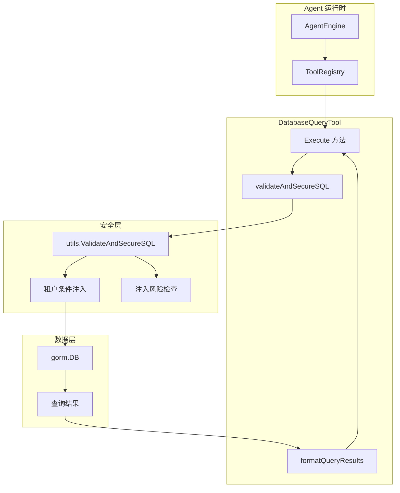

# database_query_execution 模块技术深度解析

## 模块概述：为什么需要这个模块？

想象一下，你正在构建一个 AI 助手，它需要回答用户关于知识库的问题："我们有多少个文档处于处理失败状态？"、"哪个知识库占用的存储空间最大？"。最直接的想法是让 AI 直接生成 SQL 查询数据库——但这就像把数据库的钥匙交给一个聪明的实习生，却没告诉他哪些门不能进。

**核心问题**：AI 生成的 SQL 查询存在三大风险：
1. **数据泄露**：多租户系统中，AI 可能无意中查询到其他租户的数据
2. **破坏性操作**：AI 可能生成 `DELETE`、`UPDATE` 或更危险的语句
3. **SQL 注入**：恶意用户可能通过提示词注入攻击数据库

`database_query_execution` 模块的设计洞察在于：**不信任 AI 生成的 SQL，但也不完全禁止它查询数据库**。它采用"受控执行"模式——在 SQL 到达数据库之前，通过一个安全层自动注入租户隔离条件、验证语句类型、限制可访问的表。这类似于机场安检：乘客（SQL 查询）可以登机（执行），但必须通过金属探测器（验证器）且不能携带危险品（危险语句）。

模块的核心职责是提供一个安全的数据库查询工具，让 AI 能够在多租户环境中安全地执行只读查询，同时自动处理租户隔离这一容易出错的安全细节。

## 架构设计：数据如何流动？



**数据流 walkthrough**：

1. **调用入口**：`AgentEngine` 通过 `ToolRegistry` 解析 AI 的工具调用请求，定位到 `DatabaseQueryTool.Execute` 方法
2. **上下文提取**：从 `context.Context` 中提取 `tenantID`（由上层中间件注入），这是租户隔离的关键
3. **参数解析**：将 AI 生成的 JSON 参数反序列化为 `DatabaseQueryInput` 结构
4. **安全验证**（核心环节）：调用 `validateAndSecureSQL`，委托给 `utils.ValidateAndSecureSQL` 进行多层验证
5. **租户注入**：安全层自动在 WHERE 子句中注入 `tenant_id = ?` 条件，AI 无需（也不能）手动处理
6. **查询执行**：使用 GORM 的 `Raw` 方法执行加固后的 SQL
7. **结果格式化**：将原始行数据转换为人类可读的文本和机器可用的结构化数据
8. **返回结果**：封装为 `ToolResult`，包含 `Success`、`Output`（文本）和 `Data`（结构化）

**架构角色**：这个模块是一个**带安全边界的执行器**（Guarded Executor）。它不是简单的数据库代理，而是在执行前施加了多层约束的"看门人"。它依赖于上游的上下文注入（tenantID）和下游的 SQL 验证工具，自身专注于编排执行流程和结果格式化。

## 组件深度解析

### DatabaseQueryTool

**设计意图**：这是 AI 可调用的数据库查询工具的运行时实现。它继承自 `BaseTool`，遵循工具系统的统一接口，但增加了数据库特定的安全逻辑。

**核心方法**：

#### `Execute(ctx context.Context, args json.RawMessage) (*types.ToolResult, error)`

这是工具的入口点，执行流程可分为四个阶段：

**阶段一：上下文准备**
```go
tenantID := uint64(0)
if tid, ok := ctx.Value(types.TenantIDContextKey).(uint64); ok {
    tenantID = tid
}
```
这里有一个关键的**隐式契约**：调用者必须确保 `ctx` 中包含 `TenantIDContextKey`。如果缺失，`tenantID` 会是 0，导致安全层可能无法正确注入隔离条件（取决于验证器的配置）。这是一个防御性设计——即使上下文缺失，工具也不会崩溃，但安全隔离可能失效。

**阶段二：参数验证**
```go
var input DatabaseQueryInput
if err := json.Unmarshal(args, &input); err != nil { ... }
if input.SQL == "" { ... }
```
简单的 JSON 解析和空值检查。注意这里没有对 SQL 内容做验证——那是安全层的职责，体现了**关注点分离**原则。

**阶段三：安全加固与执行**
```go
securedSQL, err := t.validateAndSecureSQL(input.SQL, tenantID)
rows, err := t.db.WithContext(ctx).Raw(securedSQL).Rows()
```
这是最关键的调用链。`validateAndSecureSQL` 委托给 `utils.ValidateAndSecureSQL`，后者执行：
- 语句类型检查（只允许 SELECT）
- 表名白名单验证（仅限 `knowledge_bases`、`knowledges`、`chunks`）
- 子查询和 CTE 禁止（防止复杂查询绕过）
- 危险函数检测（如 `pg_sleep`、`copy` 等）
- **租户条件注入**：在 WHERE 子句中自动添加 `tenant_id = ?`

**阶段四：结果处理**
```go
for rows.Next() {
    // 扫描行数据，将 []byte 转换为 string
    // 构建 map[string]interface{}
}
output := t.formatQueryResults(columns, results, securedSQL)
```
结果处理有两个输出通道：
- `Output`：人类可读的格式化文本，包含执行摘要和详细记录
- `Data`：结构化数据，包含 `columns`、`rows`、`row_count`、`query`、`tenant_id`、`display_type`

这种双通道设计考虑了不同的消费场景：AI 可以直接解析 `Data` 进行后续推理，而 `Output` 可以直接展示给用户。

**返回值**：`*types.ToolResult`
- `Success: true` + `Output` + `Data`：查询成功
- `Success: false` + `Error`：验证失败或执行错误

**副作用**：无状态修改，但会记录详细的日志（包括原始 SQL、加固后 SQL、结果行数等），这对审计和调试至关重要。

#### `validateAndSecureSQL(sqlQuery string, tenantID uint64) (string, error)`

这是一个**安全适配器**，将工具特定的调用转换为通用验证器的配置：

```go
securedSQL, validationResult, err := utils.ValidateAndSecureSQL(
    sqlQuery,
    utils.WithSecurityDefaults(tenantID),
    utils.WithInjectionRiskCheck(),
)
```

这里使用了**函数式选项模式**（Functional Options Pattern），允许灵活配置验证行为：
- `WithSecurityDefaults(tenantID)`：应用一套预设的安全策略，包括租户隔离、只读查询、表白名单等
- `WithInjectionRiskCheck()`：启用额外的注入风险检测

这种设计的好处是：如果未来需要为不同场景定制验证策略（例如管理员工具可以查询更多表），只需添加新的选项函数，而无需修改 `DatabaseQueryTool` 本身。

#### `formatQueryResults(columns []string, results []map[string]interface{}, query string) string`

结果格式化器，将原始数据转换为可读文本。设计上有几个值得注意的细节：

1. **NULL 值处理**：将 `nil` 显示为 `<NULL>`，避免空字符串混淆
2. **JSON 序列化尝试**：对复杂类型尝试 `json.Marshal`，确保嵌套结构可读
3. **结果数量警告**：如果超过 10 条记录，提示用户使用 `LIMIT`，这是一种**性能引导**设计

### DatabaseQueryInput

**设计意图**：这是 AI 与工具之间的**数据契约**。它极其简单，只有一个字段：

```go
type DatabaseQueryInput struct {
    SQL string `json:"sql" jsonschema:"The SELECT SQL query to execute. DO NOT include tenant_id condition - it will be automatically added for security."`
}
```

**关键设计决策**：
- **单字段设计**：只接受 SQL，不接受表名、条件等其他参数。这限制了 AI 的灵活性，但简化了验证逻辑
- **Schema 提示**：`jsonschema` 标签中的描述明确告诉 AI"不要包含 tenant_id 条件"，这是一种**防御性提示工程**——即使 AI 忽略了，安全层也会处理，但提示可以减少无效查询

**为什么不用参数化查询？** 一个直观的问题是：为什么不设计成 `table`、`fields`、`where` 等参数，让工具内部构建 SQL？答案是**灵活性 vs 安全性的权衡**。参数化构建可以完全防止注入，但会限制 AI 的查询能力（例如无法使用复杂的 JOIN、聚合函数）。当前设计选择信任验证器而非限制语法，这是一种更灵活的方案，但要求验证器必须足够健壮。

## 依赖关系分析

### 上游依赖（谁调用它）

**直接调用者**：`internal.agent.tools.registry.ToolRegistry`

当 `AgentEngine` 决定执行一个工具调用时，它通过 `ToolRegistry` 查找并执行对应的工具。调用链如下：

```
AgentEngine (决定调用工具)
    ↓
ToolRegistry (解析工具名，获取 Tool 实例)
    ↓
DatabaseQueryTool.Execute (执行查询)
```

**隐式依赖**：
- `context.Context` 必须包含 `types.TenantIDContextKey`，否则租户隔离可能失效
- `*gorm.DB` 必须已初始化并连接到正确的数据库

### 下游依赖（它调用谁）

**核心依赖**：`internal.utils.inject.ValidateAndSecureSQL`

这是整个安全模型的核心。`DatabaseQueryTool` 本身不包含验证逻辑，而是完全委托给这个工具函数。这种设计体现了**单一职责原则**：验证逻辑可以独立测试、复用和演进。

验证器的配置选项：
- `WithSecurityDefaults(tenantID)`：设置租户 ID、允许表白名单、启用只读检查等
- `WithInjectionRiskCheck()`：启用注入风险检测

**数据访问**：`gorm.DB`

使用 GORM 的 `Raw` 方法执行 SQL。选择 `Raw` 而非 GORM 的查询构建器是因为 AI 生成的是原生 SQL，GORM 的 ORM 功能在这里不适用。

**返回类型**：`types.ToolResult`

这是工具系统的标准返回类型，确保所有工具的输出格式一致，便于 `AgentEngine` 统一处理。

### 数据契约

**输入契约**（从 AI 到工具）：
```json
{
  "sql": "SELECT id, name FROM knowledge_bases LIMIT 10"
}
```
- 必须是有效的 JSON
- `sql` 字段必须是非空字符串
- SQL 必须是 SELECT 语句（由验证器强制执行）

**输出契约**（从工具到 AgentEngine）：
```go
&types.ToolResult{
    Success: true/false,
    Output: "人类可读的文本",
    Data: map[string]interface{}{
        "columns":      []string{"id", "name"},
        "rows":         []map[string]interface{}{...},
        "row_count":    10,
        "query":        "加固后的 SQL",
        "tenant_id":    123,
        "display_type": "database_query",
    },
    Error: "错误信息（如果失败）",
}
```

**关键约束**：
- `Data.display_type` 固定为 `"database_query"`，前端可以根据这个字段选择渲染组件
- `Data.tenant_id` 用于审计，确认查询是在正确的租户上下文中执行的

## 设计决策与权衡

### 1. 租户隔离：自动注入 vs 显式要求

**选择**：自动注入 `tenant_id` 条件，AI 不需要（也不应该）在 SQL 中包含它。

**为什么**：
- **减少 AI 错误**：AI 可能忘记添加条件，或者添加错误的条件
- **统一安全策略**：所有查询都经过相同的加固逻辑，避免遗漏
- **简化 AI 提示**：工具描述中明确告诉 AI"不要包含 tenant_id"，减少提示词复杂度

**权衡**：
- **灵活性损失**：如果未来需要跨租户查询（例如管理员场景），需要额外的机制
- **隐式行为**：AI 看不到最终的 SQL（包含注入的条件），可能影响其推理

**替代方案**：要求 AI 显式添加 `WHERE tenant_id = X`，然后验证器检查是否存在。但这会增加 AI 的负担，且容易出错。

### 2. 表白名单：硬编码 vs 动态配置

**选择**：在 `WithSecurityDefaults` 中硬编码允许的表：`knowledge_bases`、`knowledges`、`chunks`。

**为什么**：
- **安全默认值**：这些表都有 `tenant_id` 列，适合租户隔离
- **防止意外访问**：排除没有 `tenant_id` 的表（如 `messages`、`embeddings`），避免跨租户数据泄露

**权衡**：
- **扩展性限制**：添加新表需要修改代码并重新部署
- **耦合**：工具逻辑与数据库 schema 耦合

**替代方案**：从配置或元数据中动态读取允许的表。但这增加了复杂性，且可能引入配置错误导致的安全漏洞。

### 3. 验证器委托：内部实现 vs 外部依赖

**选择**：将验证逻辑委托给 `utils.ValidateAndSecureSQL`，而不是在工具内部实现。

**为什么**：
- **复用性**：其他工具（如未来的报表工具）可以复用相同的验证逻辑
- **可测试性**：验证器可以独立测试，不依赖工具的执行上下文
- **关注点分离**：工具专注于执行流程，验证器专注于安全策略

**权衡**：
- **调用链深度**：增加了一层间接，调试时可能需要追踪更多代码
- **依赖耦合**：工具依赖于验证器的接口稳定性

### 4. 结果格式：双通道输出 vs 单一格式

**选择**：同时提供 `Output`（文本）和 `Data`（结构化）两种输出。

**为什么**：
- **多场景支持**：AI 可以解析 `Data` 进行后续推理，用户可以看到 `Output` 的友好展示
- **前端集成**：`display_type` 字段允许前端选择专门的渲染组件（如表格、图表）

**权衡**：
- **数据冗余**：相同的数据存储了两次，增加内存占用
- **一致性维护**：需要确保 `Output` 和 `Data` 的内容一致

### 5. 日志策略：详细记录 vs 最小化

**选择**：记录原始 SQL、加固后 SQL、租户 ID、结果行数等详细信息。

**为什么**：
- **审计需求**：安全相关的操作需要完整的审计日志
- **调试支持**：当查询失败时，可以快速定位是验证问题还是执行问题
- **性能分析**：记录行数可以帮助识别低效查询

**权衡**：
- **日志量**：大量查询可能产生海量日志
- **敏感信息**：SQL 可能包含敏感数据（尽管在这个场景中不太可能）

**缓解措施**：使用 `Debug` 级别记录详细信息，生产环境可以调整日志级别。

## 使用指南与示例

### 基本使用

AI 调用工具的典型请求：

```json
{
  "tool": "database_query",
  "arguments": {
    "sql": "SELECT id, name, description FROM knowledge_bases ORDER BY created_at DESC LIMIT 10"
  }
}
```

工具返回：

```json
{
  "success": true,
  "output": "=== 查询结果 ===\n\n执行的 SQL: SELECT ...\n\n返回 10 行数据\n\n=== 数据详情 ===\n\n--- 记录 #1 ---\n  id: kb-123\n  name: 产品文档\n  description: ...\n...",
  "data": {
    "columns": ["id", "name", "description"],
    "rows": [{"id": "kb-123", "name": "产品文档", "description": "..."}],
    "row_count": 10,
    "query": "加固后的 SQL",
    "tenant_id": 456,
    "display_type": "database_query"
  }
}
```

### 常见查询模式

**统计文档状态分布**：
```sql
SELECT parse_status, COUNT(*) as count 
FROM knowledges 
GROUP BY parse_status
```

**查询知识库存储使用情况**：
```sql
SELECT kb.name, SUM(k.storage_size) as total_size 
FROM knowledge_bases kb 
JOIN knowledges k ON kb.id = k.knowledge_base_id 
GROUP BY kb.id, kb.name 
ORDER BY total_size DESC 
LIMIT 10
```

**查找最近处理的文档**：
```sql
SELECT id, title, file_name, processed_at 
FROM knowledges 
WHERE parse_status = 'completed' 
ORDER BY processed_at DESC 
LIMIT 5
```

### 配置选项

目前工具的配置主要通过 `utils.ValidateAndSecureSQL` 的选项函数实现。如果需要自定义验证策略（例如在测试环境中放宽限制），可以创建新的 `DatabaseQueryTool` 实例并传入自定义的验证选项：

```go
// 示例：自定义验证策略（实际使用中不推荐修改默认策略）
tool := &DatabaseQueryTool{
    BaseTool: databaseQueryTool,
    db:       db,
    // 未来可以添加自定义验证器配置
}
```

## 边界情况与注意事项

### 1. 租户 ID 缺失

**场景**：`context.Context` 中没有 `TenantIDContextKey`。

**行为**：`tenantID` 默认为 0，验证器会注入 `tenant_id = 0` 条件，导致查询返回空结果（假设没有租户 ID 为 0 的数据）。

**风险**：这可能导致 AI 认为"没有数据"，而实际上是因为租户 ID 缺失。

**建议**：在调用工具前，确保中间件已正确注入租户 ID。可以在 `Execute` 方法开头添加检查：

```go
if tenantID == 0 {
    return &types.ToolResult{
        Success: false,
        Error:   "Tenant ID not found in context",
    }, fmt.Errorf("missing tenant ID")
}
```

### 2. 复杂查询被拒绝

**场景**：AI 尝试使用子查询、CTE 或窗口函数。

**行为**：验证器会拒绝这些查询，返回错误。

**原因**：子查询和 CTE 可能被用来绕过表白名单或租户隔离。

** workaround**：将复杂查询拆分为多个简单查询，由 AI 在多次工具调用中逐步执行。

### 3. 结果截断

**场景**：查询返回大量数据（例如超过 1000 行）。

**行为**：工具会返回所有行，但 `formatQueryResults` 会添加警告提示。

**风险**：大量数据可能超出 AI 的上下文窗口，导致信息丢失。

**建议**：在工具描述中强调使用 `LIMIT`，并在 AI 提示中引导其分批次查询。

### 4. JOIN 跨表查询

**场景**：AI 尝试 JOIN 多个表。

**行为**：只要所有表都在白名单内，且都有 `tenant_id` 列，查询会被允许。

**风险**：如果 JOIN 条件不正确，可能导致意外的笛卡尔积。

**建议**：在工具描述中提供 JOIN 示例，引导 AI 正确使用。

### 5. SQL 语法错误

**场景**：AI 生成语法错误的 SQL。

**行为**：验证器的解析阶段会失败，返回解析错误。

**注意**：验证器使用 `pg_query` 解析 SQL，这意味着它针对 PostgreSQL 语法。如果底层数据库是其他类型（如 MySQL），可能会出现兼容性问题。

### 6. 时区和时间格式

**场景**：查询涉及时间字段。

**行为**：所有时间戳在数据库中是 UTC，工具返回原始值。

**建议**：在工具描述中明确说明时间格式，避免 AI 误解。

## 与其他模块的关系

- **[agent_core_orchestration](agent_core_orchestration.md)**：`AgentEngine` 通过 `ToolRegistry` 调用本模块
- **[schema_discovery_and_introspection](schema_discovery_and_introspection.md)**：`DataSchemaTool` 提供表结构信息，AI 可以先查询 schema 再生成查询
- **[tabular_data_analysis_and_structural_models](tabular_data_analysis_and_structural_models.md)**：`DataAnalysisTool` 提供数据分析能力，与本模块配合使用
- **[sql_validation_and_injection_safety](sql_validation_and_injection_safety.md)**：`utils.ValidateAndSecureSQL` 的实现细节，包含完整的验证逻辑

## 总结

`database_query_execution` 模块是一个精心设计的"受控执行器"，它在赋予 AI 数据库查询能力的同时，通过多层安全机制防止数据泄露和破坏性操作。其核心设计哲学是**不信任但可利用**——不信任 AI 生成的 SQL，但通过自动加固使其变得安全。

关键设计亮点：
1. **自动租户隔离**：消除 AI 忘记添加条件的风险
2. **委托验证**：将安全逻辑与执行逻辑分离，便于复用和测试
3. **双通道输出**：同时支持 AI 推理和用户展示
4. **详细日志**：为审计和调试提供完整信息

对于新贡献者，最重要的注意事项是：**任何修改验证策略的尝试都必须经过严格的安全审查**。这个模块是系统的安全边界之一，错误的修改可能导致跨租户数据泄露。
