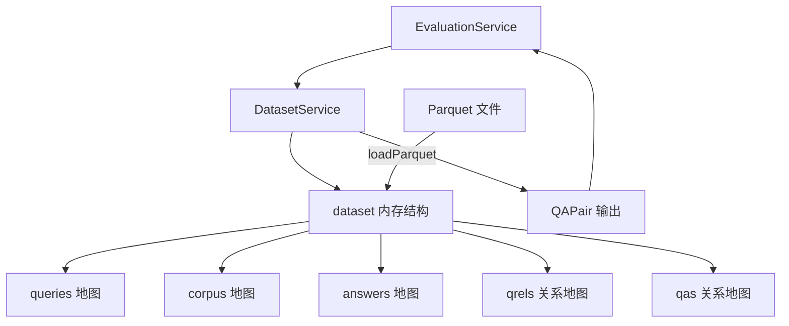

# dataset_modeling_and_service 模块深度解析

## 开篇：这个模块解决什么问题？

想象你正在构建一个问答系统的评估平台。你手头有大量测试数据——成千上万的问题、对应的答案、以及支撑答案的参考文档片段。这些数据需要被高效地加载、组织，并供评估流程随时查询。**dataset_modeling_and_service** 模块正是为此而生。

这个模块的核心职责是：**将存储在 Parquet 文件格式中的评估数据集加载到内存中，提供统一的查询接口，供评估服务生成 QA 对（Question-Answer Pairs）用于测试检索和生成质量**。它不是通用的数据访问层，而是专门为评估场景设计的轻量级、只读的内存数据集管理器。

为什么不能直接用数据库或文件系统逐条读取？因为评估过程需要频繁地随机访问问题、答案和文档片段之间的关联关系。如果每次评估都从磁盘读取，性能会成为瓶颈。这个模块的设计洞察是：**评估数据集通常是静态的、规模可控的（几千到几万条），完全可以一次性加载到内存中，用哈希表实现 O(1) 查询**。这种"预加载 + 内存索引"的模式，用空间换时间，让评估流程可以专注于算法本身而非 I/O 等待。

## 架构概览



**组件角色说明：**

- **DatasetService**：对外的服务门面，提供 `GetDatasetByID` 等公共方法。它隐藏了底层数据加载和组织的复杂性，让调用者无需关心数据来自 Parquet 文件还是其他存储。
- **dataset**：内部的内存数据结构，是模块的"大脑"。它用 5 个 `map` 分别存储问题文本、文档片段、答案文本，以及两种关联关系（问题 - 文档、问题 - 答案）。这种设计让各种查询操作都能在常数时间内完成。
- **TextInfo / RelsInfo / QaInfo**：Parquet 文件的数据契约。它们定义了磁盘上数据的布局，通过 `parquet` 标签映射到 Go 结构体字段。这是典型的"外部数据模式 → 内部领域模型"的转换层。
- **QAPair**（定义在 [core_domain_types_and_interfaces](core_domain_types_and_interfaces.md)）：评估流程真正消费的数据产品。它将分散在多个地图中的信息聚合成一个完整的 QA 对，包含问题、答案、相关文档片段及其 ID。

**数据流动路径：**

1. **初始化阶段**：`DefaultDataset()` 被调用 → 从 5 个 Parquet 文件加载数据 → 构建 `dataset` 结构的 5 个地图
2. **查询阶段**：`GetDatasetByID()` 被评估服务调用 → 调用 `dataset.Iterate()` → 遍历 `queries` 地图，对每个问题 ID 查找对应的答案和文档 → 返回 `[]*QAPair`
3. **评估消费**：评估服务拿到 QA 对列表，逐个测试检索引擎能否找到正确的文档、生成模型能否产出正确答案

## 组件深度解析

### DatasetService：评估数据的服务门面

**设计意图**：`DatasetService` 是一个无状态的服务结构体，它的作用是提供稳定的 API 边界。注意它的 `NewDatasetService()` 返回的是 `interfaces.DatasetService` 接口，这意味着系统预留了替换实现的可能（比如未来从数据库加载而非 Parquet 文件）。

**核心方法 `GetDatasetByID` 的机制**：

```go
func (d *DatasetService) GetDatasetByID(ctx context.Context, datasetID string) ([]*types.QAPair, error) {
    dataset := DefaultDataset()  // 每次调用都重新加载
    dataset.PrintStats(ctx)       // 打印统计信息
    qaPairs := dataset.Iterate()  // 生成 QA 对
    return qaPairs, nil
}
```

这里有一个**关键的设计选择**：每次调用 `GetDatasetByID` 都会重新从磁盘加载整个数据集。这看似低效，但在评估场景下是合理的——评估任务通常是批量的、低频的，重新加载保证了数据的新鲜度，避免了缓存一致性问题。不过，这也意味着如果数据集很大（超过 10 万条），调用者需要考虑缓存策略。

**参数与返回值**：
- `datasetID`：当前实现中这个参数实际上未被使用（硬编码为 `./dataset/samples`），这是一个**设计债务**——接口设计时预留了多数据集支持，但实现尚未跟上。
- 返回 `[]*types.QAPair`：评估流程可以直接迭代的完整 QA 对列表。

### dataset：内存中的数据索引引擎

**设计意图**：`dataset` 结构体是整个模块的核心抽象。它不是简单的数据容器，而是一个**为查询优化的索引结构**。理解它的关键是明白 5 个地图各自的角色：

| 地图 | 键 | 值 | 用途 |
|------|-----|-----|------|
| `queries` | `qid` (int64) | 问题文本 | 通过问题 ID 快速获取问题内容 |
| `corpus` | `pid` (int64) | 文档片段文本 | 通过文档 ID 快速获取参考内容 |
| `answers` | `aid` (int64) | 答案文本 | 通过答案 ID 快速获取答案 |
| `qrels` | `qid` (int64) | `[]pid` | 一个问题关联哪些文档（一对多） |
| `qas` | `qid` (int64) | `aid` | 一个问题对应哪个答案（一对一） |

这种设计类似于关系型数据库的**星型模式**：`queries` 是事实表，`corpus` 和 `answers` 是维度表，`qrels` 和 `qas` 是连接表。但用 Go 的 `map` 实现后，查询性能远超 SQL JOIN。

**`Iterate()` 方法的组装逻辑**：

这个方法是将分散的数据"物化"为完整 QA 对的关键。它的执行流程是：

1. 遍历 `queries` 地图的每个 `qid`
2. 用 `qid` 查 `qas` 地图，找到对应的 `aid`，再用 `aid` 查 `answers` 拿到答案文本
3. 用 `qid` 查 `qrels` 地图，找到所有相关的 `pid` 列表
4. 对每个 `pid` 查 `corpus` 地图，拿到文档片段文本
5. 组装成 `QAPair` 对象

这种"以问题为中心"的遍历策略，确保了每个 QA 对都是完整的。但注意，如果某个 `qid` 在 `qas` 或 `qrels` 中不存在，对应的字段会是空值——这是**预期行为**，因为不是所有问题都有标准答案或关联文档（有些评估场景只测试检索，不测试生成）。

**`GetContextForQID()` 的专用查询**：

这个方法是为检索评估场景设计的。当只需要测试"给定问题，能否找到相关文档"时，不需要加载答案信息。它直接返回 `[]string`（文档片段文本列表），避免了不必要的内存分配。

### Parquet 数据契约：TextInfo / RelsInfo / QaInfo

**设计意图**：这三个结构体是**外部数据模式与内部领域模型之间的适配器**。它们的存在是为了解耦：Parquet 文件的列名和类型可以独立变化，只要 `parquet` 标签映射正确，内部逻辑无需修改。

```go
type TextInfo struct {
    ID   int64  `parquet:"id"`
    Text string `parquet:"text"`
}
```

这里的 `parquet` 标签是 `parquet-go` 库的约定，告诉反序列化器将 Parquet 文件中的 `id` 列映射到 `ID` 字段。这种模式在数据工程中很常见——**用结构体标签声明映射关系，而非硬编码字段名**。

**为什么选择 Parquet？**

Parquet 是列式存储格式，相比 JSON 或 CSV 有以下优势：
- **压缩率高**：相同类型的数据连续存储，压缩效果更好
- **查询效率高**：可以只读取需要的列（虽然当前实现是全量加载）
- **模式明确**：文件自带 schema，避免类型推断错误

但这也带来了**操作约束**：Parquet 文件一旦生成就不易修改，适合"一次写入、多次读取"的评估数据场景。如果需要频繁更新数据集，应该考虑其他存储形式。

### 工具方法：PrintStats 与 PrintRandomQA

这两个方法看似简单，实则体现了**评估数据质量验证**的设计思想。

`PrintStats()` 输出三个关键指标：
- **数据规模**：问题、文档、答案的数量，帮助评估者判断数据集是否具有统计意义
- **平均关联文档数**：反映检索任务的难度（平均关联文档越多，检索越容易）
- **答案覆盖率**：有多少问题有标准答案，这对生成评估至关重要

`PrintRandomQA()` 则是**人工抽检工具**。在运行自动化评估前，开发者可以随机查看几条 QA 对，确认数据格式正确、内容合理。这种"快速反馈"机制在数据工程中非常重要。

## 依赖关系分析

### 上游依赖：谁调用这个模块？

根据模块树，`dataset_modeling_and_service` 属于 `evaluation_dataset_and_metric_services` 子模块，主要被以下组件调用：

- **[EvaluationService](evaluation_orchestration_and_state.md)**：评估编排服务，调用 `GetDatasetByID` 获取测试数据，然后驱动检索和生成评估流程
- **评估相关的 HTTP Handler**：`internal.handler.evaluation.EvaluationHandler` 可能通过服务层间接调用数据集

**调用契约**：调用者期望 `GetDatasetByID` 返回的 `QAPair` 列表是完整的、可直接用于评估的。如果数据集加载失败，当前实现会 `panic`，这意味着调用者无法优雅降级——这是一个**潜在的稳定性风险**。

### 下游依赖：这个模块调用谁？

- **parquet-go 库**：通过 `parquet.ReadFile[T]` 读取 Parquet 文件。这是唯一的外部依赖，版本升级可能导致兼容性问题
- **logger 包**：用于记录加载过程和统计信息，属于可观测性依赖
- **types.QAPair**：定义在 [core_domain_types_and_interfaces](core_domain_types_and_interfaces.md)，是数据输出的契约

**数据契约细节**：
- 输入：5 个 Parquet 文件，必须存在于 `./dataset/samples/` 目录
- 输出：`[]*types.QAPair`，每个元素包含 `QID`, `Question`, `PIDs`, `Passages`, `AID`, `Answer`

### 跨模块引用

- [core_domain_types_and_interfaces](core_domain_types_and_interfaces.md) 中的 `QAPair` 类型：这是评估数据的标准表示，数据集服务负责填充它
- [evaluation_orchestration_and_state](evaluation_orchestration_and_state.md) 中的 `EvaluationService`：数据集服务的直接消费者
- [retrieval_quality_metrics](retrieval_quality_metrics.md) 和 [generation_text_overlap_metrics](generation_text_overlap_metrics.md)：这些指标计算模块会消费 `QAPair` 中的答案和文档信息

## 设计决策与权衡

### 权衡 1：全量加载 vs 按需加载

**选择**：全量加载到内存

**理由**：评估数据集通常规模有限（几千到几万条），内存占用可控（每条 QA 对约 1KB，1 万条约 10MB）。全量加载后，所有查询都是 O(1) 的内存访问，评估流程不会受 I/O 延迟影响。

**代价**：如果数据集增长到百万级，内存会爆炸。此时需要改为按需加载或引入缓存层。当前代码中 `DefaultDataset()` 每次调用都重新加载，也说明设计者假设数据集不会太大。

### 权衡 2：硬编码路径 vs 可配置路径

**选择**：硬编码 `./dataset/samples`

**理由**：简化实现，评估数据通常是部署时准备好的，路径固定。

**代价**：灵活性差，多环境部署（开发、测试、生产）需要修改代码或 symlink。`datasetID` 参数未被使用就是一个信号——**接口设计超前于实现**。

### 权衡 3：panic vs 错误返回

**选择**：`DefaultDataset()` 中加载失败直接 `panic`

**理由**：评估数据是评估任务的先决条件，如果数据加载失败，评估无法进行，快速失败比继续运行更安全。

**代价**：调用者无法捕获错误并降级。在生产环境中，这可能导致整个评估服务崩溃。更好的做法是返回 `error`，让调用者决定如何处理。

### 权衡 4：无状态服务 vs 单例缓存

**选择**：`DatasetService` 无状态，每次调用重新加载

**理由**：避免缓存一致性问题，评估数据可能随时间更新。

**代价**：重复加载浪费资源。如果评估流程需要多次调用 `GetDatasetByID`，应该在外层做缓存。

## 使用指南与示例

### 基本使用模式

```go
// 1. 创建服务实例
datasetSvc := service.NewDatasetService()

// 2. 获取 QA 对列表用于评估
qaPairs, err := datasetSvc.GetDatasetByID(ctx, "sample-dataset")
if err != nil {
    // 处理错误
}

// 3. 遍历 QA 对进行评测
for _, pair := range qaPairs {
    fmt.Printf("问题：%s\n", pair.Question)
    fmt.Printf("答案：%s\n", pair.Answer)
    fmt.Printf("参考文档数：%d\n", len(pair.Passages))
}
```

### 配置选项

当前实现没有运行时配置选项，数据集路径硬编码。如需自定义，可修改 `DefaultDataset()` 函数：

```go
func DefaultDatasetWithDir(datasetDir string) dataset {
    queries, err := loadParquet[TextInfo](fmt.Sprintf("%s/queries.parquet", datasetDir))
    // ... 其余加载逻辑
}
```

### 扩展点

1. **多数据集支持**：实现 `datasetID` 参数，根据 ID 选择不同目录
2. **增量加载**：添加 `ReloadDataset()` 方法，支持运行时刷新数据
3. **过滤查询**：添加 `GetQAPairsByTag()` 等方法，支持按标签筛选评估数据

## 边界情况与陷阱

### 陷阱 1：缺失的关联关系

不是所有 `qid` 都在 `qas` 或 `qrels` 中有记录。`Iterate()` 方法会处理这种情况（答案为空字符串，文档列表为空），但调用者需要意识到**部分 QA 对可能不完整**。在计算指标时，需要跳过这些不完整的样本。

### 陷阱 2：ID 类型转换

内部使用 `int64` 存储 ID，但 `QAPair` 输出使用 `int`。在 32 位系统上，如果 ID 超过 `2^31-1`，会发生溢出。虽然评估数据集中 ID 通常很小，但这是一个**隐式的类型契约**，调用者应确保 ID 范围安全。

### 陷阱 3：并发安全

`dataset` 结构体不是并发安全的。如果多个 goroutine 同时调用 `Iterate()` 或 `GetContextForQID()`，可能发生数据竞争。当前实现中每次调用都创建新的 `dataset` 实例，避免了这个问题，但如果未来引入缓存，需要添加读写锁。

### 陷阱 4：文件路径依赖

Parquet 文件路径是相对路径 `./dataset/samples`。如果工作目录不是项目根目录（例如在容器中运行），文件会找不到。**部署时需要确保工作目录正确，或改为绝对路径**。

### 已知限制

1. **不支持流式加载**：必须一次性加载全部数据，无法处理超大数据集
2. **不支持动态更新**：加载后数据不可变，新增数据需要重新加载
3. **不支持复杂查询**：只能按 ID 查询，无法按内容搜索（这是检索引擎的职责）

## 运维考虑

### 监控指标

建议监控以下指标：
- 数据集加载时间（`DefaultDataset()` 执行时长）
- QA 对数量（`PrintStats()` 中的统计）
- 答案覆盖率（低于 80% 可能表示数据质量问题）

### 故障排查

如果评估流程报告"无数据"，按以下顺序检查：
1. Parquet 文件是否存在于 `./dataset/samples/`
2. 文件权限是否可读
3. Parquet 文件格式是否正确（可用 `parquet-tools` 验证）
4. `qid` 在 `queries`、`qrels`、`qas` 中是否一致

## 参考链接

- [core_domain_types_and_interfaces](core_domain_types_and_interfaces.md) - `QAPair` 类型定义
- [evaluation_orchestration_and_state](evaluation_orchestration_and_state.md) - `EvaluationService` 评估编排
- [retrieval_quality_metrics](retrieval_quality_metrics.md) - 检索质量指标计算
- [generation_text_overlap_metrics](generation_text_overlap_metrics.md) - 生成质量指标计算
