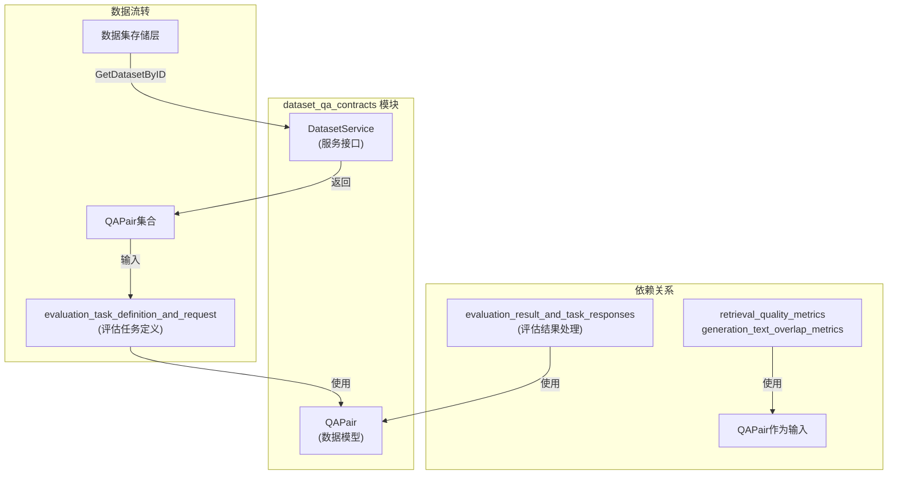

# dataset_qa_contracts 模块深度解析

## 为什么这个模块存在？

在任何复杂的问答系统评估框架中，数据质量和数据契约的一致性是评估结果可靠性的基石。`dataset_qa_contracts` 模块解决了一个看似简单但至关重要的问题：**如何以一种类型安全、可扩展且语义清晰的方式定义和传递问答评估所需的基本数据单元？**

想象一个评估系统，其中不同的模块——数据集加载器、检索引擎、问答生成器和评估计算器——需要交换有关问题、相关段落和答案的信息。如果没有统一的数据契约，每个模块可能会对"问答对"有不同的理解：有的可能用不同的字段名，有的可能缺少关键的元数据，有的可能对数据格式有不同的假设。这就像一群人说不同的语言却试图进行一场重要的商务谈判——沟通成本高昂且容易出错。

`dataset_qa_contracts` 模块就是这个评估系统的"通用语言"，它定义了所有参与者都能理解的标准数据结构和服务接口，确保数据在整个评估流程中能够无缝、准确地流动。

## 核心概念与架构

### 核心抽象

这个模块围绕两个关键抽象构建：

1. **QAPair**：问答对的原子数据单元
2. **DatasetService**：数据集访问的统一服务接口

### 架构图



## 核心组件详解

本模块包含两个主要子模块，分别处理数据模型和服务接口契约。

### qa_pair_domain_model 子模块

这个子模块定义了问答评估的核心数据结构。有关 `QAPair` 结构的详细设计原理、使用场景和最佳实践，请参阅 [qa_pair_domain_model 子模块文档](core_domain_types_and_interfaces-evaluation_dataset_and_metric_contracts-dataset_qa_contracts-qa_pair_domain_model.md)。

### dataset_service_interface_contract 子模块

这个子模块定义了数据集访问的标准接口契约。有关 `DatasetService` 接口的设计思想、实现考虑和扩展建议，请参阅 [dataset_service_interface_contract 子模块文档](core_domain_types_and_interfaces-evaluation_dataset_and_metric_contracts-dataset_qa_contracts-dataset_service_interface_contract.md)。

### QAPair：问答评估的原子单位

`QAPair` 是整个评估系统的基础数据结构，它封装了一个完整的问答评估样本所需的所有信息。

```go
type QAPair struct {
        QID      int      // Question ID
        Question string   // Question text
        PIDs     []int    // Related passage IDs
        Passages []string // Passage texts
        AID      int      // Answer ID
        Answer   string   // Answer text
}
```

#### 设计意图

这个结构看似简单，但每个字段都有其存在的理由：

1. **双重标识机制**（QID/AID/PIDs）：每个问题、答案和段落都有独立的数字ID。这支持：
   - 精确的引用和追踪
   - 在大型数据集中的高效索引
   - 跨多个系统的一致性引用

2. **ID与文本并存**：同时存储ID和文本内容是一个有意的设计权衡：
   - 提供自包含的数据单元（无需额外查找）
   - 支持离线处理和调试
   - 便于在不同系统间传输完整的评估样本

3. **段落的双重表示**：`PIDs` 和 `Passages` 是对应的，这种设计允许：
   - 灵活的使用场景：有时只需要ID，有时需要完整内容
   - 支持段落级别的评估指标计算
   - 便于实现基于段落的检索质量评估

### DatasetService：数据集访问的契约

`DatasetService` 接口定义了访问评估数据集的标准方式：

```go
type DatasetService interface {
        // GetDatasetByID retrieves QA pairs from dataset by ID
        GetDatasetByID(ctx context.Context, datasetID string) ([]*types.QAPair, error)
}
```

#### 设计意图

这个简洁的接口体现了几个重要的设计原则：

1. **最小接口原则**：只定义一个方法，遵循"接口应该小而专注"的设计哲学
2. **上下文感知**：接受 `context.Context` 参数，支持超时控制、取消和请求追踪
3. **统一的数据返回格式**：确保所有数据集提供者都返回相同的 `QAPair` 结构
4. **错误处理**：明确返回错误，允许调用者适当地处理失败情况

## 数据流程解析

### 典型的数据流向

当一个评估任务启动时，数据在系统中的流动路径如下：

1. **评估任务初始化**：`evaluation_task_definition_and_request` 模块接收到评估请求
2. **数据集获取**：通过 `DatasetService.GetDatasetByID()` 获取完整的 `QAPair` 集合
3. **评估执行**：每个 `QAPair` 被依次处理：
   - 问题被发送到问答系统
   - 相关段落用于评估检索质量
   - 标准答案用于评估生成质量
4. **结果计算**：`retrieval_quality_metrics` 和 `generation_text_overlap_metrics` 模块使用 `QAPair` 中的标准答案和系统输出进行对比计算
5. **结果聚合**：`evaluation_result_and_task_responses` 模块汇总所有 `QAPair` 的评估结果

### 设计权衡分析

这个模块的设计展现了几个关键的权衡决策：

#### 1. 自包含 vs 引用依赖

**选择**：QAPair 同时包含 ID 和文本内容，是自包含的

**替代方案**：只存储 ID，通过其他服务获取文本

**权衡理由**：
- ✅ 自包含使得数据单元可以独立使用，不依赖外部服务
- ✅ 便于调试和测试，可以直接看到完整数据
- ❌ 增加了内存占用和传输开销
- ❌ 可能存在数据不一致的风险（ID 与文本不匹配）

**为什么这样选择**：在评估场景中，数据的完整性和可重复性比存储空间更重要。评估结果需要能够独立于原始数据源进行复现和验证。

#### 2. 简单接口 vs 丰富功能

**选择**：DatasetService 只定义了一个简单的 GetDatasetByID 方法

**替代方案**：定义更丰富的接口，支持分页、过滤、抽样等

**权衡理由**：
- ✅ 简单接口更容易实现和维护
- ✅ 降低了实现者的负担
- ❌ 可能需要在其他地方补充功能
- ❌ 某些高级用例可能需要额外的抽象

**为什么这样选择**：遵循"你不需要它"（YAGNI）原则，只定义当前明确需要的功能。复杂的数据集操作可以在更高层次的服务中实现。

#### 3. 切片 vs 迭代器

**选择**：GetDatasetByID 返回完整的切片

**替代方案**：返回迭代器或流式接口

**权衡理由**：
- ✅ 切片使用简单，不需要处理迭代状态
- ✅ 支持随机访问，便于实现需要多次遍历数据的算法
- ❌ 对于大型数据集可能占用大量内存
- ❌ 无法处理超出现有内存的超大数据集

**为什么这样选择**：在当前的使用场景中，评估数据集通常不会大到无法放入内存。简单性优先于处理超大规模数据的能力。

## 与其他模块的关系

`dataset_qa_contracts` 是一个典型的"契约"模块，它被多个上游模块依赖，但自身依赖很少。

### 被依赖模块

- **evaluation_task_definition_and_request**：使用 QAPair 作为评估任务的输入数据
- **evaluation_result_and_task_responses**：使用 QAPair 计算和存储评估结果
- **retrieval_quality_metrics**：使用 QAPair 中的 PIDs 和 Passages 评估检索质量
- **generation_text_overlap_metrics**：使用 QAPair 中的 Answer 评估生成质量

### 依赖模块

这个模块几乎没有外部依赖，只依赖标准库的 context 包和项目内部的基础类型。

## 扩展点与使用建议

### 扩展 DatasetService

实现自定义的 DatasetService 时，应该注意：

1. **并发安全**：GetDatasetByID 可能会被多个 goroutine 同时调用
2. **上下文处理**：应该尊重 ctx 的取消和超时信号
3. **错误传递**：返回有意义的错误信息，便于调用者诊断问题
4. **数据验证**：确保返回的 QAPair 结构完整、数据有效

### QAPair 使用最佳实践

1. **保持不变性**：在传递过程中不要修改 QAPair 的内容
2. **指针使用**：使用指针传递 QAPair 以避免复制，但要注意并发安全
3. **验证完整性**：在使用前验证必要的字段是否存在
4. **日志记录**：在调试时记录 QID，便于追踪问题

## 常见陷阱与注意事项

### 1. 数据一致性

**陷阱**：PIDs 和 Passages 可能不匹配（长度不同或顺序不对）

**建议**：在使用前验证这两个切片的长度是否一致，并考虑添加方法来安全地访问对应的段落。

### 2. 空值处理

**陷阱**：某些字段可能为空或零值，特别是在处理不完整的数据集时

**建议**：始终检查关键字段的有效性，不要假设所有字段都有值。

### 3. 内存考虑

**陷阱**：对于大型数据集，一次性加载所有 QAPair 可能会占用大量内存

**建议**：如果处理超大数据集，考虑在更高层次添加流式处理或分页支持，或者考虑扩展 DatasetService 接口。

## 总结

`dataset_qa_contracts` 模块虽然代码量少，但它是整个评估系统的基础。它通过定义清晰的数据契约，确保了不同模块之间能够可靠地交换评估数据。它的设计体现了"简单胜于复杂"的原则，同时为未来的扩展留下了空间。

理解这个模块的关键是认识到它不仅仅是一些数据结构和接口的集合，更是整个评估系统的"语言规范"——所有参与者都必须遵循这个规范才能有效地协作。
