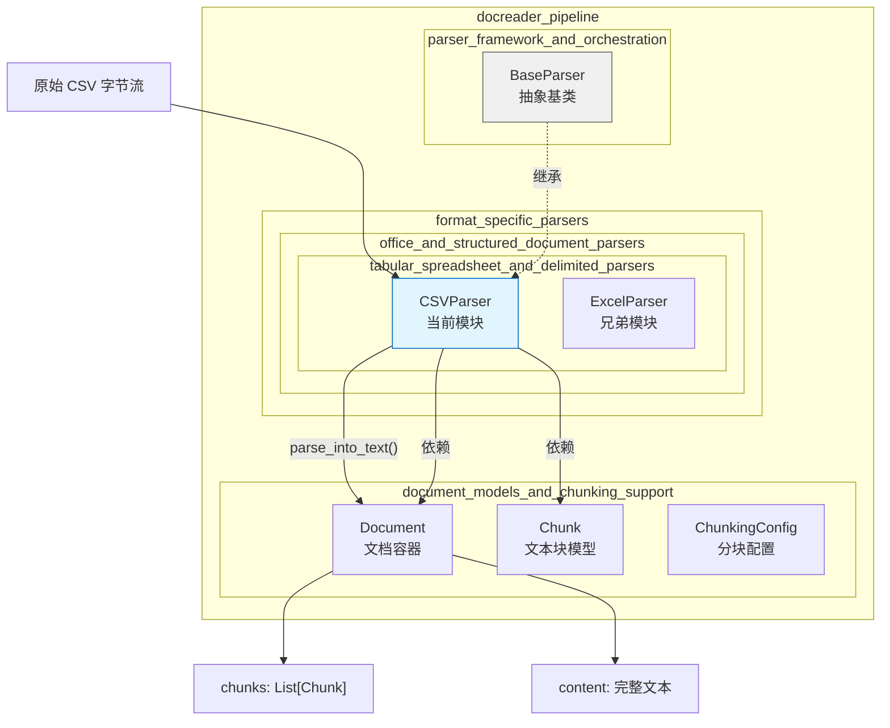

# delimited_text_table_parsing 模块深度解析

## 概述：为什么需要这个模块

想象你有一个包含数万行客户记录、产品目录或交易日志的 CSV 文件。如果直接把整个文件扔进向量数据库做语义检索，会发生什么？检索结果会返回整个文件 —— 这就像有人问你"张三的邮箱是什么"，你却把整本电话簿都递给他。

`delimited_text_table_parsing` 模块解决的就是这个**粒度问题**。它的核心洞察是：**表格数据中的每一行才是一个有意义的检索单元**，而不是整个表格。这个模块将 CSV 文件解析成结构化的文本块（Chunk），每一行变成一个独立的、可被单独检索的片段。

但这里有个微妙之处：表格数据是二维的（行 × 列），而下游的检索系统是基于一维文本流的。这个模块的设计精髓就在于它如何优雅地完成这个**维度转换** —— 把 `列名：值` 的键值对序列化成自然语言风格的文本，同时保留足够的结构信息让检索系统理解每个字段的语义。

## 架构定位与数据流



### 模块在系统中的角色

这个模块位于 `docreader_pipeline` → `format_specific_parsers` → `tabular_spreadsheet_and_delimited_parsers` 路径下，是整个文档解析流水线中的**格式特定解析器**之一。

**上游调用者**：
- `knowledge_ingestion_orchestration` 模块中的 `knowledgeService` 在导入知识库时会调用解析器
- `chat_pipeline` 中的 `PluginDataAnalysis` 在处理用户上传的表格文件时会使用此解析器

**下游消费者**：
- `chunkRepository` 将解析后的 Chunk 持久化到存储层
- `RetrieveEngine` 对 Chunk 进行向量化和检索

**数据流路径**：
```
用户上传 CSV → knowledgeService → CSVParser.parse_into_text() 
→ Document[Chunk...] → chunkRepository → 向量数据库
```

## 核心组件深度解析

### CSVParser 类：表格到文本的转换器

#### 设计意图

`CSVParser` 继承自 [`BaseParser`](#baseparser-抽象基类)，实现了 `parse_into_text()` 抽象方法。它的设计遵循**单一职责原则** —— 只负责把 CSV 的二维结构转换成一维的文本流，不负责分块策略（那是 `BaseParser.chunk_text()` 的职责）、不负责多模态处理（那是 `BaseParser.process_chunks_images()` 的职责）。

#### 内部工作机制

```python
def parse_into_text(self, content: bytes) -> Document:
    chunks: List[Chunk] = []
    text: List[str] = []
    start, end = 0, 0

    # 1. 使用 pandas 读取 CSV，自动跳过错误行
    df = pd.read_csv(BytesIO(content), on_bad_lines="skip")

    # 2. 逐行转换为"列名：值"格式
    for i, (idx, row) in enumerate(df.iterrows()):
        content_row = (
            ",".join(
                f"{col.strip()}: {str(row[col]).strip()}" for col in df.columns
            )
            + "\n"
        )
        end += len(content_row)
        text.append(content_row)
        
        # 3. 为每行创建带位置追踪的 Chunk
        chunks.append(Chunk(content=content_row, seq=i, start=start, end=end))
        start = end

    return Document(content="".join(text), chunks=chunks)
```

**关键设计决策分析**：

1. **为什么用 pandas 而不是 csv 标准库？**
   
   pandas 的 `read_csv()` 提供了几个关键优势：
   - `on_bad_lines="skip"` 自动跳过格式错误的行，避免整个解析失败
   - 自动处理编码检测、引号转义、空值填充等边界情况
   - `DataFrame.iterrows()` 提供统一的行迭代接口，无论 CSV 的实际格式如何
   
   代价是引入了 pandas 这个重量级依赖，但对于企业级应用，解析鲁棒性比依赖精简更重要。

2. **为什么每行一个 Chunk 而不是整个表格一个 Chunk？**
   
   这是**检索粒度**的权衡：
   - 整个表格一个 Chunk：检索时要么全中要么全不中，无法精确定位到具体记录
   - 每行一个 Chunk：可以精确检索到"张三的记录"，但丢失了表格的整体结构
   
   当前选择是**偏向检索精度**。如果用户需要表格结构，应该使用 [`ExcelParser`](../docreader_pipeline.md) 或其他保留二维结构的解析器。

3. **为什么输出格式是"列名：值"而不是 CSV 原样？**
   
   考虑检索场景：用户搜索"邮箱包含 gmail 的客户"。如果 Chunk 内容是 `张三,zhang@gmail.com,北京`，向量模型很难理解"zhang@gmail.com"和"邮箱"的关系。但如果内容是 `姓名：张三，邮箱：zhang@gmail.com，城市：北京`，语义关联就清晰得多。

#### 参数与返回值

| 参数/返回值 | 类型 | 说明 |
|------------|------|------|
| `content` (输入) | `bytes` | CSV 文件的原始字节流 |
| `Document` (返回) | `Document` | 包含完整文本和 Chunk 列表的文档对象 |
| `Document.content` | `str` | 所有行拼接的完整文本，用于全文索引 |
| `Document.chunks` | `List[Chunk]` | 每行一个 Chunk，用于向量检索 |

#### 副作用

- 无外部副作用（不写文件、不发起网络请求）
- 内部状态：无（纯函数式设计，便于测试和重试）

### 与 BaseParser 的继承关系

`BaseParser` 定义了所有解析器的**公共契约**：

```python
@abstractmethod
def parse_into_text(self, content: bytes) -> Document:
    """解析文档内容"""
```

`CSVParser` 实现这个接口后，自动获得 `BaseParser` 提供的以下能力：

1. **回退分块策略**：如果 `parse_into_text()` 返回的 Chunk 为空，`BaseParser.parse()` 会调用 `TextSplitter` 按字符数重新分块
2. **多模态处理**：如果配置了 `enable_multimodal=True`，会自动提取 Chunk 中的图片并进行 OCR
3. **Chunk 数量限制**：通过 `max_chunks` 参数限制返回的 Chunk 数量，避免内存爆炸

**耦合点**：`CSVParser` 依赖 `BaseParser` 的 `chunking_config` 来获取 `storage_config` 和 `vlm_config`，这意味着它无法独立于 `BaseParser` 的初始化逻辑使用。

### Document 和 Chunk 数据模型

#### Document：解析结果的容器

```python
class Document(BaseModel):
    content: str                    # 完整文本
    images: Dict[str, str]          # 图片映射（CSV 解析器通常为空）
    chunks: List[Chunk]             # 分块列表
    metadata: Dict[str, Any]        # 元数据
```

**设计意图**：`Document` 是一个**聚合根**，它同时持有完整文本（用于关键词匹配）和分块列表（用于向量检索）。这种设计支持**混合检索策略** —— 先用关键词过滤候选集，再用向量相似度排序。

#### Chunk：最小检索单元

```python
class Chunk(BaseModel):
    content: str        # 文本内容
    seq: int           # 序号（从 0 开始）
    start: int         # 在 Document.content 中的起始位置
    end: int           # 在 Document.content 中的结束位置
    images: List[Dict] # 图片信息（CSV 解析器通常为空）
    metadata: Dict     # 元数据
```

**位置追踪的意义**：`start` 和 `end` 字段允许系统在需要时**重建上下文**。例如，用户检索到某个 Chunk 后，系统可以通过 `Document.content[chunk.start:chunk.end + 500]` 获取该 Chunk 及后续 500 字符的上下文。

## 依赖关系分析

### 直接依赖

| 依赖组件 | 来源模块 | 用途 |
|---------|---------|------|
| `BaseParser` | `parser_framework_and_orchestration` | 继承基类，获得公共解析能力 |
| `Document` | `document_models_and_chunking_support` | 返回类型，封装解析结果 |
| `Chunk` | `document_models_and_chunking_support` | 构建分块列表 |
| `pandas` | 第三方库 | CSV 解析引擎 |

### 被依赖关系

| 调用方 | 来源模块 | 调用场景 |
|-------|---------|---------|
| `knowledgeService` | `knowledge_ingestion_orchestration` | 知识库导入时解析 CSV 文件 |
| `PluginDataAnalysis` | `structured_data_analysis_plugin` | 对话中分析用户上传的表格 |
| `chunkService` | `chunk_lifecycle_management` | 手动触发 Chunk 更新时 |

### 数据契约

**输入契约**：
- 必须是有效的 CSV 字节流（支持 RFC 4180 标准）
- 编码：UTF-8 优先，pandas 会自动检测其他编码
- 大小：无硬性限制，但大文件会消耗大量内存（pandas 一次性加载）

**输出契约**：
- `Document.chunks` 中的每个 Chunk 对应 CSV 的一行数据
- `Chunk.seq` 从 0 开始连续递增
- `Chunk.start` 和 `Chunk.end` 在 `Document.content` 中连续且无重叠
- 空 CSV（只有表头或完全为空）返回 `Document.chunks = []`

## 设计决策与权衡

### 1. 行级分块 vs 表级分块

**选择**：行级分块（每行一个 Chunk）

**权衡分析**：

| 维度 | 行级分块 | 表级分块 |
|------|---------|---------|
| 检索精度 | ✅ 可精确定位到记录 | ❌ 只能定位到整个表 |
| 上下文保留 | ❌ 丢失行间关系 | ✅ 保留完整表格结构 |
| 向量数量 | ❌ N 行 = N 个向量 | ✅ 1 个表 = 1 个向量 |
| 适用场景 | 记录查询、过滤 | 表格结构分析 |

**为什么选行级**：系统的核心用例是**知识库检索**，用户更可能问"张三的邮箱是什么"而不是"这个表格的结构是什么"。对于需要表格结构的场景，应该使用 [`ExcelParser`](../docreader_pipeline.md)。

**扩展点**：如果需要支持表级分块，可以在 `CSVParser` 中添加 `chunk_strategy` 参数，但当前设计**有意保持简单**。

### 2. pandas vs csv 标准库

**选择**：pandas

**权衡分析**：

| 维度 | pandas | csv 标准库 |
|------|--------|-----------|
| 容错性 | ✅ `on_bad_lines="skip"` | ❌ 遇到错误行抛出异常 |
| 编码处理 | ✅ 自动检测 | ❌ 需要手动指定 |
| 依赖大小 | ❌ ~100MB | ✅ 标准库 |
| 性能 | ✅ 向量化操作快 | ⚠️ 逐行解析慢 |

**为什么选 pandas**：在生产环境中，用户上传的 CSV 质量参差不齐。pandas 的容错能力可以**显著降低解析失败率**，而依赖大小对于服务端应用不是关键问题。

### 3. 同步解析 vs 异步解析

**选择**：同步解析

**权衡分析**：
- `parse_into_text()` 是同步方法，会阻塞调用线程
- 对于大文件（>100MB），可能导致请求超时

**为什么选同步**：
1. pandas 的 `read_csv()` 本身是同步的，异步包装不会带来性能提升
2. 调用方（如 `knowledgeService`）通常在后台任务中执行解析，不阻塞用户请求
3. 简化了错误处理和日志记录逻辑

**改进建议**：如果未来需要支持实时解析大文件，可以考虑：
- 添加 `max_file_size` 限制，超过阈值的文件拒绝解析
- 提供流式解析接口，逐行生成 Chunk 而非一次性加载

## 使用指南

### 基本用法

```python
from docreader.parser.csv_parser import CSVParser

parser = CSVParser()
with open("customers.csv", "rb") as f:
    document = parser.parse_into_text(f.read())

# 访问完整文本
print(document.content)

# 访问单个 Chunk（对应 CSV 的一行）
for chunk in document.chunks:
    print(f"Row {chunk.seq}: {chunk.content}")
    print(f"Position: {chunk.start}-{chunk.end}")
```

### 与 BaseParser 集成

```python
from docreader.parser.csv_parser import CSVParser
from docreader.models.read_config import ChunkingConfig

# 配置分块参数（虽然 CSVParser 自己控制分块粒度）
config = ChunkingConfig(
    chunk_size=512,
    chunk_overlap=50,
    enable_multimodal=False,
)

parser = CSVParser(
    file_name="customers.csv",
    chunking_config=config,
    max_chunks=1000,  # 限制返回的 Chunk 数量
)

document = parser.parse_into_text(csv_bytes)
```

### 在知识库导入中的使用

```python
# internal/application/service/knowledge/knowledgeService.go (伪代码)
func (s *knowledgeService) importCSV(file File) error {
    parser := csv_parser.NewCSVParser(file.Name)
    document := parser.ParseIntoText(file.Content)
    
    for _, chunk := range document.Chunks {
        s.chunkRepository.Save(chunk)
        s.vectorEngine.Index(chunk)
    }
}
```

## 边界情况与陷阱

### 1. 空 CSV 文件

**行为**：如果 CSV 只有表头或完全为空，`df.iterrows()` 不产生任何行，返回 `Document.chunks = []`。

**影响**：调用方需要检查 `len(document.chunks) == 0` 的情况，避免后续处理空列表。

```python
document = parser.parse_into_text(empty_csv)
if not document.chunks:
    logger.warning("CSV file has no data rows")
    return  # 或抛出特定异常
```

### 2. 大文件内存爆炸

**问题**：pandas 一次性将整个 CSV 加载到内存。对于 1GB 的 CSV 文件，可能需要 3-5GB 内存（取决于列数和数据类型）。

**缓解策略**：
- 在调用解析器前检查文件大小
- 使用 `pandas.read_csv(chunksize=1000)` 流式读取（需要修改 `CSVParser` 实现）
- 在 Kubernetes 中为解析任务设置内存限制

### 3. 编码问题

**行为**：pandas 会自动检测编码，但可能检测错误（尤其是混合编码的文件）。

**症状**：某些行解析失败或出现乱码。

**调试方法**：
```python
import chardet
with open("file.csv", "rb") as f:
    result = chardet.detect(f.read(10000))
    print(f"Detected encoding: {result['encoding']}")
```

### 4. 特殊字符处理

**问题**：CSV 中的换行符、引号、逗号可能导致解析错误。

**示例**：
```csv
姓名，备注
张三，"喜欢"跑步，游泳"
```

**行为**：pandas 会正确处理引号转义，但输出文本中的引号可能影响下游的文本处理。

**建议**：在解析后对 `Chunk.content` 进行清理：
```python
content_row = content_row.replace('"', "'")  # 统一引号
```

### 5. 列名冲突

**问题**：如果 CSV 列名包含空格、特殊字符或与保留字冲突。

**行为**：`CSVParser` 使用 `col.strip()` 清理列名，但不会做其他转换。

**建议**：在导入前标准化列名：
```python
df.columns = [col.strip().lower().replace(" ", "_") for col in df.columns]
```

## 性能特征

### 时间复杂度

- **解析**：O(N)，其中 N 是 CSV 行数（pandas 的 `read_csv()` 是线性扫描）
- **格式化**：O(N × M)，其中 M 是列数（每行需要遍历所有列）
- **Chunk 创建**：O(N)（每个 Chunk 是常数时间操作）

### 空间复杂度

- **内存峰值**：O(N × M)（pandas DataFrame 占用）+ O(N × L)（Chunk 列表，L 是平均每行长度）
- **经验法则**：内存占用约为 CSV 文件大小的 3-5 倍

### 基准测试（参考）

| 文件大小 | 行数 | 解析时间 | 内存峰值 |
|---------|------|---------|---------|
| 100KB | 1,000 | ~50ms | ~5MB |
| 1MB | 10,000 | ~200ms | ~30MB |
| 10MB | 100,000 | ~1s | ~200MB |
| 100MB | 1,000,000 | ~5s | ~1.5GB |

*测试环境：Intel i7, 16GB RAM, SSD*

## 扩展与修改指南

### 添加新的分块策略

如果想支持"多行一个 Chunk"的策略：

```python
class CSVParser(BaseParser):
    def parse_into_text(self, content: bytes, rows_per_chunk: int = 1) -> Document:
        # ... 读取 DataFrame ...
        
        chunks = []
        for i in range(0, len(df), rows_per_chunk):
            chunk_rows = df.iloc[i:i + rows_per_chunk]
            content_chunk = "\n".join(
                ",".join(f"{col}: {row[col]}" for col in df.columns)
                for _, row in chunk_rows.iterrows()
            )
            chunks.append(Chunk(content=content_chunk, seq=i // rows_per_chunk, ...))
        
        return Document(content="".join(...), chunks=chunks)
```

**注意**：修改接口会影响所有调用方，建议通过 `chunking_config` 传递参数而非修改方法签名。

### 支持其他分隔符

当前实现依赖 pandas 自动检测分隔符。如果需要强制指定：

```python
df = pd.read_csv(
    BytesIO(content),
    sep="\t",  # 强制使用制表符
    on_bad_lines="skip"
)
```

### 添加元数据

如果想为每个 Chunk 添加来源信息：

```python
chunks.append(Chunk(
    content=content_row,
    seq=i,
    start=start,
    end=end,
    metadata={
        "source_file": self.file_name,
        "row_index": i,
        "import_timestamp": datetime.now().isoformat(),
    }
))
```

## 相关模块

- [`parser_framework_and_orchestration`](../docreader_pipeline.md)：解析器框架和基类定义
- [`spreadsheet_workbook_parsing`](../docreader_pipeline.md)：Excel 文件解析（保留二维结构）
- [`knowledge_ingestion_orchestration`](../application_services_and_orchestration.md)：知识库导入编排
- [`chunk_management_api`](../sdk_client_library.md)：Chunk 的 CRUD 接口

## 总结

`delimited_text_table_parsing` 模块是一个**专注而克制**的设计：

1. **专注**：只做一件事 —— 把 CSV 行转换成可检索的文本块
2. **克制**：不尝试处理复杂场景（如合并单元格、多表头），这些交给 [`ExcelParser`](../docreader_pipeline.md)
3. **鲁棒**：依赖 pandas 的容错能力，避免解析失败
4. **可组合**：通过继承 `BaseParser` 获得分块、多模态等通用能力

理解这个模块的关键是把握它的**设计边界**：它不是通用的表格解析器，而是为**向量检索场景优化的 CSV 文本化器**。在这个定位下，它的每个设计选择（行级分块、键值对格式、同步解析）都是合理的。
