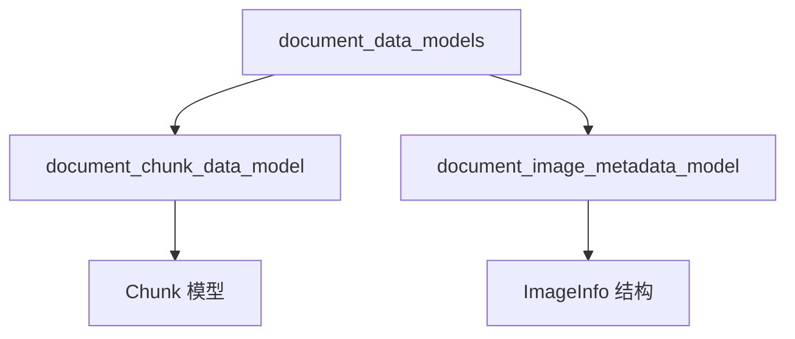

# document_data_models 模块技术深度解析

## 概述

`document_data_models` 模块是整个文档处理系统的核心数据结构层，它定义了文档和文档块（Chunk）的抽象模型。这个模块解决的核心问题是：**如何在一个统一的结构中表示原始文档内容和分块后的数据，并支持多模态内容（文本+图像）的存储和处理**。

想象一下，当你上传一份包含文本、图片和表格的复杂文档时，系统需要：
1. 保存原始文档的完整性
2. 将文档拆分成可检索的小块
3. 保留文本与图片的位置关系
4. 支持不同格式文档的统一处理

这个模块就像文档处理的"语言"，定义了所有文档在系统中的表示方式，使得从解析、分块到检索、展示的整个流程都能顺畅协作。

## 架构与核心组件

### 模块结构

### 核心组件

#### 1. Chunk 模型

`Chunk` 是文档分块后的基本单元，包含了：
- **内容与位置**：文本内容及其在原始文档中的起始和结束位置
- **序列信息**：块的序号，用于重建文档顺序
- **多模态数据**：块中包含的图片信息列表
- **元数据**：灵活的键值对，用于存储额外信息

#### 2. ImageInfo 结构

`ImageInfo` 定义了图片的元数据：
- **URL信息**：存储在COS的URL和原始URL
- **文本信息**：图片描述和OCR提取的文本
- **位置信息**：图片在文本中的位置范围

## 设计决策与权衡

### 1. 灵活的元数据设计

**选择**：使用 `Dict[str, Any] 类型存储元数据
**原因**：
- 不同格式的文档（PDF、Word、Excel）有完全不同的元数据结构
- 未来可能需要添加新的元数据字段，而无需修改核心模型
- 保持模型的通用性和可扩展性

**权衡**：
- 优点：灵活性高，适应不同文档类型
- 缺点：失去了类型安全，需要在使用时进行类型检查

### 2. 分块模型的位置保留

**选择**：在Chunk模型中保留start和end位置
**原因**：
- 支持从分块结果反向定位到原始文档
- 便于在展示时高亮相关内容
- 支持上下文重建和合并

### 3. 图片与文本的关联

**选择**：在Chunk模型中直接嵌入图片信息列表，而不是单独存储
**原因**：
- 保持语义单元的完整性（一段文本和其中的图片属于同一个语义单元）
- 简化检索逻辑，一次检索可以获取完整的语义单元
- 便于多模态内容的统一处理

## 数据流与使用场景

### 文档处理流程

1. **文档解析**：原始文档通过解析器转换为Document对象
2. **文档分块**：Document对象被分割成多个Chunk对象
3. **内容提取**：从Chunk中提取文本和图片信息
4. **索引存储**：Chunk被索引到检索系统
5. **检索展示**：检索结果中包含完整的Chunk信息和图片

### 关键依赖关系

- 被 `document_models_and_chunking_support` 模块使用
- 为 `chunking_configuration` 提供数据结构
- 与 `header_tracking_and_split_hooks` 协作进行分块

## 新贡献者注意事项

### 常见陷阱

1. **元数据的类型安全**：由于使用了 `Dict[str, Any]，在访问元数据时务必进行类型检查
2. **位置坐标系统**：不同解析器可能使用不同的位置坐标系统（字符位置 vs 字节位置），需要统一
3. **图片URL处理**：图片URL可能在不同阶段有不同的表示方式（临时URL vs 永久URL）

### 扩展建议

1. 添加新的文档类型时，优先考虑在元数据中添加字段，而不是修改核心模型
2. 保持Chunk的equals和hashCode实现目前仅基于content，如有需要可以扩展
3. 注意Chunk的start和end位置是相对于原始文档的，在修改文档内容时需要同步更新

## 子模块文档

- [document_chunk_data_model](docreader_pipeline-document_models_and_chunking_support-document_data_models-document_chunk_data_model.md)
- [document_image_metadata_model](docreader_pipeline-document_models_and_chunking_support-document_data_models-document_image_metadata_model.md)
