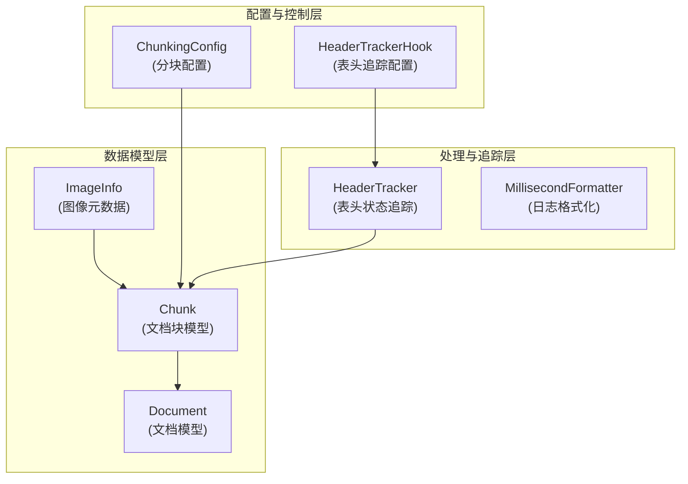

# 文档模型与分块支持 (document_models_and_chunking_support)

## 1. 模块概览

在处理文档时，我们面临一个核心矛盾：大型文档（如白皮书、技术规范、学术论文）包含丰富的语义信息，但现代AI系统（如大语言模型）和检索引擎只能有效处理有限长度的文本片段。直接将整个文档送入系统会导致上下文溢出、检索精度下降和处理效率低下。

`document_models_and_chunking_support` 模块就是为了解决这个问题而存在的。它提供了一套完整的基础设施，用于：
- 将文档表示为结构化的数据模型
- 智能地将文档切分成语义连贯的"块"(chunks)
- 跟踪文档中的特殊结构（如表格、代码块）以保持语义完整性
- 处理多模态内容（文本+图像）
- 提供配置化的分块策略

想象一下这个模块就像一个专业的"文档解剖师"：它不是简单地用剪刀把文档剪成碎片，而是理解文档的结构（标题、段落、表格、代码），在合适的"关节点"处分割，同时保留每个部分的上下文和元数据。

## 2. 架构与核心组件

让我们通过一个架构图来理解这个模块的组织方式：



### 核心组件解析

#### 2.1 数据模型层
- **[Chunk](docreader_pipeline-document_models_and_chunking_support-document_data_models.md)**: 文档分块的核心数据结构，包含文本内容、序列信息、位置标记、图像引用和元数据
- **Document**: 完整文档的容器，包含原始内容、图像映射、分块列表和文档级元数据
- **ImageInfo**: 图像元数据结构，跟踪图像的位置、描述和OCR文本

#### 2.2 配置与控制层
- **[ChunkingConfig](chunking_configuration.md)**: 分块过程的中央配置，控制分块大小、重叠度、分隔符优先级和多模态处理
- **[HeaderTrackerHook](header_tracking_and_split_hooks.md)**: 特殊结构（如表格）的识别配置，使用正则表达式定义开始/结束模式和提取逻辑

#### 2.3 处理与追踪层
- **[HeaderTracker](header_tracking_and_split_hooks.md)**: 特殊结构的状态追踪器，在分块过程中跟踪活跃的表头和代码块上下文
- **[MillisecondFormatter](request_time_formatting_utils.md)**: 性能监控工具，提供毫秒级精度的日志时间戳和请求ID追踪

## 3. 设计决策与权衡

### 3.1 语义优先的分块策略

**决策**: 采用基于分隔符优先级的分块策略，而不是简单的固定长度切分。

**为什么这样设计**:
- 简单的固定长度切分会在句子或段落中间切断，破坏语义连贯性
- 通过优先在段落分隔符(`\n\n`)、换行符(`\n`)、句号(`。`)处切分，保持语义单元的完整性
- 重叠(`chunk_overlap`)机制确保上下文不会在切分处丢失

**权衡**:
- ✅ 优点: 生成的chunk语义更连贯，提高检索和生成质量
- ⚠️ 缺点: chunk大小会有波动，极端情况下可能超过目标大小

### 3.2 表格和代码块的特殊处理

**决策**: 实现HeaderTracker机制来识别和保留表格、代码块等特殊结构。

**为什么这样设计**:
- 表格的表头在后续数据行中至关重要，如果表头和数据被分到不同的chunk，数据行将失去上下文
- 代码块是整体单元，中途切断会使其难以理解

**权衡**:
- ✅ 优点: 保持特殊结构的语义完整性，提高结构化数据的处理质量
- ⚠️ 缺点: 增加了系统复杂度，需要维护正则表达式模式

### 3.3 多模态支持的可配置性

**决策**: 将多模态处理设为可选配置(`enable_multimodal`)，默认关闭。

**为什么这样设计**:
- 图像处理需要额外的计算资源和VLM(视觉语言模型)支持
- 不是所有场景都需要多模态处理
- 允许系统在不同部署环境中灵活配置

**权衡**:
- ✅ 优点: 资源使用可控，适应不同部署场景
- ⚠️ 缺点: 需要用户理解配置项，可能导致功能未被充分利用

## 4. 关键流程与数据流

### 4.1 文档分块流程

当一个文档进入分块流程时，数据流向如下：

1. **文档加载**: 原始文档被加载到`Document`模型中
2. **配置应用**: `ChunkingConfig`提供分块参数（大小、重叠、分隔符）
3. **结构识别**: `HeaderTracker`扫描文档，识别表格、代码块等特殊结构
4. **智能切分**: 按照分隔符优先级和结构约束，将文档切分为`Chunk`序列
5. **元数据增强**: 为每个`Chunk`添加位置信息、序列编号和活跃表头上下文
6. **图像关联**: 如启用多模态，将`ImageInfo`关联到相应的`Chunk`

### 4.2 表头追踪流程

`HeaderTracker`的工作方式特别值得关注：

1. **初始化**: 加载预定义的`HeaderTrackerHook`配置（如Markdown表格识别）
2. **扫描文本**: 对每个文本片段，检查是否匹配任何hook的`start_pattern`
3. **激活表头**: 匹配成功后，提取表头内容并加入`active_headers`
4. **上下文注入**: 后续的chunk会自动包含当前活跃的表头
5. **检测结束**: 当匹配到`end_pattern`时，将表头从活跃状态移除

## 5. 子模块概览

本模块由以下子模块组成，每个子模块负责特定的功能领域：

- **[document_data_models](docreader_pipeline-document_models_and_chunking_support-document_data_models.md)**: 定义文档和分块的核心数据结构
- **[chunking_configuration](chunking_configuration.md)**: 分块过程的配置模型
- **[header_tracking_and_split_hooks](header_tracking_and_split_hooks.md)**: 特殊结构识别和追踪机制
- **[request_time_formatting_utils](request_time_formatting_utils.md)**: 日志格式化和性能监控工具

## 6. 与其他模块的关系

`document_models_and_chunking_support` 模块在整个系统中处于承上启下的位置：

- **上游依赖**: 
  - 从 [parser_framework_and_orchestration](docreader_pipeline-parser_framework_and_orchestration.md) 接收解析后的原始文档
  - 从 [protobuf_request_and_data_contracts](docreader_pipeline-protobuf_request_and_data_contracts.md) 获取通信协议定义

- **下游消费者**:
  - 为 [knowledge_and_chunk_api](sdk_client_library-knowledge_and_chunk_api.md) 提供可索引的chunk结构
  - 向 [knowledge_ingestion_extraction_and_graph_services](application_services_and_orchestration-knowledge_ingestion_extraction_and_graph_services.md) 输送处理后的文档

## 7. 使用指南与注意事项

### 7.1 基本使用模式

```python
from docreader.models.document import Document, Chunk
from docreader.models.read_config import ChunkingConfig

# 创建分块配置
config = ChunkingConfig(
    chunk_size=512,
    chunk_overlap=50,
    separators=["\n\n", "\n", "。"]
)

# 创建文档
doc = Document(content="大型文档内容...")

# 分块处理（在实际使用中，这一步由parser框架完成）
# doc.chunks = chunker.split(doc.content, config)
```

### 7.2 常见陷阱与注意事项

1. **chunk_size不是硬性限制**: 由于语义优先策略，实际chunk大小可能会超过配置值，特别是在处理长表格或代码块时。

2. **表头追踪的正则表达式性能**: 复杂的正则表达式可能在大型文档上导致性能问题，建议在生产环境中进行性能测试。

3. **多模态处理的资源消耗**: 启用`enable_multimodal`会显著增加处理时间和资源消耗，仅在确实需要图像理解时启用。

4. **线程安全**: `HeaderTracker`是有状态的，在多线程环境中使用时需要为每个线程创建独立实例。

5. **序列化兼容性**: `Chunk`和`Document`模型提供了`to_json`/`from_json`方法，但注意自定义元数据中的复杂类型可能需要额外的序列化处理。

---

这个模块是文档处理管道的核心，它的设计体现了"语义完整性优先"的原则——即使这意味着偶尔打破大小限制，也要保持文本片段的可理解性。在接下来的子模块文档中，我们将深入探讨每个组件的实现细节和使用方法。
