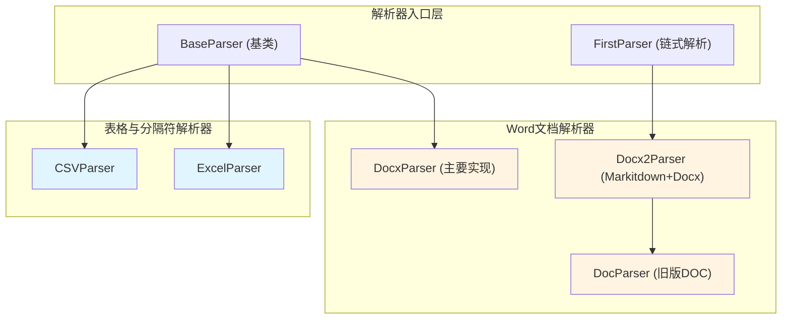

# Office and Structured Document Parsers 模块技术深潜

## 为什么存在这个模块？

在现代知识管理和文档处理系统中，我们面临一个核心挑战：**如何从多种格式的办公文档中可靠、高效地提取结构化内容？**

不同的文档格式（CSV、Excel、Word DOC/DOCX）各自有其特殊性：
- 表格数据（CSV/Excel）需要保留行列关系
- Word文档需要处理文本、表格和图片
- 新旧格式（DOC vs DOCX）需要不同的解析策略

这个模块的存在就是为了**提供统一的接口，隐藏不同格式的复杂性，将各种办公文档转换为系统可以统一处理的 Document 对象**。

## 核心抽象与心智模型

想象这个模块是一个**文档加工厂**：
- **原材料**：各种格式的二进制文档（CSV、Excel、DOC、DOCX）
- **加工流水线**：不同的 Parser 类，每个负责一种格式
- **成品**：统一的 Document 对象，包含文本内容、块结构和图片

关键抽象：
1. **Parser 接口**：所有解析器共享 `parse_into_text(content: bytes) -> Document` 接口
2. **Document 模型**：统一的输出格式，包含 content、chunks 和 images
3. **回退策略**：复杂解析器有多层回退机制，确保鲁棒性

## 模块架构



### 数据流向

以 Word DOC 文档解析为例，数据流向如下：

1. **输入**：DOC 文件的二进制内容
2. **DocParser 处理链**：
   - 尝试用 LibreOffice 将 DOC 转换为 DOCX
   - 如果成功，使用 DocxParser 解析转换后的 DOCX
   - 如果失败，尝试用 antiword 直接提取文本
   - 最后回退到 textract（已禁用，因 SSRF 漏洞）
3. **输出**：统一的 Document 对象

## 关键设计决策

### 1. 表格数据的行级分块策略

**决策**：CSVParser 和 ExcelParser 将每一行作为一个独立的 Chunk

```python
# CSVParser 中的实现
for i, (idx, row) in enumerate(df.iterrows()):
    content_row = ",".join(f"{col.strip()}: {str(row[col]).strip()}" for col in df.columns) + "\n"
    chunks.append(Chunk(content=content_row, seq=i, start=start, end=end))
```

**权衡分析**：
- ✅ **优点**：行级粒度便于后续检索和问答，用户可以精确引用表格中的某一行
- ❌ **缺点**：对于非常大的表格，会产生大量的 Chunk，增加存储和索引开销
- **替代方案**：可以按页或按固定行数分块，但会牺牲检索精度

### 2. DocParser 的多层回退机制

**决策**：DocParser 使用责任链模式，尝试多种解析方法

```python
handle_chain = [
    self._parse_with_docx,      # 1. 尝试转换为 DOCX 以提取图片
    self._parse_with_antiword,   # 2. 使用 antiword 直接提取文本
    # self._parse_with_textract, # 3. 已禁用（SSRF 漏洞）
]
```

**权衡分析**：
- ✅ **优点**：极大提高了解析的鲁棒性，一种方法失败可以尝试另一种
- ❌ **缺点**：增加了代码复杂度，最坏情况下需要多次尝试，延迟较高
- **为什么这样设计**：旧版 DOC 格式解析非常不稳定，鲁棒性优先于性能

### 3. DocxParser 的多进程并行处理

**决策**：对于大型 DOCX 文档，使用多进程按页并行处理

```python
# 使用 ProcessPoolExecutor 实现真正的多核并行
with ProcessPoolExecutor(max_workers=max_workers) as executor:
    future_to_idx = {
        executor.submit(process_page_multiprocess, *args): i
        for i, args in enumerate(args_list)
    }
```

**权衡分析**：
- ✅ **优点**：充分利用多核 CPU，大幅提升大型文档的处理速度
- ❌ **缺点**：进程间通信有开销，需要临时文件共享数据，内存占用较高
- **优化细节**：
  - 对于小文档（<1000 段落）使用启发式页面映射
  - 动态调整 worker 数量，避免过度并行
  - 临时文件统一清理，防止资源泄漏

### 4. Docx2Parser 的组合策略

**决策**：Docx2Parser 继承 FirstParser，组合 MarkitdownParser 和 DocxParser

```python
class Docx2Parser(FirstParser):
    _parser_cls = (MarkitdownParser, DocxParser)
```

**权衡分析**：
- ✅ **优点**：可以利用不同解析器的优势，Markitdown 可能更适合某些文档
- ❌ **缺点**：增加了依赖，FirstParser 的"第一个成功"策略可能不是最优选择
- **设计意图**：提供灵活性，让系统可以根据文档特性自动选择最佳解析器

## 子模块概览

这个模块可以分为两个主要子模块：

### 1. 表格与分隔符解析器 ([docreader_pipeline-format_specific_parsers-office_and_structured_document_parsers-tabular_and_delimited_parsers.md](docreader_pipeline-format_specific_parsers-office_and_structured_document_parsers-tabular_and_delimited_parsers.md))
- **CSVParser**：处理逗号分隔值文件，每行一个 Chunk
- **ExcelParser**：处理 Excel 工作簿，支持多 sheet，自动跳过空行

### 2. Word 文档解析器 ([docreader_pipeline-format_specific_parsers-office_and_structured_document_parsers-word_document_parsers.md](docreader_pipeline-format_specific_parsers-office_and_structured_document_parsers-word_document_parsers.md))
- **DocxParser**：主要的 DOCX 解析器，支持多进程、图片提取、页面映射
- **Docx2Parser**：组合解析器，先尝试 Markitdown，再回退到 DocxParser
- **DocParser**：旧版 DOC 解析器，使用多层回退策略

## 跨模块依赖

这个模块在整个系统中的位置：
- **上游依赖**：[parser_framework_and_orchestration](docreader_pipeline-parser_framework_and_orchestration.md) 提供基础架构
- **下游输出**：生成的 Document 对象被 [document_models_and_chunking_support](docreader_pipeline-document_models_and_chunking_support.md) 进一步处理
- **外部依赖**：
  - pandas：用于 CSV 和 Excel 解析
  - python-docx：用于 DOCX 解析
  - antiword/LibreOffice：用于旧版 DOC 解析

## 新贡献者指南

### 常见陷阱

1. **CSV 解析的编码问题**：CSVParser 使用 pandas 的默认编码，对于非 UTF-8 编码的文件可能会失败
2. **DocParser 的外部依赖**：需要确保环境中安装了 antiword 和 LibreOffice，否则回退链会断裂
3. **DocxParser 的内存消耗**：对于超大文档，多进程处理可能会消耗大量内存，注意 `max_pages` 参数
4. **临时文件清理**：DocxParser 和 DocParser 都使用临时文件，确保在异常情况下也能正确清理

### 扩展点

如果需要添加新的办公文档格式支持：
1. 继承 `BaseParser` 类
2. 实现 `parse_into_text(content: bytes) -> Document` 方法
3. 在适当的位置注册新的解析器

如果需要增强现有解析器：
- 对于表格解析器，可以考虑支持更多格式（TSV、JSONL 等）
- 对于 Word 解析器，可以考虑增强图片处理能力或支持更多格式的嵌入对象
