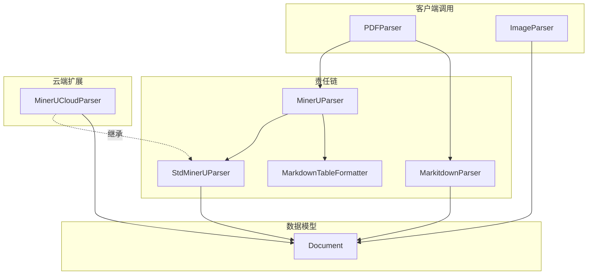

# PDF和OCR驱动的解析器模块

## 问题空间与解决方案

在企业级文档处理系统中，PDF文档和图像文件是最常见的非结构化数据源。然而，这些格式的文档处理面临着独特的挑战：

1. **PDF文档的双重性质**：PDF可能包含纯文本（可直接提取），也可能是扫描件（需要OCR），或者两者的混合
2. **复杂的布局结构**：表格、公式、图片、多栏排版等元素需要被正确识别和保留
3. **多种解析策略的权衡**：不同的解析引擎各有优劣，没有一种方案能完美处理所有场景
4. **图像内容的处理**：如何从图像中提取有意义的文本信息，并保留视觉上下文

**pdf_and_ocr_driven_parsers** 模块正是为了解决这些问题而设计的。它采用了**责任链模式**和**管道处理**相结合的架构，通过组合多种解析策略，提供了鲁棒性强、灵活性高的文档解析能力。

## 架构概览

### 核心组件职责：

1. **PDFParser**：作为PDF解析的入口点，采用责任链模式，先尝试MinerUParser，失败则回退到MarkitdownParser
2. **ImageParser**：专门处理图像文件，负责上传图片并生成带引用的markdown内容
3. **MinerUParser**：基于PipelineParser的组合解析器，将StdMinerUParser和MarkdownTableFormatter组合成处理管道
4. **StdMinerUParser**：标准的MinerU API解析器，同步调用MinerU服务进行文档解析
5. **MinerUCloudParser**：云端MinerU解析器，采用异步提交+轮询的方式与远程服务交互

## 设计决策与权衡

### 1. 责任链模式 vs 单一解析器

**选择**：采用责任链模式，组合多个解析器

**原因**：
- 没有一种解析器能完美处理所有PDF场景
- 提供优雅的降级策略：优先使用高性能的MinerU，失败时回退到更通用的Markitdown
- 便于未来扩展：可以轻松添加新的解析器到链中

**权衡**：
- ✅ 优点：提高了系统的鲁棒性和适应性
- ⚠️ 缺点：增加了代码复杂度，最坏情况下会尝试多个解析器

### 2. 同步 vs 异步MinerU API

**选择**：同时提供两种实现（StdMinerUParser和MinerUCloudParser）

**原因**：
- 本地部署的MinerU服务适合低延迟场景，同步调用更简单
- 云端MinerU服务可能处理时间较长，异步+轮询模式更可靠
- 满足不同部署环境的需求

**权衡**：
- ✅ 优点：灵活性高，适应不同场景
- ⚠️ 缺点：维护两套相似的代码逻辑，增加了测试负担

### 3. 管道组合 vs 单体解析器

**选择**：使用PipelineParser将StdMinerUParser和MarkdownTableFormatter组合

**原因**：
- 符合单一职责原则：解析和格式化分离
- 便于独立测试和优化每个阶段
- 可以灵活组合不同的处理步骤

**权衡**：
- ✅ 优点：模块化程度高，易于扩展
- ⚠️ 缺点：数据在阶段间传递有轻微的性能开销

## 数据流向

### PDF解析流程（典型路径）：

1. **入口**：客户端调用`PDFParser.parse_into_text(content)`
2. **责任链尝试**：PDFParser首先实例化MinerUParser
3. **管道执行**：
   - MinerUParser调用StdMinerUParser进行核心解析
   - StdMinerUParser调用MinerU API获取markdown和图片
   - 结果传递给MarkdownTableFormatter进行表格格式化
4. **结果返回**：如果成功，返回Document对象；如果失败，PDFParser会尝试MarkitdownParser

### 图像解析流程：

1. **入口**：客户端调用`ImageParser.parse_into_text(content)`
2. **上传图片**：将图片字节上传到存储服务，获取URL
3. **构建内容**：生成包含图片引用的markdown文本
4. **返回结果**：返回包含文本和图片映射的Document对象

## 子模块概览

本模块包含三个主要子模块，每个子模块负责特定的解析场景：

- **[pdf_document_parsing](docreader_pipeline-format_specific_parsers-pdf_and_ocr_driven_parsers-pdf_document_parsing.md)**：PDF文档解析的核心实现，包括MinerU API的集成和责任链编排
- **[image_ocr_parsing](docreader_pipeline-format_specific_parsers-pdf_and_ocr_driven_parsers-image_ocr_parsing.md)**：图像文件的OCR处理和内容生成
- **[mineru_pdf_ocr_backends](docreader_pipeline-format_specific_parsers-pdf_and_ocr_driven_parsers-mineru_pdf_ocr_backends.md)**：MinerU解析引擎的不同后端实现（本地同步和云端异步）

## 跨模块依赖

本模块在整个文档处理系统中处于**格式解析层**，依赖以下关键模块：

- **[parser_base_abstractions](docreader_pipeline-parser_framework_and_orchestration-parser_base_abstractions.md)**：提供BaseParser、FirstParser、PipelineParser等基础抽象类
- **[document_data_models](docreader_pipeline-document_models_and_chunking_support-document_data_models.md)**：定义Document数据模型，作为解析结果的载体
- **[markdown_native_parsing_and_render_helpers](docreader_pipeline-format_specific_parsers-markdown_native_parsing_and_render_helpers.md)**：提供MarkdownImageUtil和MarkdownTableFormatter等markdown处理工具

## 新贡献者指南

### 注意事项与陷阱：

1. **MinerU服务可用性**：StdMinerUParser在初始化时会ping MinerU服务，如果服务不可用，解析器会静默降级（返回空Document），这可能导致意外的行为
   
2. **图片路径替换**：在处理MinerU返回的图片时，代码会过滤掉markdown中未引用的图片，这是一种优化，但如果markdown生成有问题，可能导致图片丢失

3. **责任链的错误处理**：PDFParser的责任链模式中，"失败"的定义是返回空Document，而不是抛出异常。这意味着解析器内部的错误会被吞掉，需要查看日志才能发现

4. **云端解析器的超时**：MinerUCloudParser有MAX_WAIT_TIME限制（默认600秒），处理大文件时可能需要调整

### 扩展点：

1. **添加新的PDF解析器**：可以在PDFParser的_parser_cls元组中添加新的解析器类
   
2. **自定义MinerU参数**：StdMinerUParser的parse_into_text方法中硬编码了许多MinerU API参数，可以考虑将其配置化

3. **扩展图片处理逻辑**：ImageParser目前只生成简单的图片引用，可以扩展以添加OCR文本提取功能

### 测试建议：

- 测试不同类型的PDF：纯文本PDF、扫描件PDF、混合内容PDF
- 测试MinerU服务不可用的场景，确保降级行为符合预期
- 测试大文件处理，检查内存使用和超时设置
