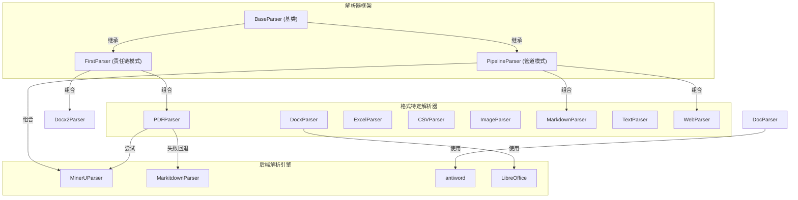
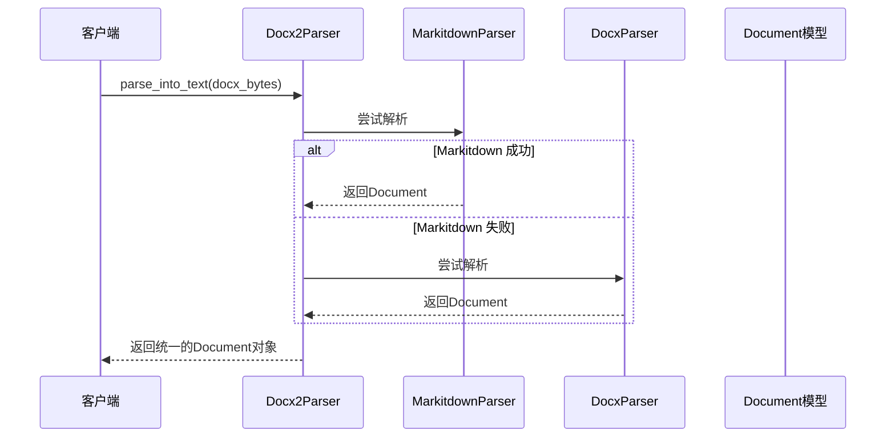

# format_specific_parsers 模块深度解析

## 概述

`format_specific_parsers` 模块是一个专业化的文档解析工具箱，它解决了**"如何将各种格式的文档（PDF、DOCX、CSV、图片等）统一转换为可处理的文本和结构化内容"**这一核心问题。

想象一下，你需要处理一个包含各种格式文档的知识库：有扫描的 PDF 合同、带有复杂表格的 Excel 数据、包含图片的 Word 文档，还有 Markdown 笔记。如果没有这个模块，你需要为每种格式写一套单独的解析逻辑，处理各种边缘情况，维护大量重复代码。

这个模块的价值在于：它提供了一个统一的接口和一套可组合的解析器，让你能够用一致的方式处理所有这些不同格式的文档，同时保留每种格式的特性（如表格、图片、排版结构）。

## 架构概览

### 架构设计要点

这个模块采用了**组合优于继承**的设计理念，通过两种核心模式实现灵活性：

1. **管道模式（Pipeline Pattern）**：多个解析器按顺序处理，前一个的输出作为后一个的输入。例如，MarkdownParser 先格式化表格，再处理图片。

2. **责任链模式（Chain of Responsibility）**：多个解析器按顺序尝试，直到第一个成功的解析器返回结果。例如，PDFParser 先尝试 MinerU，失败则回退到 Markitdown。

### 数据流示例：解析一个 DOCX 文件

## 核心设计决策

### 1. 统一的 Document 抽象

**决策**：所有解析器都返回相同的 `Document` 对象结构，包含 `content`（完整文本）、`chunks`（分块）、`images`（图片映射）。

**为什么这样设计**：
- 上游代码不需要知道文档原始格式，可以用统一方式处理任何解析结果
- 便于实现格式无关的下游处理（如向量嵌入、分块检索）
- 简化了测试和接口契约

**权衡**：
- 牺牲了一些格式特定的细节（如 DOCX 的评论、PDF 的书签）
- 但可以通过扩展 `Document` 模型或使用元数据字段来添加这些信息

### 2. 多解析器回退策略

**决策**：对于复杂格式（如 PDF、DOCX），使用多个解析器按优先级尝试，而不是依赖单一解析器。

**为什么这样设计**：
- 没有一个解析器能处理所有情况：MinerU 擅长扫描 PDF 但可能超时，Markitdown 快速但对复杂布局支持有限
- 提高了整体鲁棒性：一个解析器失败时，系统仍能尝试其他方法
- 便于渐进式改进：可以添加新的解析器到链中，而不破坏现有功能

**权衡**：
- 最坏情况下会有额外的延迟（尝试多个解析器都失败）
- 需要仔细管理错误日志，避免混淆哪个解析器实际成功了

### 3. 解析器组合而非继承

**决策**：通过 `PipelineParser` 和 `FirstParser` 组合现有解析器，而不是为每种组合创建新类。

**为什么这样设计**：
- 避免了类爆炸：不需要 `MarkdownWithTableAndImageParser` 这样的类
- 提高了可重用性：`MarkdownTableFormatter` 可以在任何需要表格格式化的地方使用
- 使解析流程更透明：通过查看 `_parser_cls` 元组就能知道处理流程

**权衡**：
- 组合的深度过深会让调试变得困难
- 需要清晰的文档说明每个解析器的职责和输入输出契约

## 子模块概览

### 办公文档与结构化文档解析器

[office_and_structured_document_parsers](docreader_pipeline-format_specific_parsers-office_and_structured_document_parsers.md)：处理 Word、Excel、CSV 等办公文档格式的完整解析器套件。包括现代 DOCX 解析、旧版 DOC 支持、以及表格数据处理。

### PDF 与 OCR 驱动解析器

[pdf_and_ocr_driven_parsers](docreader_pipeline-format_specific_parsers-pdf_and_ocr_driven_parsers.md)：专注于 PDF 文档和图片 OCR 解析，包括 MinerU 后端集成、多种 PDF 解析策略的责任链，以及图片处理能力。

### Markdown 原生解析与渲染辅助

[markdown_native_parsing_and_render_helpers](docreader_pipeline-format_specific_parsers-markdown_native_parsing_and_render_helpers.md)：专门处理 Markdown 格式，包括表格标准化、Base64 图片提取与上传，以及完整的 Markdown 处理管道。

### Markitdown 与 Web 源解析

[markitdown_and_web_source_parsing](docreader_pipeline-format_specific_parsers-markitdown_and_web_source_parsing.md)：集成 Markitdown 库进行通用文档转换，以及使用 Playwright 和 Trafilatura 的网页爬取与解析能力。

### 纯文本解析

[plain_text_parsing](docreader_pipeline-format_specific_parsers-plain_text_parsing.md)：简单但重要的纯文本文件解析，处理编码检测和基本文本提取。

## 与其他模块的依赖关系

### 输入依赖

- **parser_base_abstractions**：所有解析器都继承自这里的基类
- **document_data_models**：解析器返回的 Document、Chunk 等数据模型
- **request_time_formatting_utils**：一些解析器使用的格式化工具

### 输出被依赖

- **parser_pipeline_orchestration**：这个模块使用 format_specific_parsers 中的解析器来构建完整的解析流程
- **knowledge_ingestion_orchestration**：知识摄入服务使用这些解析器来处理上传的文档

## 新贡献者指南

### 常见陷阱

1. **忘记处理二进制输入**：所有 `parse_into_text` 方法都接收 `bytes` 类型，不是字符串。即使是文本格式，也要先解码。

2. **忽略解析器组合顺序**：在 `PipelineParser` 中，顺序很重要。例如，Markdown 表格格式化应该在图片处理之前。

3. **错误处理不当**：解析器应该优雅地失败并返回空 Document，而不是抛出异常——让责任链中的下一个解析器尝试。

4. **图片处理遗漏**：如果你的解析器支持图片，记得同时更新 `Document.content` 中的 Markdown 引用和 `Document.images` 字典。

### 扩展点

1. **添加新的格式解析器**：继承 `BaseParser`，实现 `parse_into_text` 方法，然后在适当的管道或责任链中注册。

2. **创建解析器组合**：使用 `PipelineParser` 或 `FirstParser` 组合现有解析器来处理新的场景。

3. **添加备用解析策略**：对于现有格式，可以添加新的解析器到责任链中，提高鲁棒性。

### 调试技巧

1. **查看日志**：所有解析器都有详细的日志，包括成功解析的字符数、处理时间等。

2. **单独测试解析器**：每个解析器都有 `if __name__ == "__main__":` 块，可以直接运行测试。

3. **检查 Document 结构**：解析完成后，检查 `chunks` 是否正确分块，`images` 字典是否包含预期的图片。
