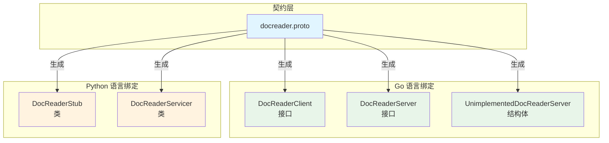
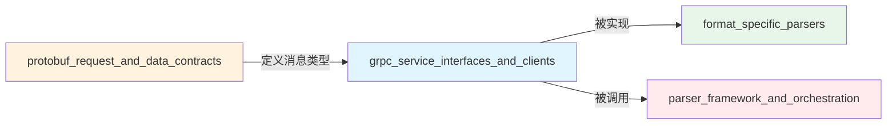

# grpc_service_interfaces_and_clients 模块深度解析

## 模块概述

`grpc_service_interfaces_and_clients` 模块是 docreader 文档解析管道系统的通信契约层。它定义了一套标准化的 gRPC 服务接口，使得不同语言实现的文档解析器能够以统一的方式暴露和调用文档读取功能。

想象这个模块就像国际标准化组织制定的通信协议——它不负责实际解析文档（那是 [format_specific_parsers](docreader_pipeline-format_specific_parsers.md) 模块的工作），而是规定了"如何说"文档解析的语言，确保无论是 Go 还是 Python 实现的解析器，都能被系统中的其他组件以相同的方式调用。

## 核心问题与解决方案

### 问题空间

在构建文档解析系统时，团队面临着几个关键挑战：

1. **多语言实现的协调**：文档解析器可能用不同语言实现（Go 用于性能敏感场景，Python 用于丰富的解析生态），需要统一的调用接口
2. **服务契约的稳定性**：解析器实现会不断演进，但调用方不应因此而频繁修改代码
3. **跨进程通信的效率**：文档解析可能是计算密集型操作，需要高效的 RPC 机制
4. **客户端库的一致性**：不同语言的客户端应该有相似的使用体验

### 解决方案

该模块通过以下方式解决了这些问题：

- **Protocol Buffers 作为契约语言**：使用 IDL 定义服务接口，保证跨语言的一致性
- **gRPC 作为传输层**：利用 HTTP/2 的多路复用和二进制传输，提供高性能通信
- **自动生成的客户端/服务器代码**：确保接口契约与实现严格对应
- **前向兼容性设计**：通过 `UnimplementedDocReaderServer` 等机制支持服务演进

## 架构与核心组件



### 核心组件详解

#### Go 语言接口

**`DocReaderClient` 接口**：定义了客户端调用文档读取服务的契约。它提供两个核心方法：
- `ReadFromFile`：从本地文件读取并解析文档
- `ReadFromURL`：从网络 URL 读取并解析文档

这个接口是客户端代码与 gRPC 传输层之间的抽象，使得调用方不需要了解底层的 RPC 细节。

**`DocReaderServer` 接口**：定义了服务端实现文档读取服务的契约。服务提供者必须实现这两个方法。

**`UnimplementedDocReaderServer` 结构体**：这是一个关键的设计元素。它提供了所有方法的默认实现（返回 `UNIMPLEMENTED` 错误），使得服务实现者可以：
1. 只实现部分方法而不会导致编译错误
2. 在服务接口新增方法时保持前向兼容性

#### Python 语言绑定

**`DocReaderStub` 类**：Python 客户端使用的存根类，封装了 gRPC 调用细节。它将方法调用转换为 gRPC 的 unary-unary RPC 调用。

**`DocReaderServicer` 类**：Python 服务端实现的基类，提供了默认的未实现方法。服务提供者通过继承此类并覆盖相关方法来实现服务。

## 数据流程

让我们追踪一次典型的文档解析请求的完整流程：

### 客户端调用流程

1. **初始化阶段**：客户端创建 gRPC 连接通道，然后实例化 `DocReaderClient`（Go）或 `DocReaderStub`（Python）
2. **请求构建**：客户端创建 `ReadFromFileRequest` 或 `ReadFromURLRequest`，填充必要参数（如文件路径或 URL）
3. **RPC 调用**：客户端调用相应方法，gRPC 库将请求序列化并通过 HTTP/2 发送
4. **响应处理**：收到响应后，gRPC 库反序列化为 `ReadResponse`，返回给调用方

### 服务端处理流程

1. **服务注册**：服务实现者创建继承自 `DocReaderServer`（Go）或 `DocReaderServicer`（Python）的实现类
2. **请求接收**：gRPC 服务器接收请求，反序列化为相应的请求对象
3. **方法分发**：根据方法名，调用服务实现者的对应方法
4. **响应返回**：服务实现者处理请求并返回 `ReadResponse`，gRPC 库将其序列化后发送回客户端

## 设计决策与权衡

### 1. Protocol Buffers + gRPC vs REST/JSON

**选择**：Protocol Buffers + gRPC

**原因**：
- **类型安全**：编译时检查，减少运行时错误
- **性能**：二进制序列化比 JSON 更小更快
- **强契约**：IDL 作为单一事实来源，自动生成多语言代码
- **HTTP/2 优势**：多路复用、头部压缩、双向流

**权衡**：
- 失去了 REST 的简单性和浏览器原生支持
- 调试工具不如 JSON 生态丰富
- 需要额外的工具链来处理 .proto 文件

### 2. 接口前向兼容性设计

**选择**：使用 `UnimplementedDocReaderServer` 模式

**原因**：
- 允许服务接口随时间演进，不破坏现有实现
- 实现者可以逐步采用新方法，而不需要一次性重构所有代码
- 在 Go 中特别重要，因为接口实现是隐式的

**权衡**：
- 运行时才会发现未实现的方法（而不是编译时）
- 需要调用方妥善处理 `UNIMPLEMENTED` 错误

### 3. 单一服务 vs 多个专用服务

**选择**：单一 `DocReader` 服务，包含多个方法

**原因**：
- 文档读取逻辑内聚性强，放在同一个服务中更合理
- 减少了服务数量和管理复杂度
- 共享相同的连接和基础设施

**权衡**：
- 如果未来功能大幅扩展，可能需要拆分
- 不同方法的性能特征可能差异较大，但共享相同的服务配置

## 与其他模块的关系



**依赖关系**：
- **依赖**：[protobuf_request_and_data_contracts](docreader_pipeline-protobuf_request_and_data_contracts.md) - 定义了请求和响应消息类型
- **被依赖**：
  - [go_grpc_client_interface_and_transport_impl](docreader_pipeline-grpc_service_interfaces_and_clients-go_grpc_client_interface_and_transport_impl.md) - Go 语言的具体客户端实现
  - [go_grpc_server_contracts_and_compatibility_guards](docreader_pipeline-grpc_service_interfaces_and_clients-go_grpc_server_contracts_and_compatibility_guards.md) - Go 语言的服务端契约
  - [python_grpc_stub_and_servicer_bindings](docreader_pipeline-grpc_service_interfaces_and_clients-python_grpc_stub_and_servicer_bindings.md) - Python 语言的存根和服务绑定

## 使用指南与最佳实践

### 服务端实现（Go）

```go
type MyDocReaderServer struct {
    // 嵌入未实现服务器以获得前向兼容性
    proto.UnimplementedDocReaderServer
}

func (s *MyDocReaderServer) ReadFromFile(ctx context.Context, req *proto.ReadFromFileRequest) (*proto.ReadResponse, error) {
    // 实现文档读取逻辑
}

func (s *MyDocReaderServer) ReadFromURL(ctx context.Context, req *proto.ReadFromURLRequest) (*proto.ReadResponse, error) {
    // 实现从 URL 读取逻辑
}

// 注册服务
server := grpc.NewServer()
proto.RegisterDocReaderServer(server, &MyDocReaderServer{})
```

### 客户端使用（Python）

```python
import grpc
import docreader_pb2
import docreader_pb2_grpc

# 创建连接
with grpc.insecure_channel('localhost:50051') as channel:
    # 创建存根
    stub = docreader_pb2_grpc.DocReaderStub(channel)
    
    # 调用方法
    request = docreader_pb2.ReadFromFileRequest(file_path="/path/to/doc.pdf")
    response = stub.ReadFromFile(request)
```

## 注意事项与常见陷阱

1. **嵌入方式**：在 Go 中，`UnimplementedDocReaderServer` 应该按值嵌入，而不是按指针嵌入，否则可能导致 nil 指针解引用。

2. **错误处理**：客户端应该妥善处理 gRPC 状态错误，特别是 `UNIMPLEMENTED`、`UNAVAILABLE` 和 `DEADLINE_EXCEEDED` 等常见错误。

3. **上下文管理**：始终使用上下文来控制超时和取消，特别是在处理可能耗时的文档解析操作时。

4. **版本兼容性**：修改 .proto 文件时，遵循 Protocol Buffers 的兼容性规则，不要更改现有字段的标签号。

5. **生成代码**：不要手动编辑生成的代码文件，所有修改应该通过更新 .proto 文件并重新生成代码来完成。

## 子模块

本模块包含以下子模块，每个子模块都有详细的文档：

- [go_grpc_client_interface_and_transport_impl](docreader_pipeline-grpc_service_interfaces_and_clients-go_grpc_client_interface_and_transport_impl.md) - Go 语言的客户端接口和传输实现
- [go_grpc_server_contracts_and_compatibility_guards](docreader_pipeline-grpc_service_interfaces_and_clients-go_grpc_server_contracts_and_compatibility_guards.md) - Go 语言的服务端契约和兼容性保护
- [python_grpc_stub_and_servicer_bindings](docreader_pipeline-grpc_service_interfaces_and_clients-python_grpc_stub_and_servicer_bindings.md) - Python 语言的存根和服务绑定
