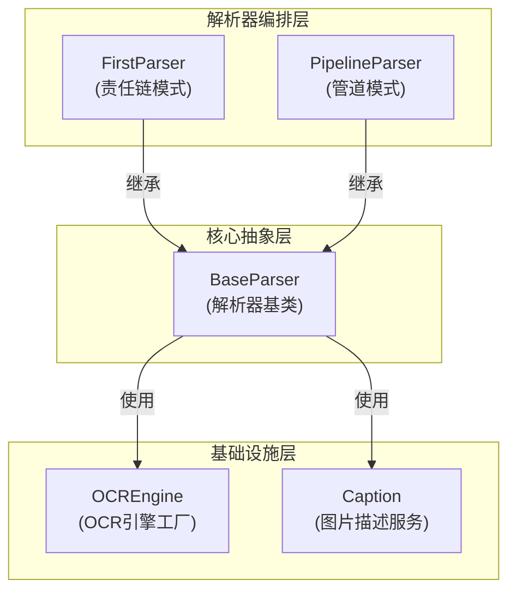

# parser_framework_and_orchestration 模块详解

## 模块概览

想象一下，你需要处理各种格式的文档：PDF、Word、Excel、Markdown、图片等等。每种格式都有自己的解析方式，有些需要OCR识别文字，有些需要提取图片并生成描述，还有些需要智能地分割内容而不破坏语义结构。`parser_framework_and_orchestration` 模块就是解决这个问题的"文档处理指挥中心"。

这个模块提供了一个统一的文档解析框架，它不仅定义了如何编写解析器，还提供了组合多个解析器的策略、OCR引擎管理、图片描述生成等功能。它的核心价值在于：

1. **统一接口**：无论什么格式的文档，都用相同的方式处理
2. **灵活组合**：可以像搭积木一样组合不同的解析器
3. **多模态支持**：不仅处理文本，还能处理图片并生成智能描述
4. **可扩展性**：添加新的文档格式支持非常简单

## 架构总览



### 架构说明

这个模块采用了分层设计，从下到上分别是：

1. **基础设施层**：提供OCR引擎管理和图片描述生成等基础能力
   - `OCREngine`：工厂模式实现，管理不同OCR后端（PaddleOCR、VLM等）
   - `Caption`：使用视觉语言模型（VLM）为图片生成智能描述

2. **核心抽象层**：定义了解析器的统一接口
   - `BaseParser`：所有解析器的基类，提供了文本分块、图片处理等通用功能

3. **解析器编排层**：提供了组合多个解析器的策略
   - `FirstParser`：责任链模式，依次尝试多个解析器，返回第一个成功的结果
   - `PipelineParser`：管道模式，将多个解析器串联起来，前一个的输出作为后一个的输入

数据流向通常是：输入文档字节 → 解析器编排层 → 核心抽象层 → 基础设施层 → 输出结构化的Document对象。

## 核心组件详解

### BaseParser：解析器的基石

`BaseParser` 是整个框架的核心，它不仅仅是一个接口定义，更是一个包含了丰富通用功能的抽象基类。

**设计意图**：
- 定义统一的解析器接口，所有具体解析器都必须实现 `parse_into_text` 方法
- 提供文本分块、图片处理、OCR识别等通用功能，避免代码重复
- 处理安全问题（如SSRF防护）、并发控制、资源管理等横切关注点

**关键功能**：

1. **智能文本分块**：`chunk_text` 方法可以智能地分割文本，同时保护Markdown表格、代码块等结构不被破坏。它的思路是：
   - 先识别并保护需要整体保留的结构（表格、代码块、公式等）
   - 然后在非保护区域使用分隔符分割
   - 最后按照指定的大小和重叠度组合成块

2. **图片处理管道**：`process_chunks_images` 方法提供了完整的图片处理流程：
   - 从文本中提取图片URL
   - 下载图片（带SSRF防护）
   - 上传到对象存储
   - 进行OCR识别
   - 生成图片描述
   - 将结果更新回Chunk对象

3. **并发控制**：使用信号量（Semaphore）控制并发任务数量，避免同时处理过多图片导致资源耗尽。

### OCREngine：OCR引擎的工厂

`OCREngine` 采用工厂模式管理不同的OCR后端实现。

**设计意图**：
- 封装OCR后端的创建逻辑，客户端不需要知道具体实现
- 实现单例模式，避免重复创建昂贵的OCR引擎实例
- 提供统一的接口，方便切换不同的OCR后端

**工作原理**：
- 使用线程安全的单例模式，确保每种OCR后端只有一个实例
- 支持多种后端：PaddleOCR（本地OCR）、VLM（视觉语言模型）、Dummy（测试用）
- 延迟初始化：只有第一次使用时才创建实例

### Caption：图片的"眼睛"

`Caption` 服务使用视觉语言模型（VLM）为图片生成智能描述。

**设计意图**：
- 提供统一的图片描述生成接口
- 支持多种VLM后端（OpenAI兼容API、Ollama本地模型）
- 封装API调用细节，提供简单的调用方式

**工作原理**：
- 支持OpenAI兼容的API和Ollama本地模型两种接口类型
- 将图片转换为base64编码或通过URL传递给VLM
- 解析返回结果，提取图片描述文本

### FirstParser：责任链模式的实践者

`FirstParser` 实现了责任链模式，依次尝试多个解析器，返回第一个成功的结果。

**设计意图**：
- 处理格式不确定的文档：依次尝试多种解析器
- 提供容错能力：一个解析器失败不会影响整体流程
- 灵活组合：可以动态配置解析器的尝试顺序

**使用场景**：
- 文档格式不明确，需要尝试多种解析方式
- 某些解析器在特定情况下更可靠，可以优先尝试

### PipelineParser：管道模式的实现

`PipelineParser` 实现了管道模式，将多个解析器串联起来，前一个的输出作为后一个的输入。

**设计意图**：
- 实现解析器的组合：预处理 → 主解析 → 后处理
- 累积中间结果：合并所有解析器提取的图片
- 分步处理复杂文档：每一步只关注一个特定任务

**使用场景**：
- 需要对文档进行多步处理（如先清理格式，再解析内容）
- 需要从文档中提取多种类型的信息

## 设计决策与权衡

### 1. 为什么使用抽象基类而不是接口？

**决策**：使用 `BaseParser` 作为抽象基类，包含大量通用实现。

**权衡**：
- ✅ **优点**：减少代码重复，所有解析器自动获得文本分块、图片处理等功能
- ❌ **缺点**：增加了继承的耦合度，修改基类可能影响所有子类

**原因**：文档解析有很多通用功能（文本分块、图片处理等），如果每个解析器都自己实现，会导致大量重复代码。使用抽象基类可以在保持接口统一的同时，提供通用功能的默认实现。

### 2. 为什么使用工厂模式管理OCR引擎？

**决策**：`OCREngine` 作为工厂类，创建并管理不同OCR后端的单例实例。

**权衡**：
- ✅ **优点**：封装创建逻辑，支持多种后端，避免重复创建昂贵资源
- ❌ **缺点**：增加了一层间接性，代码稍微复杂一些

**原因**：OCR引擎通常很昂贵（内存占用大、初始化时间长），使用单例可以避免资源浪费。同时，不同场景可能需要不同的OCR后端（如本地部署用PaddleOCR，云端部署用VLM），工厂模式可以方便地切换。

### 3. 为什么文本分块要保护Markdown结构？

**决策**：`chunk_text` 方法会识别并保护Markdown表格、代码块等结构，不被分割。

**权衡**：
- ✅ **优点**：保持语义完整性，表格、代码块等结构不会被破坏
- ❌ **缺点**：分块大小可能不均匀，某些块可能超过目标大小

**原因**：如果将一个表格从中间分割，两个半表格都没有意义。保持结构完整性比分块大小均匀更重要。

### 4. 为什么使用异步处理图片？

**决策**：图片处理使用异步IO，并通过信号量控制并发数。

**权衡**：
- ✅ **优点**：提高处理速度，充分利用IO等待时间
- ❌ **缺点**：代码复杂度增加，需要处理异步上下文

**原因**：文档中可能有多个图片，图片下载、OCR识别都是IO密集型操作，使用异步处理可以显著提高吞吐量。同时，通过信号量控制并发数可以避免资源耗尽。

## 与其他模块的关系

`parser_framework_and_orchestration` 模块是整个文档处理管道的核心，它与其他模块的关系如下：

1. **依赖**：
   - [`document_models_and_chunking_support`](docreader_pipeline-document_models_and_chunking_support.md)：提供Document、Chunk等数据模型
   - [`format_specific_parsers`](docreader_pipeline-format_specific_parsers.md)：提供具体格式的解析器实现

2. **被依赖**：
   - 整个文档处理管道的上层模块依赖这个模块提供的解析器框架

## 使用指南

### 创建自定义解析器

要创建一个自定义解析器，只需继承 `BaseParser` 并实现 `parse_into_text` 方法：

```python
from docreader.parser.base_parser import BaseParser
from docreader.models.document import Document

class MyCustomParser(BaseParser):
    def parse_into_text(self, content: bytes) -> Document:
        # 解析内容并返回Document对象
        text = content.decode('utf-8')
        return Document(content=text)
```

### 组合多个解析器

使用 `FirstParser` 尝试多个解析器：

```python
from docreader.parser.chain_parser import FirstParser
from docreader.parser.markdown_parser import MarkdownParser
from docreader.parser.pdf_parser import PDFParser

# 创建一个先尝试MarkdownParser，失败再尝试PDFParser的解析器
MyParser = FirstParser.create(MarkdownParser, PDFParser)
parser = MyParser(file_name="document.md")
document = parser.parse(content_bytes)
```

使用 `PipelineParser` 串联多个解析器：

```python
from docreader.parser.chain_parser import PipelineParser
from docreader.parser.preprocess_parser import PreprocessParser
from docreader.parser.markdown_parser import MarkdownParser

# 创建一个先预处理再解析的管道
MyParser = PipelineParser.create(PreprocessParser, MarkdownParser)
parser = MyParser(file_name="document.md")
document = parser.parse(content_bytes)
```

## 注意事项与常见陷阱

1. **OCR引擎初始化失败**：OCR引擎可能因为各种原因初始化失败（如模型文件缺失），`BaseParser` 会记录失败并在后续请求中不再尝试初始化，避免重复失败。

2. **图片URL安全性**：`BaseParser` 包含SSRF防护，会拒绝访问内网IP、localhost等地址的图片URL。如果你需要处理内网图片，需要修改 `_is_safe_url` 方法。

3. **并发控制**：默认的最大并发任务数是5，你可以通过 `max_concurrent_tasks` 参数调整。如果设置得太高，可能会导致内存不足或API限流。

4. **分块大小**：`chunk_size` 和 `chunk_overlap` 参数很重要，需要根据你的使用场景调整。如果分块太小，会丢失上下文；如果太大，可能会超过模型的上下文窗口。

5. **多模态支持**：只有特定文件类型（PDF、Markdown、Word、图片等）会处理图片，如果你需要处理其他类型的文件，需要修改 `parse` 方法中的 `allowed_types` 列表。

## 子模块文档

本模块包含以下子模块，详细文档请参考：

- [parser_pipeline_orchestration](docreader_pipeline-parser_framework_and_orchestration-parser_pipeline_orchestration.md)：解析器编排相关组件
- [parser_base_abstractions](docreader_pipeline-parser_framework_and_orchestration-parser_base_abstractions.md)：解析器基础抽象
- [caption_prompt_contracts](docreader_pipeline-parser_framework_and_orchestration-caption_prompt_contracts.md)：图片描述相关的数据契约
- [ocr_engine_interface](docreader_pipeline-parser_framework_and_orchestration-ocr_engine_interface.md)：OCR引擎接口
