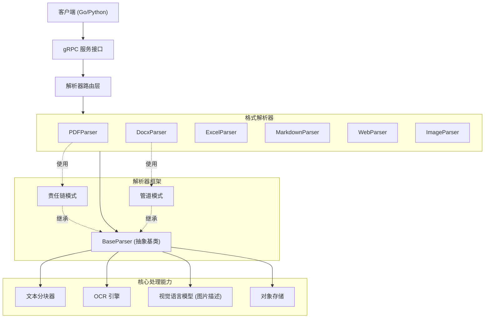
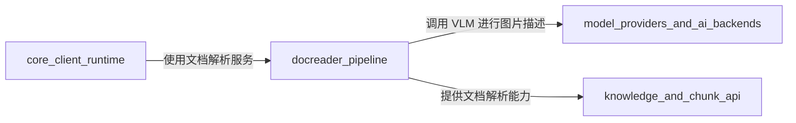

# docreader_pipeline 模块深度解析

## 1. 模块概述

想象一下你拥有一个"文档翻译官"团队：他们能接收各种格式的文档（PDF、Word、Excel、网页等），将其拆分成易于理解的片段，提取其中的文字和图片，甚至能"看懂"图片内容。这就是 `docreader_pipeline` 模块的作用——它是整个系统的文档处理核心，负责将各种非结构化的文档转换为系统可以处理的结构化数据。

### 为什么需要这个模块？

在知识管理和 AI 应用中，原始文档（如 PDF 报告、Word 文档、Excel 表格）就像"密封的包裹"。如果不打开并解析它们，AI 无法理解其中的内容。这个模块的存在就是为了：

1. **统一文档处理接口**：不管输入是 PDF、Word 还是网页，输出都是标准化的 `Chunk` 列表
2. **保留文档结构**：不仅仅提取文字，还保留表格、图片、标题层级等结构信息
3. **多模态支持**：不仅处理文字，还能提取、描述图片内容
4. **可扩展架构**：通过组合模式轻松添加新的文档格式支持

### 核心价值

这个模块是系统的"文档入口"——所有进入知识库的文档都要经过它的处理。它的设计直接影响：
- 知识库的内容质量（解析越准确，检索效果越好）
- 系统支持的文档格式丰富度
- 大文件处理的性能和资源消耗

---

## 2. 架构设计

### 2.1 整体架构图



### 2.2 架构解读

这个模块的架构采用了**多层抽象 + 组合模式**的设计，让我们逐层拆解：

#### 第一层：gRPC 接口层（契约）
- **作用**：定义服务边界，提供语言无关的 API
- **关键组件**：`ReadFromFileRequest`、`ReadFromURLRequest`、`ReadResponse`
- **设计意图**：将文档处理能力封装为独立服务，Go 和 Python 都能调用

#### 第二层：解析器框架层（抽象）
- **作用**：定义所有解析器的公共接口和行为
- **关键组件**：`BaseParser`、`FirstParser`、`PipelineParser`
- **设计意图**：通过抽象基类统一解析器接口，通过组合模式灵活构建解析流程

#### 第三层：格式解析器层（实现）
- **作用**：针对特定文件格式的具体解析实现
- **关键组件**：`PDFParser`、`DocxParser`、`ExcelParser` 等
- **设计意图**：每种格式的解析逻辑独立，便于维护和扩展

#### 第四层：核心能力层（基础设施）
- **作用**：提供跨解析器的公共能力
- **关键组件**：`TextSplitter`、`OCREngine`、`Caption`、存储接口
- **设计意图**：将通用能力下沉，避免重复代码

### 2.3 关键设计模式

#### 责任链模式（Chain of Responsibility）
**体现**：`FirstParser` 和 `PDFParser`
- **为什么这么设计**：对于同一种格式（如 PDF），可能有多种解析策略。责任链让我们可以按优先级尝试多种策略，直到成功。
- **实际例子**：`PDFParser` 先尝试 `MinerUParser`，如果失败再回退到 `MarkitdownParser`

#### 管道模式（Pipeline）
**体现**：`PipelineParser` 和 `MarkdownParser`
- **为什么这么设计**：某些文档需要多阶段处理（如先提取文本，再处理图片，最后格式化表格）。管道模式让这些阶段可以独立开发、测试和组合。
- **实际例子**：`MarkdownParser` 先格式化表格，再提取 base64 图片

#### 模板方法模式（Template Method）
**体现**：`BaseParser.parse()`
- **为什么这么设计**：解析流程的大体步骤是固定的（提取文本 → 分块 → 处理图片），但具体实现因格式而异。模板方法在基类中定义流程骨架，子类实现具体步骤。

---

## 3. 核心组件解析

### 3.1 BaseParser：解析器的"心脏"

`BaseParser` 是所有解析器的基类，它定义了文档处理的完整流程。把它想象成一个"标准工艺流程"：

```python
def parse(self, content: bytes) -> Document:
    # 1. 格式特定的文本提取（由子类实现）
    document = self.parse_into_text(content)
    
    # 2. 如果子类没有分块，进行通用分块
    if not document.chunks:
        chunks = self._str_to_chunk(splitter.split_text(document.content))
        document.chunks = chunks
    
    # 3. 如果启用多模态，处理图片
    if self.enable_multimodal:
        chunks = self.process_chunks_images(chunks, document.images)
    
    return document
```

**设计亮点**：
- **可配置的分块策略**：通过 `ChunkingConfig` 控制分块大小、重叠、分隔符
- **智能图片处理**：自动下载、OCR、生成描述、上传存储
- **并发控制**：通过 `max_concurrent_tasks` 限制并发图片处理数量

**关键方法解析**：

#### `chunk_text()`：智能文本分块

这个方法不仅仅是按字数切割——它懂得**保护文档结构**：

```python
def chunk_text(self, text: str) -> List[Chunk]:
    # 1. 先识别需要保护的结构（表格、代码块、公式）
    protected_ranges = find_protected_structures(text)
    
    # 2. 在保护结构之间的文本进行分割
    units = split_with_protection(text, protected_ranges)
    
    # 3. 组装成块，确保不切断保护结构
    chunks = assemble_chunks(units)
    return chunks
```

**为什么这么设计**？
- 如果简单按字数切割，可能会把一个表格切成两半，导致后续检索和生成效果很差
- 通过"保护范围"机制，确保表格、代码块等结构作为整体保留

#### `process_chunks_images()`：多模态处理流水线

处理图片是一个复杂的多级流程：

```
原始图片 → 下载/提取 → 缩放 → OCR识别 → VLM生成描述 → 上传存储 → 替换原文引用
```

**并发设计**：
- 使用 `asyncio.Semaphore` 控制并发数，避免同时处理过多图片导致内存溢出
- 单个图片处理超时保护（30秒）
- 单个图片失败不影响整体处理

**安全设计**：
- `_is_safe_url()` 方法防止 SSRF 攻击：拒绝内网 IP、localhost、元数据服务地址
- 代理配置支持，避免直接访问外部网络

### 3.2 Chunk：知识的"原子"

`Chunk` 是文档处理的输出单位，代表文档的一个片段。

```python
class Chunk(BaseModel):
    content: str           # 文本内容
    seq: int               # 序号
    start: int             # 在原文档中的起始位置
    end: int               # 在原文档中的结束位置
    images: List[Dict]     # 块中包含的图片
    metadata: Dict[str, Any]  # 元数据
```

**设计意图**：
- `start/end`：便于溯源到原文档位置
- `images`：图片与文本关联，而不是分离存储，这样检索时能同时拿到文字和图片
- `metadata`：预留扩展字段，可以存储页码、标题等额外信息

### 3.3 OCREngine：OCR 的"策略工厂"

```python
class OCREngine:
    _instances: Dict[str, OCRBackend] = {}
    
    @classmethod
    def get_instance(cls, backend_type: str) -> OCRBackend:
        if backend_type == "paddle":
            return PaddleOCRBackend()
        elif backend_type == "vlm":
            return VLMOCRBackend()
        else:
            return DummyOCRBackend()
```

**设计亮点**：
- **单例模式**：每种 OCR 后端只初始化一次，避免重复加载模型
- **策略模式**：可以轻松切换不同的 OCR 实现

### 3.4 Caption：让系统"看懂"图片

`Caption` 类使用视觉语言模型（VLM）为图片生成描述。

```python
class Caption:
    def get_caption(self, image_data: str) -> str:
        # 1. 支持 OpenAI 兼容接口和 Ollama 两种模式
        if self.interface_type == "ollama":
            return self._call_ollama_api(image_data)
        else:
            return self._call_openai_api(image_data)
```

**设计意图**：
- 适配多种 VLM 服务，不绑定特定厂商
- 提示词设计为中文："简单凝炼的描述图片的主要内容"，符合中文使用场景

---

## 4. 数据流程详解

### 4.1 典型文档处理流程

让我们追踪一个 **PDF 文件** 的完整处理旅程：

```
1. 客户端请求
   ↓
2. gRPC 接收 ReadFromFileRequest
   ↓
3. 根据文件类型选择 PDFParser
   ↓
4. PDFParser (责任链):
   ├─ 尝试 MinerUParser (主解析器)
   │  ├─ 调用 MinerU API 解析 PDF
   │  ├─ 提取 Markdown、表格、图片
   │  └─ 返回 Document
   └─ 如果失败，尝试 MarkitdownParser (备用)
   ↓
5. BaseParser 通用处理:
   ├─ 文本分块 (保护表格/代码结构)
   ├─ 并发处理图片:
   │  ├─ 下载/提取图片
   │  ├─ OCR 识别文字
   │  ├─ VLM 生成描述
   │  └─ 上传到对象存储
   └─ 组装最终 Chunk 列表
   ↓
6. 返回 ReadResponse (包含 Chunk 列表)
```

### 4.2 关键数据流

**请求数据结构**：
```
ReadFromFileRequest
├── file_content: bytes (文件二进制)
├── file_name: string (文件名，用于推断类型)
├── file_type: string (文件类型，可选)
└── read_config: ReadConfig
    ├── chunk_size: int (分块大小)
    ├── chunk_overlap: int (分块重叠)
    ├── enable_multimodal: bool (是否处理图片)
    ├── storage_config: StorageConfig (对象存储配置)
    └── vlm_config: VLMConfig (视觉模型配置)
```

**响应数据结构**：
```
ReadResponse
└── chunks: [Chunk]
    ├── content: string (块文本)
    ├── seq: int (序号)
    ├── start: int (起始位置)
    ├── end: int (结束位置)
    └── images: [Image]
        ├── url: string (图片存储URL)
        ├── caption: string (图片描述)
        ├── ocr_text: string (OCR识别文本)
        ├── original_url: string (原始URL)
        ├── start: int (在块中的起始位置)
        └── end: int (在块中的结束位置)
```

---

## 5. 设计决策与权衡

### 5.1 分块策略：智能保护 vs 简单切割

**决策**：实现了复杂的"保护结构"分块逻辑，而不是简单按字符数切割

**权衡分析**：
- ✅ **优点**：表格、代码块等结构保持完整，显著提升检索质量
- ❌ **缺点**：分块逻辑复杂，维护成本高；可能产生超大块（如果整个文档是一个大表格）

**为什么这样选择**：
对于 RAG（检索增强生成）系统来说，**块的质量比大小均匀更重要**。一个被切断的表格会让检索完全失效，而稍大的块虽然可能增加一点 Token 消耗，但至少能被正确检索。

### 5.2 多模态处理：同步 vs 异步

**决策**：图片处理采用异步并发，但在 `parse()` 中同步等待所有图片完成

**权衡分析**：
- ✅ **优点**：API 简单，调用方拿到响应时所有图片都已处理完毕
- ❌ **缺点**：大文件（如含大量图片的 PDF）处理时间长，可能导致 gRPC 超时

**备选方案**：
- 完全异步：立即返回响应，图片处理在后台进行。但会增加状态管理复杂度。
- 当前设计是**延迟与一致性的平衡**：对于多数文档（<100张图片），处理时间可接受；对于超大文档，需要调用方设置较长的超时时间。

### 5.3 解析器组合：继承 vs 组合

**决策**：使用 `FirstParser` 和 `PipelineParser` 通过**组合**来构建解析器，而不是通过多层继承

**权衡分析**：
- ✅ **优点**：
  - 灵活性：可以在运行时动态组合解析器
  - 可测试性：每个解析器可以独立测试
  - 避免继承地狱：不会出现 `PDFMinerUParserMarkdownImageParser` 这样的类名
- ❌ **缺点**：
  - 稍微增加了对象创建的开销
  - 错误堆栈可能更长，调试稍复杂

**为什么这样选择**：
这是经典的**组合优于继承**原则的应用。当你需要"用多种方式做同一件事"时，组合几乎总是比继承更好的选择。

### 5.4 OCR 后端：本地 vs 远程

**决策**：支持多种 OCR 后端（Paddle、VLM、Dummy），通过工厂模式选择

**权衡分析**：
- **PaddleOCR（本地）**：精确度高，无需网络调用，但需要安装依赖和模型
- **VLM（远程）**：可以"看懂"图片内容（不仅是文字），但依赖外部服务
- **Dummy（空实现）**：快速，不处理图片，用于不需要 OCR 的场景

**为什么这样设计**：
不同部署环境有不同的需求：
- 私有化部署：可能选择 PaddleOCR（无外部依赖）
- 云环境：可能选择 VLM（更好的效果）
- 开发环境：可能选择 Dummy（快速迭代）

---

## 6. 子模块概览

`docreader_pipeline` 模块被组织成几个清晰的子模块，每个子模块负责一部分功能：

### 6.1 document_models_and_chunking_support

**职责**：定义核心数据模型和分块支持

**关键组件**：
- `Chunk`、`Document`：文档数据模型
- `ChunkingConfig`：分块配置
- `HeaderTracker`：表头追踪 Hook
- `MillisecondFormatter`：日志格式化

**详细文档**：[docreader_pipeline-document_models_and_chunking_support.md](docreader_pipeline-document_models_and_chunking_support.md)

### 6.2 parser_framework_and_orchestration

**职责**：解析器框架和流程编排

**关键组件**：
- `BaseParser`：解析器基类
- `FirstParser`、`PipelineParser`：组合解析器
- `OCREngine`：OCR 引擎工厂
- `Caption`：图片描述服务

**详细文档**：[docreader_pipeline-parser_framework_and_orchestration.md](docreader_pipeline-parser_framework_and_orchestration.md)

### 6.3 format_specific_parsers

**职责**：各种文件格式的具体解析实现

**关键组件**：
- `PDFParser`、`DocxParser`、`ExcelParser`、`MarkdownParser`、`WebParser`、`ImageParser` 等

**详细文档**：[docreader_pipeline-format_specific_parsers.md](docreader_pipeline-format_specific_parsers.md)

### 6.4 protobuf_request_and_data_contracts & grpc_service_interfaces_and_clients

**职责**：gRPC 接口和数据契约

**关键组件**：
- `ReadFromFileRequest`、`ReadFromURLRequest`、`ReadResponse`
- `DocReaderClient`、`DocReaderServer`

**详细文档**：
- [docreader_pipeline-protobuf_request_and_data_contracts.md](docreader_pipeline-protobuf_request_and_data_contracts.md)
- [docreader_pipeline-grpc_service_interfaces_and_clients.md](docreader_pipeline-grpc_service_interfaces_and_clients.md)

---

## 7. 跨模块依赖

### 7.1 依赖关系图



### 7.2 关键依赖说明

#### 对 model_providers_and_ai_backends 的依赖
- **用途**：通过 `Caption` 类调用 VLM 模型生成图片描述
- **契约**：OpenAI 兼容接口或 Ollama 接口
- **注意**：这是可选依赖，如果不启用多模态（`enable_multimodal=false`）则不需要

#### 对 knowledge_and_chunk_api 的依赖
- **方向**：反向依赖 —— `knowledge_and_chunk_api` 使用 `docreader_pipeline` 来处理文档
- **契约**：`Chunk` 数据结构在两个模块中保持一致

---

## 8. 使用指南与最佳实践

### 8.1 基本使用（Python）

```python
from docreader.parser.pdf_parser import PDFParser

# 创建解析器
parser = PDFParser(
    chunk_size=512,
    chunk_overlap=50,
    enable_multimodal=True,  # 启用图片处理
    ocr_backend="paddle"     # 使用 PaddleOCR
)

# 解析文档
with open("document.pdf", "rb") as f:
    content = f.read()
    document = parser.parse(content)

# 使用结果
for chunk in document.chunks:
    print(f"Chunk {chunk.seq}: {chunk.content[:100]}...")
    for img in chunk.images:
        print(f"  - Image: {img['caption']}")
```

### 8.2 基本使用（Go 客户端）

```go
import "github.com/Tencent/WeKnora/docreader/client"

// 创建客户端
client, err := client.NewClient("docreader-service:50051")
if err != nil {
    log.Fatal(err)
}
defer client.Close()

// 读取文件
content, _ := os.ReadFile("document.pdf")

// 构建请求
req := &proto.ReadFromFileRequest{
    FileName:    "document.pdf",
    FileContent: content,
    ReadConfig: &proto.ReadConfig{
        ChunkSize:        512,
        EnableMultimodal: true,
    },
}

// 调用服务
resp, err := client.ReadFromFile(context.Background(), req)
if err != nil {
    log.Fatal(err)
}

// 使用结果
for _, chunk := range resp.Chunks {
    fmt.Printf("Chunk %d: %s\n", chunk.Seq, chunk.Content)
}
```

### 8.3 配置最佳实践

#### 分块配置选择

| 场景 | chunk_size | chunk_overlap | 说明 |
|------|-----------|--------------|------|
| 通用文档 | 512-1024 | 50-100 | 平衡检索精度和上下文 |
| 代码/技术文档 | 1024-2048 | 100-200 | 代码需要更多上下文 |
| 对话/问答 | 256-512 | 25-50 | 更细粒度的检索 |

#### 多模态配置

```python
# 生产环境推荐配置
chunking_config = ChunkingConfig(
    enable_multimodal=True,
    vlm_config={
        "base_url": "https://your-vlm-service.com",
        "model_name": "qwen-vl-max",
        "api_key": "your-api-key",
        "interface_type": "openai"
    },
    storage_config={
        "provider": "cos",
        "bucket": "your-bucket",
        # ...
    }
)
```

### 8.4 常见陷阱与注意事项

⚠️ **陷阱 1：超大文档导致内存溢出**
- **症状**：处理包含数百张图片的文档时，内存飙升
- **解决方案**：
  - 调整 `max_concurrent_tasks`（默认 5，可降低为 2-3）
  - 分批处理，或者禁用多模态处理

⚠️ **陷阱 2：分块切断表格**
- **症状**：检索时发现表格内容不完整
- **解决方案**：
  - 这个问题在 `BaseParser.chunk_text()` 中已经处理
  - 如果你实现自定义分块，务必参考 `_split_into_units()` 的"保护范围"逻辑

⚠️ **陷阱 3：SSRF 攻击**
- **症状**：文档中的图片 URL 指向内网服务，导致安全漏洞
- **解决方案**：
  - `BaseParser._is_safe_url()` 已经实现了防护
  - 不要绕过这个检查！
  - 如果需要访问内网资源，显式配置白名单

⚠️ **陷阱 4：gRPC 消息大小限制**
- **症状**：大文件返回 "message too large" 错误
- **解决方案**：
  - Go 客户端通过 `MAX_FILE_SIZE_MB` 环境变量配置
  - 默认 50MB，可根据需要调整

---

## 9. 总结

`docreader_pipeline` 模块是一个设计精良的文档处理系统，它的价值在于：

1. **统一的接口**：将各种复杂的文档格式隐藏在简单的 API 背后
2. **组合的架构**：通过责任链和管道模式，灵活构建解析流程
3. **质量优先**：智能分块保护文档结构，多模态处理理解图片内容
4. **生产级**：包含并发控制、安全防护、错误处理等企业级特性

理解这个模块的关键是理解它的**分层抽象**——从 gRPC 接口到具体格式解析，每一层都只关注自己的职责，通过清晰的契约协作。这是一个可以作为教科书案例的模块设计。
