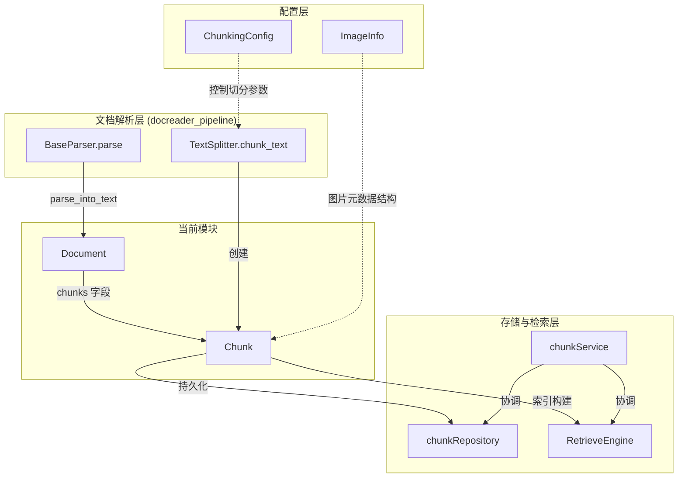

# document_chunk_data_model 模块深度解析

## 概述：为什么需要这个模块

想象你有一个 100 页的 PDF 文档，里面包含文字、表格、图片。用户问了一个问题："这份文档里关于预算的部分说了什么？" 系统不能把整份 100 页的文档塞进 LLM 的上下文窗口 —— 既浪费 token，又会让模型难以定位关键信息。

**`document_chunk_data_model` 模块的核心使命**：定义文档切分后的**原子数据单元**（Chunk），以及承载这些切片的**容器**（Document）。它是整个知识检索系统的"货币"——从文档解析器产出，流经向量化、存储、检索，最终到达 LLM 的上下文窗口。

这个模块解决的问题看似简单，实则暗含多个设计约束：
- **位置可追溯性**：检索到一个 chunk 后，需要知道它在原文档的哪个位置（`start`/`end`）
- **顺序保持**：多个 chunks 需要按原始顺序重组（`seq`）
- **多模态支持**：chunk 内可能嵌入图片及其元数据（`images`）
- **灵活扩展**：不同文档类型需要不同的元数据字段（`metadata`）
- **序列化友好**：需要持久化到数据库、通过 gRPC 传输、缓存到 Redis

如果你只用一个 `str` 来表示切片，上述需求全部无法满足。这就是 `Chunk` 类存在的意义。

---

## 架构定位与数据流



### 数据流追踪

**文档 ingestion 流程**（写入路径）：
1. `BaseParser.parse()` 接收原始文件字节流
2. 调用具体解析器的 `parse_into_text()` 生成 `Document` 对象（含原始 content 和 images）
3. 如果 `Document.chunks` 为空，调用 `TextSplitter.chunk_text()` 按 `ChunkingConfig` 切分
4. 通过 `_str_to_chunk()` 将 `(start, end, text)` 三元组转换为 `Chunk` 对象列表
5. 如果启用多模态，调用 `process_chunks_images()` 为每个 chunk 提取并处理图片
6. `chunkService` 将 chunks 持久化到 `chunkRepository`（GORM + PostgreSQL）
7. 同时调用 `RetrieveEngine` 构建向量索引

**检索流程**（读取路径）：
1. 用户查询经过 embedding 后，`RetrieveEngine` 返回带分数的 `IndexWithScore`
2. `chunkRepository` 根据索引 ID 加载完整的 `Chunk` 对象
3. Chunk 的 `metadata` 字段包含知识库 ID、文档 ID 等用于权限校验
4. 最终 chunks 被组装到 LLM 的 context 中

**关键依赖关系**：
- **上游**：`BaseParser`（创建者）、`ChunkingConfig`（配置者）
- **下游**：`chunkRepository`（持久化）、`chunkService`（业务逻辑）、`RetrieveEngine`（索引）
- **旁路**：`ImageInfo`（图片元数据契约，Go 语言定义）

---

## 核心组件深度解析

### Chunk 类：检索系统的原子单位

```python
class Chunk(BaseModel):
    content: str = Field(default="", description="chunk text content")
    seq: int = Field(default=0, description="Chunk sequence number")
    start: int = Field(default=0, description="Chunk start position")
    end: int = Field(description="Chunk end position")  # 注意：无默认值
    images: List[Dict[str, Any]] = Field(default_factory=list, ...)
    metadata: Dict[str, Any] = Field(default_factory=dict, ...)
```

#### 字段设计意图

| 字段 | 类型 | 设计理由 |
|------|------|----------|
| `content` | str | 实际参与向量化和语义匹配的文本内容 |
| `seq` | int | 文档内顺序号，用于多 chunk 重组时保持原始顺序 |
| `start`/`end` | int | **原文档中的字符偏移量**，用于高亮显示和引用定位 |
| `images` | List[Dict] | chunk 内嵌图片的元数据（URL、OCR 文本、caption） |
| `metadata` | Dict[str, Any] | **扩展性设计**：存储 knowledge_id、document_id、file_type 等 |

**为什么 `end` 没有默认值？** 这是一个隐式的完整性校验——如果一个 chunk 无法确定结束位置，说明切分逻辑有 bug，应该在构造时抛出异常而非静默失败。

#### 序列化方法族

```python
def to_dict(self, **kwargs: Any) -> Dict[str, Any]:
    data = self.model_dump()
    data.update(kwargs)
    data["class_name"] = self.__class__.__name__
    return data

def to_json(self, **kwargs: Any) -> str:
    data = self.to_dict(**kwargs)
    return json.dumps(data)

@classmethod
def from_dict(cls, data: Dict[str, Any], **kwargs: Any):
    if isinstance(kwargs, dict):
        data.update(kwargs)
    data.pop("class_name", None)  # 移除类名标记
    return cls(**data)

@classmethod
def from_json(cls, data_str: str, **kwargs: Any):
    data = json.loads(data_str)
    return cls.from_dict(data, **kwargs)
```

**设计洞察**：
- `to_dict` 注入 `class_name` 字段，用于反序列化时区分不同类型（未来可能有 `TableChunk`、`CodeChunk` 等子类）
- `from_dict` 主动弹出 `class_name`，避免 Pydantic 校验失败（因为模型中没有这个字段）
- 支持 `**kwargs` 动态覆盖字段，方便在序列化后追加元数据

#### 哈希与相等性：基于内容的去重策略

```python
def __hash__(self):
    return hash((self.content,))

def __eq__(self, other):
    return self.content == other.content
```

**关键设计决策**：两个 chunk 是否"相等"，**只看 content，忽略位置、顺序、元数据**。

**为什么这样设计？**
- **去重场景**：同一文档被多次上传，或不同文档包含相同段落，系统需要识别重复内容
- **缓存场景**：向量化是昂贵操作，如果 content 相同可以复用 embedding
- **权衡**：这意味着 `Chunk(seq=1, content="hello", start=0, end=5) == Chunk(seq=2, content="hello", start=100, end=105)` —— 在某些场景下可能违反直觉，但在检索去重场景下是正确的

#### 使用示例

```python
# 创建 chunk
chunk = Chunk(
    content="这是文档的第一段。",
    seq=0,
    start=0,
    end=12,
    metadata={"knowledge_id": "kb-123", "document_id": "doc-456"}
)

# 序列化（用于存储到 Redis 或消息队列）
json_str = chunk.to_json()

# 反序列化（从数据库加载后）
restored = Chunk.from_json(json_str)

# 内容去重检查
if chunk in existing_chunks_set:
    print("重复内容，跳过向量化")
```

---

### Document 类：文档的容器与工厂

```python
class Document(BaseModel):
    model_config = {"arbitrary_types_allowed": True}
    
    content: str = Field(default="", description="document text content")
    images: Dict[str, str] = Field(default_factory=dict, ...)
    chunks: List[Chunk] = Field(default_factory=list, ...)
    metadata: Dict[str, Any] = Field(default_factory=dict, ...)
```

#### 与 Chunk 的关键差异

| 维度 | Document | Chunk |
|------|----------|-------|
| **images 字段** | `Dict[str, str]`（URL → Base64/路径） | `List[Dict[str, Any]]`（结构化元数据） |
| **内容完整性** | 完整原文 | 切片片段 |
| **生命周期** | 解析阶段临时存在 | 持久化到数据库 |
| **使用场景** | 解析器内部流转 | 检索、展示、向量化 |

**为什么 images 类型不同？**
- `Document.images` 是解析过程中的**中间表示**：键是原始 URL，值是 Base64 或本地路径，用于批量处理
- `Chunk.images` 是**最终存储形态**：每个 chunk 只包含自己范围内的图片，且带有 OCR 文本、caption、COS URL 等丰富元数据

#### 核心方法

```python
def set_content(self, content: str) -> None:
    """设置文档内容（解析器使用）"""
    
def get_content(self) -> str:
    """获取文档内容"""
    
def is_valid(self) -> bool:
    """校验：content 非空"""
    return self.content != ""
```

`is_valid()` 是一个简单的防御性校验——空文档没有处理意义，应该在 pipeline 早期被过滤。

---

## 设计决策与权衡分析

### 1. 为什么用 Pydantic BaseModel 而非 dataclass？

**选择**：Pydantic BaseModel

**理由**：
- **运行时校验**：`end` 字段无默认值，构造时缺失会立即报错
- **序列化内置**：`model_dump()` 比 dataclass 的 `asdict()` 更灵活（支持嵌套、排除字段）
- **类型 coercion**：自动将字符串数字转换为 int，减少解析层负担
- **生态兼容**：与 FastAPI、配置系统无缝集成

**代价**：
- 性能略低于 dataclass（构造时校验开销）
- 运行时依赖 pydantic 库

### 2. metadata 使用 Dict[str, Any] 而非严格 Schema

**选择**：动态字典

**理由**：
- **多租户扩展**：不同租户可能需要不同的元数据字段（如 `department_id`、`security_level`）
- **文档类型差异**：PDF 需要 `page_number`，网页需要 `url`、`crawl_time`
- **向后兼容**：新增字段不需要修改模型和数据库迁移

**风险**：
- 类型不安全：`metadata["page_number"]` 可能是 str 或 int，取决于写入方
- IDE 无法自动补全

**缓解措施**：在 `chunkService` 层定义标准字段约定，通过文档而非代码强制约束

### 3. 哈希仅基于 content 的权衡

**收益**：
- 去重逻辑简单高效
- 缓存键稳定（不受位置变化影响）

**代价**：
- 无法区分"相同内容但不同位置"的 chunk（在某些引用场景下可能需要）
- 如果 content 相同但 metadata 不同（如权限级别），会被误判为重复

**适用场景判断**：当前系统主要用于知识检索，content 去重是高频需求，位置/元数据差异是低频需求，因此这个权衡是合理的。

### 4. images 字段的多态设计

Chunk 的 `images: List[Dict[str, Any]]` 是一个"弱类型"设计：

```python
# 实际存储的数据结构
{
    "original_url": "https://...",
    "cos_url": "https://cos.myqcloud.com/...",
    "ocr_text": "图表 1: 预算分布",
    "caption": "2024 年各部门预算占比",
    "start": 150,
    "end": 200,
    "alt_text": "预算图表"
}
```

**为什么不用专门的 `ImageChunk` 类？**
- 图片是 chunk 的**附属信息**，不是独立检索单元
- 不同解析器提取的图片元数据差异很大（PDF 有坐标，Markdown 只有 URL）
- 保持灵活性，避免过度设计

**风险**：调用方需要知道哪些字段一定存在，哪些可选。建议通过文档约定标准字段集。

---

## 依赖关系与契约

### 上游依赖（谁创建 Chunk）

| 组件 | 依赖方式 | 契约要求 |
|------|----------|----------|
| `BaseParser` | 直接实例化 | 必须设置 `seq`、`start`、`end`、`content` |
| `TextSplitter` | 通过 `chunk_text()` | 保证 `start`/`end` 与原文 content 一致 |
| `ChunkingConfig` | 配置注入 | 控制 chunk 大小、重叠、分隔符 |

### 下游依赖（谁消费 Chunk）

| 组件 | 使用场景 | 依赖字段 |
|------|----------|----------|
| `chunkRepository` | GORM 持久化 | 全部字段（转为数据库记录） |
| `chunkService` | 业务逻辑编排 | `metadata` 用于权限校验 |
| `RetrieveEngine` | 向量索引构建 | `content` 用于 embedding |
| `evaluationMemoryStorage` | 评估结果存储 | 用于记录检索到的 chunk |

### 跨语言契约：ImageInfo

注意 `Chunk.images` 的类型是 `List[Dict[str, Any]]`，但 Go 语言侧定义了严格的 `ImageInfo` 结构：

```go
type ImageInfo struct {
    URL         string // 图片 URL（COS）
    Caption     string // 图片描述
    OCRText     string // OCR 提取的文本
    OriginalURL string // 原始图片 URL
    Start       int    // 图片在文本中的开始位置
    End       int    // 图片在文本中的结束位置
}
```

**隐式契约**：Python 侧写入 `Chunk.images` 的字典应尽可能对齐 Go 侧的字段名，否则跨语言调用时可能丢失信息。

---

## 使用指南与最佳实践

### 创建 Chunk 的标准流程

```python
from docreader.models.document import Chunk, Document
from docreader.models.read_config import ChunkingConfig
from docreader.parser.base_parser import BaseParser

# 1. 配置切分参数
config = ChunkingConfig(
    chunk_size=512,
    chunk_overlap=50,
    separators=["\n\n", "\n", "。"],
    enable_multimodal=True
)

# 2. 使用解析器（推荐方式，自动处理切分和图片）
parser = BaseParser(
    file_name="document.pdf",
    chunking_config=config,
    max_chunks=1000
)
document = parser.parse(file_bytes)

# 3. 访问 chunks
for chunk in document.chunks:
    print(f"Chunk {chunk.seq}: {chunk.content[:50]}...")
    print(f"  Position: {chunk.start}-{chunk.end}")
    print(f"  Images: {len(chunk.images)}")
```

### 手动创建 Chunk（测试场景）

```python
chunk = Chunk(
    content="手动创建的测试内容",
    seq=0,
    start=0,
    end=15,
    metadata={
        "knowledge_id": "test-kb",
        "document_id": "test-doc",
        "file_type": ".txt"
    }
)

# 序列化存储
stored = chunk.to_json()

# 从存储恢复
restored = Chunk.from_json(stored)
assert restored.content == chunk.content
```

### 配置 ChunkingConfig 的策略

| 场景 | chunk_size | chunk_overlap | separators |
|------|------------|---------------|------------|
| 通用文档 | 512 | 50 | `["\n\n", "\n", "。"]` |
| 代码文件 | 1024 | 100 | `["\n\n", "\n"]` |
| 中文长文 | 768 | 100 | `["\n\n", "。", "！"]` |
| 高精度检索 | 256 | 50 | `["\n\n", "\n"]` |

**原则**：
- `chunk_size` 越小，检索精度越高，但上下文碎片化
- `chunk_overlap` 减少边界信息丢失，但增加存储和 token 消耗
- `separators` 按优先级排序，优先在段落边界切分

---

## 边界情况与陷阱

### 1. end 字段缺失导致构造失败

```python
# ❌ 错误：end 无默认值
chunk = Chunk(content="hello", seq=0, start=0)
# ValidationError: Field required

# ✅ 正确
chunk = Chunk(content="hello", seq=0, start=0, end=5)
```

### 2. 哈希相等性导致的意外去重

```python
chunk1 = Chunk(content="相同内容", seq=0, start=0, end=6, metadata={"doc": "A"})
chunk2 = Chunk(content="相同内容", seq=0, start=100, end=106, metadata={"doc": "B"})

print(chunk1 == chunk2)  # True
print(hash(chunk1) == hash(chunk2))  # True

# 如果放入 set，会丢失一个
chunk_set = {chunk1, chunk2}
print(len(chunk_set))  # 1，不是 2！
```

**解决方案**：如果需要区分位置/元数据不同的相同内容，不要用 `set`，改用字典 keyed by `(content, start, end)`。

### 3. metadata 字段类型不一致

```python
# 解析器 A 写入
chunk1.metadata["page_number"] = 1  # int

# 解析器 B 写入
chunk2.metadata["page_number"] = "1"  # str

# 下游消费方可能崩溃
if chunk.metadata["page_number"] > 5:  # TypeError: str > int
    ...
```

**解决方案**：在 `chunkService` 层统一标准化 metadata 字段类型。

### 4. 多模态图片处理失败

```python
# 如果图片下载失败，chunk.images 可能为空列表
# 调用方不应假设 images 一定非空

for img in chunk.images:  # ✅ 安全
    process(img)

# 而不是
img = chunk.images[0]  # ❌ 可能 IndexError
```

### 5. 序列化时的 class_name 陷阱

```python
# to_dict 会注入 class_name
data = chunk.to_dict()
print(data["class_name"])  # "Chunk"

# from_dict 会弹出 class_name
restored = Chunk.from_dict(data)
# 如果手动调用 Chunk(**data) 会报错：unexpected keyword argument 'class_name'
```

---

## 性能与扩展性考虑

### 内存占用估算

一个典型 Chunk 的内存占用：
- `content`: 512 字符 ≈ 1-2 KB（UTF-8）
- `metadata`: 5-10 个字段 ≈ 500 B
- `images`: 0-3 张图片，每张 ≈ 200 B（仅元数据）
- **总计**：约 2-3 KB / chunk

如果知识库有 100 万 chunks，内存中全量加载约需 2-3 GB。

### 批量操作建议

```python
# ❌ 低效：逐个序列化
for chunk in chunks:
    redis.set(f"chunk:{id}", chunk.to_json())

# ✅ 高效：批量序列化 + 管道
pipeline = redis.pipeline()
for chunk in chunks:
    pipeline.set(f"chunk:{id}", chunk.to_json())
pipeline.execute()
```

### 未来扩展方向

1. **子类化支持**：当前 `class_name` 字段预留了子类扩展能力（如 `TableChunk`、`CodeChunk`）
2. **嵌套 Chunk**：未来可能支持 `sub_chunks` 字段，用于层次化文档结构
3. **版本化**：增加 `version` 字段，支持 chunk 内容更新后的版本追踪

---

## 相关模块参考

- **[chunk_management_api](knowledge_and_chunk_api.md)**：HTTP 层的 Chunk CRUD 接口定义
- **[chunk_record_persistence](knowledge_and_corpus_storage_repositories.md)**：`chunkRepository` 的 GORM 实现
- **[chunk_lifecycle_management](knowledge_ingestion_extraction_and_graph_services.md)**：`chunkService` 的业务逻辑
- **[document_data_models](document_data_models.md)**：父模块，包含 `ImageInfo` 等关联模型
- **[chunking_configuration](chunking_configuration.md)**：`ChunkingConfig` 的详细配置项
- **[parser_base_abstractions](parser_base_abstractions.md)**：`BaseParser` 的切分逻辑

---

## 总结

`document_chunk_data_model` 模块是整个知识检索系统的**数据基石**。它的设计哲学可以概括为：

> **简单但完整，灵活但有约束**

- **简单**：核心只有两个类，字段直观
- **完整**：覆盖内容、位置、顺序、图片、元数据
- **灵活**：`metadata` 和 `images` 使用动态类型
- **有约束**：`end` 必填、哈希基于 content、序列化注入 `class_name`

理解这个模块，就理解了整个系统如何"看待"文档——不是作为整体，而是作为可检索、可组合、可追溯的切片集合。
