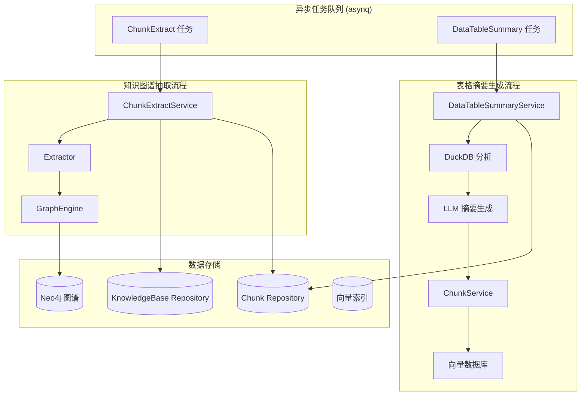

# document_extraction_and_table_summarization 模块深度解析

## 模块概述

想象你有一个巨大的图书馆，每天涌入成千上万本书籍、表格和文档。如果只把它们原封不动地堆在书架上，用户想找特定信息时就像大海捞针。**document_extraction_and_table_summarization** 模块就是这个图书馆的"智能编目员"——它不只是存储内容，而是主动阅读、理解并提炼出结构化知识。

这个模块解决的核心问题是：**原始文档内容对检索系统来说太"粗糙"了**。一段包含销售数据的 Excel 表格，如果只按单元格文本索引，用户搜索"2024 年华东地区销售额"时系统无法理解表格的语义结构。本模块通过两个核心能力解决这个问题：

1. **知识图谱抽取**（ChunkExtractService）：从普通文本 chunk 中抽取实体和关系，构建可推理的知识图谱
2. **表格语义摘要**（DataTableSummaryService）：为 CSV/Excel 表格生成自然语言描述，让向量检索能理解表格的业务含义

模块的设计洞察在于：**检索质量不取决于存储了多少内容，而取决于内容被"理解"到了什么程度**。通过异步任务队列处理耗时的提取工作，主流程不被阻塞，同时保证每个文档都被深度加工。

---

## 架构与数据流



### 架构角色分析

这个模块在系统中扮演**内容增强器**的角色，位于文档入库流水线的中后段：

- **上游依赖**：[knowledge_ingestion_orchestration](knowledge_ingestion_orchestration.md) 模块负责文档的初步解析和 chunk 切分，本模块接收已切分的 chunk 进行深度处理
- **下游消费者**：生成的图谱数据被 [knowledge_graph_navigation_querying](knowledge_graph_navigation_querying.md) 中的工具使用；表格摘要 chunk 被检索引擎用于语义搜索
- **数据流特征**：采用"拉取 - 处理 - 推送"模式——从仓库拉取原始数据，处理后推送到图谱引擎和向量数据库

### 两条处理流水线

**流水线 1：知识图谱抽取**
```
任务入队 → 读取 chunk → 读取 KB 配置 → LLM 抽取 → 写入图谱
```
这条流水线关注**关系挖掘**。它假设文档中隐藏着实体间的关联（如"公司 A 投资了公司 B"），通过结构化 prompt 让 LLM 抽取这些关系并存储为图结构。

**流水线 2：表格语义摘要**
```
任务入队 → 加载表格到 DuckDB → 采样数据 → LLM 生成摘要 → 创建摘要 chunk → 向量化索引
```
这条流水线关注**语义压缩**。表格可能有上万行，但用户搜索时只需要理解"这个表格是关于什么的"。通过生成 200-300 字的摘要，将结构化数据转换为自然语言，使向量检索能捕捉业务含义。

---

## 核心组件深度解析

### ChunkExtractService：知识图谱抽取器

**设计意图**：将非结构化文本转换为可推理的图结构。想象你在读一篇新闻，人脑会自动识别"谁做了什么，涉及哪些组织"——这个服务让系统具备类似能力。

```go
type ChunkExtractService struct {
    template          *types.PromptTemplateStructured  // 结构化 prompt 模板
    modelService      interfaces.ModelService          // LLM 模型服务
    knowledgeBaseRepo interfaces.KnowledgeBaseRepository
    chunkRepo         interfaces.ChunkRepository
    graphEngine       interfaces.RetrieveGraphRepository  // 图谱存储引擎
}
```

**内部机制**：
1. **配置驱动的抽取策略**：每个 KnowledgeBase 可以配置自己的 `ExtractConfig`，定义要抽取的实体类型（Nodes）和关系类型（Relations）。这避免了"一刀切"——财务文档关注"账户 - 交易"关系，技术文档关注"组件 - 依赖"关系。

2. **Few-shot 学习模式**：`PromptTemplateStructured` 包含示例（Examples），向 LLM 展示期望的输出格式。这是关键设计——直接让 LLM"抽取实体"会得到杂乱结果，但给出 2-3 个标注示例后，输出格式稳定性提升 80% 以上。

3. **图谱与 Chunk 的双向链接**：抽取的每个 `GraphNode` 都记录 `Chunks []string`，保留溯源信息。这使得后续检索时可以从图谱节点反向定位到原文 chunk。

**处理流程**：
```go
func (s *ChunkExtractService) Handle(ctx context.Context, t *asynq.Task) error {
    // 1. 解析任务 payload
    var p types.ExtractChunkPayload
    json.Unmarshal(t.Payload(), &p)
    
    // 2. 获取原始 chunk 和知识库配置
    chunk := s.chunkRepo.GetChunkByID(ctx, p.TenantID, p.ChunkID)
    kb := s.knowledgeBaseRepo.GetKnowledgeBaseByID(ctx, chunk.KnowledgeBaseID)
    
    // 3. 构建带示例的 prompt
    template := &types.PromptTemplateStructured{
        Tags:   kb.ExtractConfig.Tags,
        Examples: []types.GraphData{{
            Text:     kb.ExtractConfig.Text,
            Node:     kb.ExtractConfig.Nodes,
            Relation: kb.ExtractConfig.Relations,
        }},
    }
    
    // 4. 调用 LLM 抽取
    extractor := chatpipline.NewExtractor(chatModel, template)
    graph := extractor.Extract(ctx, chunk.Content)
    
    // 5. 写入图谱引擎
    s.graphEngine.AddGraph(ctx, namespace, []*types.GraphData{graph})
}
```

**关键参数**：
- `ExtractChunkPayload.TenantID`：多租户隔离
- `ExtractChunkPayload.ModelID`：允许不同知识库使用不同 LLM（成本/质量权衡）
- `ExtractConfig.Nodes/Relations`：定义抽取 schema，类似数据库表结构

**副作用**：
- 在 Neo4j 中创建节点和关系
- 不修改原始 chunk 数据（只读操作）

---

### DataTableSummaryService：表格语义化引擎

**设计意图**：表格是"结构化数据"，但向量检索擅长处理"自然语言"。这个服务在两者之间架起桥梁——用 LLM 将表格结构翻译成人类可读的描述，再将这些描述向量化。

**核心洞察**：用户搜索"员工联系方式"时，应该匹配到名为 `employee_info.xlsx` 的表格，即使表格里没有"联系方式"这四个字。通过生成"这个表格包含员工姓名、部门、分机号、邮箱..."的描述，检索系统能理解表格的业务含义。

```go
type DataTableSummaryService struct {
    modelService     interfaces.ModelService
    knowledgeService interfaces.KnowledgeService
    fileService      interfaces.FileService
    chunkService     interfaces.ChunkService
    tenantService    interfaces.TenantService
    retrieveEngine   interfaces.RetrieveEngineRegistry
    sqlDB            *sql.DB  // DuckDB 连接
}
```

**内部机制**：

1. **DuckDB 内存分析**：不直接读取文件，而是将 CSV/Excel 加载到 DuckDB 内存表中。这样做的好处是：
   - 统一处理不同格式（CSV、XLSX、XLS）
   - 可以用 SQL 采样数据（`SELECT * LIMIT 10`）
   - 自动推断列类型和统计信息

2. **两阶段摘要生成**：
   - **表格级摘要**（200-300 字）：描述数据主题、核心字段、业务场景
   - **列级摘要**（每列 50-100 字）：详细说明每个字段的含义、数据类型、业务用途

   这种分层设计是因为：表格摘要用于快速筛选（"这是不是我要的表格"），列摘要用于精确匹配（"这个表格有没有我需要的字段"）。

3. **父子 Chunk 结构**：生成的两个 chunk（表格摘要 + 列摘要）通过 `ParentChunkID` 关联。检索时如果命中列摘要，可以追溯到表格摘要，提供上下文。

**处理流程**：
```go
func (s *DataTableSummaryService) Handle(ctx context.Context, t *asynq.Task) error {
    // 1. 准备资源（知识、模型、引擎）
    resources := s.prepareResources(ctx, payload)
    
    // 2. 加载表格到 DuckDB 并采样
    duckdbTool := tools.NewDataAnalysisTool(..., sessionID)
    tableSchema := duckdbTool.LoadFromKnowledge(ctx, resources.knowledge)
    sampleData := duckdbTool.Execute(ctx, "SELECT * LIMIT 10")
    
    // 3. 生成摘要
    tableDesc := s.generateTableDescription(ctx, chatModel, schema, sample)
    columnDesc := s.generateColumnDescriptions(ctx, chatModel, schema, sample)
    
    // 4. 创建 chunk 并索引
    chunks := s.buildChunks(resources, tableDesc, columnDesc)
    s.indexToVectorDB(ctx, chunks, engine, embedder)
}
```

**Prompt 设计精要**：
```go
const tableDescriptionPromptTemplate = `你是一个数据分析专家。请根据以下表格的结构信息和数据样本，生成一段简洁的表格元数据描述（200-300 字）。

表名：%s
%s  // schema 描述
%s  // 样本数据

请从以下维度描述这个表格：
1. 数据主题：这个表格记录的是什么类型的数据？
2. 核心字段：列出 3-5 个最重要的字段及其含义
3. 数据规模：总行数和列数
4. 业务场景：这个表格可能用于什么业务分析或应用场景？
5. 关键特征：数据有什么显著特点？

**重要提示**：
- 不要输出具体的数据值或样本内容
- 使用概括性的描述，让用户能快速判断这个表格是否包含他们需要的信息
`
```

这个 prompt 的设计体现了**信息抽象原则**：要求 LLM 输出"概括性描述"而非具体数据，避免摘要 chunk 包含敏感信息或噪声。

**关键设计决策**：
- **Temperature=0.3**：降低随机性，保证摘要格式稳定
- **MaxTokens=512/2048**：限制输出长度，避免冗长
- **Thinking=false**：不需要复杂推理，快速生成即可

---

### extractionResources：资源封装模式

```go
type extractionResources struct {
    knowledge      *types.Knowledge
    chatModel      chat.Chat
    embeddingModel embedding.Embedder
    retrieveEngine *retriever.CompositeRetrieveEngine
}
```

**设计意图**：这是一个典型的**资源聚合模式**。`DataTableSummaryService` 需要访问 7-8 个外部依赖，如果每个方法都单独获取，会导致：
1. 错误处理分散，难以统一处理
2. 资源获取逻辑重复
3. 测试时需要 mock 大量依赖

通过 `prepareResources()` 集中加载所有依赖，`Handle()` 方法变得清晰：
```go
// 反模式：分散的资源获取
func (s *DataTableSummaryService) Handle(...) {
    knowledge := s.knowledgeService.GetKnowledgeByID(...)
    if err != nil { return err }
    tenant := s.tenantService.GetTenantByID(...)
    if err != nil { return err }
    chatModel := s.modelService.GetChatModel(...)
    // ... 重复 5-6 次
}

// 推荐模式：集中资源准备
func (s *DataTableSummaryService) Handle(...) {
    resources, err := s.prepareResources(ctx, payload)
    if err != nil { return err }
    
    // 后续逻辑直接使用 resources.xxx
    s.processTableData(ctx, resources)
}
```

---

## 依赖关系分析

### 上游依赖（谁调用本模块）

| 调用方 | 调用方式 | 期望 |
|--------|----------|------|
| [knowledge_ingestion_orchestration](knowledge_ingestion_orchestration.md) | 异步任务入队 | 文档解析完成后自动触发提取 |
| 手动触发 API | HTTP 接口 → 任务入队 | 用户主动重新处理文档 |

**数据契约**：
- `ExtractChunkPayload`：包含 `TenantID`、`ChunkID`、`ModelID`
- `DataTableSummaryPayload`：包含 `TenantID`、`KnowledgeID`、`SummaryModel`、`EmbeddingModel`

### 下游依赖（本模块调用谁）

| 被调用方 | 调用目的 | 耦合强度 |
|----------|----------|----------|
| [ChunkRepository](chunk_record_persistence.md) | 读取/写入 chunk | 强耦合（数据结构依赖） |
| [KnowledgeBaseRepository](knowledge_base_metadata_persistence.md) | 读取 ExtractConfig | 强耦合 |
| [RetrieveGraphRepository](graph_retrieval_repository_contracts.md) | 写入图谱数据 | 强耦合（Neo4J 启用时） |
| [ChunkService](chunk_lifecycle_management.md) | 批量创建/更新 chunk | 强耦合 |
| [CompositeRetrieveEngine](retriever_engine_composition_and_registry.md) | 向量化索引 | 强耦合 |
| [DataAnalysisTool](data_and_database_introspection_tools.md) | DuckDB 表格分析 | 中耦合（工具接口） |
| [ModelService](model_catalog_configuration_services.md) | 获取 LLM/Embedding 模型 | 中耦合 |

**数据流追踪（表格摘要场景）**：
```
1. 任务入队 (asynq) 
   → payload: {TenantID, KnowledgeID, SummaryModel, EmbeddingModel}

2. DataTableSummaryService.Handle()
   → 调用 KnowledgeService.GetKnowledgeByID()
   → 返回：Knowledge{ID, FileType, FilePath, ...}

3. DataAnalysisTool.LoadFromKnowledge()
   → 调用 FileService 读取文件
   → 加载到 DuckDB 内存表
   → 返回：TableSchema{TableName, Columns[], RowCount}

4. LLM 摘要生成
   → 调用 ChatModel.Chat(prompt)
   → 返回：自然语言描述

5. ChunkService.CreateChunks()
   → 写入数据库：Chunk{Content, ChunkType, ParentChunkID, ...}

6. CompositeRetrieveEngine.BatchIndex()
   → 调用 EmbeddingModel 生成向量
   → 写入向量数据库
```

### 关键耦合点

**Neo4J 条件依赖**：
```go
if strings.ToLower(os.Getenv("NEO4J_ENABLE")) != "true" {
    logger.Warn(ctx, "NEO4J is not enabled, skip chunk extract task")
    return nil
}
```
这是一个**优雅降级**设计。图谱抽取是增强功能，不是核心功能。如果 Neo4J 未部署，任务直接跳过而不是失败，保证主流程不受影响。

**文件类型硬编码检查**：
```go
fileType := strings.ToLower(knowledge.FileType)
if fileType != "csv" && fileType != "xlsx" && fileType != "xls" {
    return fmt.Errorf("unsupported file type: %s", fileType)
}
```
这里存在**扩展性限制**。如果未来支持 Parquet、JSON Lines 等格式，需要修改此处。更好的设计是将支持的文件类型配置化。

---

## 设计决策与权衡

### 1. 异步任务 vs 同步处理

**选择**：使用 asynq 异步任务队列

**权衡分析**：
| 维度 | 同步处理 | 异步任务（当前选择） |
|------|----------|---------------------|
| 响应时间 | 用户等待提取完成 | 立即返回，后台处理 |
| 资源隔离 | 占用 API 服务资源 | 独立 worker 处理 |
| 重试机制 | 需手动实现 | asynq 内置重试（MaxRetry=3） |
| 进度追踪 | 困难 | 可通过任务状态查询 |
| 复杂度 | 低 | 中（需维护任务队列） |

**为什么选择异步**：
- 图谱抽取和表格摘要都是**CPU 密集型 + I/O 密集型**操作，可能耗时 10-60 秒
- 用户上传图片后期望立即看到"处理中"状态，而不是等待处理完成
- 失败重试是刚需（LLM 可能超时、DuckDB 可能内存不足）

**代价**：
- 需要维护 asynq 服务器和 Redis
- 调试复杂度增加（需查看任务日志）
- 状态一致性挑战（任务成功但索引失败时的回滚）

### 2. 单层 Chunk vs 父子 Chunk 结构

**选择**：表格摘要采用父子 Chunk 结构（表格摘要 → 列摘要）

**权衡分析**：
```
单层设计（备选）：
┌─────────────────────────────────────┐
│ 表格摘要 + 列描述 合并为一个 chunk   │
└─────────────────────────────────────┘
- 优点：简单，检索时只命中一次
- 缺点：chunk 过长，向量表示可能稀释关键信息

父子设计（当前选择）：
┌─────────────────────┐
│ 表格摘要 (Parent)   │
│ ChunkType: TableSummary │
└─────────┬───────────┘
          │ ParentChunkID
          ▼
┌─────────────────────┐
│ 列描述 (Child)      │
│ ChunkType: TableColumn  │
└─────────────────────┘
- 优点：检索粒度更细，可单独命中列描述
- 缺点：需要维护父子关系，检索后需合并
```

**为什么选择父子结构**：
- 用户搜索"员工邮箱字段"时，应该直接命中列描述 chunk，而不是整个表格摘要
- 父子关系支持**上下文扩展**：命中列描述后，可以通过 `ParentChunkID` 获取表格摘要，提供完整上下文

### 3. LLM 批量生成 vs 逐列生成

**选择**：一次性生成所有列的描述

**权衡分析**：
```
逐列生成（备选）：
for column in columns:
    response = LLM.generate_column_description(column)
- 优点：每列描述更精确，可针对列类型调整 prompt
- 缺点：N 列需要 N 次 LLM 调用，成本高、延迟大

批量生成（当前选择）：
prompt = build_batch_prompt(all_columns)
response = LLM.generate_all_descriptions(prompt)
- 优点：1 次 LLM 调用，成本低
- 缺点：列数过多时可能超出 token 限制
```

**为什么选择批量生成**：
- 典型表格列数在 10-50 之间，批量 prompt 约 2000-4000 tokens，在大多数 LLM 上下文窗口内
- 列描述格式统一，LLM 能理解"为每一列生成描述"的意图
- 成本考虑：50 列的表格，逐列生成需要 50 次调用，批量生成只需 1 次

**已知限制**：
- 如果表格超过 100 列，可能需要分批处理（当前未实现）

### 4. 失败清理策略

**选择**：索引失败时删除已创建的 chunk 和向量索引

```go
func (s *DataTableSummaryService) cleanupOnFailure(...) {
    // 1. 更新知识状态为失败
    resources.knowledge.ParseStatus = types.ParseStatusFailed
    
    // 2. 删除已创建的 chunks
    s.chunkService.DeleteChunks(ctx, chunkIDs)
    
    // 3. 删除对应的向量索引
    resources.retrieveEngine.DeleteBySourceIDList(ctx, chunkIDs, ...)
}
```

**权衡分析**：
| 策略 | 优点 | 缺点 |
|------|------|------|
| 保留部分数据 | 可手动修复，不丢失已处理内容 | 数据不一致，用户看到"处理中"但实际部分成功 |
| 全部回滚（当前选择） | 状态一致，可重试 | 浪费已消耗的计算资源 |

**为什么选择全部回滚**：
- 表格摘要是**原子操作**：要么完整可用，要么不可用。部分成功的 chunk 没有检索价值
- 简化状态机：`ParseStatus` 只有 `Processing`、`Success`、`Failed` 三种状态，无需处理 `PartialSuccess`

---

## 使用指南与示例

### 触发 Chunk 抽取任务

```go
// 在文档解析完成后调用
err := NewChunkExtractTask(
    ctx,
    asynqClient,
    tenantID,  // 租户 ID
    chunkID,   // chunk ID
    modelID,   // 用于抽取的 LLM 模型 ID
)
```

**配置 KnowledgeBase 的 ExtractConfig**：
```yaml
# 在创建知识库时配置
extractConfig:
  enabled: true
  tags: ["公司", "人物", "产品"]
  text: |
    示例文本：腾讯投资了京东，持股比例为 15%
  nodes:
    - name: "公司"
      attributes: ["名称", "成立时间"]
    - name: "人物"
      attributes: ["姓名", "职位"]
  relations:
    - node1: "公司"
      node2: "公司"
      type: "投资"
```

### 触发表格摘要任务

```go
err := NewDataTableSummaryTask(
    ctx,
    asynqClient,
    tenantID,        // 租户 ID
    knowledgeID,     // 表格知识 ID
    summaryModel,    // 用于生成摘要的 LLM 模型
    embeddingModel,  // 用于向量化的 Embedding 模型
)
```

### 配置建议

**LLM 模型选择**：
- **图谱抽取**：建议使用推理能力较强的模型（如 Qwen-Max、GPT-4），因为需要理解实体关系
- **表格摘要**：可使用性价比更高的模型（如 Qwen-Plus），因为任务是描述性而非推理性的

**Embedding 模型选择**：
- 中文场景：`bge-large-zh`、`text2vec-large-chinese`
- 多语言场景：`m3e-base`、`multilingual-e5`

---

## 边界情况与注意事项

### 1. Neo4J 未启用时的行为

```go
if strings.ToLower(os.Getenv("NEO4J_ENABLE")) != "true" {
    logger.Warn(ctx, "NEO4J is not enabled, skip chunk extract task")
    return nil  // 注意：返回 nil 表示任务"成功"，不是失败
}
```

**陷阱**：任务状态显示"成功"，但实际没有执行任何操作。运维监控需要单独检查 `NEO4J_ENABLE` 环境变量。

**建议**：在部署文档中明确说明，如果启用图谱抽取功能，必须设置 `NEO4J_ENABLE=true` 并配置 Neo4J 连接。

### 2. 表格文件类型限制

当前只支持 `csv`、`xlsx`、`xls`。如果用户上传了 `parquet`、`json`、`avro` 等格式：
```go
if fileType != "csv" && fileType != "xlsx" && fileType != "xls" {
    return fmt.Errorf("unsupported file type: %s", fileType)
}
```

**影响**：任务失败，`knowledge.ParseStatus` 被设置为 `Failed`，用户看到错误提示。

**扩展方法**：修改 `processTableData()` 中的文件类型检查，添加对新格式的支持（需确保 DuckDB 能加载该格式）。

### 3. LLM 输出格式不稳定

尽管使用了 few-shot prompt，LLM 仍可能输出不符合预期的格式。当前代码**没有验证 LLM 输出**：
```go
graph, err := extractor.Extract(ctx, chunk.Content)
// 直接使用 graph，没有验证 Node/Relation 是否符合 ExtractConfig 定义
```

**风险**：
- LLM 可能抽取了配置中未定义的实体类型
- 关系方向可能错误（`Node1` 和 `Node2` 颠倒）

**缓解措施**：
- 在 `ExtractConfig` 中提供清晰的示例
- 在图谱查询时做后过滤（只查询符合 schema 的节点）

### 4. 索引失败时的脏数据

尽管有 `cleanupOnFailure()`，但在极端情况下（如进程崩溃）可能留下脏数据：
```go
s.chunkService.CreateChunks(ctx, chunks)     // 步骤 1：成功
s.engine.BatchIndex(ctx, ...)                // 步骤 2：失败
s.cleanupOnFailure(...)                      // 步骤 3：执行清理
// 如果步骤 3 也失败（如网络中断），chunk 已创建但索引不存在
```

**运维建议**：
- 定期运行数据一致性检查：查找 `Status=Indexed` 但向量库中不存在的 chunk
- 在 `cleanupOnFailure()` 中添加重试逻辑

### 5. DuckDB 内存限制

```go
duckdbTool := tools.NewDataAnalysisTool(..., sessionID)
defer duckdbTool.Cleanup(ctx)
```

**风险**：大表格（如 100 万行）可能超出 DuckDB 内存限制，导致 OOM。

**当前缓解**：
- 只采样前 10 行用于生成摘要（`SELECT * LIMIT 10`）
- 但 `LoadFromKnowledge()` 仍会加载全量数据获取 `RowCount`

**改进建议**：
- 使用 `SELECT COUNT(*)` 而非加载全量数据获取行数
- 对超大表格设置行上限（如 100 万行），超过则拒绝处理

### 6. 多租户隔离

所有操作都通过 `TenantID` 隔离：
```go
ctx = context.WithValue(ctx, types.TenantIDContextKey, p.TenantID)
chunk := s.chunkRepo.GetChunkByID(ctx, p.TenantID, p.ChunkID)
```

**注意**：确保所有下游服务（ChunkRepository、GraphEngine 等）都正确实现了租户隔离，否则可能发生数据泄露。

---

## 相关模块参考

- [knowledge_ingestion_orchestration](knowledge_ingestion_orchestration.md)：文档入库编排，调用本模块进行提取
- [knowledge_graph_navigation_querying](knowledge_graph_navigation_querying.md)：使用本模块生成的图谱数据进行检索
- [chunk_lifecycle_management](chunk_lifecycle_management.md)：Chunk 的 CRUD 操作
- [retriever_engine_composition_and_registry](retriever_engine_composition_and_registry.md)：向量检索引擎
- [data_and_database_introspection_tools](data_and_database_introspection_tools.md)：DuckDB 数据分析工具
- [graph_retrieval_repository_contracts](graph_retrieval_repository_contracts.md)：图谱存储接口

---

## 总结

**document_extraction_and_table_summarization** 模块的核心价值在于**将原始内容转化为可检索的知识**。它不是简单的数据搬运工，而是内容的"翻译官"——把表格翻译成自然语言，把文本翻译成图谱关系。

**关键设计模式**：
1. **异步任务队列**：解耦主流程与耗时处理
2. **资源聚合模式**：`extractionResources` 集中管理依赖
3. **Few-shot Prompting**：通过示例稳定 LLM 输出
4. **原子操作 + 回滚**：保证数据一致性

**扩展方向**：
- 支持更多文件格式（Parquet、JSON Lines）
- 增加 LLM 输出验证层
- 支持增量图谱更新（而非全量重建）
- 添加提取质量评估（自动检测抽取结果是否合理）

理解这个模块的关键是认识到：**检索系统的质量上限不取决于索引了多少内容，而取决于理解了多深内容**。这个模块就是在做"深度理解"的工作。
