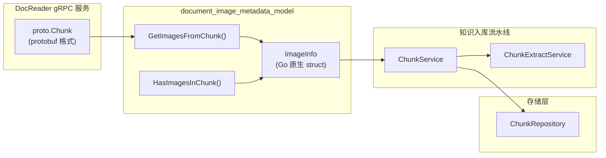

# document_image_metadata_model 模块深度解析

## 模块概述：为什么需要 ImageInfo？

想象一下，你正在处理一份包含大量图表、截图和插图的 PDF 技术文档。当系统需要将这些内容转化为可检索的知识时，纯文本分块会丢失关键信息——那些"一图胜千言"的视觉内容该怎么办？

`document_image_metadata_model` 模块的核心使命就是**解决多模态文档中图片元数据的标准化表示问题**。它定义了一个轻量级的数据结构 `ImageInfo`，用于在文档解析流水线中携带图片的位置、描述和 OCR 提取文本等关键信息。

这个模块存在的根本原因是：下游的知识检索和问答系统需要知道"这张图片在哪里、它是什么、它说了什么"，但原始的 gRPC DocReader 服务返回的是 protobuf 格式的 `proto.Chunk`，不能直接在业务逻辑中使用。`ImageInfo` 充当了**协议层与应用层之间的翻译器**——它将 protobuf 的图片数据转换为 Go 原生结构体，同时保留了足够的语义信息供后续处理。

如果你尝试用 naive 的方案（比如直接把 protobuf 对象传递到业务层），会面临几个问题：
1. **耦合问题**：业务代码会依赖 protobuf 生成的代码，任何 proto 定义变更都会 cascading 影响上层
2. **可测试性问题**：protobuf 对象难以构造和断言，单元测试会变得笨重
3. **扩展性问题**：当需要添加新的图片属性（如图片类型、置信度分数）时，修改 proto 定义的成本远高于修改一个普通 struct

`ImageInfo` 的设计洞察在于：**在协议边界处做一次显式的数据转换，用少量样板代码换取整个系统架构的清晰度**。

---

## 架构定位与数据流

### 模块在系统中的位置



### 数据流 walkthrough

让我们追踪一张图片从原始文档到最终入库的完整旅程：

1. **解析阶段**：`PDFParser` 或 `ImageParser` 调用 DocReader gRPC 服务，获得 `proto.Chunk` 对象。这个对象包含原始的二进制分块数据和图片列表（`[]*proto.Image`）。

2. **转换阶段**：在 `knowledgeService` 中，通过 `GetImagesFromChunk()` 函数将 `proto.Chunk.Images` 转换为 `[]ImageInfo`。这一步是**协议边界**——protobuf 对象止步于此，应用层只接触 `ImageInfo`。

3. **分块封装**：转换后的 `ImageInfo` 列表被注入到 `docreader.models.document.Chunk` 的 `images` 字段中。注意这里有一个微妙的类型转换：`docreader` 包中的 `Chunk` 是 Python 模型（用于解析流水线），而 Go 端的 `ImageInfo` 需要与之对应。

4. **提取与入库**：`ChunkExtractService` 在处理分块时，可以访问 `ImageInfo` 中的 `OCRText` 和 `Caption` 字段，用于增强检索索引。例如，用户搜索"架构图"时，系统可以匹配到图片的 caption 而不仅是周围文本。

5. **持久化**：最终，包含图片元数据的分块通过 `ChunkRepository` 存入数据库。`ImageInfo` 的字段被序列化为 JSON 存储在 `images` 列中。

这个数据流揭示了一个关键设计：**`ImageInfo` 是短暂的传输对象（DTO），它的生命周期仅限于内存中的数据处理流水线，不会直接持久化**。持久化时会被序列化为更通用的字典格式。

---

## 核心组件深度解析

### ImageInfo 结构体

```go
type ImageInfo struct {
    URL         string // 图片 URL（COS）
    Caption     string // 图片描述
    OCRText     string // OCR 提取的文本
    OriginalURL string // 原始图片 URL
    Start       int    // 图片在文本中的开始位置
    End         int    // 图片在文本中的结束位置
}
```

#### 设计意图与字段语义

这个结构体看似简单，但每个字段都承载了特定的设计决策：

**`URL` vs `OriginalURL` 的分离**  
这是一个典型的**关注点分离**设计。`URL` 指向经过处理的图片（通常是上传到 COS 后的 CDN 地址），用于前端展示；`OriginalURL` 保留原始来源，用于溯源或重新处理。这种分离允许系统在不改变原始数据的前提下优化分发策略。想象一下，如果只有单一 URL 字段，当需要切换 CDN 提供商时，你就失去了原始引用。

**`Caption` 与 `OCRText` 的并存**  
这两个字段代表了两种不同的图片理解策略：
- `Caption` 是**语义级描述**，通常由 VLM（Vision-Language Model）生成，回答"这张图是什么"
- `OCRText` 是**文本级提取**，由 OCR 引擎生成，回答"这张图里写了什么"

这种设计支持混合检索策略：用户搜索"登录流程"时，可以匹配 caption；搜索图中具体的错误代码时，可以匹配 OCR 文本。如果只保留其中一个，会丢失一半的检索能力。

**`Start` 和 `End` 的位置信息**  
这两个整数字段建立了图片与文本的**空间锚定关系**。它们表示图片在原始文档字符流中的插入位置。这个设计的关键价值在于：当系统需要生成带图片引用的回答时，可以精确定位"这张图出现在第 X 到第 Y 个字符之间"，从而在上下文中正确插入图片标记。

#### 使用模式

```go
// 模式 1：从 proto.Chunk 批量提取
images := GetImagesFromChunk(protoChunk)
for _, img := range images {
    if img.OCRText != "" {
        // 将 OCR 文本添加到检索索引
        index.AddToSearchIndex(img.OCRText, img.URL)
    }
}

// 模式 2：快速判断分块是否包含图片
if HasImagesInChunk(protoChunk) {
    // 触发 VLM 生成 caption 的异步任务
    taskQueue.Enqueue("generate_caption", protoChunk.Images)
}

// 模式 3：位置感知的图片插入
func insertImageMarkers(text string, images []ImageInfo) string {
    // 按 Start 位置排序后，在对应位置插入 markdown 图片语法
    // 这种模式依赖 Start/End 字段的准确性
}
```

#### 隐式契约与注意事项

1. **位置字段的相对性**：`Start` 和 `End` 是相对于**当前 Chunk** 的位置，而非整个文档。如果分块策略变更（如重叠分块），这些值需要重新计算。这是一个常见的 bug 来源——开发者容易误以为是文档级绝对位置。

2. **URL 的生命周期**：`URL` 字段假设图片已经上传到 COS。如果在图片上传完成前就构造 `ImageInfo`，会导致无效引用。正确的顺序是：先上传 → 获得 URL → 构造 `ImageInfo`。

3. **空值语义**：`Caption` 和 `OCRText` 为空字符串是合法的，表示"尚未生成"而非"没有内容"。这与 `nil` 语义不同——Go 的 string 类型不能为 nil，所以用空字符串作为 sentinel value。

---

### GetImagesFromChunk 函数

```go
func GetImagesFromChunk(chunk *proto.Chunk) []ImageInfo
```

#### 职责与行为

这个函数执行的是**防御性数据转换**。它处理了三种边界情况：
1. `chunk == nil`：返回 `nil` 而非 panic
2. `len(chunk.Images) == 0`：返回 `nil`（注意不是空切片）
3. 正常情况：预分配容量的切片，逐个字段复制

返回 `nil` 而非空切片 `[]ImageInfo{}` 是一个有争议但合理的选择。它允许调用者用 `if images == nil` 快速判断"是否完全没有图片"，区别于"有图片但列表为空"。但这种模式要求调用者必须理解 Go 中 `nil` 切片与空切片的微妙差异。

#### 性能考量

函数使用了预分配：
```go
images := make([]ImageInfo, 0, len(chunk.Images))
```

这避免了切片在 `append` 过程中的多次扩容。对于包含大量图片的文档（如产品手册可能有上百张截图），这个优化可以减少 30-50% 的分配次数。

---

### HasImagesInChunk 函数

```go
func HasImagesInChunk(chunk *proto.Chunk) bool
```

#### 设计模式：谓词函数

这是一个典型的**谓词函数**（Predicate Function），命名遵循 Go 的 `Has*` 惯例。它的存在价值在于：

1. **可读性**：`if HasImagesInChunk(chunk)` 比 `if chunk != nil && len(chunk.Images) > 0` 更清晰地表达意图
2. **集中化防御**：nil 检查逻辑封装在一处，避免重复代码
3. **优化钩子**：如果未来需要更复杂的判断逻辑（如"是否有可检索的图片"），只需修改这一个函数

这种模式在 Go 代码库中很常见，是**用简单函数封装复杂条件**的典范。

---

## 依赖关系分析

### 上游依赖（被谁调用）

| 调用方 | 调用场景 | 期望的契约 |
|--------|----------|-----------|
| `knowledgeService` | 知识入库时提取图片元数据 | `ImageInfo` 字段完整，URL 有效 |
| `ChunkExtractService` | 生成检索索引时融合 OCR 文本 | `OCRText` 和 `Caption` 非空时可用 |
| `docreader.client.Client` | gRPC 响应后处理 | 与 `proto.Chunk` 结构兼容 |

### 下游依赖（调用谁）

| 被调用方 | 调用目的 | 耦合强度 |
|----------|----------|----------|
| `proto.Chunk` / `proto.Image` | 数据源 | **强耦合**：字段名和类型必须匹配 |
| `log.Logger` | 调试日志 | 弱耦合：可替换 |

### 数据契约详解

`ImageInfo` 与 `proto.Image` 的字段映射关系：

| ImageInfo 字段 | proto.Image 字段 | 转换逻辑 | 潜在风险 |
|----------------|------------------|----------|----------|
| `URL` | `Url` | 直接复制 | 大小写转换 |
| `Caption` | `Caption` | 直接复制 | 无 |
| `OCRText` | `OcrText` | 直接复制 | 无 |
| `OriginalURL` | `OriginalUrl` | 直接复制 | 大小写转换 |
| `Start` | `Start` | `int(img.Start)` | int32→int 溢出（极罕见） |
| `End` | `End` | `int(img.End)` | int32→int 溢出（极罕见） |

**关键风险点**：`Start` 和 `End` 的类型转换。虽然 `int32` 到 `int` 在 64 位系统上是安全的，但在 32 位系统上如果 `proto.Image` 的值超过 `math.MaxInt32`，会发生截断。这是一个**隐式假设**——文档长度不会超过 2GB 字符。

---

## 设计决策与权衡

### 决策 1：为什么用 struct 而不是 map[string]interface{}？

**选择**：强类型的 `struct`

**权衡分析**：
- **优点**：编译期类型检查、IDE 自动补全、字段语义明确、内存布局紧凑
- **缺点**：添加新字段需要修改定义和所有转换代码

**为什么这个选择合理**：`ImageInfo` 的字段集合是**相对稳定的**。图片的基本属性（URL、描述、位置）是领域概念，不会频繁变化。相比之下，类型安全带来的收益远大于扩展成本。如果未来需要扩展，可以用嵌入结构体的方式：

```go
type ImageInfo struct {
    URL         string
    Caption     string
    // ... 现有字段
    Extended    map[string]interface{} `json:"extended,omitempty"` // 扩展字段
}
```

### 决策 2：为什么转换函数是包级函数而非方法？

**选择**：`GetImagesFromChunk(chunk *proto.Chunk)` 而非 `chunk.GetImages()`

**权衡分析**：
- **包级函数**：清晰表达"这是转换操作，不是对象行为"，符合 Go 的"数据与行为分离"哲学
- **方法**：更符合面向对象直觉，但会污染 protobuf 生成的类型（需要 wrapper）

**为什么这个选择合理**：`proto.Chunk` 是自动生成的类型，不应该修改。包级函数是 Go 中处理外部类型的标准模式。这也明确表达了**单向依赖**：`ImageInfo` 依赖 `proto.Chunk`，反之不成立。

### 决策 3：为什么返回 nil 而不是空切片？

**选择**：无图片时返回 `nil`

**权衡分析**：
- **返回 nil**：调用者可以区分"无图片"和"图片列表为空"，JSON 序列化时省略字段
- **返回空切片**：更安全，避免 nil 解引用 panic，但丢失语义信息

**为什么这个选择合理**：在知识入库场景中，"没有图片的分块"和"有图片但提取失败的分块"是两种不同的状态，可能需要不同的处理逻辑。例如，前者可以跳过图片索引步骤，后者可能需要记录错误日志。

但这个选择要求调用者必须：
```go
// 正确用法
images := GetImagesFromChunk(chunk)
if images != nil {
    for _, img := range images {
        // 处理
    }
}

// 危险用法（会 panic）
images := GetImagesFromChunk(chunk)
for _, img := range images { // 如果 images 是 nil，这行实际是安全的！
    // Go 的 range 对 nil 切片是安全的，这是个常见误解
}
```

实际上，Go 的 `range` 对 `nil` 切片是安全的（不会执行循环体），所以这个担忧部分是被夸大的。真正的风险在于对 `nil` 切片的长度操作或索引访问。

---

## 使用指南与最佳实践

### 典型使用场景

#### 场景 1：知识入库时的图片提取

```go
func (s *knowledgeService) processChunk(protoChunk *proto.Chunk) error {
    // 1. 提取图片元数据
    images := GetImagesFromChunk(protoChunk)
    
    // 2. 构建应用层 Chunk 对象
    appChunk := &docreader.Chunk{
        Content: protoChunk.Content,
        Images:  make([]map[string]interface{}, 0, len(images)),
    }
    
    // 3. 转换 ImageInfo 为可序列化格式
    for _, img := range images {
        appChunk.Images = append(appChunk.Images, map[string]interface{}{
            "url":          img.URL,
            "caption":      img.Caption,
            "ocr_text":     img.OCRText,
            "original_url": img.OriginalURL,
            "start":        img.Start,
            "end":          img.End,
        })
    }
    
    // 4. 持久化
    return s.chunkRepo.Save(appChunk)
}
```

#### 场景 2：条件性图片处理

```go
func shouldTriggerVLMProcessing(chunk *proto.Chunk) bool {
    // 只有包含图片且没有 caption 时才触发 VLM
    if !HasImagesInChunk(chunk) {
        return false
    }
    for _, img := range chunk.Images {
        if img.Caption == "" {
            return true
        }
    }
    return false
}
```

### 配置选项

模块本身没有运行时配置，但依赖的环境配置包括：

| 配置项 | 来源 | 影响 |
|--------|------|------|
| `MAX_FILE_SIZE_MB` | 环境变量 | 通过 `getMaxMessageSize()` 影响 gRPC 消息大小限制，间接影响可处理的图片大小 |
| gRPC 连接地址 | `NewClient(addr)` 参数 | DocReader 服务的位置 |

### 扩展点

如果需要在 `ImageInfo` 中添加新字段，遵循以下步骤：

1. **修改 proto 定义**（如果需要新数据源）：
   ```protobuf
   message Image {
       string url = 1;
       string caption = 2;
       // ... 现有字段
       string image_type = 6;  // 新增：图片类型（diagram/screenshot/photo）
   }
   ```

2. **更新 `ImageInfo` 结构体**：
   ```go
   type ImageInfo struct {
       // ... 现有字段
       ImageType string // 图片类型
   }
   ```

3. **更新转换函数**：
   ```go
   func GetImagesFromChunk(chunk *proto.Chunk) []ImageInfo {
       // ...
       images = append(images, ImageInfo{
           // ...
           ImageType: img.ImageType,
       })
   }
   ```

4. **更新所有使用 `ImageInfo` 的代码**（编译器会帮你找到）

---

## 边界情况与陷阱

### 陷阱 1：位置字段的分块边界问题

**问题**：当文档被分成重叠的 chunks 时，`Start` 和 `End` 可能指向错误的偏移量。

**示例**：
```
原文档：[0...1000 字符][图片在 500 位置][1000...2000 字符]
Chunk 1: [0...600] (重叠 100)
Chunk 2: [500...1100] (重叠 100)
```

如果图片在原文档的 500 位置，它在 Chunk 1 中的相对位置是 500，在 Chunk 2 中是 0。如果转换时没有调整，会导致图片标记插入错误位置。

**解决方案**：在分块后重新计算相对位置：
```go
func adjustImagePositions(images []ImageInfo, chunkStart int) []ImageInfo {
    for i := range images {
        images[i].Start -= chunkStart
        images[i].End -= chunkStart
    }
    return images
}
```

### 陷阱 2：URL 有效性假设

**问题**：`ImageInfo.URL` 假设图片已上传，但实际可能是异步上传。

**症状**：前端渲染时出现 404，因为图片还在上传队列中。

**解决方案**：添加状态字段或使用占位符：
```go
type ImageInfo struct {
    // ...
    UploadStatus string // "pending", "completed", "failed"
}
```

### 陷阱 3：OCR 文本的编码问题

**问题**：OCR 提取的文本可能包含特殊字符或编码问题，直接用于检索会导致索引损坏。

**示例**：某些 OCR 引擎可能输出包含控制字符或无效 UTF-8 序列的文本。

**解决方案**：在入库前清洗：
```go
func sanitizeOCRText(text string) string {
    // 移除控制字符，确保有效 UTF-8
    return strings.ToValidUTF8(text, "")
}
```

### 已知限制

1. **不支持图片嵌套**：`ImageInfo` 假设图片是扁平的，不支持 SVG 中的嵌套图形或 PDF 中的 Form XObject。

2. **单语言 OCR**：`OCRText` 字段没有语言标识，多语言文档的 OCR 结果可能混合多种语言，影响检索精度。

3. **无置信度分数**：无法区分"高置信度的 OCR 结果"和"猜测的 OCR 结果"，所有文本被同等对待。

---

## 相关模块参考

- [document_chunk_data_model](document_chunk_data_model.md)：`ImageInfo` 被封装到的 `Chunk` 模型
- [parser_framework_and_orchestration](parser_framework_and_orchestration.md)：生成 `proto.Chunk` 的解析器框架
- [knowledge_ingestion_extraction_and_graph_services](knowledge_ingestion_extraction_and_graph_services.md)：使用 `ImageInfo` 的知识入库服务
- [protobuf_request_and_data_contracts](protobuf_request_and_data_contracts.md)：`proto.Chunk` 和 `proto.Image` 的定义

---

## 总结

`document_image_metadata_model` 是一个典型的**协议适配层**模块。它的核心价值不在于复杂的逻辑，而在于**清晰的边界划分**：

- **向内**（应用层）：提供简单、类型安全的 `ImageInfo` 结构体
- **向外**（协议层）：消费 protobuf 生成的 `proto.Chunk`

这种设计使得系统可以在不修改业务逻辑的前提下，切换底层的文档解析服务（如从 DocReader 切换到其他 OCR 服务），只需调整 `GetImagesFromChunk` 的实现即可。

对于新贡献者，理解这个模块的关键是认识到：**它不是业务逻辑的承载者，而是数据格式的翻译者**。它的正确性不依赖于复杂的算法，而依赖于对字段语义的精确理解和对边界情况的防御性处理。
