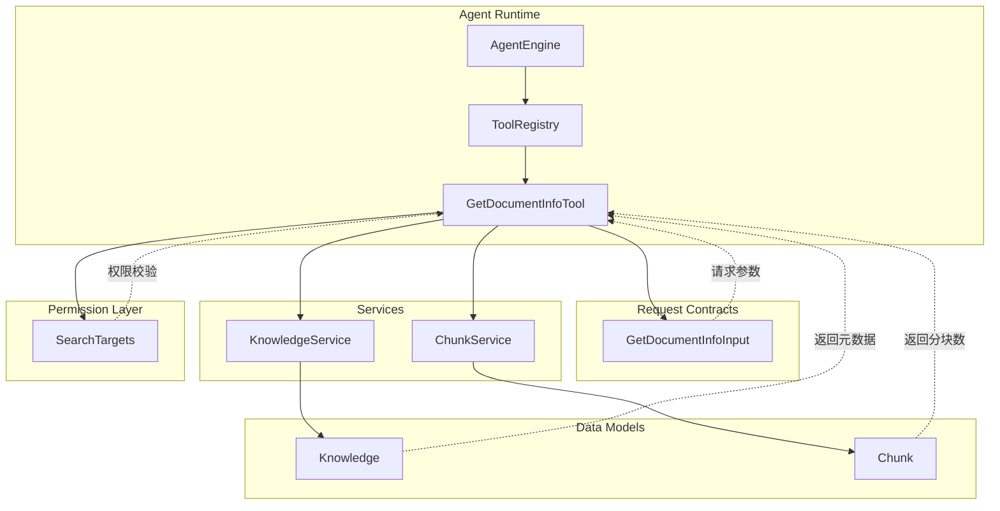

# document_metadata_retrieval_request_contracts 模块深度解析

## 模块概述

想象一下，你正在图书馆找书。在决定借阅之前，你通常会先查看目录卡片——了解书的标题、作者、页数、出版年份等元数据，而不是直接把整本书搬下来翻阅。`document_metadata_retrieval_request_contracts` 模块扮演的正是这个"目录查询"的角色。

在 WeKnora 的 Agent 系统中，当 Agent 需要理解文档的基本信息（如标题、类型、大小、处理状态）时，它不能也不应该直接获取文档的完整内容——那样既浪费资源，又可能超出上下文窗口的限制。这个模块定义了 Agent 向系统查询文档元数据的**请求契约**，让 Agent 能够高效地"预览"文档，决定下一步行动。

核心设计洞察：**元数据查询与内容检索应该分离**。搜索工具返回的是文档内容片段，而本模块的工具返回的是文档的"身份证信息"。这种分离让 Agent 可以在不消耗大量 token 的情况下，快速了解文档的处理状态、分块数量等关键元信息。

---

## 架构定位与数据流

### 模块在系统中的位置



### 数据流追踪

当 Agent 决定查询文档元数据时，数据流经以下路径：

1. **请求发起**：Agent 根据对话上下文，决定调用 `get_document_info` 工具，构造 `GetDocumentInfoInput` 结构体
2. **参数验证**：工具层解析 JSON 参数，校验 `knowledge_ids` 数组非空且不超过 10 个元素
3. **权限预检**：`SearchTargets` 包含当前会话有权访问的知识库列表，用于后续权限校验
4. **并发查询**：
   - 调用 `KnowledgeService.GetKnowledgeByIDOnly()` 获取文档元数据（注意：不使用租户过滤，支持跨租户共享）
   - 调用 `ChunkService.ListPagedChunksByKnowledgeID()` 统计分块数量
5. **权限复核**：检查返回的 `Knowledge.KnowledgeBaseID` 是否在 `SearchTargets` 允许的范围内
6. **结果聚合**：将元数据与分块数合并，生成人类可读输出和结构化数据

这个流程的关键在于**权限检查的双层设计**：先通过 `GetKnowledgeByIDOnly` 绕过租户过滤获取数据，再用 `SearchTargets` 进行应用层权限校验。这种设计支持跨租户共享知识库的场景——文档可能属于租户 A，但租户 B 的用户通过共享机制获得了访问权限。

---

## 核心组件深度解析

### GetDocumentInfoInput

**设计目的**：定义 Agent 查询文档元数据时的输入参数结构。

```go
type GetDocumentInfoInput struct {
    KnowledgeIDs []string `json:"knowledge_ids" jsonschema:"Array of document/knowledge IDs, obtained from knowledge_id field in search results, supports concurrent batch queries"`
}
```

**为什么是数组而不是单个 ID？**

这是一个经过权衡的设计决策。表面上看，支持批量查询增加了复杂度，但实际上：

1. **Agent 行为模式**：Agent 在分析搜索结果时，经常需要同时了解多个文档的信息（例如："比较这 5 篇文档的处理状态"）
2. **并发优化**：批量查询允许工具内部使用 goroutine 并发获取多个文档的信息，显著降低延迟
3. **Token 效率**：一次工具调用返回多个文档信息，比多次调用更节省 token

**约束条件**：
- 最少 1 个 ID（空数组会被拒绝）
- 最多 10 个 ID（防止资源滥用）

这个上限是经验值——超过 10 个文档的元数据查询通常意味着 Agent 在"盲目扫描"，应该被引导使用更精确的搜索策略。

**字段语义**：
- `knowledge_ids` 来源于搜索结果的 `knowledge_id` 字段，这意味着 Agent 通常先执行搜索，再针对感兴趣的文档查询详细信息

---

### GetDocumentInfoTool（依赖组件）

虽然工具实现本身不属于本模块，但理解其工作机制对于正确使用请求契约至关重要。

**执行流程的关键细节**：

```go
// 并发获取每个文档的信息
for _, knowledgeID := range knowledgeIDs {
    wg.Add(1)
    go func(id string) {
        defer wg.Done()
        
        // 1. 获取元数据（绕过租户过滤）
        knowledge, err := t.knowledgeService.GetKnowledgeByIDOnly(ctx, id)
        
        // 2. 权限校验（应用层）
        if !t.searchTargets.ContainsKB(knowledge.KnowledgeBaseID) {
            return fmt.Errorf("知识库 %s 不可访问")
        }
        
        // 3. 统计分块数（使用文档的实际租户 ID）
        _, total, err := t.chunkService.GetRepository().
            ListPagedChunksByKnowledgeID(ctx, knowledge.TenantID, id, ...)
    }(knowledgeID)
}
```

**关键设计点**：

1. **`GetKnowledgeByIDOnly` vs `GetKnowledgeByID`**：
   - 带 `Only` 后缀的方法**不**使用上下文中的租户 ID 进行过滤
   - 这是为了支持跨租户共享场景：文档属于租户 A，但当前用户是租户 B，通过共享机制获得了访问权限
   - 权限校验被推迟到应用层，通过 `SearchTargets` 完成

2. **分块查询使用 `knowledge.TenantID`**：
   - 注意这里用的是文档记录中存储的租户 ID，而不是当前会话的租户 ID
   - 这确保了即使文档是共享的，也能正确查询到其分块（分块与文档在同一租户下）

3. **并发安全**：
   - 使用 `sync.Mutex` 保护 `results` map 的写入
   - 每个 goroutine 独立执行查询，避免阻塞

---

## 依赖关系分析

### 上游依赖（调用本模块的组件）

| 组件 | 依赖关系 | 期望 |
|------|----------|------|
| `GetDocumentInfoTool` | 直接使用 `GetDocumentInfoInput` | 输入参数符合 JSON Schema，`knowledge_ids` 为字符串数组 |
| `ToolRegistry` | 间接依赖（通过工具注册） | 工具的 `schema` 字段能正确生成 OpenAPI 兼容的 JSON Schema |
| `AgentEngine` | 间接依赖（通过工具调用） | 工具返回的 `ToolResult` 包含人类可读的 `Output` 和结构化的 `Data` |

### 下游依赖（本模块调用的组件）

| 组件 | 调用目的 | 数据契约 |
|------|----------|----------|
| `KnowledgeService` | 获取文档元数据 | 返回 `*types.Knowledge`，包含标题、类型、文件大小等字段 |
| `ChunkService` | 统计分块数量 | 返回分片列表和总数，本模块只关心总数 |
| `SearchTargets` | 权限校验 | `ContainsKB(kbID)` 返回布尔值，表示当前会话是否有权访问该知识库 |

### 数据契约详解

**Knowledge 模型关键字段**：
```go
type Knowledge struct {
    ID              string     // 文档唯一标识
    TenantID        uint64     // 所属租户 ID（用于分块查询）
    KnowledgeBaseID string     // 所属知识库 ID（用于权限校验）
    Type            string     // 来源类型：file/url/passage
    Title           string     // 文档标题
    ParseStatus     string     // 处理状态：pending/processing/completed/failed
    FileName        string     // 原始文件名
    FileType        string     // 文件类型：pdf/docx/md 等
    FileSize        int64      // 文件大小（字节）
    Metadata        JSON       // 自定义元数据
}
```

**SearchTargets 权限模型**：
```go
type SearchTarget struct {
    Type          SearchTargetType
    KnowledgeBaseID string   // 知识库 ID
    TenantID      uint64     // 知识库所属租户 ID
    KnowledgeIDs  []string   // 可选：限定到具体文档
}
```

`SearchTargets` 本质上是一个 `(tenant_id, kb_id)` 的集合，表示当前会话有权访问的搜索范围。当文档来自共享知识库时，`TenantID` 是知识库所有者的租户 ID，而不是当前用户的租户 ID。

---

## 设计决策与权衡

### 1. 批量查询 vs 单次查询

**选择**：支持最多 10 个文档的批量查询

**权衡分析**：
- **优点**：
  - 减少工具调用次数，节省 token
  - 内部并发执行，降低总延迟
  - 符合 Agent 的实际使用模式（经常需要比较多个文档）
- **缺点**：
  - 增加了参数验证的复杂度
  - 部分失败的处理逻辑更复杂（需要区分成功和失败的文档）

**为什么这个权衡是合理的**：在 Agent 场景中，工具调用的 token 成本远高于代码复杂度成本。10 个文档的上限既能覆盖常见用例，又能防止滥用。

### 2. 应用层权限校验 vs 数据层权限校验

**选择**：使用 `GetKnowledgeByIDOnly` 绕过数据层过滤，在应用层通过 `SearchTargets` 校验

**权衡分析**：
- **优点**：
  - 支持跨租户共享场景
  - 权限逻辑集中管理，易于审计
  - 可以返回更具体的错误信息（"知识库不可访问"而不是"文档不存在"）
- **缺点**：
  - 需要确保所有代码路径都执行了应用层校验
  - 增加了代码审查的负担

**风险提示**：如果未来添加了新的查询路径，必须确保同样执行了 `SearchTargets` 校验，否则可能导致权限绕过。

### 3. 双格式输出（Output + Data）

**选择**：同时返回人类可读的 `Output` 和结构化的 `Data`

```go
return &types.ToolResult{
    Success: true,
    Output:  output,  // 格式化文本，供 LLM 阅读
    Data: map[string]interface{}{
        "documents":    formattedDocs,  // 结构化数据，供前端展示
        "total_docs":   len(successDocs),
        "display_type": "document_info",  // 前端渲染提示
        "title":        firstTitle,
    },
}
```

**设计意图**：
- `Output`：使用 emoji 和格式化文本（如 `✅ 已完成`），让 LLM 更容易理解处理状态
- `Data`：结构化数据供前端直接渲染，避免二次解析

**权衡**：增加了响应大小，但提升了用户体验和前端集成效率。

---

## 使用指南与示例

### 基本使用模式

Agent 通常在以下场景调用此工具：

**场景 1：搜索后深入了解**
```
用户：帮我找一下关于"机器学习"的文档
Agent: [调用 knowledge_search]
Agent: [发现 5 篇相关文档，调用 get_document_info 获取详细信息]
Agent: 找到了 5 篇文档，其中 3 篇已完成处理，2 篇还在处理中...
```

**场景 2：检查文档处理状态**
```
用户：我上传的文档处理完了吗？
Agent: [调用 get_document_info 检查 parse_status]
Agent: 您的文档正在处理中（🔄 处理中），已完成 50/100 个分块
```

### 请求示例

```json
{
  "knowledge_ids": [
    "kb-doc-001",
    "kb-doc-002",
    "kb-doc-003"
  ]
}
```

### 响应示例（结构化数据）

```json
{
  "success": true,
  "data": {
    "documents": [
      {
        "knowledge_id": "kb-doc-001",
        "title": "机器学习入门指南",
        "type": "file",
        "file_name": "ml_intro.pdf",
        "file_size": 2048576,
        "parse_status": "completed",
        "chunk_count": 45,
        "metadata": {"author": "张三"}
      }
    ],
    "total_docs": 1,
    "requested": 1,
    "errors": [],
    "display_type": "document_info",
    "title": "机器学习入门指南"
  }
}
```

---

## 边界情况与注意事项

### 1. 部分失败处理

当请求多个文档时，可能部分成功、部分失败：

```
成功获取 2 / 3 个文档信息

=== 部分失败 ===
  - kb-doc-003: 知识库 kb-999 不可访问
```

**注意事项**：
- Agent 应该检查 `errors` 数组，而不是仅依赖 `success` 字段
- 前端应该同时展示成功和失败的信息，让用户了解完整情况

### 2. 跨租户共享知识库

当文档来自共享知识库时：
- `Knowledge.TenantID` 是知识库所有者的租户 ID
- `SearchTargets` 中必须包含该知识库的 `(tenant_id, kb_id)` 组合
- 分块查询必须使用 `Knowledge.TenantID`，而不是当前会话的租户 ID

**潜在陷阱**：如果错误地使用当前会话的租户 ID 查询分块，会返回空结果（因为分块在另一个租户下）。

### 3. 处理状态的语义

`parse_status` 的可能值：
- `pending`：⏳ 待处理（刚上传，尚未开始）
- `processing`：🔄 处理中（正在分块/索引）
- `completed`/`success`：✅ 已完成
- `failed`：❌ 失败（查看 `error_message` 了解详情）

**注意事项**：Agent 不应该对 `pending` 或 `processing` 状态的文档执行内容搜索，因为分块尚未就绪。

### 4. 分块数量统计的近似性

分块数量通过 `ListPagedChunksByKnowledgeID` 的 `total` 字段获取，这是一个近似值：
- 只统计 `chunk_type = "text"` 的分块
- 不包括图片、表格等特殊类型的分块
- 如果文档正在处理中，数字可能随时变化

### 5. 性能考虑

- **并发度**：每个文档一个 goroutine，10 个文档最多 10 个并发查询
- **分页大小**：分块查询使用 `PageSize: 1000`，只获取总数，不获取实际分块内容
- **超时**：依赖上下文超时，建议在调用链上层设置合理的超时时间（如 30 秒）

---

## 扩展点与修改建议

### 可扩展的方面

1. **增加过滤条件**：
   - 当前实现获取所有元数据字段
   - 可以扩展为支持字段选择（如只获取 `title` 和 `parse_status`）
   - 收益：减少响应大小，提高性能

2. **增加排序选项**：
   - 当前返回顺序与请求顺序一致
   - 可以支持按标题、处理状态、分块数排序
   - 收益：方便 Agent 优先处理已完成的文档

3. **增加统计聚合**：
   - 当前返回每个文档的详细信息
   - 可以增加总体统计（如"共 100 个分块，平均每个文档 20 个"）
   - 收益：帮助 Agent 快速了解整体情况

### 不建议修改的方面

1. **批量上限（10 个）**：
   - 这是经过权衡的经验值
   - 如需查询更多文档，应该使用多次调用或改进搜索策略

2. **双格式输出**：
   - 同时返回 `Output` 和 `Data` 是核心设计
   - 移除任一格式都会破坏现有集成

---

## 相关模块参考

- [corpus_browsing_request_contracts](corpus_browsing_request_contracts.md)：同级的文档分块列表查询请求契约
- [knowledge_access_and_corpus_navigation_tools](knowledge_access_and_corpus_navigation_tools.md)：父模块，包含所有知识库访问工具的概述
- [tool_definition_and_registry](tool_definition_and_registry.md)：工具注册与解析机制
- [KnowledgeService](knowledge_content_service_and_repository_interfaces.md)：知识元数据服务接口
- [ChunkService](chunk_content_service_and_repository_interfaces.md)：分块管理服务接口

---

## 总结

`document_metadata_retrieval_request_contracts` 模块虽然代码量不大，但体现了几个重要的设计原则：

1. **关注点分离**：元数据查询与内容检索分离，让 Agent 能够高效地"预览"文档
2. **批量优化**：支持并发批量查询，符合 Agent 的实际使用模式
3. **权限分层**：数据层绕过 + 应用层校验，支持跨租户共享场景
4. **双格式输出**：同时服务 LLM 和前端，提升整体用户体验

理解这个模块的关键在于把握它的**架构角色**：它是 Agent 与知识库元数据之间的"目录查询接口"，让 Agent 能够在不消耗大量资源的情况下，快速了解文档的基本信息，从而做出更智能的决策。
