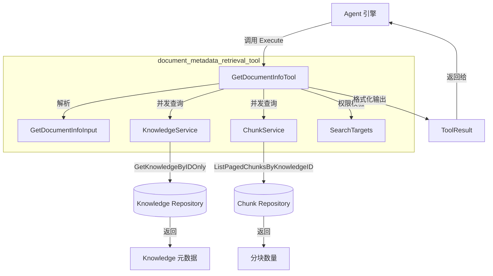

# document_metadata_retrieval_tool 模块深度解析

## 模块概述

想象一下，你正在和一个智能助手对话，它刚刚从知识库里搜索到了一堆文档片段。助手知道这些片段的内容，但它需要回答你这样一个问题："这些文档都是什么类型的文件？有多大？处理完成了吗？" —— 这时候，**文档元数据检索工具**（`GetDocumentInfoTool`）就派上用场了。

这个模块的核心职责是：**为 Agent 提供批量获取文档元数据的能力**。它不是用来检索文档内容的（那是 `knowledge_search` 的工作），而是用来回答"这个文档是什么"这类元数据问题。设计这个工具的洞察在于：**内容检索和元数据查询是两种截然不同的需求**。搜索工具返回的是分块后的文本内容，但往往缺少文件的整体信息（如文件大小、处理状态、原始文件名等）。如果让搜索工具同时返回这些信息，会造成接口臃肿和性能浪费。因此，系统选择将元数据查询独立成一个专用工具，支持并发批量查询，让 Agent 在需要时按需调用。

## 架构设计



### 数据流 walkthrough

1. **Agent 发起调用**：Agent 引擎根据对话上下文决定需要查询哪些文档的元数据，构造 `GetDocumentInfoInput` 并调用工具的 `Execute` 方法。

2. **参数解析与验证**：工具首先解析 JSON 参数，验证 `knowledge_ids` 数组非空且不超过 10 个（防止滥用）。

3. **并发元数据收集**：对于每个 `knowledge_id`，工具启动一个 goroutine 并行执行：
   - 调用 `KnowledgeService.GetKnowledgeByIDOnly` 获取文档基础元数据
   - 通过 `SearchTargets.ContainsKB` 验证当前会话是否有权限访问该知识库
   - 调用 `ChunkService` 查询该文档的分块数量

4. **结果聚合**：等待所有 goroutine 完成后，工具将成功结果和错误信息分别收集，生成人类可读的文本输出和机器可读的结构化数据。

5. **返回 ToolResult**：最终返回一个 `ToolResult`，包含 `Success` 标志、`Output` 文本和 `Data` 结构化数据，供 Agent 和前端消费。

## 核心组件深度解析

### GetDocumentInfoTool

**设计意图**：这是一个典型的"工具模式"（Tool Pattern）实现，遵循系统内统一的工具接口规范。它的存在让 Agent 能够像调用函数一样获取文档元数据，而不需要直接依赖底层服务。

**内部机制**：
- 继承自 `BaseTool`，获得工具名称、描述和 JSON Schema 的定义能力
- 持有三个关键依赖：`KnowledgeService`（元数据源）、`ChunkService`（分块计数源）、`SearchTargets`（权限校验器）
- `Execute` 方法采用并发模型：为每个文档 ID 启动独立 goroutine，使用 `sync.WaitGroup` 等待完成，`sync.Mutex` 保护共享的 `results` map

**关键参数**：
- `knowledgeService interfaces.KnowledgeService`：提供文档元数据访问，注意这里使用的是 `GetKnowledgeByIDOnly` 方法（不带租户过滤），因为权限校验由工具自己通过 `SearchTargets` 完成
- `chunkService interfaces.ChunkService`：提供分块查询能力，用于计算文档的分块数量
- `searchTargets types.SearchTargets`：预计算的可搜索目标集合，包含 (tenant_id, kb_id) 映射，用于跨租户共享知识库的权限验证

**返回值**：`*types.ToolResult`，包含：
- `Success bool`：是否至少有一个文档查询成功
- `Output string`：格式化的人类可读文本，包含 emoji 图标和结构化排版
- `Data map[string]interface{}`：结构化数据，包含 `documents` 数组、`total_docs`、`requested`、`errors` 等字段，供前端渲染使用
- `Error string`：错误汇总信息

**副作用**：无直接副作用，但会触发底层 Repository 的数据库查询。

### GetDocumentInfoInput

**设计意图**：定义工具的输入契约，使用 JSON Schema 让 LLM 能够理解如何构造正确的调用参数。

**内部机制**：
- 单一字段 `KnowledgeIDs []string`，支持批量查询
- JSON Schema 标签 `jsonschema` 提供自然语言描述，帮助 LLM 理解字段用途

**关键设计决策**：为什么支持批量查询而不是单个？因为 Agent 在一次对话中往往需要同时了解多个文档的信息（例如搜索返回了 5 个相关文档），批量查询可以减少工具调用次数，降低延迟。

### 辅助格式化函数

模块包含三个私有格式化函数，它们的设计体现了"对人类友好，对机器也可读"的原则：

- `formatSource`：将技术性的 `type` 和 `source` 字段转换为人类可读的描述（如"文件上传"、"URL: xxx"）
- `formatFileSize`：将字节数转换为带单位的可读格式（如 "1.5 MB"），使用二进制单位（1024 进制）
- `formatParseStatus`：将状态码转换为带 emoji 的状态描述（如 "✅ 已完成"、"❌ 失败"），提升前端展示的可读性

## 依赖关系分析

### 上游调用者

| 调用者 | 期望 | 数据契约 |
|--------|------|----------|
| `AgentEngine` | 获取文档元数据以回答用户关于文档属性的问题 | 传入 `json.RawMessage` 包含 `knowledge_ids` 数组，接收 `*ToolResult` |
| `ToolRegistry` | 注册和路由工具调用 | 通过 `BaseTool` 的 `name` 字段识别工具，调用 `Execute` 方法 |

### 下游依赖

| 依赖 | 为什么需要它 | 数据契约 |
|------|-------------|----------|
| `KnowledgeService.GetKnowledgeByIDOnly` | 获取文档基础元数据（标题、类型、文件大小等） | 输入 `knowledge_id`，输出 `*types.Knowledge` |
| `ChunkService.GetRepository().ListPagedChunksByKnowledgeID` | 计算文档的分块数量 | 输入 `tenant_id`, `knowledge_id`, `Pagination`，输出 `total` 计数 |
| `SearchTargets.ContainsKB` | 验证当前会话是否有权访问该知识库 | 输入 `kb_id`，输出 `bool` |

### 关键耦合点

1. **权限模型的耦合**：工具不直接使用租户上下文进行权限校验，而是依赖预计算的 `SearchTargets`。这意味着工具的权限行为完全由创建它时的 `SearchTargets` 决定。这种设计的好处是支持跨租户共享知识库的场景（工具的权限可以超越当前租户边界），但缺点是如果 `SearchTargets` 过期，工具可能访问到不该访问的资源。

2. **分块计数的实现细节**：工具通过查询分块列表（`ListPagedChunksByKnowledgeID`）并取 `total` 来计算分块数，而不是直接调用一个 `CountChunks` 方法。这意味着即使 `PageSize=1000`，底层仍然可能执行全量计数查询。如果未来分块数量级增长，这里可能成为性能瓶颈。

## 设计决策与权衡

### 1. 并发查询 vs 顺序查询

**选择**：使用 goroutine 并发查询每个文档的元数据。

**权衡**：
- ✅ 优点：显著降低多文档查询的延迟（10 个文档的查询时间 ≈ 1 个文档的查询时间）
- ❌ 缺点：增加了代码复杂度（需要 `sync.WaitGroup` 和 `sync.Mutex`），且在高并发场景下可能对数据库造成压力

**为什么这样设计**：Agent 场景下，用户往往需要同时了解多个文档的信息，延迟敏感度高。10 个文档的顺序查询可能需要 500ms，而并发查询只需 50ms。数据库层面的并发压力可以通过连接池和查询优化来缓解。

### 2. GetKnowledgeByIDOnly vs GetKnowledgeByID

**选择**：使用 `GetKnowledgeByIDOnly`（不带租户过滤）而非 `GetKnowledgeByID`。

**权衡**：
- ✅ 优点：支持跨租户共享知识库的场景，权限校验逻辑集中在 `SearchTargets`
- ❌ 缺点：如果 `SearchTargets` 校验逻辑有漏洞，可能绕过租户隔离

**为什么这样设计**：系统支持知识库共享功能，一个租户的用户可能有权访问另一个租户的知识库。如果使用 `GetKnowledgeByID`（自动使用上下文中的租户 ID），会错误地过滤掉共享知识库。因此，工具选择自己通过 `SearchTargets` 进行权限校验，而不是依赖服务的租户过滤。

### 3. 批量限制为 10 个文档

**选择**：限制 `knowledge_ids` 最多 10 个。

**权衡**：
- ✅ 优点：防止滥用（如一次性查询 1000 个文档导致数据库过载），控制单次工具调用的资源消耗
- ❌ 缺点：对于需要查询大量文档的场景，Agent 需要多次调用工具

**为什么这样设计**：这是一个典型的"保护性限制"。Agent 场景下，单次对话需要查询超过 10 个文档元数据的情况极少。如果真的有这种需求，可以通过多次工具调用来实现。

### 4. 双重输出格式（Output + Data）

**选择**：同时提供人类可读的 `Output` 和机器可读的 `Data`。

**权衡**：
- ✅ 优点：前端可以直接使用 `Data` 渲染结构化 UI，同时 `Output` 可以作为 LLM 的上下文；支持渐进式增强
- ❌ 缺点：需要维护两套格式的一致性，增加代码量

**为什么这样设计**：系统需要同时服务两种消费者：LLM（需要自然语言文本）和前端 UI（需要结构化数据）。这种双重输出模式是 Agent 工具的标准设计，参考 [tool_execution_abstractions](tool_execution_abstractions.md)。

### 5. 部分失败容忍

**选择**：即使部分文档查询失败，只要有一个成功就返回 `Success: true`。

**权衡**：
- ✅ 优点：提高系统的韧性，单个文档的权限问题不会阻塞其他文档的查询
- ❌ 缺点：调用方需要检查 `errors` 数组来处理部分失败的情况

**为什么这样设计**：Agent 场景下，用户更希望看到"能看到的文档信息"，而不是因为一个文档不可访问就完全失败。错误信息会被收集并在输出中明确标注。

## 使用指南

### 基本调用示例

```go
// 创建工具实例
tool := NewGetDocumentInfoTool(
    knowledgeService,
    chunkService,
    searchTargets, // 预计算的 (tenant_id, kb_id) 映射
)

// 构造输入参数
input := GetDocumentInfoInput{
    KnowledgeIDs: []string{"doc-123", "doc-456", "doc-789"},
}
inputJSON, _ := json.Marshal(input)

// 执行工具调用
result, err := tool.Execute(ctx, inputJSON)
if err != nil {
    // 处理错误
}

// 消费结果
if result.Success {
    fmt.Println(result.Output) // 人类可读输出
    docs := result.Data["documents"].([]map[string]interface{}) // 结构化数据
}
```

### LLM 调用示例（通过 Agent）

当用户问："刚才搜索到的那些文档都是什么类型的文件？" 时，Agent 会自动构造如下工具调用：

```json
{
  "tool": "get_document_info",
  "arguments": {
    "knowledge_ids": ["kb-001-doc-123", "kb-001-doc-456"]
  }
}
```

### 配置选项

本模块无运行时配置选项，所有行为通过构造函数参数控制。

## 边界情况与陷阱

### 1. 空 knowledge_ids 数组

**行为**：返回错误 `"knowledge_ids is required and must be a non-empty array"`。

**陷阱**：LLM 可能因为上下文理解错误而传入空数组。调用方应确保在构造参数前验证数组非空。

### 2. 超过 10 个文档

**行为**：当前代码的限制检查有 bug —— 错误消息是 `"knowledge_ids must contain at least one valid knowledge ID"`，但实际检查的是 `> 10`。这是一个需要修复的问题。

**建议**：如果业务需要查询超过 10 个文档，应分批调用工具。

### 3. 跨租户共享知识库的权限校验

**行为**：工具通过 `SearchTargets.ContainsKB` 校验权限，而不是依赖 `KnowledgeService` 的租户过滤。

**陷阱**：如果 `SearchTargets` 是在会话创建时计算的，而会话期间知识库的共享权限发生变化，工具可能访问到过期权限允许的资源。

**建议**：对于高安全场景，应在每次工具调用时重新计算 `SearchTargets`。

### 4. 分块计数的性能问题

**行为**：通过 `ListPagedChunksByKnowledgeID` 查询分块数，即使 `PageSize=1000`，底层可能仍执行全量 `COUNT` 查询。

**陷阱**：对于分块数量极大的文档（如 10 万 + 分块），计数查询可能成为性能瓶颈。

**建议**：如果性能成为问题，考虑在 `Knowledge` 表中添加 `chunk_count` 缓存字段，在文档处理完成后更新。

### 5. 部分失败的处理

**行为**：部分文档查询失败不会导致整个工具调用失败，错误信息会被收集在 `result.Data["errors"]` 中。

**陷阱**：调用方如果只检查 `result.Success` 而不检查 `errors` 数组，可能忽略部分失败的情况。

**建议**：始终检查 `errors` 数组，并在前端 UI 中明确标注失败的文档。

### 6. 元数据字段的 nil 处理

**行为**：`k.Metadata` 可能为 nil，代码通过 `k.Metadata.Map()` 安全处理。

**陷阱**：如果 `Metadata.Map()` 实现有 bug，可能导致 panic。

**建议**：确保 `JSON.Map()` 方法对 nil 接收者安全。

## 扩展点

### 添加新的元数据字段

如果需要返回更多元数据字段（如 `processed_at`、`embedding_model_id`），只需：

1. 在 `formattedDocs` 的 map 中添加新字段
2. 在 `output` 文本格式化部分添加对应的打印逻辑
3. 更新工具描述中的"Returned Information"部分

### 支持自定义权限校验

当前权限校验硬编码为 `SearchTargets.ContainsKB`。如果需要更复杂的权限逻辑（如基于文档标签的权限），可以：

1. 在 `GetDocumentInfoTool` 中添加 `permissionChecker` 接口字段
2. 在构造函数中注入自定义权限校验器
3. 在 goroutine 中调用 `permissionChecker.Check(ctx, knowledge)` 替代 `SearchTargets.ContainsKB`

## 相关模块

- [tool_execution_abstractions](tool_execution_abstractions.md)：工具执行的基础抽象和接口定义
- [knowledge_access_and_corpus_navigation_tools](knowledge_access_and_corpus_navigation_tools.md)：其他知识库访问工具的集合
- [knowledge_chunk_listing_tool](knowledge_chunk_listing_tool.md)：列出文档分块的工具，与本工具配合使用
- [semantic_knowledge_search](semantic_knowledge_search.md)：语义搜索工具，搜索结果中的 `knowledge_id` 可作为本工具的输入

## 总结

`document_metadata_retrieval_tool` 是一个设计精良的专用工具，体现了以下设计原则：

1. **单一职责**：只负责元数据查询，不处理内容检索
2. **并发优化**：批量查询时充分利用并发降低延迟
3. **权限解耦**：权限校验与数据访问分离，支持跨租户共享场景
4. **双重输出**：同时服务 LLM 和前端 UI 两种消费者
5. **韧性设计**：部分失败不阻塞整体结果，错误信息透明传递

理解这个模块的关键在于把握它的**架构角色**：它是 Agent 与知识库元数据之间的"翻译层"，将底层的服务调用转换为 Agent 可理解的工具接口，同时将结果格式化为人类和机器都可消费的形式。
